Tidy\_Tuesday\_2020\_01\_14
================
Maria Sevillano
14/01/2020

Tidy Tuesday: Australian Fires
==============================

This R Markdown documents exploration of [Tidy Tuesday](https://github.com/rfordatascience/tidytuesday/tree/master/data/2020/2020-01-07)

The objective for this week is to visualize recent bushfires spreading rapidly in Australia. For this purpose I have decided to use the three (cleaned up) datasets:

1.  rainfall
2.  temperature
3.  new southwales rural fire service data

Things to note: It has been the hottest and driest year in Australia.

Load libraries
--------------

``` r
library(sf)
library(mapview)
library(tidyverse)
library(here)
library(ggthemes)

library(ggrepel)
library(googleway)
library(ggspatial)
library(rnaturalearth)
library(rnaturalearthdata)
library(lwgeom)
library(rgeos)
```

Get Data
--------

``` r
rainfall <- readr::read_csv('https://raw.githubusercontent.com/rfordatascience/tidytuesday/master/data/2020/2020-01-07/rainfall.csv')
temperature <- readr::read_csv('https://raw.githubusercontent.com/rfordatascience/tidytuesday/master/data/2020/2020-01-07/temperature.csv')
aus_fires <- sf::st_read("http://www.rfs.nsw.gov.au/feeds/majorIncidents.json")
```

    ## Reading layer `OGRGeoJSON' from data source `http://www.rfs.nsw.gov.au/feeds/majorIncidents.json' using driver `GeoJSON'
    ## Simple feature collection with 40 features and 7 fields
    ## geometry type:  GEOMETRY
    ## dimension:      XY
    ## bbox:           xmin: 144.2634 ymin: -37.48673 xmax: 153.1924 ymax: -28.90403
    ## epsg (SRID):    4326
    ## proj4string:    +proj=longlat +datum=WGS84 +no_defs

Check Data Structure
--------------------

``` r
str(rainfall)
```

    ## Classes 'spec_tbl_df', 'tbl_df', 'tbl' and 'data.frame': 179273 obs. of  11 variables:
    ##  $ station_code: chr  "009151" "009151" "009151" "009151" ...
    ##  $ city_name   : chr  "Perth" "Perth" "Perth" "Perth" ...
    ##  $ year        : num  1967 1967 1967 1967 1967 ...
    ##  $ month       : chr  "01" "01" "01" "01" ...
    ##  $ day         : chr  "01" "02" "03" "04" ...
    ##  $ rainfall    : num  NA NA NA NA NA NA NA NA NA NA ...
    ##  $ period      : num  NA NA NA NA NA NA NA NA NA NA ...
    ##  $ quality     : chr  NA NA NA NA ...
    ##  $ lat         : num  -32 -32 -32 -32 -32 ...
    ##  $ long        : num  116 116 116 116 116 ...
    ##  $ station_name: chr  "Subiaco Wastewater Treatment Plant" "Subiaco Wastewater Treatment Plant" "Subiaco Wastewater Treatment Plant" "Subiaco Wastewater Treatment Plant" ...
    ##  - attr(*, "spec")=
    ##   .. cols(
    ##   ..   station_code = col_character(),
    ##   ..   city_name = col_character(),
    ##   ..   year = col_double(),
    ##   ..   month = col_character(),
    ##   ..   day = col_character(),
    ##   ..   rainfall = col_double(),
    ##   ..   period = col_double(),
    ##   ..   quality = col_character(),
    ##   ..   lat = col_double(),
    ##   ..   long = col_double(),
    ##   ..   station_name = col_character()
    ##   .. )

``` r
summary(rainfall)
```

    ##  station_code        city_name              year         month          
    ##  Length:179273      Length:179273      Min.   :1858   Length:179273     
    ##  Class :character   Class :character   1st Qu.:1932   Class :character  
    ##  Mode  :character   Mode  :character   Median :1976   Mode  :character  
    ##                                        Mean   :1964                     
    ##                                        3rd Qu.:2000                     
    ##                                        Max.   :2020                     
    ##                                                                         
    ##      day               rainfall           period         quality         
    ##  Length:179273      Min.   :  0.000   Min.   : 1.00    Length:179273     
    ##  Class :character   1st Qu.:  0.000   1st Qu.: 1.00    Class :character  
    ##  Mode  :character   Median :  0.000   Median : 1.00    Mode  :character  
    ##                     Mean   :  2.398   Mean   : 1.03                      
    ##                     3rd Qu.:  0.800   3rd Qu.: 1.00                      
    ##                     Max.   :327.600   Max.   :23.00                      
    ##                     NA's   :11760     NA's   :114797                     
    ##       lat              long       station_name      
    ##  Min.   :-37.83   Min.   :115.8   Length:179273     
    ##  1st Qu.:-34.92   1st Qu.:138.6   Class :character  
    ##  Median :-33.86   Median :149.2   Mode  :character  
    ##  Mean   :-33.51   Mean   :143.4                     
    ##  3rd Qu.:-31.96   3rd Qu.:151.2                     
    ##  Max.   :-27.48   Max.   :153.1                     
    ## 

``` r
str(temperature)
```

    ## Classes 'spec_tbl_df', 'tbl_df', 'tbl' and 'data.frame': 528278 obs. of  5 variables:
    ##  $ city_name  : chr  "PERTH" "PERTH" "PERTH" "PERTH" ...
    ##  $ date       : Date, format: "1910-01-01" "1910-01-02" ...
    ##  $ temperature: num  26.7 27 27.5 24 24.8 24.4 25.3 28 32.6 35.9 ...
    ##  $ temp_type  : chr  "max" "max" "max" "max" ...
    ##  $ site_name  : chr  "PERTH AIRPORT" "PERTH AIRPORT" "PERTH AIRPORT" "PERTH AIRPORT" ...
    ##  - attr(*, "spec")=
    ##   .. cols(
    ##   ..   city_name = col_character(),
    ##   ..   date = col_date(format = ""),
    ##   ..   temperature = col_double(),
    ##   ..   temp_type = col_character(),
    ##   ..   site_name = col_character()
    ##   .. )

``` r
summary(temperature)
```

    ##   city_name              date             temperature   
    ##  Length:528278      Min.   :1910-01-01   Min.   :-11.5  
    ##  Class :character   1st Qu.:1940-09-06   1st Qu.: 11.1  
    ##  Mode  :character   Median :1967-10-04   Median : 16.3  
    ##                     Mean   :1966-11-09   Mean   : 16.6  
    ##                     3rd Qu.:1993-08-02   3rd Qu.: 21.6  
    ##                     Max.   :2019-05-31   Max.   : 48.3  
    ##                                          NA's   :3465   
    ##   temp_type          site_name        
    ##  Length:528278      Length:528278     
    ##  Class :character   Class :character  
    ##  Mode  :character   Mode  :character  
    ##                                       
    ##                                       
    ##                                       
    ## 

``` r
str(aus_fires)
```

    ## Classes 'sf' and 'data.frame':   40 obs. of  8 variables:
    ##  $ title           : Factor w/ 39 levels "Adaminaby Complex",..: 1 7 8 9 10 11 13 14 15 16 ...
    ##  $ link            : Factor w/ 1 level "http://www.rfs.nsw.gov.au/fire-information/fires-near-me": 1 1 1 1 1 1 1 1 1 1 ...
    ##  $ category        : Factor w/ 2 levels "Advice","Not Applicable": 1 1 1 1 1 1 1 1 1 1 ...
    ##  $ guid            : Factor w/ 40 levels "https://incidents.rfs.nsw.gov.au/api/v1/incidents/366937",..: 7 1 36 15 6 8 20 13 19 4 ...
    ##  $ guid_isPermaLink: Factor w/ 1 level "true": 1 1 1 1 1 1 1 1 1 1 ...
    ##  $ pubDate         : Factor w/ 37 levels "10/02/2020 11:40:00 PM",..: 25 35 37 11 34 16 26 8 28 5 ...
    ##  $ description     : Factor w/ 40 levels "ALERT LEVEL: Advice <br />LOCATION: \"Green Valley/Avoca\" Yenches/River Rd, Talmalmo, NSW 2640 <br />COUNCIL A"| __truncated__,..: 25 6 7 8 9 3 10 5 4 16 ...
    ##  $ geometry        :sfc_GEOMETRY of length 40; first list element: List of 2
    ##   ..$ : 'XY' num  148.9 -35.9
    ##   ..$ :List of 32
    ##   .. ..$ :List of 1
    ##   .. .. ..$ : num [1:5, 1:2] 149 149 149 149 149 ...
    ##   .. .. ..- attr(*, "class")= chr  "XY" "POLYGON" "sfg"
    ##   .. ..$ :List of 1
    ##   .. .. ..$ : num [1:9, 1:2] 149 149 149 149 149 ...
    ##   .. .. ..- attr(*, "class")= chr  "XY" "POLYGON" "sfg"
    ##   .. ..$ :List of 1
    ##   .. .. ..$ : num [1:18, 1:2] 149 149 149 149 149 ...
    ##   .. .. ..- attr(*, "class")= chr  "XY" "POLYGON" "sfg"
    ##   .. ..$ :List of 1
    ##   .. .. ..$ : num [1:8, 1:2] 149 149 149 149 149 ...
    ##   .. .. ..- attr(*, "class")= chr  "XY" "POLYGON" "sfg"
    ##   .. ..$ :List of 1
    ##   .. .. ..$ : num [1:7, 1:2] 149 149 149 149 149 ...
    ##   .. .. ..- attr(*, "class")= chr  "XY" "POLYGON" "sfg"
    ##   .. ..$ :List of 1
    ##   .. .. ..$ : num [1:14, 1:2] 149 149 149 149 149 ...
    ##   .. .. ..- attr(*, "class")= chr  "XY" "POLYGON" "sfg"
    ##   .. ..$ :List of 1
    ##   .. .. ..$ : num [1:7, 1:2] 148 148 148 148 148 ...
    ##   .. .. ..- attr(*, "class")= chr  "XY" "POLYGON" "sfg"
    ##   .. ..$ :List of 1
    ##   .. .. ..$ : num [1:23, 1:2] 149 149 149 149 149 ...
    ##   .. .. ..- attr(*, "class")= chr  "XY" "POLYGON" "sfg"
    ##   .. ..$ :List of 1
    ##   .. .. ..$ : num [1:6, 1:2] 149 149 149 149 149 ...
    ##   .. .. ..- attr(*, "class")= chr  "XY" "POLYGON" "sfg"
    ##   .. ..$ :List of 1
    ##   .. .. ..$ : num [1:6, 1:2] 149 149 149 149 149 ...
    ##   .. .. ..- attr(*, "class")= chr  "XY" "POLYGON" "sfg"
    ##   .. ..$ :List of 1
    ##   .. .. ..$ : num [1:104, 1:2] 149 149 149 149 149 ...
    ##   .. .. ..- attr(*, "class")= chr  "XY" "POLYGON" "sfg"
    ##   .. ..$ :List of 1
    ##   .. .. ..$ : num [1:106, 1:2] 149 149 149 149 149 ...
    ##   .. .. ..- attr(*, "class")= chr  "XY" "POLYGON" "sfg"
    ##   .. ..$ :List of 1
    ##   .. .. ..$ : num [1:28, 1:2] 149 149 149 149 149 ...
    ##   .. .. ..- attr(*, "class")= chr  "XY" "POLYGON" "sfg"
    ##   .. ..$ :List of 1
    ##   .. .. ..$ : num [1:4, 1:2] 148.8 148.8 148.8 148.8 -35.9 ...
    ##   .. .. ..- attr(*, "class")= chr  "XY" "POLYGON" "sfg"
    ##   .. ..$ :List of 1
    ##   .. .. ..$ : num [1:8, 1:2] 149 149 149 149 149 ...
    ##   .. .. ..- attr(*, "class")= chr  "XY" "POLYGON" "sfg"
    ##   .. ..$ :List of 1
    ##   .. .. ..$ : num [1:13, 1:2] 149 149 149 149 149 ...
    ##   .. .. ..- attr(*, "class")= chr  "XY" "POLYGON" "sfg"
    ##   .. ..$ :List of 1
    ##   .. .. ..$ : num [1:33, 1:2] 149 149 149 149 149 ...
    ##   .. .. ..- attr(*, "class")= chr  "XY" "POLYGON" "sfg"
    ##   .. ..$ :List of 1
    ##   .. .. ..$ : num [1:4, 1:2] 148.6 148.6 148.6 148.6 -36.1 ...
    ##   .. .. ..- attr(*, "class")= chr  "XY" "POLYGON" "sfg"
    ##   .. ..$ :List of 1
    ##   .. .. ..$ : num [1:12, 1:2] 149 149 149 149 149 ...
    ##   .. .. ..- attr(*, "class")= chr  "XY" "POLYGON" "sfg"
    ##   .. ..$ :List of 1
    ##   .. .. ..$ : num [1:172, 1:2] 149 149 149 149 149 ...
    ##   .. .. ..- attr(*, "class")= chr  "XY" "POLYGON" "sfg"
    ##   .. ..$ :List of 1
    ##   .. .. ..$ : num [1:8, 1:2] 149 149 149 149 149 ...
    ##   .. .. ..- attr(*, "class")= chr  "XY" "POLYGON" "sfg"
    ##   .. ..$ :List of 1
    ##   .. .. ..$ : num [1:5, 1:2] 149 149 149 149 149 ...
    ##   .. .. ..- attr(*, "class")= chr  "XY" "POLYGON" "sfg"
    ##   .. ..$ :List of 1
    ##   .. .. ..$ : num [1:8, 1:2] 149 149 149 149 149 ...
    ##   .. .. ..- attr(*, "class")= chr  "XY" "POLYGON" "sfg"
    ##   .. ..$ :List of 1
    ##   .. .. ..$ : num [1:4, 1:2] 148.7 148.7 148.7 148.7 -35.9 ...
    ##   .. .. ..- attr(*, "class")= chr  "XY" "POLYGON" "sfg"
    ##   .. ..$ :List of 1
    ##   .. .. ..$ : num [1:7, 1:2] 149 149 149 149 149 ...
    ##   .. .. ..- attr(*, "class")= chr  "XY" "POLYGON" "sfg"
    ##   .. ..$ :List of 1
    ##   .. .. ..$ : num [1:6, 1:2] 149 149 149 149 149 ...
    ##   .. .. ..- attr(*, "class")= chr  "XY" "POLYGON" "sfg"
    ##   .. ..$ :List of 1
    ##   .. .. ..$ : num [1:167, 1:2] 148 148 148 148 148 ...
    ##   .. .. ..- attr(*, "class")= chr  "XY" "POLYGON" "sfg"
    ##   .. ..$ :List of 1
    ##   .. .. ..$ : num [1:5, 1:2] 149 149 149 149 149 ...
    ##   .. .. ..- attr(*, "class")= chr  "XY" "POLYGON" "sfg"
    ##   .. ..$ :List of 1
    ##   .. .. ..$ : num [1:41, 1:2] 149 149 149 149 149 ...
    ##   .. .. ..- attr(*, "class")= chr  "XY" "POLYGON" "sfg"
    ##   .. ..$ :List of 1
    ##   .. .. ..$ : num [1:173, 1:2] 149 149 149 149 149 ...
    ##   .. .. ..- attr(*, "class")= chr  "XY" "POLYGON" "sfg"
    ##   .. ..$ :List of 1
    ##   .. .. ..$ : num [1:92, 1:2] 149 149 149 149 149 ...
    ##   .. .. ..- attr(*, "class")= chr  "XY" "POLYGON" "sfg"
    ##   .. ..$ :List of 1
    ##   .. .. ..$ : num [1:162, 1:2] 149 149 149 149 149 ...
    ##   .. .. ..- attr(*, "class")= chr  "XY" "POLYGON" "sfg"
    ##   .. ..- attr(*, "class")= chr  "XY" "GEOMETRYCOLLECTION" "sfg"
    ##   ..- attr(*, "class")= chr  "XY" "GEOMETRYCOLLECTION" "sfg"
    ##  - attr(*, "sf_column")= chr "geometry"
    ##  - attr(*, "agr")= Factor w/ 3 levels "constant","aggregate",..: NA NA NA NA NA NA NA
    ##   ..- attr(*, "names")= chr  "title" "link" "category" "guid" ...

``` r
summary(aus_fires)
```

    ##                         title   
    ##  Assist SES                : 2  
    ##  Adaminaby Complex         : 1  
    ##  Assist SES - Bankstown    : 1  
    ##  Assist SES - Liverpool    : 1  
    ##  Assist SES Campbeltown    : 1  
    ##  Assist SES Gosford & Wyong: 1  
    ##  (Other)                   :33  
    ##                                                        link   
    ##  http://www.rfs.nsw.gov.au/fire-information/fires-near-me:40  
    ##                                                               
    ##                                                               
    ##                                                               
    ##                                                               
    ##                                                               
    ##                                                               
    ##            category 
    ##  Advice        :25  
    ##  Not Applicable:15  
    ##                     
    ##                     
    ##                     
    ##                     
    ##                     
    ##                                                        guid   
    ##  https://incidents.rfs.nsw.gov.au/api/v1/incidents/366937: 1  
    ##  https://incidents.rfs.nsw.gov.au/api/v1/incidents/367024: 1  
    ##  https://incidents.rfs.nsw.gov.au/api/v1/incidents/367252: 1  
    ##  https://incidents.rfs.nsw.gov.au/api/v1/incidents/367266: 1  
    ##  https://incidents.rfs.nsw.gov.au/api/v1/incidents/367335: 1  
    ##  https://incidents.rfs.nsw.gov.au/api/v1/incidents/367769: 1  
    ##  (Other)                                                 :34  
    ##  guid_isPermaLink                   pubDate  
    ##  true:40          12/02/2020 2:59:00 AM : 3  
    ##                   12/02/2020 12:22:00 AM: 2  
    ##                   10/02/2020 11:40:00 PM: 1  
    ##                   10/02/2020 7:37:00 AM : 1  
    ##                   10/02/2020 7:41:00 PM : 1  
    ##                   10/02/2020 7:44:00 PM : 1  
    ##                   (Other)               :31  
    ##                                                                                                                                                                                                                                                                                                description
    ##  ALERT LEVEL: Advice <br />LOCATION: "Green Valley/Avoca" Yenches/River Rd, Talmalmo, NSW 2640 <br />COUNCIL AREA: Greater Hume <br />STATUS: Under control <br />TYPE: Bush Fire <br />FIRE: Yes <br />SIZE: 208275 ha <br />RESPONSIBLE AGENCY: Rural Fire Service <br />UPDATED: 12 Feb 2020 15:00: 1  
    ##  ALERT LEVEL: Advice <br />LOCATION: 148.52  -35.43 <br />COUNCIL AREA: Snowy Monaro <br />STATUS: Being controlled <br />TYPE: Bush Fire <br />FIRE: Yes <br />SIZE: 3872 ha <br />RESPONSIBLE AGENCY: Rural Fire Service <br />UPDATED: 12 Feb 2020 15:51                                          : 1  
    ##  ALERT LEVEL: Advice <br />LOCATION: 4km SW of Timbillica <br />COUNCIL AREA: Bega Valley <br />STATUS: Under control <br />TYPE: Bush Fire <br />FIRE: Yes <br />SIZE: 191579 ha <br />RESPONSIBLE AGENCY: Rural Fire Service <br />UPDATED: 12 Feb 2020 14:26                                      : 1  
    ##  ALERT LEVEL: Advice <br />LOCATION: 8km North West of Bredbo, NSW <br />COUNCIL AREA: Snowy Monaro <br />STATUS: Under control <br />TYPE: Bush Fire <br />FIRE: Yes <br />SIZE: 12458 ha <br />RESPONSIBLE AGENCY: Rural Fire Service <br />UPDATED: 12 Feb 2020 16:23                             : 1  
    ##  ALERT LEVEL: Advice <br />LOCATION: 909 Campbells River Rd, Black Springs, NSW 2787 <br />COUNCIL AREA: Oberon <br />STATUS: Under control <br />TYPE: Bush Fire <br />FIRE: Yes <br />SIZE: 481 ha <br />RESPONSIBLE AGENCY: Forest Corporation of NSW <br />UPDATED: 11 Feb 2020 17:13            : 1  
    ##  ALERT LEVEL: Advice <br />LOCATION: Badja Forest Rd, Countegany, NSW 2630 <br />COUNCIL AREA: Eurobodalla <br />STATUS: Under control <br />TYPE: Bush Fire <br />FIRE: Yes <br />SIZE: 315512 ha <br />RESPONSIBLE AGENCY: Rural Fire Service <br />UPDATED: 12 Feb 2020 17:04                     : 1  
    ##  (Other)                                                                                                                                                                                                                                                                                             :34  
    ##                geometry 
    ##  GEOMETRYCOLLECTION:23  
    ##  POINT             :17  
    ##  epsg:4326         : 0  
    ##  +proj=long...     : 0  
    ##                         
    ##                         
    ## 

``` r
levels(as.factor(temperature$city_name))
```

    ## [1] "BRISBANE"  "CANBERRA"  "KENT"      "MELBOURNE" "PERTH"     "PORT"     
    ## [7] "SYDNEY"

``` r
levels(as.factor(rainfall$city_name))
```

    ## [1] "Adelaide"  "Brisbane"  "Canberra"  "Melbourne" "Perth"     "Sydney"

``` r
#The names of cities common to data sets differs.
```

Temperature Data
----------------

I'll be looking at time series data, class of variabe 'date' is DATE, the package LUBRIDATE might come in handy.

This data set contains daily data from January 1910 to May 2019.

Will have to do some wrangling to make plots easier on the eyes (e.g. filter by years)

``` r
library(lubridate)

sub_temp<- temperature %>%
  filter(date >= as.Date("2018-01-01")) 
```

Temperature Plots
-----------------

For plotting I used the package GGTHEMES, which allows to reproduce the style of several magazines, journals, web pages, etc.

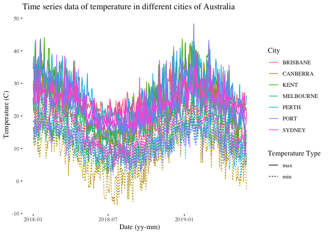

With the previous plot we can observe some trends, such as higher temperatures in summer months (i.e. Jan, Feb, March), however it is still too much data. I'll try with monthly means next.

``` r
mean_month<- sub_temp %>%
  mutate(month= month(date)) %>%
  mutate(year= year(date)) %>%
  group_by(city_name, temp_type, month, year) %>%
  summarise(mean_month= mean(temperature)) %>%
  mutate(date= sprintf("%d-%02d", year, month))  %>%
  mutate(date= paste(date, "01", sep = "-")) %>%
  mutate(date= as_date(date))
```

``` r
ggplot(mean_month) +
  ggthemes::theme_tufte() + 
  geom_line(aes(date, mean_month, color=city_name, linetype=temp_type)) +
  ylab("Temperature (C)") +
  xlab("Date (yy-mm)") +
  scale_color_discrete(name= "City") +
  scale_linetype_discrete(name= "Temperature Type") +
  ggtitle("Monthly average of temperature in different cities of Australia")
```

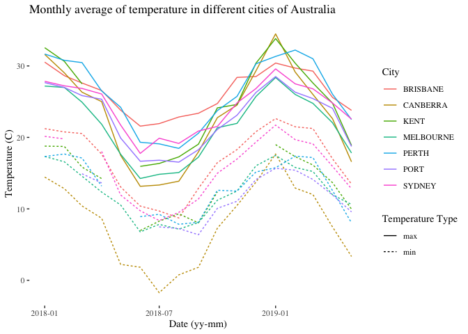

Let's look at how the max tempertures have changed over the years in the summer months: December - February.

``` r
yearly_temp<- temperature %>%
  filter(temp_type=="max") %>%
  mutate(month= month(date)) %>%
  mutate(year= year(date)) %>%
  filter(month %in% c(12, 01, 02)) %>%
  group_by(city_name, month, year) %>%
  summarise(mean_month= mean(temperature)) %>%
  mutate(date= sprintf("%d-%02d", year, month))  %>%
  mutate(date= paste(date, "01", sep = "-")) %>% #trick to get it in date format: made all days the 1st
  mutate(date= as_date(date))
```

``` r
ggplot(yearly_temp) +
  ggthemes::theme_tufte() + 
  geom_area(aes(date, mean_month, fill= city_name), stat = "identity", alpha=0.8) +
  facet_wrap(~city_name) +
  ylab("Temperature (C)") +
  xlab("Date (yy)") +
  scale_fill_discrete(name= "City") +
  ggtitle("Monthly average of temperature in different cities of Australia (Dec-Feb)") 
```

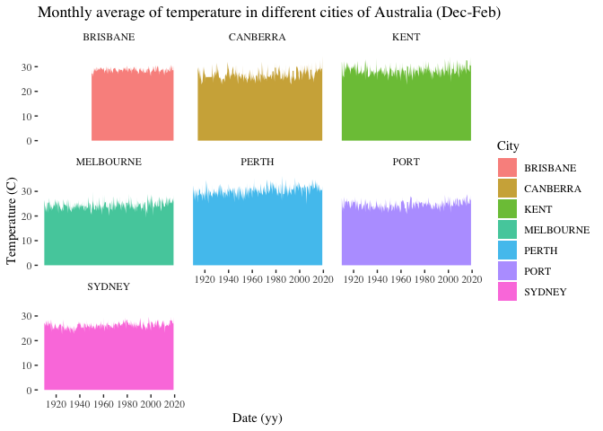

``` r
yearly_temp2<- temperature %>%
  filter(temp_type=="max") %>%
  mutate(month= month(date)) %>%
  mutate(year= year(date)) %>%
  filter(month %in% c(12, 01, 02)) %>%
  group_by(city_name, year) %>%
  summarise(mean_month= mean(temperature))
```

``` r
ggplot(yearly_temp2) +
  ggthemes::theme_tufte() + 
  geom_bar(aes(year, mean_month, fill= city_name), stat = "identity", position = "dodge", alpha=0.8) +
  facet_wrap(~city_name) +
  ylab("Temperature (C)") +
  xlab("Date (yy)") +
  scale_fill_discrete(name= "City") +
  ggtitle("Monthly average of temperature in different cities of Australia (Dec-Feb)")
```

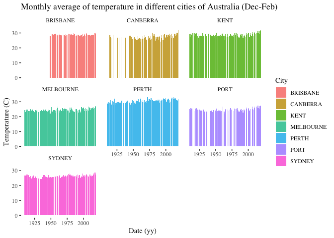

Rainfall
--------

Will only use data that have certified quality (i.e. completed the routine quality control process <http://www.bom.gov.au/climate/cdo/about/about-rain-data.shtml>). Will focus on data from the 3 summer months (Dec - Feb). Further, will only take a look at data collected over a single day. Will only plot data from the last 10 years.

``` r
#Turn city names to caps just as in temperature data and keep only quality checked data. Also for consistency with dates will use the same format as previously.

rainfall_e<- rainfall %>%
  mutate(city_name=toupper(city_name)) %>%
  filter(quality=="Y") %>%
  mutate(date= as_date(paste(year, month, day, sep="-"))) %>%
  filter(month %in% c("12", "01", "02")) %>%
  filter(period==1) %>%
  filter(date>= today() - years(10))
```

``` r
ggplot(rainfall_e) +
  theme_tufte() +
  geom_line(aes(date, rainfall, color=city_name, group=city_name)) +
  facet_grid(city_name~month) +
  ylab("Rainfall (mm)") +
  xlab("Date (yy)") +
  scale_color_discrete(name= "City")  
```

    ## geom_path: Each group consists of only one observation. Do you need to
    ## adjust the group aesthetic?

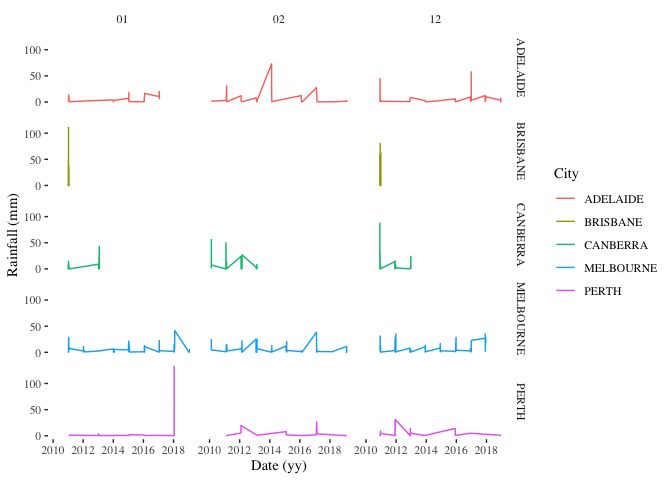

Let's include the data that is not certfied

``` r
rainfall_e2<- rainfall %>%
  mutate(city_name=toupper(city_name)) %>%
  mutate(date= as_date(paste(year, month, day, sep="-"))) %>%
  filter(month %in% c("12", "01", "02")) %>%
  filter(period==1) %>%
  filter(date>= today() - years(10))
```

``` r
ggplot(rainfall_e2) +
  theme_tufte() +
  geom_line(aes(date, rainfall, color=city_name, group=city_name)) +
  facet_grid(city_name~month) +
  ylab("Rainfall (mm)") +
  xlab("Date (yy)") +
  scale_color_discrete(name= "City")  
```

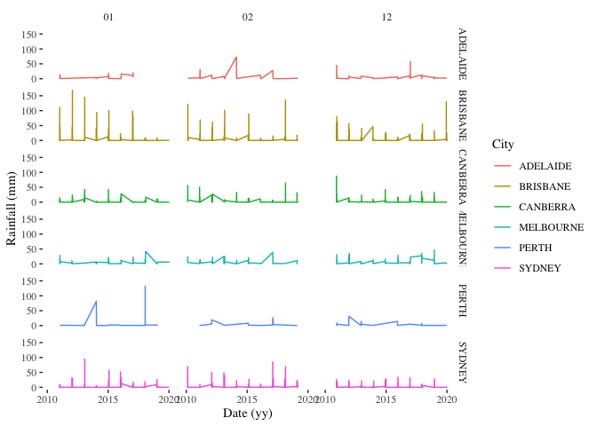 \#\# Fires

To represent spatial data (e.g., coordinates, maps), we will use the SF package. Pertinent information regarding simple features can be found in the vignette <https://r-spatial.github.io/sf/articles/sf1.html>

To get additional spatial data the RNATURALEARTH package will be used. Keep in mind that it has some dependencies that need to be downloaded when using a function for the first time. I had issues with 'install.packages("rnaturalearthhires", repos = "<http://packages.ropensci.org>", type = "source")'. Just restarting R should do the trick.

``` r
world <- rnaturalearth::ne_countries(scale = "medium", returnclass = "sf") #sf: simple feature standard
class(world)
```

    ## [1] "sf"         "data.frame"

``` r
world %>% filter(name_sort=="Australia") %>% select(geometry) # to get a bounding box for the country
```

    ## Simple feature collection with 1 feature and 0 fields
    ## geometry type:  MULTIPOLYGON
    ## dimension:      XY
    ## bbox:           xmin: 112.9082 ymin: -54.74922 xmax: 158.9589 ymax: -10.05176
    ## epsg (SRID):    4326
    ## proj4string:    +proj=longlat +datum=WGS84 +no_defs
    ##                         geometry
    ## 1 MULTIPOLYGON (((143.1789 -1...

``` r
world_points <- cbind(world, st_coordinates(st_centroid(world$geometry)))
```

When plotting spatial feature data (sf), I used the SF package in combination with GGPLOT2. Additional info can be found here: <https://www.r-spatial.org/r/2018/10/25/ggplot2-sf.html>

``` r
#WORLD
ggplot(data=world) +
  geom_sf(fill= "antiquewhite") +
  xlab("Longitude") + ylab("Latitude") +
  theme(panel.grid.major = element_line(color = gray(.5), linetype = "dashed", size = 0.5), 
        panel.background = element_rect(fill = "aliceblue"))
```

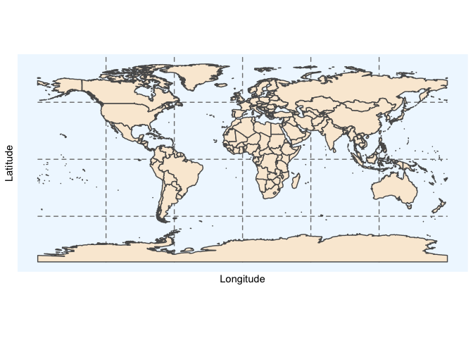

``` r
#AUSTRALIA RECT
ggplot(data=world) +
  geom_sf(fill= "antiquewhite") +
  xlab("Longitude") + ylab("Latitude") +
  theme(panel.grid.major = element_line(color = gray(.5), linetype = "dashed", size = 0.5), 
        panel.background = element_rect(fill = "aliceblue")) + 
  geom_rect(aes(xmin = 110, xmax= 158.9589, ymin= -54.74922, ymax=-5), color= "black", fill=NA) +
  ggtitle("Australia")
```

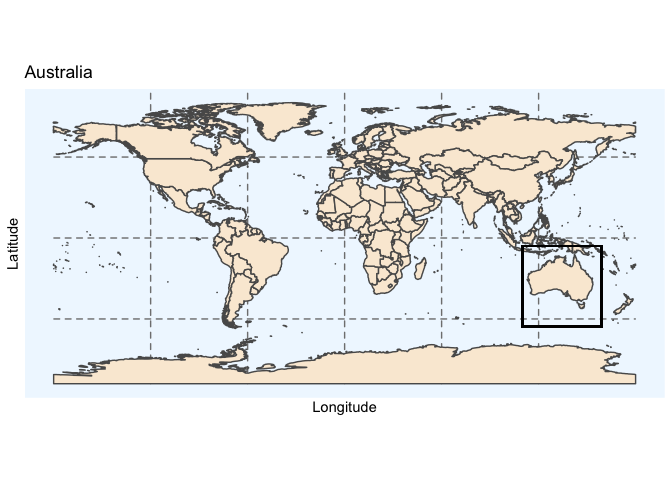

``` r
#AUSTRALIA
ggplot(data=world) +
  geom_sf(fill= "antiquewhite") +
  geom_text(data= world_points,aes(x=X, y=Y, label=name),
            color = "darkblue", fontface = "bold", check_overlap = FALSE) +
  xlab("Longitude") + ylab("Latitude") +
  annotation_scale(location = "bl", width_hint = 0.5)  +
  annotation_north_arrow(location = "bl", which_north = "true", 
                         pad_x = unit(0.75, "in"), pad_y = unit(0.5, "in"),
                         style = north_arrow_fancy_orienteering) +
  coord_sf(xlim = c(110, 158.9589), ylim = c(-54.74922, -5), expand = FALSE) +
  ggtitle("Australia") +
  theme(panel.grid.major = element_line(color = gray(.5), linetype = "dashed", size = 0.5), 
        panel.background = element_rect(fill = "aliceblue")) 
```

    ## Scale on map varies by more than 10%, scale bar may be inaccurate

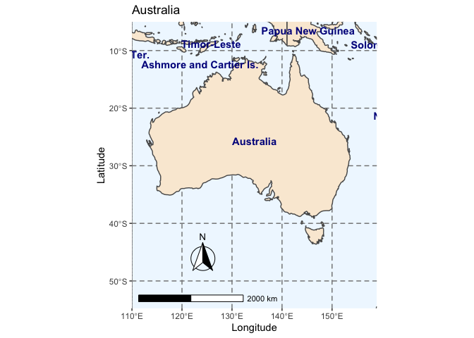

``` r
#AUSTRALIA FIRE DATA
ggplot(data=world) +
  geom_sf(fill= "antiquewhite") +
  geom_text(data= world_points,aes(x=X, y=Y, label=name),
            color = "darkblue", fontface = "bold", check_overlap = FALSE) +
  xlab("Longitude") + ylab("Latitude") +
  annotation_scale(location = "bl", width_hint = 0.5) +
  geom_sf(data=aus_fires) +
  coord_sf(xlim = c(110, 158.9589), ylim = c(-54.74922, -5), expand = FALSE) +
  ggtitle("Raw New Southwales RFS Data") +
  theme(panel.grid.major = element_line(color = gray(.5), linetype = "dashed", size = 0.5), panel.background = element_rect(fill = "aliceblue")) 
```

    ## Scale on map varies by more than 10%, scale bar may be inaccurate

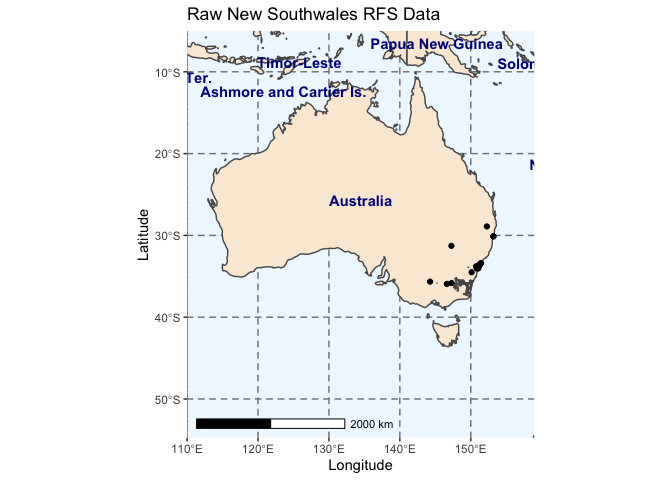

``` r
#This plot shows the available data for fires, they are happening in the south east area, therefore, we will zoom into that part for further visualization.

ggplot(data=world) +
  geom_sf(fill= "antiquewhite") +
  geom_text(data= world_points,aes(x=X, y=Y, label=name),
            color = "darkblue", fontface = "bold", check_overlap = FALSE) +
  xlab("Longitude") + ylab("Latitude") +
  annotation_scale(location = "bl", width_hint = 0.5) +
  geom_sf(data=aus_fires) +
  coord_sf(xlim = c(110, 158.9589), ylim = c(-54.74922, -5), expand = FALSE) +
  ggtitle("Raw New Southwales RFS Data") +
  theme(panel.grid.major = element_line(color = gray(.5), linetype = "dashed", size = 0.5), 
        panel.background = element_rect(fill = "aliceblue")) +
  geom_rect(aes(xmin = 140, xmax= 158, ymin= -40, ymax=-20), color= "black", fill=NA)
```

    ## Scale on map varies by more than 10%, scale bar may be inaccurate

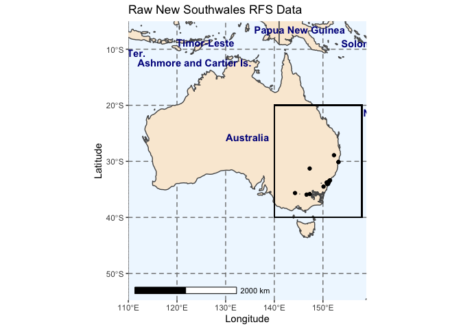

To generate a data frame of aus\_fires free of points within its geometry collection, I followed <https://gist.github.com/deanmarchiori/cb64f105eb0f6204eaa88323eaa29fdb>

``` r
fire_poly <- aus_fires %>% 
  st_buffer(dist = 0) %>% 
  st_union(by_feature = TRUE)
```

``` r
ggplot(data=world) +
  geom_sf(fill= "antiquewhite") +
  xlab("Longitude") + ylab("Latitude") +
  annotation_scale(location = "bl", width_hint = 0.5) +
  geom_sf(data=fire_poly, fill="red") +
  coord_sf(xlim = c(140, 158), ylim = c(-40, -20), expand = FALSE) +
  ggtitle("Zoom to affected areas") +
  theme(panel.grid.major = element_line(color = gray(.5), linetype = "dashed", size = 0.5), 
        panel.background = element_rect(fill = "aliceblue"))
```

    ## Scale on map varies by more than 10%, scale bar may be inaccurate

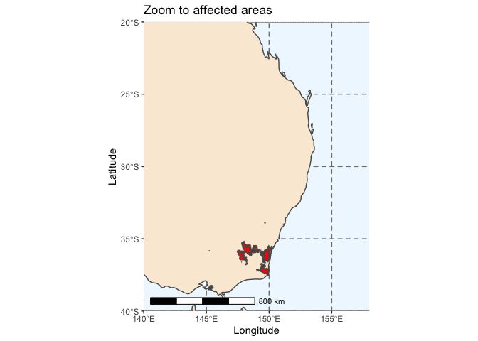
