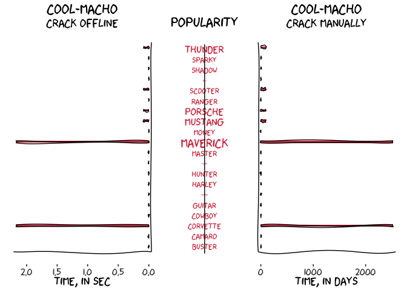
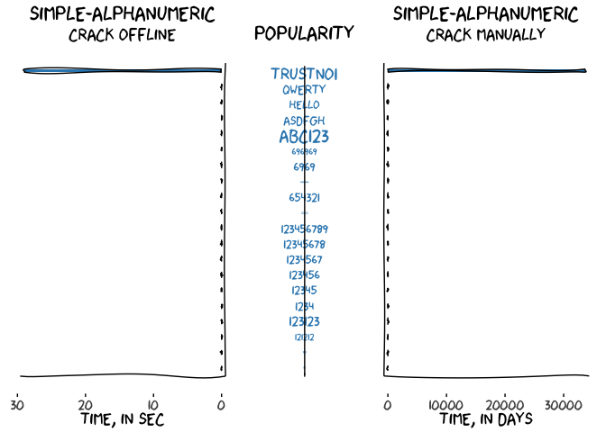
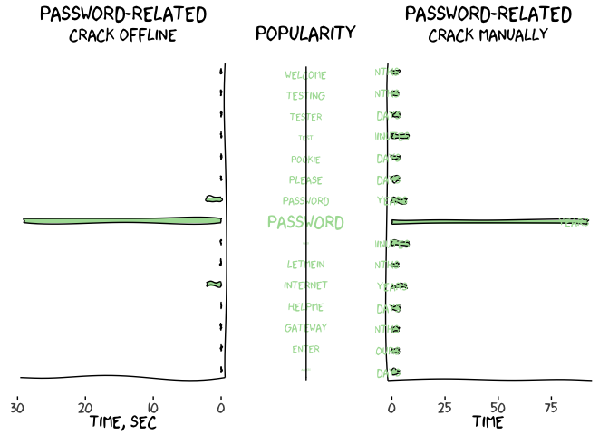
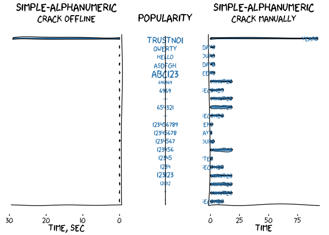
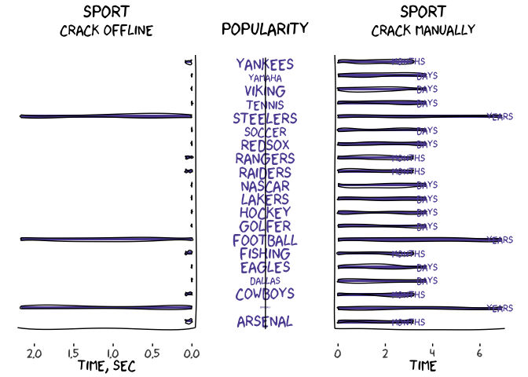

02\_Tidy\_Tuesday
================
Maria Sevillano
15/01/2020

Tidy Tuesday: Passwords
=======================

This R Markdown documents exploration of Tidy Tuesday data found in <https://github.com/rfordatascience/tidytuesday/blob/master/data/2020/2020-01-14>.

The objective for this week is to visualize popular password and how easy it is to crack down bad passwords.

Since the readme file shows a xkcd comic <https://xkcd.com/936/>, I wanted to incorporate this look into the visualization.

Here are some resources I found helpful:

<https://stackoverflow.com/questions/12675147/how-can-we-make-xkcd-style-graphs>

<https://epijim.uk/code-snippets/xkcd/>

Load libraries
--------------

``` r
library(tidyverse)
library(xkcd)
library(RColorBrewer)
library(cowplot)
```

Get Data
--------

``` r
passwords <- readr::read_csv('https://raw.githubusercontent.com/rfordatascience/tidytuesday/master/data/2020/2020-01-14/passwords.csv')
```

Ispect data
-----------

``` r
str(passwords)
```

    ## Classes 'spec_tbl_df', 'tbl_df', 'tbl' and 'data.frame': 507 obs. of  9 variables:
    ##  $ rank             : num  1 2 3 4 5 6 7 8 9 10 ...
    ##  $ password         : chr  "password" "123456" "12345678" "1234" ...
    ##  $ category         : chr  "password-related" "simple-alphanumeric" "simple-alphanumeric" "simple-alphanumeric" ...
    ##  $ value            : num  6.91 18.52 1.29 11.11 3.72 ...
    ##  $ time_unit        : chr  "years" "minutes" "days" "seconds" ...
    ##  $ offline_crack_sec: num  2.17 1.11e-05 1.11e-03 1.11e-07 3.21e-03 1.11e-06 3.21e-03 2.17 2.17 8.35e-02 ...
    ##  $ rank_alt         : num  1 2 3 4 5 6 7 8 9 10 ...
    ##  $ strength         : num  8 4 4 4 8 4 8 4 7 8 ...
    ##  $ font_size        : num  11 8 8 8 11 8 11 8 11 11 ...
    ##  - attr(*, "spec")=
    ##   .. cols(
    ##   ..   rank = col_double(),
    ##   ..   password = col_character(),
    ##   ..   category = col_character(),
    ##   ..   value = col_double(),
    ##   ..   time_unit = col_character(),
    ##   ..   offline_crack_sec = col_double(),
    ##   ..   rank_alt = col_double(),
    ##   ..   strength = col_double(),
    ##   ..   font_size = col_double()
    ##   .. )

``` r
summary(passwords)
```

    ##       rank         password           category             value       
    ##  Min.   :  1.0   Length:507         Length:507         Min.   : 1.290  
    ##  1st Qu.:125.8   Class :character   Class :character   1st Qu.: 3.430  
    ##  Median :250.5   Mode  :character   Mode  :character   Median : 3.720  
    ##  Mean   :250.5                                         Mean   : 5.603  
    ##  3rd Qu.:375.2                                         3rd Qu.: 3.720  
    ##  Max.   :500.0                                         Max.   :92.270  
    ##  NA's   :7                                             NA's   :7       
    ##   time_unit         offline_crack_sec     rank_alt        strength     
    ##  Length:507         Min.   : 0.00000   Min.   :  1.0   Min.   : 0.000  
    ##  Class :character   1st Qu.: 0.00321   1st Qu.:125.8   1st Qu.: 6.000  
    ##  Mode  :character   Median : 0.00321   Median :251.5   Median : 7.000  
    ##                     Mean   : 0.50001   Mean   :251.2   Mean   : 7.432  
    ##                     3rd Qu.: 0.08350   3rd Qu.:376.2   3rd Qu.: 8.000  
    ##                     Max.   :29.27000   Max.   :502.0   Max.   :48.000  
    ##                     NA's   :7          NA's   :7       NA's   :7       
    ##    font_size   
    ##  Min.   : 0.0  
    ##  1st Qu.:10.0  
    ##  Median :11.0  
    ##  Mean   :10.3  
    ##  3rd Qu.:11.0  
    ##  Max.   :28.0  
    ##  NA's   :7

``` r
levels(as.factor(passwords$category))
```

    ##  [1] "animal"              "cool-macho"          "fluffy"             
    ##  [4] "food"                "name"                "nerdy-pop"          
    ##  [7] "password-related"    "rebellious-rude"     "simple-alphanumeric"
    ## [10] "sport"

``` r
levels(as.factor(passwords$time_unit))
```

    ## [1] "days"    "hours"   "minutes" "months"  "seconds" "weeks"   "years"

Wrangle Data
------------

``` r
font_import(pattern = "[X/x]kcd", prompt=FALSE)
fonttable()
```

    ##     package                                       afmfile
    ## 1        NA                                   xkcd.afm.gz
    ## 2        NA                               Keyboard.afm.gz
    ## 3        NA                            SFNSDisplay.afm.gz
    ## 4        NA                               SFNSText.afm.gz
    ## 5        NA                         SFNSTextItalic.afm.gz
    ## 6        NA                            Andale Mono.afm.gz
    ## 7        NA                          Apple Braille.afm.gz
    ## 8        NA            Apple Braille Outline 6 Dot.afm.gz
    ## 9        NA            Apple Braille Outline 8 Dot.afm.gz
    ## 10       NA           Apple Braille Pinpoint 6 Dot.afm.gz
    ## 11       NA           Apple Braille Pinpoint 8 Dot.afm.gz
    ## 12       NA                           AppleMyungjo.afm.gz
    ## 13       NA                            Arial Black.afm.gz
    ## 14       NA                      Arial Bold Italic.afm.gz
    ## 15       NA                      Arial Bold Italic.afm.gz
    ## 16       NA                             Arial Bold.afm.gz
    ## 17       NA                             Arial Bold.afm.gz
    ## 18       NA                           Arial Italic.afm.gz
    ## 19       NA                           Arial Italic.afm.gz
    ## 20       NA                                  Arial.afm.gz
    ## 21       NA                                  Arial.afm.gz
    ## 22       NA                           Arial Narrow.afm.gz
    ## 23       NA                      Arial Narrow Bold.afm.gz
    ## 24       NA               Arial Narrow Bold Italic.afm.gz
    ## 25       NA                    Arial Narrow Italic.afm.gz
    ## 26       NA                     Arial Rounded Bold.afm.gz
    ## 27       NA                          Arial Unicode.afm.gz
    ## 28       NA                                Aurella.afm.gz
    ## 29       NA                     Back to Black Demo.afm.gz
    ## 30       NA                                 Batang.afm.gz
    ## 31       NA                       Bodoni Ornaments.afm.gz
    ## 32       NA               Bodoni 72 Smallcaps Book.afm.gz
    ## 33       NA             Bold & Stylish Calligraphy.afm.gz
    ## 34       NA                     Bookshelf Symbol 7.afm.gz
    ## 35       NA                      Bradley Hand Bold.afm.gz
    ## 36       NA                           Brush Script.afm.gz
    ## 37       NA                           Brush Script.afm.gz
    ## 38       NA                                Calibri.afm.gz
    ## 39       NA                           Calibri Bold.afm.gz
    ## 40       NA                    Calibri Bold Italic.afm.gz
    ## 41       NA                         Calibri Italic.afm.gz
    ## 42       NA                                Cambria.afm.gz
    ## 43       NA                           Cambria Bold.afm.gz
    ## 44       NA                    Cambria Bold Italic.afm.gz
    ## 45       NA                         Cambria Italic.afm.gz
    ## 46       NA                           Cambria Math.afm.gz
    ## 47       NA                                Candara.afm.gz
    ## 48       NA                           Candara Bold.afm.gz
    ## 49       NA                    Candara Bold Italic.afm.gz
    ## 50       NA                         Candara Italic.afm.gz
    ## 51       NA                      cerbetica_regular.afm.gz
    ## 52       NA                                chalala.afm.gz
    ## 53       NA                          Comic Sans MS.afm.gz
    ## 54       NA                     Comic Sans MS Bold.afm.gz
    ## 55       NA                               Consolas.afm.gz
    ## 56       NA                          Consolas Bold.afm.gz
    ## 57       NA                   Consolas Bold Italic.afm.gz
    ## 58       NA                        Consolas Italic.afm.gz
    ## 59       NA                             Constantia.afm.gz
    ## 60       NA                        Constantia Bold.afm.gz
    ## 61       NA                 Constantia Bold Italic.afm.gz
    ## 62       NA                      Constantia Italic.afm.gz
    ## 63       NA                                 Corbel.afm.gz
    ## 64       NA                            Corbel Bold.afm.gz
    ## 65       NA                     Corbel Bold Italic.afm.gz
    ## 66       NA                          Corbel Italic.afm.gz
    ## 67       NA                Courier New Bold Italic.afm.gz
    ## 68       NA                       Courier New Bold.afm.gz
    ## 69       NA                     Courier New Italic.afm.gz
    ## 70       NA                            Courier New.afm.gz
    ## 71       NA             December Calligraphy - TTF.afm.gz
    ## 72       NA                     DIN Alternate Bold.afm.gz
    ## 73       NA                     DIN Condensed Bold.afm.gz
    ## 74       NA                   Franklin Gothic Book.afm.gz
    ## 75       NA            Franklin Gothic Book Italic.afm.gz
    ## 76       NA                 Franklin Gothic Medium.afm.gz
    ## 77       NA          Franklin Gothic Medium Italic.afm.gz
    ## 78       NA                               Gabriola.afm.gz
    ## 79       NA                                Georgia.afm.gz
    ## 80       NA                           Georgia Bold.afm.gz
    ## 81       NA                    Georgia Bold Italic.afm.gz
    ## 82       NA                         Georgia Italic.afm.gz
    ## 83       NA                           Gill Sans MT.afm.gz
    ## 84       NA                      Gill Sans MT Bold.afm.gz
    ## 85       NA               Gill Sans MT Bold Italic.afm.gz
    ## 86       NA                    Gill Sans MT Italic.afm.gz
    ## 87       NA                                  Gulim.afm.gz
    ## 88       NA                           Hello Sarrah.afm.gz
    ## 89       NA                         I Love Glitter.afm.gz
    ## 90       NA                                 Impact.afm.gz
    ## 91       NA                        Khmer Sangam MN.afm.gz
    ## 92       NA                          Lao Sangam MN.afm.gz
    ## 93       NA                         Lucida Console.afm.gz
    ## 94       NA                    Lucida Sans Unicode.afm.gz
    ## 95       NA                               Luminari.afm.gz
    ## 96       NA                                Marlett.afm.gz
    ## 97       NA                                 Meiryo.afm.gz
    ## 98       NA                            Meiryo Bold.afm.gz
    ## 99       NA                     Meiryo Bold Italic.afm.gz
    ## 100      NA                          Meiryo Italic.afm.gz
    ## 101      NA                   Microsoft Sans Serif.afm.gz
    ## 102      NA                              MS Gothic.afm.gz
    ## 103      NA                              MS Mincho.afm.gz
    ## 104      NA                             MS PGothic.afm.gz
    ## 105      NA                             MS PMincho.afm.gz
    ## 106      NA                MS Reference Sans Serif.afm.gz
    ## 107      NA                 MS Reference Specialty.afm.gz
    ## 108      NA                       October Twilight.afm.gz
    ## 109      NA                 Palatino Linotype Bold.afm.gz
    ## 110      NA          Palatino Linotype Bold Italic.afm.gz
    ## 111      NA               Palatino Linotype Italic.afm.gz
    ## 112      NA                      Palatino Linotype.afm.gz
    ## 113      NA                               Perpetua.afm.gz
    ## 114      NA                          Perpetua Bold.afm.gz
    ## 115      NA                   Perpetua Bold Italic.afm.gz
    ## 116      NA                        Perpetua Italic.afm.gz
    ## 117      NA                               PMingLiU.afm.gz
    ## 118      NA                               Roselyne.afm.gz
    ## 119      NA                                 SimSun.afm.gz
    ## 120      NA               Stylish Calligraphy Demo.afm.gz
    ## 121      NA                                 Tahoma.afm.gz
    ## 122      NA                            Tahoma Bold.afm.gz
    ## 123      NA            Times New Roman Bold Italic.afm.gz
    ## 124      NA            Times New Roman Bold Italic.afm.gz
    ## 125      NA                   Times New Roman Bold.afm.gz
    ## 126      NA                   Times New Roman Bold.afm.gz
    ## 127      NA                 Times New Roman Italic.afm.gz
    ## 128      NA                 Times New Roman Italic.afm.gz
    ## 129      NA                        Times New Roman.afm.gz
    ## 130      NA                        Times New Roman.afm.gz
    ## 131      NA                            Trattatello.afm.gz
    ## 132      NA               Trebuchet MS Bold Italic.afm.gz
    ## 133      NA                           Trebuchet MS.afm.gz
    ## 134      NA                      Trebuchet MS Bold.afm.gz
    ## 135      NA                    Trebuchet MS Italic.afm.gz
    ## 136      NA                         Tw Cen MT Bold.afm.gz
    ## 137      NA                  Tw Cen MT Bold Italic.afm.gz
    ## 138      NA                       Tw Cen MT Italic.afm.gz
    ## 139      NA                              Tw Cen MT.afm.gz
    ## 140      NA                       Unic Calligraphy.afm.gz
    ## 141      NA              Unicorn Calligraphy - TTF.afm.gz
    ## 142      NA              Vampire Calligraphy - TTF.afm.gz
    ## 143      NA                                Verdana.afm.gz
    ## 144      NA                                Verdana.afm.gz
    ## 145      NA                           Verdana Bold.afm.gz
    ## 146      NA                           Verdana Bold.afm.gz
    ## 147      NA                    Verdana Bold Italic.afm.gz
    ## 148      NA                    Verdana Bold Italic.afm.gz
    ## 149      NA                         Verdana Italic.afm.gz
    ## 150      NA                         Verdana Italic.afm.gz
    ## 151      NA                               Webdings.afm.gz
    ## 152      NA                              Wingdings.afm.gz
    ## 153      NA                              Wingdings.afm.gz
    ## 154      NA                            Wingdings 2.afm.gz
    ## 155      NA                            Wingdings 2.afm.gz
    ## 156      NA                            Wingdings 3.afm.gz
    ## 157      NA                            Wingdings 3.afm.gz
    ## 158      NA                     Winter Calligraphy.afm.gz
    ## 159      NA FontsFree-Net-proxima_nova_reg-webfont.afm.gz
    ##                                                                        fontfile
    ## 1                                     /Users/m.sevillano/Library/Fonts/xkcd.ttf
    ## 2                                            /System/Library/Fonts/Keyboard.ttf
    ## 3                                         /System/Library/Fonts/SFNSDisplay.ttf
    ## 4                                            /System/Library/Fonts/SFNSText.ttf
    ## 5                                      /System/Library/Fonts/SFNSTextItalic.ttf
    ## 6                                                /Library/Fonts/Andale Mono.ttf
    ## 7                                       /System/Library/Fonts/Apple Braille.ttf
    ## 8                         /System/Library/Fonts/Apple Braille Outline 6 Dot.ttf
    ## 9                         /System/Library/Fonts/Apple Braille Outline 8 Dot.ttf
    ## 10                       /System/Library/Fonts/Apple Braille Pinpoint 6 Dot.ttf
    ## 11                       /System/Library/Fonts/Apple Braille Pinpoint 8 Dot.ttf
    ## 12                                              /Library/Fonts/AppleMyungjo.ttf
    ## 13                                               /Library/Fonts/Arial Black.ttf
    ## 14                                         /Library/Fonts/Arial Bold Italic.ttf
    ## 15                               /Library/Fonts/Microsoft/Arial Bold Italic.ttf
    ## 16                                      /Library/Fonts/Microsoft/Arial Bold.ttf
    ## 17                                                /Library/Fonts/Arial Bold.ttf
    ## 18                                    /Library/Fonts/Microsoft/Arial Italic.ttf
    ## 19                                              /Library/Fonts/Arial Italic.ttf
    ## 20                                                     /Library/Fonts/Arial.ttf
    ## 21                                           /Library/Fonts/Microsoft/Arial.ttf
    ## 22                                              /Library/Fonts/Arial Narrow.ttf
    ## 23                                         /Library/Fonts/Arial Narrow Bold.ttf
    ## 24                                  /Library/Fonts/Arial Narrow Bold Italic.ttf
    ## 25                                       /Library/Fonts/Arial Narrow Italic.ttf
    ## 26                                        /Library/Fonts/Arial Rounded Bold.ttf
    ## 27                                             /Library/Fonts/Arial Unicode.ttf
    ## 28                                 /Users/m.sevillano/Library/Fonts/Aurella.ttf
    ## 29                      /Users/m.sevillano/Library/Fonts/Back to Black Demo.ttf
    ## 30                                          /Library/Fonts/Microsoft/Batang.ttf
    ## 31                                          /Library/Fonts/Bodoni Ornaments.ttf
    ## 32                                  /Library/Fonts/Bodoni 72 Smallcaps Book.ttf
    ## 33              /Users/m.sevillano/Library/Fonts/Bold & Stylish Calligraphy.ttf
    ## 34                              /Library/Fonts/Microsoft/Bookshelf Symbol 7.ttf
    ## 35                                         /Library/Fonts/Bradley Hand Bold.ttf
    ## 36                                              /Library/Fonts/Brush Script.ttf
    ## 37                                    /Library/Fonts/Microsoft/Brush Script.ttf
    ## 38                                         /Library/Fonts/Microsoft/Calibri.ttf
    ## 39                                    /Library/Fonts/Microsoft/Calibri Bold.ttf
    ## 40                             /Library/Fonts/Microsoft/Calibri Bold Italic.ttf
    ## 41                                  /Library/Fonts/Microsoft/Calibri Italic.ttf
    ## 42                                         /Library/Fonts/Microsoft/Cambria.ttf
    ## 43                                    /Library/Fonts/Microsoft/Cambria Bold.ttf
    ## 44                             /Library/Fonts/Microsoft/Cambria Bold Italic.ttf
    ## 45                                  /Library/Fonts/Microsoft/Cambria Italic.ttf
    ## 46                                    /Library/Fonts/Microsoft/Cambria Math.ttf
    ## 47                                         /Library/Fonts/Microsoft/Candara.ttf
    ## 48                                    /Library/Fonts/Microsoft/Candara Bold.ttf
    ## 49                             /Library/Fonts/Microsoft/Candara Bold Italic.ttf
    ## 50                                  /Library/Fonts/Microsoft/Candara Italic.ttf
    ## 51                       /Users/m.sevillano/Library/Fonts/cerbetica_regular.ttf
    ## 52                                 /Users/m.sevillano/Library/Fonts/chalala.ttf
    ## 53                                             /Library/Fonts/Comic Sans MS.ttf
    ## 54                                        /Library/Fonts/Comic Sans MS Bold.ttf
    ## 55                                        /Library/Fonts/Microsoft/Consolas.ttf
    ## 56                                   /Library/Fonts/Microsoft/Consolas Bold.ttf
    ## 57                            /Library/Fonts/Microsoft/Consolas Bold Italic.ttf
    ## 58                                 /Library/Fonts/Microsoft/Consolas Italic.ttf
    ## 59                                      /Library/Fonts/Microsoft/Constantia.ttf
    ## 60                                 /Library/Fonts/Microsoft/Constantia Bold.ttf
    ## 61                          /Library/Fonts/Microsoft/Constantia Bold Italic.ttf
    ## 62                               /Library/Fonts/Microsoft/Constantia Italic.ttf
    ## 63                                          /Library/Fonts/Microsoft/Corbel.ttf
    ## 64                                     /Library/Fonts/Microsoft/Corbel Bold.ttf
    ## 65                              /Library/Fonts/Microsoft/Corbel Bold Italic.ttf
    ## 66                                   /Library/Fonts/Microsoft/Corbel Italic.ttf
    ## 67                                   /Library/Fonts/Courier New Bold Italic.ttf
    ## 68                                          /Library/Fonts/Courier New Bold.ttf
    ## 69                                        /Library/Fonts/Courier New Italic.ttf
    ## 70                                               /Library/Fonts/Courier New.ttf
    ## 71              /Users/m.sevillano/Library/Fonts/December Calligraphy - TTF.ttf
    ## 72                                        /Library/Fonts/DIN Alternate Bold.ttf
    ## 73                                        /Library/Fonts/DIN Condensed Bold.ttf
    ## 74                            /Library/Fonts/Microsoft/Franklin Gothic Book.ttf
    ## 75                     /Library/Fonts/Microsoft/Franklin Gothic Book Italic.ttf
    ## 76                          /Library/Fonts/Microsoft/Franklin Gothic Medium.ttf
    ## 77                   /Library/Fonts/Microsoft/Franklin Gothic Medium Italic.ttf
    ## 78                                        /Library/Fonts/Microsoft/Gabriola.ttf
    ## 79                                                   /Library/Fonts/Georgia.ttf
    ## 80                                              /Library/Fonts/Georgia Bold.ttf
    ## 81                                       /Library/Fonts/Georgia Bold Italic.ttf
    ## 82                                            /Library/Fonts/Georgia Italic.ttf
    ## 83                                    /Library/Fonts/Microsoft/Gill Sans MT.ttf
    ## 84                               /Library/Fonts/Microsoft/Gill Sans MT Bold.ttf
    ## 85                        /Library/Fonts/Microsoft/Gill Sans MT Bold Italic.ttf
    ## 86                             /Library/Fonts/Microsoft/Gill Sans MT Italic.ttf
    ## 87                                           /Library/Fonts/Microsoft/Gulim.ttf
    ## 88                            /Users/m.sevillano/Library/Fonts/Hello Sarrah.ttf
    ## 89                          /Users/m.sevillano/Library/Fonts/I Love Glitter.ttf
    ## 90                                                    /Library/Fonts/Impact.ttf
    ## 91                                           /Library/Fonts/Khmer Sangam MN.ttf
    ## 92                                             /Library/Fonts/Lao Sangam MN.ttf
    ## 93                                  /Library/Fonts/Microsoft/Lucida Console.ttf
    ## 94                             /Library/Fonts/Microsoft/Lucida Sans Unicode.ttf
    ## 95                                                  /Library/Fonts/Luminari.ttf
    ## 96                                         /Library/Fonts/Microsoft/Marlett.ttf
    ## 97                                          /Library/Fonts/Microsoft/Meiryo.ttf
    ## 98                                     /Library/Fonts/Microsoft/Meiryo Bold.ttf
    ## 99                              /Library/Fonts/Microsoft/Meiryo Bold Italic.ttf
    ## 100                                  /Library/Fonts/Microsoft/Meiryo Italic.ttf
    ## 101                                     /Library/Fonts/Microsoft Sans Serif.ttf
    ## 102                                      /Library/Fonts/Microsoft/MS Gothic.ttf
    ## 103                                      /Library/Fonts/Microsoft/MS Mincho.ttf
    ## 104                                     /Library/Fonts/Microsoft/MS PGothic.ttf
    ## 105                                     /Library/Fonts/Microsoft/MS PMincho.ttf
    ## 106                        /Library/Fonts/Microsoft/MS Reference Sans Serif.ttf
    ## 107                         /Library/Fonts/Microsoft/MS Reference Specialty.ttf
    ## 108                       /Users/m.sevillano/Library/Fonts/October Twilight.ttf
    ## 109                         /Library/Fonts/Microsoft/Palatino Linotype Bold.ttf
    ## 110                  /Library/Fonts/Microsoft/Palatino Linotype Bold Italic.ttf
    ## 111                       /Library/Fonts/Microsoft/Palatino Linotype Italic.ttf
    ## 112                              /Library/Fonts/Microsoft/Palatino Linotype.ttf
    ## 113                                       /Library/Fonts/Microsoft/Perpetua.ttf
    ## 114                                  /Library/Fonts/Microsoft/Perpetua Bold.ttf
    ## 115                           /Library/Fonts/Microsoft/Perpetua Bold Italic.ttf
    ## 116                                /Library/Fonts/Microsoft/Perpetua Italic.ttf
    ## 117                                       /Library/Fonts/Microsoft/PMingLiU.ttf
    ## 118                               /Users/m.sevillano/Library/Fonts/Roselyne.ttf
    ## 119                                         /Library/Fonts/Microsoft/SimSun.ttf
    ## 120               /Users/m.sevillano/Library/Fonts/Stylish Calligraphy Demo.ttf
    ## 121                                                   /Library/Fonts/Tahoma.ttf
    ## 122                                              /Library/Fonts/Tahoma Bold.ttf
    ## 123                    /Library/Fonts/Microsoft/Times New Roman Bold Italic.ttf
    ## 124                              /Library/Fonts/Times New Roman Bold Italic.ttf
    ## 125                           /Library/Fonts/Microsoft/Times New Roman Bold.ttf
    ## 126                                     /Library/Fonts/Times New Roman Bold.ttf
    ## 127                         /Library/Fonts/Microsoft/Times New Roman Italic.ttf
    ## 128                                   /Library/Fonts/Times New Roman Italic.ttf
    ## 129                                /Library/Fonts/Microsoft/Times New Roman.ttf
    ## 130                                          /Library/Fonts/Times New Roman.ttf
    ## 131                                              /Library/Fonts/Trattatello.ttf
    ## 132                                 /Library/Fonts/Trebuchet MS Bold Italic.ttf
    ## 133                                             /Library/Fonts/Trebuchet MS.ttf
    ## 134                                        /Library/Fonts/Trebuchet MS Bold.ttf
    ## 135                                      /Library/Fonts/Trebuchet MS Italic.ttf
    ## 136                                 /Library/Fonts/Microsoft/Tw Cen MT Bold.ttf
    ## 137                          /Library/Fonts/Microsoft/Tw Cen MT Bold Italic.ttf
    ## 138                               /Library/Fonts/Microsoft/Tw Cen MT Italic.ttf
    ## 139                                      /Library/Fonts/Microsoft/Tw Cen MT.ttf
    ## 140                       /Users/m.sevillano/Library/Fonts/Unic Calligraphy.ttf
    ## 141              /Users/m.sevillano/Library/Fonts/Unicorn Calligraphy - TTF.ttf
    ## 142              /Users/m.sevillano/Library/Fonts/Vampire Calligraphy - TTF.ttf
    ## 143                                                  /Library/Fonts/Verdana.ttf
    ## 144                                        /Library/Fonts/Microsoft/Verdana.ttf
    ## 145                                             /Library/Fonts/Verdana Bold.ttf
    ## 146                                   /Library/Fonts/Microsoft/Verdana Bold.ttf
    ## 147                            /Library/Fonts/Microsoft/Verdana Bold Italic.ttf
    ## 148                                      /Library/Fonts/Verdana Bold Italic.ttf
    ## 149                                           /Library/Fonts/Verdana Italic.ttf
    ## 150                                 /Library/Fonts/Microsoft/Verdana Italic.ttf
    ## 151                                                 /Library/Fonts/Webdings.ttf
    ## 152                                                /Library/Fonts/Wingdings.ttf
    ## 153                                      /Library/Fonts/Microsoft/Wingdings.ttf
    ## 154                                    /Library/Fonts/Microsoft/Wingdings 2.ttf
    ## 155                                              /Library/Fonts/Wingdings 2.ttf
    ## 156                                    /Library/Fonts/Microsoft/Wingdings 3.ttf
    ## 157                                              /Library/Fonts/Wingdings 3.ttf
    ## 158                     /Users/m.sevillano/Library/Fonts/Winter Calligraphy.ttf
    ## 159 /Users/m.sevillano/Library/Fonts/FontsFree-Net-proxima_nova_reg-webfont.ttf
    ##                          FullName                FamilyName
    ## 1                            xkcd                      xkcd
    ## 2                       .Keyboard                 .Keyboard
    ## 3                     System Font               System Font
    ## 4                     System Font               System Font
    ## 5              System Font Italic               System Font
    ## 6                     Andale Mono               Andale Mono
    ## 7                   Apple Braille             Apple Braille
    ## 8     Apple Braille Outline 6 Dot             Apple Braille
    ## 9     Apple Braille Outline 8 Dot             Apple Braille
    ## 10   Apple Braille Pinpoint 6 Dot             Apple Braille
    ## 11   Apple Braille Pinpoint 8 Dot             Apple Braille
    ## 12           AppleMyungjo Regular              AppleMyungjo
    ## 13                    Arial Black               Arial Black
    ## 14              Arial Bold Italic                     Arial
    ## 15              Arial Bold Italic                     Arial
    ## 16                     Arial Bold                     Arial
    ## 17                     Arial Bold                     Arial
    ## 18                   Arial Italic                     Arial
    ## 19                   Arial Italic                     Arial
    ## 20                          Arial                     Arial
    ## 21                          Arial                     Arial
    ## 22                   Arial Narrow              Arial Narrow
    ## 23              Arial Narrow Bold              Arial Narrow
    ## 24       Arial Narrow Bold Italic              Arial Narrow
    ## 25            Arial Narrow Italic              Arial Narrow
    ## 26          Arial Rounded MT Bold     Arial Rounded MT Bold
    ## 27               Arial Unicode MS          Arial Unicode MS
    ## 28                 Aurella-Script                   Aurella
    ## 29             Back to Black Demo        Back to Black Demo
    ## 30                         Batang                    Batang
    ## 31               Bodoni Ornaments          Bodoni Ornaments
    ## 32       Bodoni 72 Smallcaps Book       Bodoni 72 Smallcaps
    ## 33     Bold & Stylish Calligraphy Bold  Stylish Calligraphy
    ## 34             Bookshelf Symbol 7        Bookshelf Symbol 7
    ## 35              Bradley-Hand-Bold                          
    ## 36         Brush Script MT Italic           Brush Script MT
    ## 37         Brush Script MT Italic           Brush Script MT
    ## 38                        Calibri                   Calibri
    ## 39                   Calibri Bold                   Calibri
    ## 40            Calibri Bold Italic                   Calibri
    ## 41                 Calibri Italic                   Calibri
    ## 42                        Cambria                   Cambria
    ## 43                   Cambria Bold                   Cambria
    ## 44            Cambria Bold Italic                   Cambria
    ## 45                 Cambria Italic                   Cambria
    ## 46                   Cambria Math              Cambria Math
    ## 47                        Candara                   Candara
    ## 48                   Candara Bold                   Candara
    ## 49            Candara Bold Italic                   Candara
    ## 50                 Candara Italic                   Candara
    ## 51                      Cerbetica                 Cerbetica
    ## 52                 chalala-script                   chalala
    ## 53                  Comic Sans MS             Comic Sans MS
    ## 54             Comic Sans MS Bold             Comic Sans MS
    ## 55                       Consolas                  Consolas
    ## 56                  Consolas Bold                  Consolas
    ## 57           Consolas Bold Italic                  Consolas
    ## 58                Consolas Italic                  Consolas
    ## 59                     Constantia                Constantia
    ## 60                Constantia Bold                Constantia
    ## 61         Constantia Bold Italic                Constantia
    ## 62              Constantia Italic                Constantia
    ## 63                         Corbel                    Corbel
    ## 64                    Corbel Bold                    Corbel
    ## 65             Corbel Bold Italic                    Corbel
    ## 66                  Corbel Italic                    Corbel
    ## 67        Courier New Bold Italic               Courier New
    ## 68               Courier New Bold               Courier New
    ## 69             Courier New Italic               Courier New
    ## 70                    Courier New               Courier New
    ## 71           December Calligraphy      December Calligraphy
    ## 72             DIN Alternate Bold             DIN Alternate
    ## 73             DIN Condensed Bold             DIN Condensed
    ## 74           Franklin Gothic Book      Franklin Gothic Book
    ## 75    Franklin Gothic Book Italic      Franklin Gothic Book
    ## 76         Franklin Gothic Medium    Franklin Gothic Medium
    ## 77  Franklin Gothic Medium Italic    Franklin Gothic Medium
    ## 78                       Gabriola                  Gabriola
    ## 79                        Georgia                   Georgia
    ## 80                   Georgia Bold                   Georgia
    ## 81            Georgia Bold Italic                   Georgia
    ## 82                 Georgia Italic                   Georgia
    ## 83                   Gill Sans MT              Gill Sans MT
    ## 84              Gill Sans MT Bold              Gill Sans MT
    ## 85       Gill Sans MT Bold Italic              Gill Sans MT
    ## 86            Gill Sans MT Italic              Gill Sans MT
    ## 87                          Gulim                     Gulim
    ## 88              HelloSarrahScript       Hello Sarrah Script
    ## 89                 I Love Glitter            I Love Glitter
    ## 90                         Impact                    Impact
    ## 91                Khmer Sangam MN           Khmer Sangam MN
    ## 92                  Lao Sangam MN             Lao Sangam MN
    ## 93                 Lucida Console            Lucida Console
    ## 94            Lucida Sans Unicode       Lucida Sans Unicode
    ## 95                       Luminari                  Luminari
    ## 96                        Marlett                   Marlett
    ## 97                         Meiryo                    Meiryo
    ## 98                    Meiryo Bold                    Meiryo
    ## 99             Meiryo Bold Italic                    Meiryo
    ## 100                 Meiryo Italic                    Meiryo
    ## 101          Microsoft Sans Serif      Microsoft Sans Serif
    ## 102                     MS Gothic                 MS Gothic
    ## 103                     MS Mincho                 MS Mincho
    ## 104                    MS PGothic                MS PGothic
    ## 105                    MS PMincho                MS PMincho
    ## 106       MS Reference Sans Serif   MS Reference Sans Serif
    ## 107        MS Reference Specialty    MS Reference Specialty
    ## 108              October Twilight          October Twilight
    ## 109        Palatino Linotype Bold         Palatino Linotype
    ## 110 Palatino Linotype Bold Italic         Palatino Linotype
    ## 111      Palatino Linotype Italic         Palatino Linotype
    ## 112             Palatino Linotype         Palatino Linotype
    ## 113                      Perpetua                  Perpetua
    ## 114                 Perpetua Bold                  Perpetua
    ## 115          Perpetua Bold Italic                  Perpetua
    ## 116               Perpetua Italic                  Perpetua
    ## 117                      PMingLiU                  PMingLiU
    ## 118              Roselyne-Regular          Roselyne Regular
    ## 119                        SimSun                    SimSun
    ## 120      Stylish Calligraphy Demo  Stylish Calligraphy Demo
    ## 121                        Tahoma                    Tahoma
    ## 122                   Tahoma Bold                    Tahoma
    ## 123   Times New Roman Bold Italic           Times New Roman
    ## 124   Times New Roman Bold Italic           Times New Roman
    ## 125          Times New Roman Bold           Times New Roman
    ## 126          Times New Roman Bold           Times New Roman
    ## 127        Times New Roman Italic           Times New Roman
    ## 128        Times New Roman Italic           Times New Roman
    ## 129               Times New Roman           Times New Roman
    ## 130               Times New Roman           Times New Roman
    ## 131                   Trattatello               Trattatello
    ## 132      Trebuchet MS Bold Italic              Trebuchet MS
    ## 133                  Trebuchet MS              Trebuchet MS
    ## 134             Trebuchet MS Bold              Trebuchet MS
    ## 135           Trebuchet MS Italic              Trebuchet MS
    ## 136                Tw Cen MT Bold                 Tw Cen MT
    ## 137         Tw Cen MT Bold Italic                 Tw Cen MT
    ## 138              Tw Cen MT Italic                 Tw Cen MT
    ## 139                     Tw Cen MT                 Tw Cen MT
    ## 140              Unic Calligraphy          Unic Calligraphy
    ## 141           Unicorn Calligraphy       Unicorn Calligraphy
    ## 142           Vampire Calligraphy       Vampire Calligraphy
    ## 143                       Verdana                   Verdana
    ## 144                       Verdana                   Verdana
    ## 145                  Verdana Bold                   Verdana
    ## 146                  Verdana Bold                   Verdana
    ## 147           Verdana Bold Italic                   Verdana
    ## 148           Verdana Bold Italic                   Verdana
    ## 149                Verdana Italic                   Verdana
    ## 150                Verdana Italic                   Verdana
    ## 151                      Webdings                  Webdings
    ## 152                     Wingdings                 Wingdings
    ## 153                     Wingdings                 Wingdings
    ## 154                   Wingdings 2               Wingdings 2
    ## 155                   Wingdings 2               Wingdings 2
    ## 156                   Wingdings 3               Wingdings 3
    ## 157                   Wingdings 3               Wingdings 3
    ## 158            Winter Calligraphy        Winter Calligraphy
    ## 159       Proxima Nova Rg Regular           Proxima Nova Rg
    ##                         FontName  Bold Italic Symbol afmsymfile
    ## 1                           xkcd FALSE  FALSE  FALSE         NA
    ## 2                      -Keyboard FALSE  FALSE  FALSE         NA
    ## 3                   -SFNSDisplay FALSE  FALSE  FALSE         NA
    ## 4                      -SFNSText FALSE  FALSE  FALSE         NA
    ## 5               -SFNSText-Italic FALSE   TRUE  FALSE         NA
    ## 6                     AndaleMono FALSE  FALSE  FALSE         NA
    ## 7                   AppleBraille FALSE  FALSE  FALSE         NA
    ## 8       AppleBraille-Outline6Dot FALSE  FALSE  FALSE         NA
    ## 9       AppleBraille-Outline8Dot FALSE  FALSE  FALSE         NA
    ## 10     AppleBraille-Pinpoint6Dot FALSE  FALSE  FALSE         NA
    ## 11     AppleBraille-Pinpoint8Dot FALSE  FALSE  FALSE         NA
    ## 12                  AppleMyungjo FALSE  FALSE  FALSE         NA
    ## 13                   Arial-Black FALSE  FALSE  FALSE         NA
    ## 14            Arial-BoldItalicMT  TRUE   TRUE  FALSE         NA
    ## 15            Arial-BoldItalicMT  TRUE   TRUE  FALSE         NA
    ## 16                  Arial-BoldMT  TRUE  FALSE  FALSE         NA
    ## 17                  Arial-BoldMT  TRUE  FALSE  FALSE         NA
    ## 18                Arial-ItalicMT FALSE   TRUE  FALSE         NA
    ## 19                Arial-ItalicMT FALSE   TRUE  FALSE         NA
    ## 20                       ArialMT FALSE  FALSE  FALSE         NA
    ## 21                       ArialMT FALSE  FALSE  FALSE         NA
    ## 22                   ArialNarrow FALSE  FALSE  FALSE         NA
    ## 23              ArialNarrow-Bold  TRUE  FALSE  FALSE         NA
    ## 24        ArialNarrow-BoldItalic  TRUE   TRUE  FALSE         NA
    ## 25            ArialNarrow-Italic FALSE   TRUE  FALSE         NA
    ## 26            ArialRoundedMTBold FALSE  FALSE  FALSE         NA
    ## 27                ArialUnicodeMS FALSE  FALSE  FALSE         NA
    ## 28                Aurella-Script FALSE  FALSE  FALSE         NA
    ## 29               BacktoBlackDemo FALSE  FALSE  FALSE         NA
    ## 30                        Batang FALSE  FALSE  FALSE         NA
    ## 31          BodoniOrnamentsITCTT FALSE  FALSE  FALSE         NA
    ## 32     BodoniSvtyTwoSCITCTT-Book FALSE  FALSE  FALSE         NA
    ## 33        BoldStylishCalligraphy FALSE  FALSE  FALSE         NA
    ## 34          BookshelfSymbolSeven FALSE  FALSE   TRUE         NA
    ## 35             Bradley-Hand-Bold  TRUE  FALSE  FALSE         NA
    ## 36                 BrushScriptMT FALSE   TRUE  FALSE         NA
    ## 37                 BrushScriptMT FALSE   TRUE  FALSE         NA
    ## 38                       Calibri FALSE  FALSE  FALSE         NA
    ## 39                  Calibri-Bold  TRUE  FALSE  FALSE         NA
    ## 40            Calibri-BoldItalic  TRUE   TRUE  FALSE         NA
    ## 41                Calibri-Italic FALSE   TRUE  FALSE         NA
    ## 42                       Cambria FALSE  FALSE  FALSE         NA
    ## 43                  Cambria-Bold  TRUE  FALSE  FALSE         NA
    ## 44            Cambria-BoldItalic  TRUE   TRUE  FALSE         NA
    ## 45                Cambria-Italic FALSE   TRUE  FALSE         NA
    ## 46                   CambriaMath FALSE  FALSE  FALSE         NA
    ## 47                       Candara FALSE  FALSE  FALSE         NA
    ## 48                  Candara-Bold  TRUE  FALSE  FALSE         NA
    ## 49            Candara-BoldItalic  TRUE   TRUE  FALSE         NA
    ## 50                Candara-Italic FALSE   TRUE  FALSE         NA
    ## 51                     Cerbetica FALSE  FALSE  FALSE         NA
    ## 52                chalala-script FALSE  FALSE  FALSE         NA
    ## 53                   ComicSansMS FALSE  FALSE  FALSE         NA
    ## 54              ComicSansMS-Bold  TRUE  FALSE  FALSE         NA
    ## 55                      Consolas FALSE  FALSE  FALSE         NA
    ## 56                 Consolas-Bold  TRUE  FALSE  FALSE         NA
    ## 57           Consolas-BoldItalic  TRUE   TRUE  FALSE         NA
    ## 58               Consolas-Italic FALSE   TRUE  FALSE         NA
    ## 59                    Constantia FALSE  FALSE  FALSE         NA
    ## 60               Constantia-Bold  TRUE  FALSE  FALSE         NA
    ## 61         Constantia-BoldItalic  TRUE   TRUE  FALSE         NA
    ## 62             Constantia-Italic FALSE   TRUE  FALSE         NA
    ## 63                        Corbel FALSE  FALSE  FALSE         NA
    ## 64                   Corbel-Bold  TRUE  FALSE  FALSE         NA
    ## 65             Corbel-BoldItalic  TRUE   TRUE  FALSE         NA
    ## 66                 Corbel-Italic FALSE   TRUE  FALSE         NA
    ## 67     CourierNewPS-BoldItalicMT  TRUE   TRUE  FALSE         NA
    ## 68           CourierNewPS-BoldMT  TRUE  FALSE  FALSE         NA
    ## 69         CourierNewPS-ItalicMT FALSE   TRUE  FALSE         NA
    ## 70                CourierNewPSMT FALSE  FALSE  FALSE         NA
    ## 71           DecemberCalligraphy FALSE  FALSE  FALSE         NA
    ## 72             DINAlternate-Bold  TRUE  FALSE  FALSE         NA
    ## 73             DINCondensed-Bold  TRUE  FALSE  FALSE         NA
    ## 74           FranklinGothic-Book FALSE  FALSE  FALSE         NA
    ## 75     FranklinGothic-BookItalic FALSE   TRUE  FALSE         NA
    ## 76         FranklinGothic-Medium FALSE  FALSE  FALSE         NA
    ## 77   FranklinGothic-MediumItalic FALSE   TRUE  FALSE         NA
    ## 78                      Gabriola FALSE  FALSE  FALSE         NA
    ## 79                       Georgia FALSE  FALSE  FALSE         NA
    ## 80                  Georgia-Bold  TRUE  FALSE  FALSE         NA
    ## 81            Georgia-BoldItalic  TRUE   TRUE  FALSE         NA
    ## 82                Georgia-Italic FALSE   TRUE  FALSE         NA
    ## 83                    GillSansMT FALSE  FALSE  FALSE         NA
    ## 84               GillSansMT-Bold  TRUE  FALSE  FALSE         NA
    ## 85         GillSansMT-BoldItalic  TRUE   TRUE  FALSE         NA
    ## 86             GillSansMT-Italic FALSE   TRUE  FALSE         NA
    ## 87                         Gulim FALSE  FALSE  FALSE         NA
    ## 88             HelloSarrahScript FALSE  FALSE  FALSE         NA
    ## 89                  ILoveGlitter FALSE  FALSE  FALSE         NA
    ## 90                        Impact FALSE  FALSE  FALSE         NA
    ## 91                 KhmerSangamMN FALSE  FALSE  FALSE         NA
    ## 92                   LaoSangamMN FALSE  FALSE  FALSE         NA
    ## 93                 LucidaConsole FALSE  FALSE  FALSE         NA
    ## 94             LucidaSansUnicode FALSE  FALSE  FALSE         NA
    ## 95              Luminari-Regular FALSE  FALSE  FALSE         NA
    ## 96                       Marlett FALSE  FALSE  FALSE         NA
    ## 97                        Meiryo FALSE  FALSE  FALSE         NA
    ## 98                   Meiryo-Bold  TRUE  FALSE  FALSE         NA
    ## 99             Meiryo-BoldItalic  TRUE   TRUE  FALSE         NA
    ## 100                Meiryo-Italic FALSE   TRUE  FALSE         NA
    ## 101           MicrosoftSansSerif FALSE  FALSE  FALSE         NA
    ## 102                    MS-Gothic FALSE  FALSE  FALSE         NA
    ## 103                    MS-Mincho FALSE  FALSE  FALSE         NA
    ## 104                   MS-PGothic FALSE  FALSE  FALSE         NA
    ## 105                   MS-PMincho FALSE  FALSE  FALSE         NA
    ## 106         MSReferenceSansSerif FALSE  FALSE  FALSE         NA
    ## 107         MSReferenceSpecialty FALSE  FALSE  FALSE         NA
    ## 108              OctoberTwilight FALSE  FALSE  FALSE         NA
    ## 109        PalatinoLinotype-Bold  TRUE  FALSE  FALSE         NA
    ## 110  PalatinoLinotype-BoldItalic  TRUE   TRUE  FALSE         NA
    ## 111      PalatinoLinotype-Italic FALSE   TRUE  FALSE         NA
    ## 112       PalatinoLinotype-Roman FALSE  FALSE  FALSE         NA
    ## 113                     Perpetua FALSE  FALSE  FALSE         NA
    ## 114                Perpetua-Bold  TRUE  FALSE  FALSE         NA
    ## 115          Perpetua-BoldItalic  TRUE   TRUE  FALSE         NA
    ## 116              Perpetua-Italic FALSE   TRUE  FALSE         NA
    ## 117                     PMingLiU FALSE  FALSE  FALSE         NA
    ## 118             Roselyne-Regular FALSE  FALSE  FALSE         NA
    ## 119                       SimSun FALSE  FALSE  FALSE         NA
    ## 120       StylishCalligraphyDemo FALSE  FALSE  FALSE         NA
    ## 121                       Tahoma FALSE  FALSE  FALSE         NA
    ## 122                  Tahoma-Bold  TRUE  FALSE  FALSE         NA
    ## 123 TimesNewRomanPS-BoldItalicMT  TRUE   TRUE  FALSE         NA
    ## 124 TimesNewRomanPS-BoldItalicMT  TRUE   TRUE  FALSE         NA
    ## 125       TimesNewRomanPS-BoldMT  TRUE  FALSE  FALSE         NA
    ## 126       TimesNewRomanPS-BoldMT  TRUE  FALSE  FALSE         NA
    ## 127     TimesNewRomanPS-ItalicMT FALSE   TRUE  FALSE         NA
    ## 128     TimesNewRomanPS-ItalicMT FALSE   TRUE  FALSE         NA
    ## 129            TimesNewRomanPSMT FALSE  FALSE  FALSE         NA
    ## 130            TimesNewRomanPSMT FALSE  FALSE  FALSE         NA
    ## 131                  Trattatello FALSE  FALSE  FALSE         NA
    ## 132         Trebuchet-BoldItalic  TRUE   TRUE  FALSE         NA
    ## 133                  TrebuchetMS FALSE  FALSE  FALSE         NA
    ## 134             TrebuchetMS-Bold  TRUE  FALSE  FALSE         NA
    ## 135           TrebuchetMS-Italic FALSE   TRUE  FALSE         NA
    ## 136                 TwCenMT-Bold  TRUE  FALSE  FALSE         NA
    ## 137           TwCenMT-BoldItalic  TRUE   TRUE  FALSE         NA
    ## 138               TwCenMT-Italic FALSE   TRUE  FALSE         NA
    ## 139              TwCenMT-Regular FALSE  FALSE  FALSE         NA
    ## 140              UnicCalligraphy FALSE  FALSE  FALSE         NA
    ## 141           UnicornCalligraphy FALSE  FALSE  FALSE         NA
    ## 142           VampireCalligraphy FALSE  FALSE  FALSE         NA
    ## 143                      Verdana FALSE  FALSE  FALSE         NA
    ## 144                      Verdana FALSE  FALSE  FALSE         NA
    ## 145                 Verdana-Bold  TRUE  FALSE  FALSE         NA
    ## 146                 Verdana-Bold  TRUE  FALSE  FALSE         NA
    ## 147           Verdana-BoldItalic  TRUE   TRUE  FALSE         NA
    ## 148           Verdana-BoldItalic  TRUE   TRUE  FALSE         NA
    ## 149               Verdana-Italic FALSE   TRUE  FALSE         NA
    ## 150               Verdana-Italic FALSE   TRUE  FALSE         NA
    ## 151                     Webdings FALSE  FALSE  FALSE         NA
    ## 152            Wingdings-Regular FALSE  FALSE  FALSE         NA
    ## 153            Wingdings-Regular FALSE  FALSE  FALSE         NA
    ## 154                   Wingdings2 FALSE  FALSE  FALSE         NA
    ## 155                   Wingdings2 FALSE  FALSE  FALSE         NA
    ## 156                   Wingdings3 FALSE  FALSE  FALSE         NA
    ## 157                   Wingdings3 FALSE  FALSE  FALSE         NA
    ## 158            WinterCalligraphy FALSE  FALSE  FALSE         NA
    ## 159          ProximaNova-Regular FALSE  FALSE  FALSE         NA

``` r
loadfonts()

colors_category<- data.frame(category=levels(as.factor(passwords$category)), color= RColorBrewer::brewer.pal(length(levels(as.factor(passwords$category))), name = "Spectral")) %>%
  mutate(color=as.character(color)) %>%
  column_to_rownames("category")
  

sec_to_day<- function(x){x/(60*60*24)}
min_to_day<- function(x) {x/(60*24)}
hour_to_day<- function(x) {x/24}
week_to_day<- function(x) {7*x}
month_to_day<- function(x) {30.42*x}
year_day<- function(x) {365*x}


for (i in levels(as.factor(passwords$category))){
  #Data for left side
  passwords1<- passwords %>%
    filter(category== i) %>%
    group_by(category) %>%
    top_n(-20, rank) %>%
    mutate(pass1= as.numeric(as.factor(password))) %>%
    mutate(xmin= pass1 - 0.1) %>%
    mutate(xmax= pass1 + 0.1) %>%
    mutate(ymin = 0) %>%
    mutate(ymax = offline_crack_sec)
  
  #Give some space to fit in text
  xrange1 <- range(min(passwords1$xmin), max(passwords1$xmax))
  yrange1 <- range(min(passwords1$ymin), max(passwords1$ymax))
  mapping1 <- aes(xmin=xmin,ymin=ymin,xmax=xmax,ymax=ymax, fill=category)
  
  #Data for right side
  passwords2<- passwords %>%
    filter(category== i) %>%
    group_by(category) %>%
    top_n(-20, rank) %>%
    mutate(pass2= as.numeric(as.factor(password))) %>%
    mutate(value2= ifelse(time_unit=="hours", hour_to_day(value), 
                         ifelse(time_unit=="minutes", min_to_day(value),
                                  ifelse(time_unit=="months", month_to_day(value),
                                         ifelse(time_unit=="seconds", sec_to_day(value),
                                                ifelse(time_unit=="weeks", week_to_day(value),
                                                       ifelse(time_unit=="years", year_day(value),
                                                              ifelse(time_unit=="days", value, value)))))))) %>%
    mutate(xmin= pass2 - 0.1) %>%
    mutate(xmax= pass2 + 0.1) %>%
    mutate(ymin = 0) %>%
    mutate(ymax = value2)
  
  #Give some space to fit in text
  xrange2 <- range(min(passwords2$xmin), max(passwords2$xmax))
  yrange2 <- range(min(passwords2$ymin), max(passwords2$ymax))
  mapping2 <- aes(xmin=xmin,ymin=ymin,xmax=xmax,ymax=ymax, fill=category)
  
  
  #Plots
  p1<- ggplot() + 
    xkcdrect(mapping1, passwords1) +
    xkcdaxis(xrange1,yrange1) +
    scale_fill_manual(values = colors_category[i,"color"]) +
    scale_y_reverse() +
    coord_flip()  +
    ggtitle(i, subtitle = "Crack offline") +
    theme(axis.title.y = element_blank(), 
          axis.text.y = element_blank(), 
          axis.ticks.y = element_blank(),
          legend.position = "none",
          plot.title = element_text(hjust = 0.5),
          plot.subtitle = element_text(hjust = 0.5)) +
    ylab("Time, in sec")
  
  
  pmid<- ggplot(passwords1, aes(x=0,y=pass1)) +
    geom_text(aes(label=password, size= font_size, family="xkcd"), color= colors_category[i,"color"]) +
    xkcdaxis(c(0,0),xrange1) +
    ggtitle("Popularity") +
    theme_xkcd()+
    theme(axis.title=element_blank(),
          panel.grid=element_blank(),
          axis.text.y=element_blank(),
          axis.ticks.y=element_blank(),
          panel.background=element_blank(),
          axis.text.x=element_text(color=NA),
          axis.ticks.x=element_line(color=NA),
          legend.position = "none",
          plot.title = element_text(hjust = 0.5)) 
  
  p2<- ggplot() + 
    xkcdrect(mapping2, passwords2) +
    xkcdaxis(xrange2,yrange2) +
    scale_fill_manual(values = colors_category[i,"color"]) +
    coord_flip()  +
    ggtitle(i, subtitle = "Crack manually") +
    theme(axis.title.y = element_blank(), 
          axis.text.y = element_blank(), 
          axis.ticks.y = element_blank(),
          legend.position = "none",
          plot.title = element_text(hjust = 0.5),
          plot.subtitle = element_text(hjust = 0.5)) +
    ylab("Time, in days")
  
  plot<- plot_grid(p1,pmid, p2,align = "h", nrow = 1, axis = "tblr", rel_widths = c(1,0.5,1))
  print(plot)
}
```



Alternative \#1
===============

You cant't really see a difference in bar sizes when using year as time unit.

``` r
for (i in levels(as.factor(passwords$category))){
  #Data for left side
  passwords1<- passwords %>%
    filter(category== i) %>%
    group_by(category) %>%
    top_n(-20, rank) %>%
    mutate(pass1= as.numeric(as.factor(password))) %>%
    mutate(xmin= pass1 - 0.1) %>%
    mutate(xmax= pass1 + 0.1) %>%
    mutate(ymin = 0) %>%
    mutate(ymax = offline_crack_sec)
  
  #Give some space to fit in text
  xrange1 <- range(min(passwords1$xmin), max(passwords1$xmax))
  yrange1 <- range(min(passwords1$ymin), max(passwords1$ymax))
  mapping1 <- aes(xmin=xmin,ymin=ymin,xmax=xmax,ymax=ymax, fill=category)
  
  #Data for right side
  passwords2<- passwords %>%
    filter(category== i) %>%
    group_by(category) %>%
    top_n(-20, rank) %>%
    mutate(pass2= as.numeric(as.factor(password))) %>%
    mutate(xmin= pass2 - 0.1) %>%
    mutate(xmax= pass2 + 0.1) %>%
    mutate(ymin = 0) %>%
    mutate(ymax = value)
  
  #Give some space to fit in text
  xrange2 <- range(min(passwords2$xmin), max(passwords2$xmax))
  yrange2 <- range(min(passwords2$ymin), max(passwords2$ymax))
  mapping2 <- aes(xmin=xmin,ymin=ymin,xmax=xmax,ymax=ymax, fill=category)
  
  
  #Plots
  p1<- ggplot() + 
    xkcdrect(mapping1, passwords1) +
    xkcdaxis(xrange1,yrange1)  +
    scale_y_reverse() +
    scale_fill_manual(values = colors_category[i,"color"]) +
    coord_flip()  +
    ggtitle(i, subtitle = "Crack offline") +
    theme(axis.title.y = element_blank(), 
          axis.text.y = element_blank(), 
          axis.ticks.y = element_blank(),
          legend.position = "none",
          plot.title = element_text(hjust = 0.5),
          plot.subtitle = element_text(hjust = 0.5)) +
    ylab("Time, sec")
  
  
  pmid<- ggplot(passwords1, aes(x=0,y=pass1)) +
    geom_text(aes(label=password, size= font_size, family="xkcd"), colour= colors_category[i,"color"]) +
    xkcdaxis(c(0,0),xrange1, colour=colors_category[i,"color"]) +
    ggtitle("Popularity") +
    theme_xkcd()+
    theme(axis.title=element_blank(),
          panel.grid=element_blank(),
          axis.text.y=element_blank(),
          axis.ticks.y=element_blank(),
          panel.background=element_blank(),
          axis.text.x=element_text(color=NA),
          axis.ticks.x=element_line(color=NA),
          legend.position = "none",
          plot.title = element_text(hjust = 0.5)) 
  
  p2<- ggplot() + 
    xkcdrect(mapping2, passwords2) +
    xkcdaxis(xrange2,yrange2) +
    geom_text(data = passwords2, aes(x= pass2, y= value + 0.5, label=time_unit, family="xkcd") , color= colors_category[i,"color"], hjust=1, fill= "white") +
    scale_fill_manual(values = colors_category[i,"color"]) +
    coord_flip()  +
    ggtitle(i, subtitle = "Crack manually") +
    theme(axis.title.y = element_blank(), 
          axis.text.y = element_blank(), 
          axis.ticks.y = element_blank(),
          legend.position = "none",
          plot.title = element_text(hjust = 0.5),
          plot.subtitle = element_text(hjust = 0.5)) +
    ylab("Time")
  
  plot<- plot_grid(p1,pmid, p2,align = "h", nrow = 1, axis = "tblr", rel_widths = c(1,0.5,1))
  print(plot)
}
```



Alternative \#2
===============

``` r
password4<- passwords %>%
  filter(category== "cool-macho") %>%
  group_by(category) %>%
  top_n(-20, rank) %>%
  ungroup() %>%
  mutate(offline_crack_sec= -offline_crack_sec) %>%
  select(password, value, offline_crack_sec) %>%
  gather(key="crack", value= "time", -password)


password5<- passwords %>%
  select(password, rank)

password4 <- password4 %>%
  left_join(password5)

breaks_values <- pretty(password4$time)

ggplot(password4) +
  geom_bar(aes(reorder(password, desc(rank)), time, fill=crack), stat = "identity") +
  scale_y_continuous(breaks = breaks_values,
                     labels = abs(breaks_values)) +
  coord_flip() +
  xlab("Password") +
  theme_xkcd()
```


