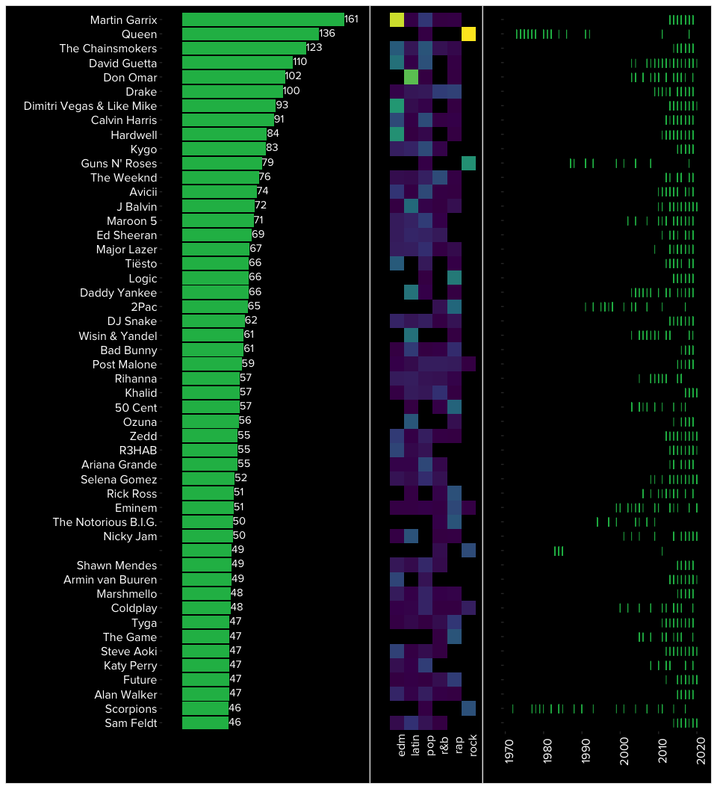
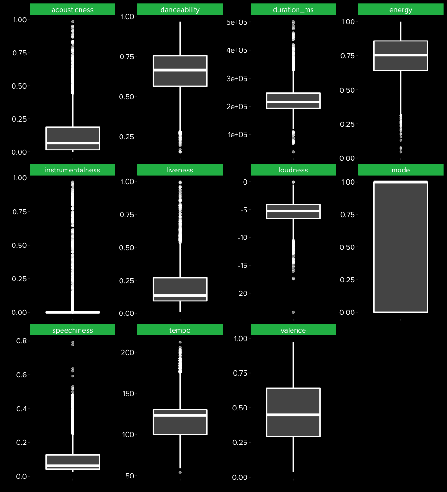

03\_TidyTuesday
================
Maria Sevillano
21/01/2020

Tidy Tuesday: Spotify
=====================

This R Markdown documents exploration of [Tidy Tuesday data](https://github.com/rfordatascience/tidytuesday/blob/master/data/2020/2020-01-21).

The objective for this week is to visualize data downloaded with the **spotifyr** package. I'll be using [Spotify's aesthetics](https://brandpalettes.com/spotify-color-codes/) in the visualization.

The following code will aim to explore the following:
\* Who are the top 50 artist?
\* Are the top50 artist consistently categorized in the same genre?
\* How timeless are some popular artists?
\* What is the distribution of song features belonging to these top50 artists? (e.g., How positive is the music they make according to [valence](https://www.kaylinpavlik.com/classifying-songs-genres/)?)

Load libraries
--------------

``` r
library(tidyverse)
library(extrafont)
library(patchwork)
library(cowplot)
```

Get Data
--------

``` r
spotify_songs <- readr::read_csv('https://raw.githubusercontent.com/rfordatascience/tidytuesday/master/data/2020/2020-01-21/spotify_songs.csv')
```

Check Data Structure
--------------------

``` r
str(spotify_songs)
```

    ## Classes 'spec_tbl_df', 'tbl_df', 'tbl' and 'data.frame': 32833 obs. of  23 variables:
    ##  $ track_id                : chr  "6f807x0ima9a1j3VPbc7VN" "0r7CVbZTWZgbTCYdfa2P31" "1z1Hg7Vb0AhHDiEmnDE79l" "75FpbthrwQmzHlBJLuGdC7" ...
    ##  $ track_name              : chr  "I Don't Care (with Justin Bieber) - Loud Luxury Remix" "Memories - Dillon Francis Remix" "All the Time - Don Diablo Remix" "Call You Mine - Keanu Silva Remix" ...
    ##  $ track_artist            : chr  "Ed Sheeran" "Maroon 5" "Zara Larsson" "The Chainsmokers" ...
    ##  $ track_popularity        : num  66 67 70 60 69 67 62 69 68 67 ...
    ##  $ track_album_id          : chr  "2oCs0DGTsRO98Gh5ZSl2Cx" "63rPSO264uRjW1X5E6cWv6" "1HoSmj2eLcsrR0vE9gThr4" "1nqYsOef1yKKuGOVchbsk6" ...
    ##  $ track_album_name        : chr  "I Don't Care (with Justin Bieber) [Loud Luxury Remix]" "Memories (Dillon Francis Remix)" "All the Time (Don Diablo Remix)" "Call You Mine - The Remixes" ...
    ##  $ track_album_release_date: chr  "2019-06-14" "2019-12-13" "2019-07-05" "2019-07-19" ...
    ##  $ playlist_name           : chr  "Pop Remix" "Pop Remix" "Pop Remix" "Pop Remix" ...
    ##  $ playlist_id             : chr  "37i9dQZF1DXcZDD7cfEKhW" "37i9dQZF1DXcZDD7cfEKhW" "37i9dQZF1DXcZDD7cfEKhW" "37i9dQZF1DXcZDD7cfEKhW" ...
    ##  $ playlist_genre          : chr  "pop" "pop" "pop" "pop" ...
    ##  $ playlist_subgenre       : chr  "dance pop" "dance pop" "dance pop" "dance pop" ...
    ##  $ danceability            : num  0.748 0.726 0.675 0.718 0.65 0.675 0.449 0.542 0.594 0.642 ...
    ##  $ energy                  : num  0.916 0.815 0.931 0.93 0.833 0.919 0.856 0.903 0.935 0.818 ...
    ##  $ key                     : num  6 11 1 7 1 8 5 4 8 2 ...
    ##  $ loudness                : num  -2.63 -4.97 -3.43 -3.78 -4.67 ...
    ##  $ mode                    : num  1 1 0 1 1 1 0 0 1 1 ...
    ##  $ speechiness             : num  0.0583 0.0373 0.0742 0.102 0.0359 0.127 0.0623 0.0434 0.0565 0.032 ...
    ##  $ acousticness            : num  0.102 0.0724 0.0794 0.0287 0.0803 0.0799 0.187 0.0335 0.0249 0.0567 ...
    ##  $ instrumentalness        : num  0.00 4.21e-03 2.33e-05 9.43e-06 0.00 0.00 0.00 4.83e-06 3.97e-06 0.00 ...
    ##  $ liveness                : num  0.0653 0.357 0.11 0.204 0.0833 0.143 0.176 0.111 0.637 0.0919 ...
    ##  $ valence                 : num  0.518 0.693 0.613 0.277 0.725 0.585 0.152 0.367 0.366 0.59 ...
    ##  $ tempo                   : num  122 100 124 122 124 ...
    ##  $ duration_ms             : num  194754 162600 176616 169093 189052 ...
    ##  - attr(*, "spec")=
    ##   .. cols(
    ##   ..   track_id = col_character(),
    ##   ..   track_name = col_character(),
    ##   ..   track_artist = col_character(),
    ##   ..   track_popularity = col_double(),
    ##   ..   track_album_id = col_character(),
    ##   ..   track_album_name = col_character(),
    ##   ..   track_album_release_date = col_character(),
    ##   ..   playlist_name = col_character(),
    ##   ..   playlist_id = col_character(),
    ##   ..   playlist_genre = col_character(),
    ##   ..   playlist_subgenre = col_character(),
    ##   ..   danceability = col_double(),
    ##   ..   energy = col_double(),
    ##   ..   key = col_double(),
    ##   ..   loudness = col_double(),
    ##   ..   mode = col_double(),
    ##   ..   speechiness = col_double(),
    ##   ..   acousticness = col_double(),
    ##   ..   instrumentalness = col_double(),
    ##   ..   liveness = col_double(),
    ##   ..   valence = col_double(),
    ##   ..   tempo = col_double(),
    ##   ..   duration_ms = col_double()
    ##   .. )

``` r
summary(spotify_songs)
```

    ##    track_id          track_name        track_artist       track_popularity
    ##  Length:32833       Length:32833       Length:32833       Min.   :  0.00  
    ##  Class :character   Class :character   Class :character   1st Qu.: 24.00  
    ##  Mode  :character   Mode  :character   Mode  :character   Median : 45.00  
    ##                                                           Mean   : 42.48  
    ##                                                           3rd Qu.: 62.00  
    ##                                                           Max.   :100.00  
    ##  track_album_id     track_album_name   track_album_release_date
    ##  Length:32833       Length:32833       Length:32833            
    ##  Class :character   Class :character   Class :character        
    ##  Mode  :character   Mode  :character   Mode  :character        
    ##                                                                
    ##                                                                
    ##                                                                
    ##  playlist_name      playlist_id        playlist_genre    
    ##  Length:32833       Length:32833       Length:32833      
    ##  Class :character   Class :character   Class :character  
    ##  Mode  :character   Mode  :character   Mode  :character  
    ##                                                          
    ##                                                          
    ##                                                          
    ##  playlist_subgenre   danceability        energy              key        
    ##  Length:32833       Min.   :0.0000   Min.   :0.000175   Min.   : 0.000  
    ##  Class :character   1st Qu.:0.5630   1st Qu.:0.581000   1st Qu.: 2.000  
    ##  Mode  :character   Median :0.6720   Median :0.721000   Median : 6.000  
    ##                     Mean   :0.6548   Mean   :0.698619   Mean   : 5.374  
    ##                     3rd Qu.:0.7610   3rd Qu.:0.840000   3rd Qu.: 9.000  
    ##                     Max.   :0.9830   Max.   :1.000000   Max.   :11.000  
    ##     loudness            mode         speechiness      acousticness   
    ##  Min.   :-46.448   Min.   :0.0000   Min.   :0.0000   Min.   :0.0000  
    ##  1st Qu.: -8.171   1st Qu.:0.0000   1st Qu.:0.0410   1st Qu.:0.0151  
    ##  Median : -6.166   Median :1.0000   Median :0.0625   Median :0.0804  
    ##  Mean   : -6.720   Mean   :0.5657   Mean   :0.1071   Mean   :0.1753  
    ##  3rd Qu.: -4.645   3rd Qu.:1.0000   3rd Qu.:0.1320   3rd Qu.:0.2550  
    ##  Max.   :  1.275   Max.   :1.0000   Max.   :0.9180   Max.   :0.9940  
    ##  instrumentalness       liveness         valence           tempo       
    ##  Min.   :0.0000000   Min.   :0.0000   Min.   :0.0000   Min.   :  0.00  
    ##  1st Qu.:0.0000000   1st Qu.:0.0927   1st Qu.:0.3310   1st Qu.: 99.96  
    ##  Median :0.0000161   Median :0.1270   Median :0.5120   Median :121.98  
    ##  Mean   :0.0847472   Mean   :0.1902   Mean   :0.5106   Mean   :120.88  
    ##  3rd Qu.:0.0048300   3rd Qu.:0.2480   3rd Qu.:0.6930   3rd Qu.:133.92  
    ##  Max.   :0.9940000   Max.   :0.9960   Max.   :0.9910   Max.   :239.44  
    ##   duration_ms    
    ##  Min.   :  4000  
    ##  1st Qu.:187819  
    ##  Median :216000  
    ##  Mean   :225800  
    ##  3rd Qu.:253585  
    ##  Max.   :517810

``` r
spotify_songs %>%
  select(playlist_genre) %>%
  distinct #how many genres
```

    ## # A tibble: 6 x 1
    ##   playlist_genre
    ##   <chr>         
    ## 1 pop           
    ## 2 rap           
    ## 3 rock          
    ## 4 latin         
    ## 5 r&b           
    ## 6 edm

``` r
spotify_songs %>%
  select(track_artist) %>%
  distinct #how many artists
```

    ## # A tibble: 10,693 x 1
    ##    track_artist    
    ##    <chr>           
    ##  1 Ed Sheeran      
    ##  2 Maroon 5        
    ##  3 Zara Larsson    
    ##  4 The Chainsmokers
    ##  5 Lewis Capaldi   
    ##  6 Katy Perry      
    ##  7 Sam Feldt       
    ##  8 Avicii          
    ##  9 Shawn Mendes    
    ## 10 Ellie Goulding  
    ## # … with 10,683 more rows

Data Wrangling
--------------

``` r
#get a frequency table for top 50
popular_artists<- spotify_songs %>% 
  group_by(track_artist) %>%
  summarize(count= n()) %>%
  arrange(desc(count)) %>%
  ungroup() %>%
  top_n(50, count) %>%
  mutate(track_artist = as.factor(track_artist)) %>%
  mutate(track_artist = fct_reorder(track_artist, count))


#select specific colums for distributions of variables for these popular artists
distribution_variables<-  spotify_songs %>%
  filter(track_artist %in% popular_artists$track_artist) %>%
  select(danceability, energy, key, loudness, mode, speechiness, acousticness, instrumentalness, liveness, valence, tempo, duration_ms) %>%
  gather()


#popular artis genre
popular_artists_genre <-spotify_songs %>%
  filter(track_artist %in% as.character(popular_artists$track_artist)) %>% 
  group_by(track_artist, playlist_genre) %>%
  summarize(count= n()) %>%
  ungroup() %>%
  mutate(track_artist= as.factor(track_artist)) %>%
  mutate(track_artist= fct_relevel(track_artist, levels(popular_artists$track_artist)))


#popular artis song release
popular_artists_year <-spotify_songs %>%
  filter(track_artist %in% as.character(popular_artists$track_artist)) %>% 
  separate(track_album_release_date, into = c("year", "month", "day")) %>%
  select(-month, -day) %>%
  select(year, track_artist) %>%
  mutate(year =as.numeric(year)) %>%
  mutate(track_artist = as.factor(track_artist)) %>%
  mutate(track_artist = fct_relevel(track_artist, levels(popular_artists$track_artist))) %>%
  mutate(fill_cat= ifelse((as.numeric(track_artist)%%2)==0, "EVEN", "ODD")) %>%
  mutate(ymin= as.numeric(as.factor(track_artist)))
```

Plots
-----

``` r
#font_import() #only done once
#loadfonts() 


p_artist_rank<- ggplot(popular_artists) +  geom_bar(aes(track_artist, count), stat = "identity", fill="#1DB954") +
  geom_text(aes(track_artist, count, label= count), family="Proxima Nova Rg", color = "#FFFFFF", hjust = 0, nudge_x = 0.1) +
  coord_flip() +
  theme(panel.border = element_blank(),
        panel.grid.major = element_blank(),
        panel.grid.minor = element_blank(),
        axis.line = element_line(size = 0.5, linetype = "solid", colour = "black"),
        plot.background = element_rect(fill = "#000000"),
        panel.background = element_rect(fill = "#000000")) +
  theme(axis.text = element_text(family="Proxima Nova Rg", color = "#FFFFFF", size= 12)) +
  theme(axis.text.x = element_blank()) +
  scale_y_discrete(expand = c(0, 20)) #bring axis labels closer to bar

p_genres<- ggplot() +
  geom_tile(data=popular_artists_genre, aes(playlist_genre, track_artist, fill= count)) +
  theme(panel.border = element_blank(),
        panel.grid.major = element_blank(),
        panel.grid.minor = element_blank(),
        axis.line = element_line(size = 0.5, linetype = "solid", colour = "black"),
        plot.background = element_rect(fill = "#000000"),
        panel.background = element_rect(fill = "#000000"),
        axis.text = element_text(family="Proxima Nova Rg", color = "#FFFFFF", size= 12),
        axis.text.x = element_text(angle=90), 
        axis.text.y = element_blank(), 
        legend.title = element_text(color= "white"),
        legend.text = element_text(color= "white"), 
        legend.background = element_rect(fill="black"), 
        axis.ticks.length = grid::unit(0, "pt")) +
  scale_fill_viridis_c(breaks = c(1, 10, 25, 50, 75, 100,150)) +
  coord_fixed(ratio = 1) +
  theme(legend.position = "none")


p_years<- ggplot(popular_artists_year)  +
  geom_point(aes(year, track_artist), color= "#1DB954", shape= "|", size=3) +
  theme(panel.border = element_blank(),
        panel.grid.major = element_blank(),
        panel.grid.minor = element_blank(),
        axis.line = element_line(size = 0.5, linetype = "solid", colour = "black"),
        plot.background = element_rect(fill = "#000000"),
        panel.background = element_rect(fill = "#000000")) +
  theme(axis.text = element_text(family="Proxima Nova Rg", color = "#FFFFFF", size= 12)) +
  theme(axis.text.x = element_text(angle=90)) +
  theme(axis.text.y = element_blank()) +
  theme(legend.title = element_text(color= "white")) +
  theme(legend.text = element_text(color= "white")) +
  theme(legend.background = element_rect(fill="black")) 

#plot using patchwork
p_artist_rank + p_genres + p_years
```



``` r
p_song_descriptors<- ggplot(distribution_variables) +
  geom_boxplot(aes(key, value), fill= "#999999", color = "white", alpha= 0.5, size = 1) + 
  facet_wrap(~key, scales = 'free') +
  theme(panel.border = element_blank(),
        panel.grid.major = element_blank(),
        panel.grid.minor = element_blank(),
        axis.line = element_line(size = 0.5, linetype = "solid", colour = "black"),
        plot.background = element_rect(fill = "#000000"),
        panel.background = element_rect(fill = "#000000")) +
  theme(axis.text = element_text(family="Proxima Nova Rg", color = "#FFFFFF", size= 12)) +
  theme(axis.text.x = element_blank()) +
  theme(strip.background = element_rect(fill = "#1DB954"),
        strip.text = element_text(family="Proxima Nova Rg", color = "#FFFFFF", size =12))

p_song_descriptors
```


