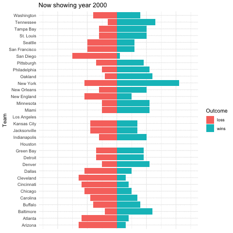
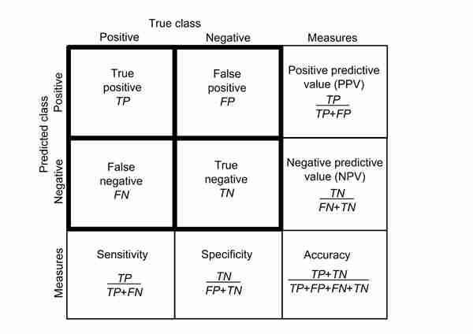
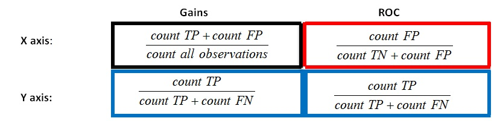

```{r setup, include=FALSE}
knitr::opts_chunk$set(echo = TRUE)
```

# Tidy Tuesday: NFL Stadium Attendance

This R Markdown documents exploration of [Tidy Tuesday](https://github.com/rfordatascience/tidytuesday/tree/master/data/2020/2020-02-04).  

The objective for this week is to perform exploratory data analysis on NFL game attendance.  

Additionally I will be following the [tutorial](https://juliasilge.com/blog/intro-tidymodels/) based on the same data for model creation using tidymodels. More info on tidymodels can be found [here](https://rviews.rstudio.com/2019/06/19/a-gentle-intro-to-tidymodels/). The focus of these packages is to facilitate data pre-processing and results validation, not statistical models per se.

The idea behind using tidymodels is to see if the numerical variables:  
(1) weekly_attendance: Weekly attendance number  
(2) margin_of_victory: (Points Scored - Points Allowed)/ Games Played 
(3) strength_of_schedule: Average quality of opponent as measured by SRS (Simple Rating System)  

have any predictive power over a team going to the playoffs.

## Load libraries
```{r load_libraries, warning=FALSE, message=FALSE}
library(tidyverse)
library(gganimate)
library(tidymodels)
library(patchwork)
```

## Get Data
```{r get_data, warning=FALSE, message=FALSE}
attendance <- readr::read_csv('https://raw.githubusercontent.com/rfordatascience/tidytuesday/master/data/2020/2020-02-04/attendance.csv')
standings <- readr::read_csv('https://raw.githubusercontent.com/rfordatascience/tidytuesday/master/data/2020/2020-02-04/standings.csv')
games <- readr::read_csv('https://raw.githubusercontent.com/rfordatascience/tidytuesday/master/data/2020/2020-02-04/games.csv')
```

## Check Data Structure
```{r data_structure, warning=FALSE, message=FALSE}
str(attendance)
str(standings)
str(games)

levels(as.factor(attendance$team))
levels(as.factor(attendance$team_name))
levels(as.factor(games$home_team))
levels(as.factor(games$away_team))
levels(as.factor(standings$team))

```

## Wrangle data
```{r data_wrangling, warning=FALSE, message=FALSE}
#Suggested by tidytuesday
NFL_joined_data<- attendance %>%
  left_join(standings, by = c("year", "team_name", "team")) 
nrow(NFL_joined_data)

NFL_data<- attendance %>%
  left_join(standings, by = c("year", "team_name", "team")) %>%
  filter(!is.na(weekly_attendance)) %>%
  select(weekly_attendance, team_name, year, week, margin_of_victory, strength_of_schedule, playoffs)
nrow(NFL_data)

NFL_standings<- standings %>%
  select(team, year, wins, loss) %>%
  mutate(loss=-1*loss) %>%
  gather(Outcome, numbers, -team, -year)

#for modeling we want to divide data into testing and training, we will split based on similar number of playoff outcome (strata)
NFL_split <- NFL_data %>%
  initial_split(strata = playoffs, prop = 0.6) #this returns an rset valuable that allows us to extract the splits with the following functions. Instead of using the default 75%, I will use 60% of the data for training. 

class(NFL_split)

NFL_split
```


#Train Model

The classification algorithms I will compare are *Random Forrest Classifiers* and *Support Vector Machine*.  
Tidymodel recipe uses step_center function to normalize to a mean of zero and function step_scale to get a standard deviation of 1 for the three chosen variables.
```{r training_model, warning=FALSE, message=FALSE}
NFL_recipe <- training(NFL_split) %>%
  recipe(playoffs ~ weekly_attendance + margin_of_victory + strength_of_schedule) %>%
  step_corr(weekly_attendance, margin_of_victory, strength_of_schedule) %>%
  step_center(weekly_attendance, margin_of_victory, strength_of_schedule) %>% #normalize 
  step_scale(weekly_attendance, margin_of_victory, strength_of_schedule) %>% #scale variance
  prep()

NFL_recipe

NFL_train <- juice(NFL_recipe)

#Random forrest model
NFL_RF <-  rand_forest(trees = 100, mode = "classification") %>%
  set_engine("randomForest") %>%
  fit(playoffs ~ ., data = NFL_train)

NFL_RF

#Support vector machine model; good resource: https://medium.com/@ODSC/build-a-multi-class-support-vector-machine-in-r-abcdd4b7dab6
NFL_SVM<- svm_rbf(mode = "classification", rbf_sigma = 0.2) %>%
  set_engine("kernlab") %>% #this is default, couldn't use e1071
  fit(playoffs ~ ., data = NFL_train)

#rbf_sigma: The precision parameter for the radial basis function

NFL_SVM
```

#Test Model
Tidymodels makes it easy to perform repetive tasks. For example by using bake() I apply the same data transformations from training data to testing data.

```{r testing_model, warning=FALSE, message=FALSE}
#Performed the same preprocessing on testing data, mean of zero and standard deviation of 1
NFL_test <- NFL_recipe %>%
  bake(testing(NFL_split)) 

glimpse(NFL_test)

predict(NFL_RF, NFL_test)

#Validation
NFL_RF %>%
  predict(NFL_test) %>%
  bind_cols(NFL_test) %>%
  metrics(truth = playoffs, estimate = .pred_class)


#Validation2
NFL_SVM %>%
  predict(NFL_test) %>%
  bind_cols(NFL_test) %>%
  metrics(truth = playoffs, estimate = .pred_class)


#Per classifier metrics
NFL_probs_RF <- NFL_RF %>%
  predict(NFL_test, type = "prob") %>%
  bind_cols(NFL_test)

glimpse(NFL_probs_RF)


#Per classifier metrics2
NFL_probs_SVM <- NFL_SVM %>%
  predict(NFL_test, type = "prob") %>%
  bind_cols(NFL_test)

glimpse(NFL_probs_SVM)
```

## Plot
Exploratory visualization is done with gganimate. However, when rendering the Rmarkdown document, it gets stuck. Found a workaround [here](https://stackoverflow.com/questions/53876485/how-to-render-a-gganimate-graph-in-html-using-rmarkdownrender-without-gener)

```{r plot_0, warning=FALSE, message=FALSE, eval=FALSE}

animate_attendance<- ggplot(attendance) +
  theme_minimal() +
  geom_point(aes(week, team, size=weekly_attendance)) +
  ylab("Team") +
  scale_x_continuous("Week", breaks = unique(attendance$week)) +
  scale_size("Attendance", labels = comma) +
  transition_states(year, 3,3) +
  ggtitle('Now showing year {closest_state}')

annimate_standings<- ggplot(NFL_standings) +
  theme_minimal() +
  geom_bar(aes(team, numbers, fill=Outcome), stat= "identity") +
  theme(axis.ticks.x = element_blank(), 
        axis.title.x = element_blank(),
        axis.text.x = element_blank()) +
  xlab("Team") +
  coord_flip() +
  transition_states(year, 3,3) +
  ggtitle('Now showing year {closest_state}')
  
anim_save("images/attendance.gif", animate_attendance)

anim_save("images/standings.gif", annimate_standings)

```

 



The main visualizations for the models will be:  
(1) confusion matrix: shows what's observed and what is predicted. It incorporates a contingency table of classification errors (false positives, false negatives)  


(2) roc curves: Receiver operating characteristics curve incorporate measures of sensitivity and specificity. The area under the curve represents accuracy, the larger the better.

(3) gains curves: display of the expected results base on the choice of the percentage targeted.The greater the area between the gain curve and the baseline, the better the model. Cumulative gain visually determines the effectiveness of a model when compared to the results one might expect without a model.

From [this](https://community.tibco.com/wiki/gains-vs-roc-curves-do-you-understand-difference) discussion:  
>"The Gains and the ROC curve are visualizations showing overall performance of the models. The shape of the curves will tell us a lot about the behavior of the model. It clearly shows how much our model is better than a model assigning categories randomly and how far we are from the optimal model which is in practice unachievable."

The 1:1 line is a random model

Here's the difference:



```{r plots, warning=FALSE, message=FALSE}

gain_RF<- NFL_probs_RF%>%
  gain_curve(playoffs, .pred_Playoffs) %>%
  autoplot() +
  ggtitle("Gain Random Forest")

gain_SVM<- NFL_probs_SVM%>%
  gain_curve(playoffs, .pred_Playoffs) %>%
  autoplot() +
  ggtitle("Gain Support Vector Machine")


roc_RF<- NFL_probs_RF%>%
  roc_curve(playoffs, .pred_Playoffs) %>%
  autoplot() +
  ggtitle("ROC Random Forest")

roc_SVM<-NFL_probs_SVM%>%
  roc_curve(playoffs, .pred_Playoffs) %>%
  autoplot() +
  ggtitle("ROC Support Vector Machine")

cf_RF<- NFL_RF %>%
  predict(NFL_test) %>%
  bind_cols(NFL_test) %>%
  conf_mat(playoffs, .pred_class) %>%
  autoplot() +
  ggtitle("Random Forest Confusion Matrix")

cf_SVM<- NFL_SVM %>%
  predict(NFL_test) %>%
  bind_cols(NFL_test) %>%
  conf_mat(playoffs, .pred_class) %>%
  autoplot() +
  ggtitle("Support Vector Machine Confusion Matrix")


cf_RF + cf_SVM

roc_RF + roc_SVM

gain_RF + gain_SVM
```
