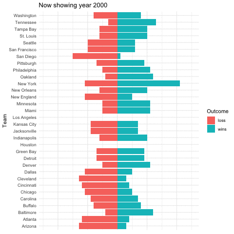
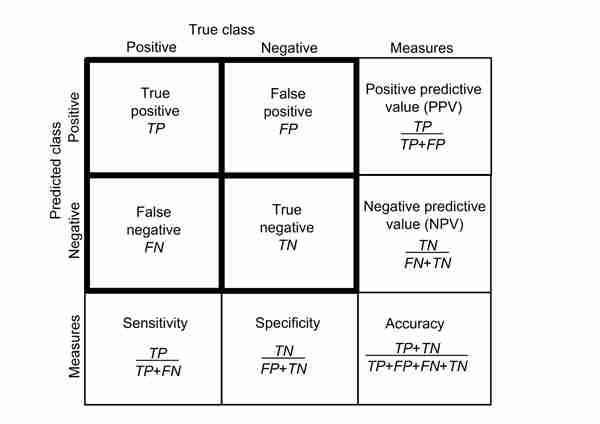
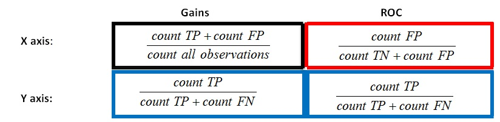
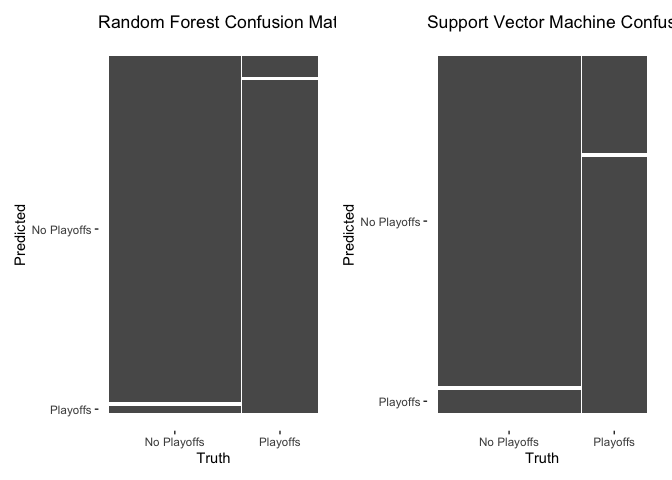
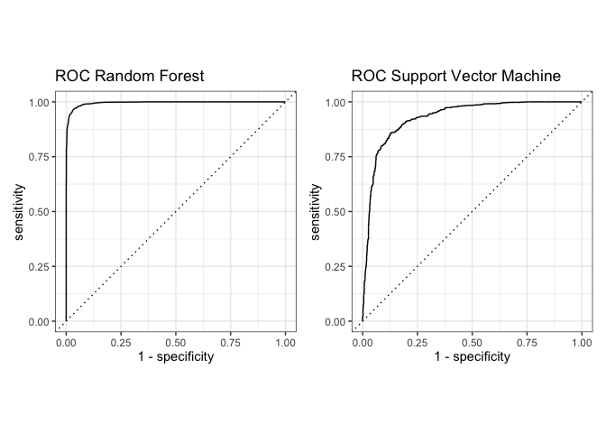
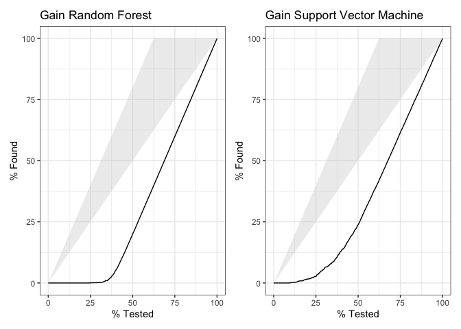

05\_TidyTuesday
================
Maria Sevillano
04/02/2020

Tidy Tuesday: NFL Stadium Attendance
====================================

This R Markdown documents exploration of [Tidy Tuesday](https://github.com/rfordatascience/tidytuesday/tree/master/data/2020/2020-02-04).

The objective for this week is to perform exploratory data analysis on NFL game attendance.

Additionally I will be following the [tutorial](https://juliasilge.com/blog/intro-tidymodels/) based on the same data for model creation using tidymodels. More info on tidymodels can be found [here](https://rviews.rstudio.com/2019/06/19/a-gentle-intro-to-tidymodels/). The focus of these packages is to facilitate data pre-processing and results validation, not statistical models per se.

The idea behind using tidymodels is to see if the numerical variables:
(1) weekly\_attendance: Weekly attendance number
(2) margin\_of\_victory: (Points Scored - Points Allowed)/ Games Played (3) strength\_of\_schedule: Average quality of opponent as measured by SRS (Simple Rating System)

have any predictive power over a team going to the playoffs.

Load libraries
--------------

``` r
library(tidyverse)
library(gganimate)
library(tidymodels)
library(patchwork)
```

Get Data
--------

``` r
attendance <- readr::read_csv('https://raw.githubusercontent.com/rfordatascience/tidytuesday/master/data/2020/2020-02-04/attendance.csv')
standings <- readr::read_csv('https://raw.githubusercontent.com/rfordatascience/tidytuesday/master/data/2020/2020-02-04/standings.csv')
games <- readr::read_csv('https://raw.githubusercontent.com/rfordatascience/tidytuesday/master/data/2020/2020-02-04/games.csv')
```

Check Data Structure
--------------------

``` r
str(attendance)
```

    ## Classes 'spec_tbl_df', 'tbl_df', 'tbl' and 'data.frame': 10846 obs. of  8 variables:
    ##  $ team             : chr  "Arizona" "Arizona" "Arizona" "Arizona" ...
    ##  $ team_name        : chr  "Cardinals" "Cardinals" "Cardinals" "Cardinals" ...
    ##  $ year             : num  2000 2000 2000 2000 2000 2000 2000 2000 2000 2000 ...
    ##  $ total            : num  893926 893926 893926 893926 893926 ...
    ##  $ home             : num  387475 387475 387475 387475 387475 ...
    ##  $ away             : num  506451 506451 506451 506451 506451 ...
    ##  $ week             : num  1 2 3 4 5 6 7 8 9 10 ...
    ##  $ weekly_attendance: num  77434 66009 NA 71801 66985 ...
    ##  - attr(*, "spec")=
    ##   .. cols(
    ##   ..   team = col_character(),
    ##   ..   team_name = col_character(),
    ##   ..   year = col_double(),
    ##   ..   total = col_double(),
    ##   ..   home = col_double(),
    ##   ..   away = col_double(),
    ##   ..   week = col_double(),
    ##   ..   weekly_attendance = col_double()
    ##   .. )

``` r
str(standings)
```

    ## Classes 'spec_tbl_df', 'tbl_df', 'tbl' and 'data.frame': 638 obs. of  15 variables:
    ##  $ team                : chr  "Miami" "Indianapolis" "New York" "Buffalo" ...
    ##  $ team_name           : chr  "Dolphins" "Colts" "Jets" "Bills" ...
    ##  $ year                : num  2000 2000 2000 2000 2000 2000 2000 2000 2000 2000 ...
    ##  $ wins                : num  11 10 9 8 5 13 12 9 7 4 ...
    ##  $ loss                : num  5 6 7 8 11 3 4 7 9 12 ...
    ##  $ points_for          : num  323 429 321 315 276 346 333 321 367 185 ...
    ##  $ points_against      : num  226 326 321 350 338 191 165 255 327 359 ...
    ##  $ points_differential : num  97 103 0 -35 -62 155 168 66 40 -174 ...
    ##  $ margin_of_victory   : num  6.1 6.4 0 -2.2 -3.9 9.7 10.5 4.1 2.5 -10.9 ...
    ##  $ strength_of_schedule: num  1 1.5 3.5 2.2 1.4 -1.3 -2.5 -0.2 -1.4 0.4 ...
    ##  $ simple_rating       : num  7.1 7.9 3.5 0 -2.5 8.3 8 3.9 1.1 -10.5 ...
    ##  $ offensive_ranking   : num  0 7.1 1.4 0.5 -2.7 1.5 0 0.6 3.2 -8.1 ...
    ##  $ defensive_ranking   : num  7.1 0.8 2.2 -0.5 0.2 6.8 8 3.3 -2.1 -2.4 ...
    ##  $ playoffs            : chr  "Playoffs" "Playoffs" "No Playoffs" "No Playoffs" ...
    ##  $ sb_winner           : chr  "No Superbowl" "No Superbowl" "No Superbowl" "No Superbowl" ...
    ##  - attr(*, "spec")=
    ##   .. cols(
    ##   ..   team = col_character(),
    ##   ..   team_name = col_character(),
    ##   ..   year = col_double(),
    ##   ..   wins = col_double(),
    ##   ..   loss = col_double(),
    ##   ..   points_for = col_double(),
    ##   ..   points_against = col_double(),
    ##   ..   points_differential = col_double(),
    ##   ..   margin_of_victory = col_double(),
    ##   ..   strength_of_schedule = col_double(),
    ##   ..   simple_rating = col_double(),
    ##   ..   offensive_ranking = col_double(),
    ##   ..   defensive_ranking = col_double(),
    ##   ..   playoffs = col_character(),
    ##   ..   sb_winner = col_character()
    ##   .. )

``` r
str(games)
```

    ## Classes 'spec_tbl_df', 'tbl_df', 'tbl' and 'data.frame': 5324 obs. of  19 variables:
    ##  $ year          : num  2000 2000 2000 2000 2000 2000 2000 2000 2000 2000 ...
    ##  $ week          : chr  "1" "1" "1" "1" ...
    ##  $ home_team     : chr  "Minnesota Vikings" "Kansas City Chiefs" "Washington Redskins" "Atlanta Falcons" ...
    ##  $ away_team     : chr  "Chicago Bears" "Indianapolis Colts" "Carolina Panthers" "San Francisco 49ers" ...
    ##  $ winner        : chr  "Minnesota Vikings" "Indianapolis Colts" "Washington Redskins" "Atlanta Falcons" ...
    ##  $ tie           : chr  NA NA NA NA ...
    ##  $ day           : chr  "Sun" "Sun" "Sun" "Sun" ...
    ##  $ date          : chr  "September 3" "September 3" "September 3" "September 3" ...
    ##  $ time          : 'hms' num  13:00:00 13:00:00 13:01:00 13:02:00 ...
    ##   ..- attr(*, "units")= chr "secs"
    ##  $ pts_win       : num  30 27 20 36 16 27 21 14 21 41 ...
    ##  $ pts_loss      : num  27 14 17 28 0 7 16 10 16 14 ...
    ##  $ yds_win       : num  374 386 396 359 336 398 296 187 395 425 ...
    ##  $ turnovers_win : num  1 2 0 1 0 0 1 2 2 3 ...
    ##  $ yds_loss      : num  425 280 236 339 223 249 278 252 355 167 ...
    ##  $ turnovers_loss: num  1 1 1 1 1 1 1 3 4 2 ...
    ##  $ home_team_name: chr  "Vikings" "Chiefs" "Redskins" "Falcons" ...
    ##  $ home_team_city: chr  "Minnesota" "Kansas City" "Washington" "Atlanta" ...
    ##  $ away_team_name: chr  "Bears" "Colts" "Panthers" "49ers" ...
    ##  $ away_team_city: chr  "Chicago" "Indianapolis" "Carolina" "San Francisco" ...
    ##  - attr(*, "spec")=
    ##   .. cols(
    ##   ..   year = col_double(),
    ##   ..   week = col_character(),
    ##   ..   home_team = col_character(),
    ##   ..   away_team = col_character(),
    ##   ..   winner = col_character(),
    ##   ..   tie = col_character(),
    ##   ..   day = col_character(),
    ##   ..   date = col_character(),
    ##   ..   time = col_time(format = ""),
    ##   ..   pts_win = col_double(),
    ##   ..   pts_loss = col_double(),
    ##   ..   yds_win = col_double(),
    ##   ..   turnovers_win = col_double(),
    ##   ..   yds_loss = col_double(),
    ##   ..   turnovers_loss = col_double(),
    ##   ..   home_team_name = col_character(),
    ##   ..   home_team_city = col_character(),
    ##   ..   away_team_name = col_character(),
    ##   ..   away_team_city = col_character()
    ##   .. )

``` r
levels(as.factor(attendance$team))
```

    ##  [1] "Arizona"       "Atlanta"       "Baltimore"     "Buffalo"      
    ##  [5] "Carolina"      "Chicago"       "Cincinnati"    "Cleveland"    
    ##  [9] "Dallas"        "Denver"        "Detroit"       "Green Bay"    
    ## [13] "Houston"       "Indianapolis"  "Jacksonville"  "Kansas City"  
    ## [17] "Los Angeles"   "Miami"         "Minnesota"     "New England"  
    ## [21] "New Orleans"   "New York"      "Oakland"       "Philadelphia" 
    ## [25] "Pittsburgh"    "San Diego"     "San Francisco" "Seattle"      
    ## [29] "St. Louis"     "Tampa Bay"     "Tennessee"     "Washington"

``` r
levels(as.factor(attendance$team_name))
```

    ##  [1] "49ers"      "Bears"      "Bengals"    "Bills"      "Broncos"   
    ##  [6] "Browns"     "Buccaneers" "Cardinals"  "Chargers"   "Chiefs"    
    ## [11] "Colts"      "Cowboys"    "Dolphins"   "Eagles"     "Falcons"   
    ## [16] "Giants"     "Jaguars"    "Jets"       "Lions"      "Packers"   
    ## [21] "Panthers"   "Patriots"   "Raiders"    "Rams"       "Ravens"    
    ## [26] "Redskins"   "Saints"     "Seahawks"   "Steelers"   "Texans"    
    ## [31] "Titans"     "Vikings"

``` r
levels(as.factor(games$home_team))
```

    ##  [1] "Arizona Cardinals"    "Atlanta Falcons"      "Baltimore Ravens"    
    ##  [4] "Buffalo Bills"        "Carolina Panthers"    "Chicago Bears"       
    ##  [7] "Cincinnati Bengals"   "Cleveland Browns"     "Dallas Cowboys"      
    ## [10] "Denver Broncos"       "Detroit Lions"        "Green Bay Packers"   
    ## [13] "Houston Texans"       "Indianapolis Colts"   "Jacksonville Jaguars"
    ## [16] "Kansas City Chiefs"   "Los Angeles Chargers" "Los Angeles Rams"    
    ## [19] "Miami Dolphins"       "Minnesota Vikings"    "New England Patriots"
    ## [22] "New Orleans Saints"   "New York Giants"      "New York Jets"       
    ## [25] "Oakland Raiders"      "Philadelphia Eagles"  "Pittsburgh Steelers" 
    ## [28] "San Diego Chargers"   "San Francisco 49ers"  "Seattle Seahawks"    
    ## [31] "St. Louis Rams"       "Tampa Bay Buccaneers" "Tennessee Titans"    
    ## [34] "Washington Redskins"

``` r
levels(as.factor(games$away_team))
```

    ##  [1] "Arizona Cardinals"    "Atlanta Falcons"      "Baltimore Ravens"    
    ##  [4] "Buffalo Bills"        "Carolina Panthers"    "Chicago Bears"       
    ##  [7] "Cincinnati Bengals"   "Cleveland Browns"     "Dallas Cowboys"      
    ## [10] "Denver Broncos"       "Detroit Lions"        "Green Bay Packers"   
    ## [13] "Houston Texans"       "Indianapolis Colts"   "Jacksonville Jaguars"
    ## [16] "Kansas City Chiefs"   "Los Angeles Chargers" "Los Angeles Rams"    
    ## [19] "Miami Dolphins"       "Minnesota Vikings"    "New England Patriots"
    ## [22] "New Orleans Saints"   "New York Giants"      "New York Jets"       
    ## [25] "Oakland Raiders"      "Philadelphia Eagles"  "Pittsburgh Steelers" 
    ## [28] "San Diego Chargers"   "San Francisco 49ers"  "Seattle Seahawks"    
    ## [31] "St. Louis Rams"       "Tampa Bay Buccaneers" "Tennessee Titans"    
    ## [34] "Washington Redskins"

``` r
levels(as.factor(standings$team))
```

    ##  [1] "Arizona"       "Atlanta"       "Baltimore"     "Buffalo"      
    ##  [5] "Carolina"      "Chicago"       "Cincinnati"    "Cleveland"    
    ##  [9] "Dallas"        "Denver"        "Detroit"       "Green Bay"    
    ## [13] "Houston"       "Indianapolis"  "Jacksonville"  "Kansas City"  
    ## [17] "Los Angeles"   "Miami"         "Minnesota"     "New England"  
    ## [21] "New Orleans"   "New York"      "Oakland"       "Philadelphia" 
    ## [25] "Pittsburgh"    "San Diego"     "San Francisco" "Seattle"      
    ## [29] "St. Louis"     "Tampa Bay"     "Tennessee"     "Washington"

Wrangle data
------------

``` r
#Suggested by tidytuesday
NFL_joined_data<- attendance %>%
  left_join(standings, by = c("year", "team_name", "team")) 
nrow(NFL_joined_data)
```

    ## [1] 10846

``` r
NFL_data<- attendance %>%
  left_join(standings, by = c("year", "team_name", "team")) %>%
  filter(!is.na(weekly_attendance)) %>%
  select(weekly_attendance, team_name, year, week, margin_of_victory, strength_of_schedule, playoffs)
nrow(NFL_data)
```

    ## [1] 10208

``` r
NFL_standings<- standings %>%
  select(team, year, wins, loss) %>%
  mutate(loss=-1*loss) %>%
  gather(Outcome, numbers, -team, -year)

#for modeling we want to divide data into testing and training, we will split based on similar number of playoff outcome (strata)
NFL_split <- NFL_data %>%
  initial_split(strata = playoffs, prop = 0.6) #this returns an rset valuable that allows us to extract the splits with the following functions. Instead of using the default 75%, I will use 60% of the data for training. 

class(NFL_split)
```

    ## [1] "rsplit"   "mc_split"

``` r
NFL_split
```

    ## <6125/4083/10208>

Train Model
===========

The classification algorithms I will compare are *Random Forrest Classifiers* and *Support Vector Machine*.
Tidymodel recipe uses step\_center function to normalize to a mean of zero and function step\_scale to get a standard deviation of 1 for the three chosen variables.

``` r
NFL_recipe <- training(NFL_split) %>%
  recipe(playoffs ~ weekly_attendance + margin_of_victory + strength_of_schedule) %>%
  step_corr(weekly_attendance, margin_of_victory, strength_of_schedule) %>%
  step_center(weekly_attendance, margin_of_victory, strength_of_schedule) %>% #normalize 
  step_scale(weekly_attendance, margin_of_victory, strength_of_schedule) %>% #scale variance
  prep()

NFL_recipe
```

    ## Data Recipe
    ## 
    ## Inputs:
    ## 
    ##       role #variables
    ##    outcome          1
    ##  predictor          3
    ## 
    ## Training data contained 6125 data points and no missing data.
    ## 
    ## Operations:
    ## 
    ## Correlation filter removed no terms [trained]
    ## Centering for weekly_attendance, ... [trained]
    ## Scaling for weekly_attendance, ... [trained]

``` r
NFL_train <- juice(NFL_recipe)

#Random forrest model
NFL_RF <-  rand_forest(trees = 100, mode = "classification") %>%
  set_engine("randomForest") %>%
  fit(playoffs ~ ., data = NFL_train)

NFL_RF
```

    ## parsnip model object
    ## 
    ## Fit time:  553ms 
    ## 
    ## Call:
    ##  randomForest(x = as.data.frame(x), y = y, ntree = ~100) 
    ##                Type of random forest: classification
    ##                      Number of trees: 100
    ## No. of variables tried at each split: 1
    ## 
    ##         OOB estimate of  error rate: 2.86%
    ## Confusion matrix:
    ##             No Playoffs Playoffs class.error
    ## No Playoffs        3749       72  0.01884323
    ## Playoffs            103     2201  0.04470486

``` r
#Support vector machine model; good resource: https://medium.com/@ODSC/build-a-multi-class-support-vector-machine-in-r-abcdd4b7dab6
NFL_SVM<- svm_rbf(mode = "classification", rbf_sigma = 0.2) %>%
  set_engine("kernlab") %>% #this is default, couldn't use e1071
  fit(playoffs ~ ., data = NFL_train)

#rbf_sigma: The precision parameter for the radial basis function

NFL_SVM
```

    ## parsnip model object
    ## 
    ## Fit time:  2.6s 
    ## Support Vector Machine object of class "ksvm" 
    ## 
    ## SV type: C-svc  (classification) 
    ##  parameter : cost C = 1 
    ## 
    ## Gaussian Radial Basis kernel function. 
    ##  Hyperparameter : sigma =  0.2 
    ## 
    ## Number of Support Vectors : 2003 
    ## 
    ## Objective Function Value : -1944.209 
    ## Training error : 0.140082 
    ## Probability model included.

Test Model
==========

Tidymodels makes it easy to perform repetive tasks. For example by using bake() I apply the same data transformations from training data to testing data.

``` r
#Performed the same preprocessing on testing data, mean of zero and standard deviation of 1
NFL_test <- NFL_recipe %>%
  bake(testing(NFL_split)) 

glimpse(NFL_test)
```

    ## Observations: 4,083
    ## Variables: 4
    ## $ weekly_attendance    <dbl> -2.63141832, -0.53115291, -1.95778222, 0.59…
    ## $ margin_of_victory    <dbl> -2.27325628, -2.27325628, -2.27325628, -1.5…
    ## $ strength_of_schedule <dbl> -0.4384665, -0.4384665, -0.4384665, 0.90791…
    ## $ playoffs             <fct> No Playoffs, No Playoffs, No Playoffs, No P…

``` r
predict(NFL_RF, NFL_test)
```

    ## # A tibble: 4,083 x 1
    ##    .pred_class
    ##    <fct>      
    ##  1 No Playoffs
    ##  2 No Playoffs
    ##  3 No Playoffs
    ##  4 No Playoffs
    ##  5 No Playoffs
    ##  6 No Playoffs
    ##  7 No Playoffs
    ##  8 Playoffs   
    ##  9 Playoffs   
    ## 10 Playoffs   
    ## # … with 4,073 more rows

``` r
#Validation
NFL_RF %>%
  predict(NFL_test) %>%
  bind_cols(NFL_test) %>%
  metrics(truth = playoffs, estimate = .pred_class)
```

    ## # A tibble: 2 x 3
    ##   .metric  .estimator .estimate
    ##   <chr>    <chr>          <dbl>
    ## 1 accuracy binary         0.966
    ## 2 kap      binary         0.927

``` r
#Validation2
NFL_SVM %>%
  predict(NFL_test) %>%
  bind_cols(NFL_test) %>%
  metrics(truth = playoffs, estimate = .pred_class)
```

    ## # A tibble: 2 x 3
    ##   .metric  .estimator .estimate
    ##   <chr>    <chr>          <dbl>
    ## 1 accuracy binary         0.855
    ## 2 kap      binary         0.682

``` r
#Per classifier metrics
NFL_probs_RF <- NFL_RF %>%
  predict(NFL_test, type = "prob") %>%
  bind_cols(NFL_test)

glimpse(NFL_probs_RF)
```

    ## Observations: 4,083
    ## Variables: 6
    ## $ `.pred_No Playoffs`  <dbl> 0.97, 1.00, 1.00, 1.00, 1.00, 1.00, 1.00, 0…
    ## $ .pred_Playoffs       <dbl> 0.03, 0.00, 0.00, 0.00, 0.00, 0.00, 0.00, 0…
    ## $ weekly_attendance    <dbl> -2.63141832, -0.53115291, -1.95778222, 0.59…
    ## $ margin_of_victory    <dbl> -2.27325628, -2.27325628, -2.27325628, -1.5…
    ## $ strength_of_schedule <dbl> -0.4384665, -0.4384665, -0.4384665, 0.90791…
    ## $ playoffs             <fct> No Playoffs, No Playoffs, No Playoffs, No P…

``` r
#Per classifier metrics2
NFL_probs_SVM <- NFL_SVM %>%
  predict(NFL_test, type = "prob") %>%
  bind_cols(NFL_test)

glimpse(NFL_probs_SVM)
```

    ## Observations: 4,083
    ## Variables: 6
    ## $ `.pred_No Playoffs`  <dbl> 0.903410127, 0.883054683, 0.897005659, 0.87…
    ## $ .pred_Playoffs       <dbl> 0.09658987, 0.11694532, 0.10299434, 0.12921…
    ## $ weekly_attendance    <dbl> -2.63141832, -0.53115291, -1.95778222, 0.59…
    ## $ margin_of_victory    <dbl> -2.27325628, -2.27325628, -2.27325628, -1.5…
    ## $ strength_of_schedule <dbl> -0.4384665, -0.4384665, -0.4384665, 0.90791…
    ## $ playoffs             <fct> No Playoffs, No Playoffs, No Playoffs, No P…

Plot
----

Exploratory visualization is done with gganimate. However, when rendering the Rmarkdown document, it gets stuck. Found a workaround [here](https://stackoverflow.com/questions/53876485/how-to-render-a-gganimate-graph-in-html-using-rmarkdownrender-without-gener)

``` r
animate_attendance<- ggplot(attendance) +
  theme_minimal() +
  geom_point(aes(week, team, size=weekly_attendance)) +
  ylab("Team") +
  scale_x_continuous("Week", breaks = unique(attendance$week)) +
  scale_size("Attendance", labels = comma) +
  transition_states(year, 3,3) +
  ggtitle('Now showing year {closest_state}')

annimate_standings<- ggplot(NFL_standings) +
  theme_minimal() +
  geom_bar(aes(team, numbers, fill=Outcome), stat= "identity") +
  theme(axis.ticks.x = element_blank(), 
        axis.title.x = element_blank(),
        axis.text.x = element_blank()) +
  xlab("Team") +
  coord_flip() +
  transition_states(year, 3,3) +
  ggtitle('Now showing year {closest_state}')
  
anim_save("images/attendance.gif", animate_attendance)

anim_save("images/standings.gif", annimate_standings)
```




The main visualizations for the models will be:
(1) confusion matrix: shows what's observed and what is predicted. It incorporates a contingency table of classification errors (false positives, false negatives)


1.  roc curves: Receiver operating characteristics curve incorporate measures of sensitivity and specificity. The area under the curve represents accuracy, the larger the better.

2.  gains curves: display of the expected results base on the choice of the percentage targeted.The greater the area between the gain curve and the baseline, the better the model. Cumulative gain visually determines the effectiveness of a model when compared to the results one might expect without a model.

From [this](https://community.tibco.com/wiki/gains-vs-roc-curves-do-you-understand-difference) discussion:
&gt;"The Gains and the ROC curve are visualizations showing overall performance of the models. The shape of the curves will tell us a lot about the behavior of the model. It clearly shows how much our model is better than a model assigning categories randomly and how far we are from the optimal model which is in practice unachievable."

The 1:1 line is a random model

Here's the difference: 

``` r
gain_RF<- NFL_probs_RF%>%
  gain_curve(playoffs, .pred_Playoffs) %>%
  autoplot() +
  ggtitle("Gain Random Forest")

gain_SVM<- NFL_probs_SVM%>%
  gain_curve(playoffs, .pred_Playoffs) %>%
  autoplot() +
  ggtitle("Gain Support Vector Machine")


roc_RF<- NFL_probs_RF%>%
  roc_curve(playoffs, .pred_Playoffs) %>%
  autoplot() +
  ggtitle("ROC Random Forest")

roc_SVM<-NFL_probs_SVM%>%
  roc_curve(playoffs, .pred_Playoffs) %>%
  autoplot() +
  ggtitle("ROC Support Vector Machine")

cf_RF<- NFL_RF %>%
  predict(NFL_test) %>%
  bind_cols(NFL_test) %>%
  conf_mat(playoffs, .pred_class) %>%
  autoplot() +
  ggtitle("Random Forest Confusion Matrix")

cf_SVM<- NFL_SVM %>%
  predict(NFL_test) %>%
  bind_cols(NFL_test) %>%
  conf_mat(playoffs, .pred_class) %>%
  autoplot() +
  ggtitle("Support Vector Machine Confusion Matrix")


cf_RF + cf_SVM
```



``` r
roc_RF + roc_SVM
```



``` r
gain_RF + gain_SVM
```


