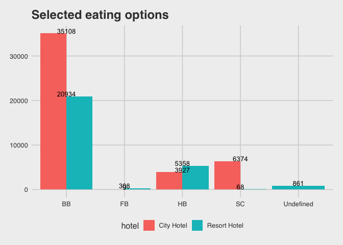
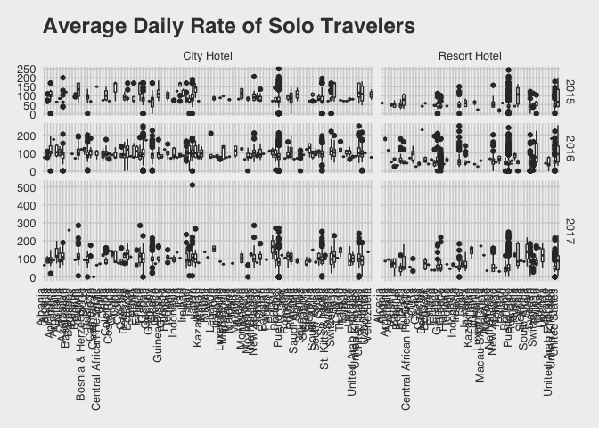
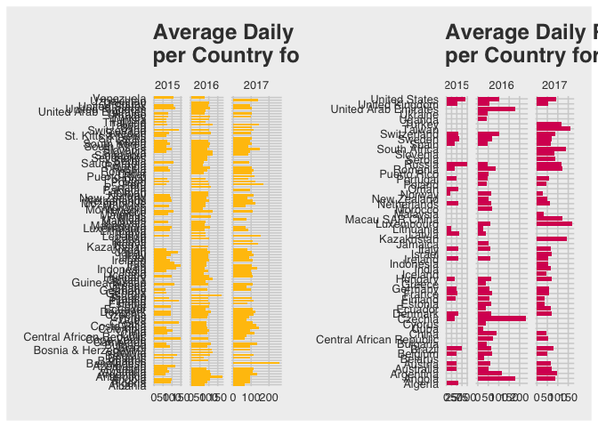

Tidy\_Tuesday\_2020\_02\_11
================

Tidy Tuesday: Hotels
====================

This R Markdown documents exploration of [Tidy Tuesday](https://github.com/rfordatascience/tidytuesday/tree/master/data/2020/2020-02-11).
The objective for this week is to compare data from City and Resort hotels. Both hotels are located in Portugal, at the resort region of Algarveand and at the city of Lisbon.

Tidyverse makes a plug for a few time series analysis packages, so I'll try incorporating them here.

1.  What type of eating options do people book for the two hotels?
2.  Where do solo travelers come from?

lead time: Number of days that elapsed between the entering date of the booking into the PMS and the arrival date

Load libraries
--------------

``` r
library(tidyverse)
library(skimr)
library(countrycode)
library(lubridate)
library(ggthemes)
library(patchwork)


library(tsibble)
library(feasts)
library(fable)
```

Get Data
--------

``` r
hotels <- readr::read_csv('https://raw.githubusercontent.com/rfordatascience/tidytuesday/master/data/2020/2020-02-11/hotels.csv')
```

Check Data Structure
--------------------

This time instead of using base R str function, I will be using [skimr](https://github.com/ropensci/skimr) package, since it can:

> display summary statistics the user can skim quickly to understand their data

It also outputs knited results which is more aesthetically pleasing.

``` r
hotels %>%
  skim() 
```

|                                                  |            |
|:-------------------------------------------------|:-----------|
| Name                                             | Piped data |
| Number of rows                                   | 119390     |
| Number of columns                                | 32         |
| \_\_\_\_\_\_\_\_\_\_\_\_\_\_\_\_\_\_\_\_\_\_\_   |            |
| Column type frequency:                           |            |
| character                                        | 13         |
| Date                                             | 1          |
| numeric                                          | 18         |
| \_\_\_\_\_\_\_\_\_\_\_\_\_\_\_\_\_\_\_\_\_\_\_\_ |            |
| Group variables                                  | None       |

**Variable type: character**

| skim\_variable        |  n\_missing|  complete\_rate|  min|  max|  empty|  n\_unique|  whitespace|
|:----------------------|-----------:|---------------:|----:|----:|------:|----------:|-----------:|
| hotel                 |           0|               1|   10|   12|      0|          2|           0|
| arrival\_date\_month  |           0|               1|    3|    9|      0|         12|           0|
| meal                  |           0|               1|    2|    9|      0|          5|           0|
| country               |           0|               1|    2|    4|      0|        178|           0|
| market\_segment       |           0|               1|    6|   13|      0|          8|           0|
| distribution\_channel |           0|               1|    3|    9|      0|          5|           0|
| reserved\_room\_type  |           0|               1|    1|    1|      0|         10|           0|
| assigned\_room\_type  |           0|               1|    1|    1|      0|         12|           0|
| deposit\_type         |           0|               1|   10|   10|      0|          3|           0|
| agent                 |           0|               1|    1|    4|      0|        334|           0|
| company               |           0|               1|    1|    4|      0|        353|           0|
| customer\_type        |           0|               1|    5|   15|      0|          4|           0|
| reservation\_status   |           0|               1|    7|    9|      0|          3|           0|

**Variable type: Date**

| skim\_variable            |  n\_missing|  complete\_rate| min        | max        | median     |  n\_unique|
|:--------------------------|-----------:|---------------:|:-----------|:-----------|:-----------|----------:|
| reservation\_status\_date |           0|               1| 2014-10-17 | 2017-09-14 | 2016-08-07 |        926|

**Variable type: numeric**

| skim\_variable                    |  n\_missing|  complete\_rate|     mean|      sd|       p0|      p25|      p50|   p75|  p100| hist  |
|:----------------------------------|-----------:|---------------:|--------:|-------:|--------:|--------:|--------:|-----:|-----:|:------|
| is\_canceled                      |           0|               1|     0.37|    0.48|     0.00|     0.00|     0.00|     1|     1| ▇▁▁▁▅ |
| lead\_time                        |           0|               1|   104.01|  106.86|     0.00|    18.00|    69.00|   160|   737| ▇▂▁▁▁ |
| arrival\_date\_year               |           0|               1|  2016.16|    0.71|  2015.00|  2016.00|  2016.00|  2017|  2017| ▃▁▇▁▆ |
| arrival\_date\_week\_number       |           0|               1|    27.17|   13.61|     1.00|    16.00|    28.00|    38|    53| ▅▇▇▇▅ |
| arrival\_date\_day\_of\_month     |           0|               1|    15.80|    8.78|     1.00|     8.00|    16.00|    23|    31| ▇▇▇▇▆ |
| stays\_in\_weekend\_nights        |           0|               1|     0.93|    1.00|     0.00|     0.00|     1.00|     2|    19| ▇▁▁▁▁ |
| stays\_in\_week\_nights           |           0|               1|     2.50|    1.91|     0.00|     1.00|     2.00|     3|    50| ▇▁▁▁▁ |
| adults                            |           0|               1|     1.86|    0.58|     0.00|     2.00|     2.00|     2|    55| ▇▁▁▁▁ |
| children                          |           4|               1|     0.10|    0.40|     0.00|     0.00|     0.00|     0|    10| ▇▁▁▁▁ |
| babies                            |           0|               1|     0.01|    0.10|     0.00|     0.00|     0.00|     0|    10| ▇▁▁▁▁ |
| is\_repeated\_guest               |           0|               1|     0.03|    0.18|     0.00|     0.00|     0.00|     0|     1| ▇▁▁▁▁ |
| previous\_cancellations           |           0|               1|     0.09|    0.84|     0.00|     0.00|     0.00|     0|    26| ▇▁▁▁▁ |
| previous\_bookings\_not\_canceled |           0|               1|     0.14|    1.50|     0.00|     0.00|     0.00|     0|    72| ▇▁▁▁▁ |
| booking\_changes                  |           0|               1|     0.22|    0.65|     0.00|     0.00|     0.00|     0|    21| ▇▁▁▁▁ |
| days\_in\_waiting\_list           |           0|               1|     2.32|   17.59|     0.00|     0.00|     0.00|     0|   391| ▇▁▁▁▁ |
| adr                               |           0|               1|   101.83|   50.54|    -6.38|    69.29|    94.58|   126|  5400| ▇▁▁▁▁ |
| required\_car\_parking\_spaces    |           0|               1|     0.06|    0.25|     0.00|     0.00|     0.00|     0|     8| ▇▁▁▁▁ |
| total\_of\_special\_requests      |           0|               1|     0.57|    0.79|     0.00|     0.00|     0.00|     1|     5| ▇▁▁▁▁ |

Data Wrangle
------------

Plot
----

Type of meal booked. Categories are presented in standard hospitality meal packages:

1.  Undefined/SC – no meal package
2.  BB – Bed & Breakfast
3.  HB – Half board (breakfast and one other meal – usually dinner)
4.  FB – Full board (breakfast, lunch and dinner)

``` r
ggplot(hotels_1, aes(meal, counts)) +
  theme_fivethirtyeight() +
  geom_bar(aes(fill= hotel), stat = "identity", position = "dodge") +
  geom_text(aes(y= counts +1, label=counts), position = position_dodge(0.9), vjust=0, size=3.5) +
  ggtitle("Selected eating options")
```



The Average Daily Rate (ADR) defined by dividing the sum of all lodging transactions by the total number of staying nights.

``` r
ggplot(hotels_2) +
  theme_fivethirtyeight() +
  geom_boxplot(aes(country_name, adr)) +
  facet_grid(year_visited ~ hotel, scales = "free", space = "free") +
  theme(axis.text.x = element_text(angle = 90, hjust = 1, vjust = 0)) +
  ylab("Average daily spending per guest") + #interesting behaviour
  ggtitle("Average Daily Rate of Solo Travelers")
```



``` r
h3_1<- ggplot(hotels_3 %>% filter(hotel=="City Hotel")) +
  theme_fivethirtyeight() +
  geom_bar(aes(country_name, average_adr_country), fill="#FFC20A", stat = "identity", position = "dodge") +
  coord_flip() +
  facet_grid(~year_visited, scales = "free", space = "free") +
  ggtitle("Average Daily Rate of Solo Travelers \nper Country for City Hotel")


h3_2<- ggplot(hotels_3 %>% filter(hotel=="Resort Hotel")) +
  theme_fivethirtyeight() +
  geom_bar(aes(country_name, average_adr_country), fill="#D81B60", stat = "identity", position = "dodge") +
  coord_flip() +
  facet_grid(~year_visited, scales = "free", space = "free") +
  ggtitle("Average Daily Rate of Solo Travelers \nper Country for Resort Hotel")

h3_1 + h3_2
```


