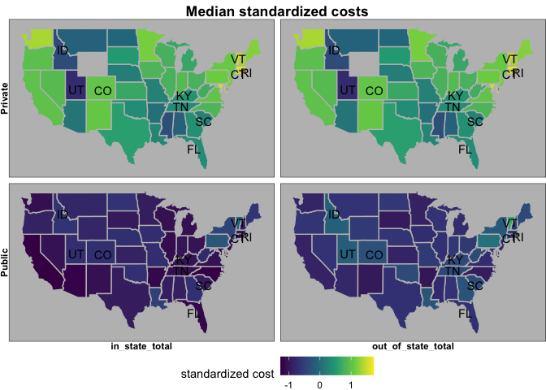
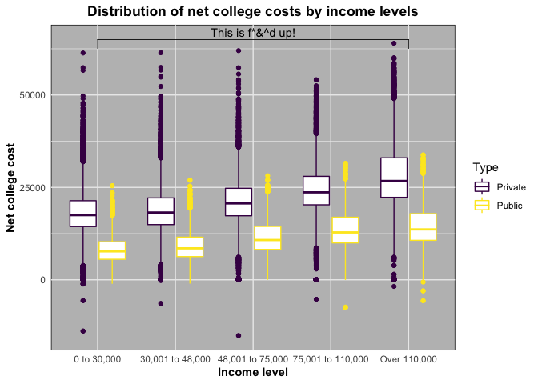
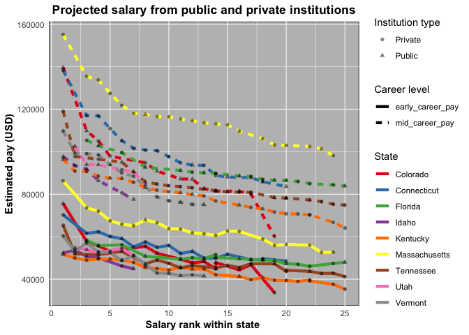

Untitled
================

Tidy Tuesday: College Tuition
=============================

Load libraries
--------------

``` r
library(tidyverse)
library(skimr)
library(patchwork)
library(maps)
library(stringi)
library(ggpubr)
```

Get Data
--------

``` r
tuition_cost <- readr::read_csv('https://raw.githubusercontent.com/rfordatascience/tidytuesday/master/data/2020/2020-03-10/tuition_cost.csv')
tuition_income <- readr::read_csv('https://raw.githubusercontent.com/rfordatascience/tidytuesday/master/data/2020/2020-03-10/tuition_income.csv') 
salary_potential <- readr::read_csv('https://raw.githubusercontent.com/rfordatascience/tidytuesday/master/data/2020/2020-03-10/salary_potential.csv')
historical_tuition <- readr::read_csv('https://raw.githubusercontent.com/rfordatascience/tidytuesday/master/data/2020/2020-03-10/historical_tuition.csv')
diversity_school <- readr::read_csv('https://raw.githubusercontent.com/rfordatascience/tidytuesday/master/data/2020/2020-03-10/diversity_school.csv')
```

Data Structure
--------------

``` r
skim(tuition_cost)
```

|                                                  |               |
|:-------------------------------------------------|:--------------|
| Name                                             | tuition\_cost |
| Number of rows                                   | 2973          |
| Number of columns                                | 10            |
| \_\_\_\_\_\_\_\_\_\_\_\_\_\_\_\_\_\_\_\_\_\_\_   |               |
| Column type frequency:                           |               |
| character                                        | 5             |
| numeric                                          | 5             |
| \_\_\_\_\_\_\_\_\_\_\_\_\_\_\_\_\_\_\_\_\_\_\_\_ |               |
| Group variables                                  | None          |

**Variable type: character**

| skim\_variable |  n\_missing|  complete\_rate|  min|  max|  empty|  n\_unique|  whitespace|
|:---------------|-----------:|---------------:|----:|----:|------:|----------:|-----------:|
| name           |           0|            1.00|    8|   67|      0|       2938|           0|
| state          |          52|            0.98|    4|   14|      0|         50|           0|
| state\_code    |           0|            1.00|    2|    2|      0|         55|           0|
| type           |           0|            1.00|    5|   10|      0|          4|           0|
| degree\_length |           0|            1.00|    5|    6|      0|          3|           0|

**Variable type: numeric**

| skim\_variable          |  n\_missing|  complete\_rate|      mean|        sd|    p0|    p25|    p50|      p75|   p100| hist  |
|:------------------------|-----------:|---------------:|---------:|---------:|-----:|------:|------:|--------:|------:|:------|
| room\_and\_board        |        1094|            0.63|  10095.28|   3288.55|    30|   7935|  10000|  12424.5|  21300| ▁▅▇▃▁ |
| in\_state\_tuition      |           0|            1.00|  16491.29|  14773.84|   480|   4890|  10099|  27124.0|  59985| ▇▂▂▁▁ |
| in\_state\_total        |           0|            1.00|  22871.73|  18948.39|   962|   5802|  17669|  35960.0|  75003| ▇▅▂▂▁ |
| out\_of\_state\_tuition |           0|            1.00|  20532.73|  13255.65|   480|   9552|  17486|  29208.0|  59985| ▇▆▅▂▁ |
| out\_of\_state\_total   |           0|            1.00|  26913.16|  17719.73|  1376|  11196|  23214|  39054.0|  75003| ▇▅▅▂▁ |

Data Wrangle
------------

``` r
#median tuition by type and state, (in state vs out of state)
g_diff<-tuition_cost %>%
  select(state, type, in_state_total, out_of_state_total) %>%
  filter(type=="Public") %>%
  mutate(difference= out_of_state_total-in_state_total) %>%
  group_by(state) %>%
  summarise(median_difference= median(difference)) %>%
  top_n(11, median_difference)

tuition_standardized<-tuition_cost %>%
  select(name, state, state_code, type, in_state_total, out_of_state_total) %>%
  filter(type %in% c("Private", "Public")) %>%
  gather(in_out_state, cost, -name, -state, -state_code, -type) %>%
  mutate(standardized_cost= scale(cost)) %>%
  group_by(state, state_code, type, in_out_state) %>%
  summarise(median_standardized_cost= median(standardized_cost)) %>%
  ungroup() %>%
  filter(!is.na(type)) %>%
  filter(!is.na(in_out_state)) %>%
  filter(!is.na(state)) %>%
  mutate(type=as.factor(type)) %>%
  mutate(in_out_state= as.factor(in_out_state)) %>%
  data.frame
  
#mean of 0 and a standard deviation of 1
tuition_standardized<- droplevels(tuition_standardized)

map_data<- map_data('state') %>%
  rename(state="region") %>%
  mutate(state= stri_trans_totitle(state)) %>%
  select(-subregion) %>%
  left_join(tuition_standardized)

map_data_centroids<- map_data %>% 
  group_by(state, state_code) %>%
  summarise(centroid.long= mean(long), centroid.lat= mean(lat)) %>%
  filter(state %in% g_diff$state) %>%
  mutate(centroid.long=ifelse(state_code=="RI", -70.8, centroid.long))


#
net_cost_v_income_lvl<-tuition_cost  %>%
  select(name, state_code, type) %>%
  rename(state="state_code") %>%
  distinct() %>%
  right_join(tuition_income) %>%
  filter(!type=="For Profit") %>%
  filter(!is.na(type)) %>%
  mutate(income_lvl= ifelse(income_lvl=="48_001 to 75,000", "48,001 to 75,000", income_lvl)) %>%
  mutate(type=as.factor(type))

net_cost_v_income_lvl %>% filter(type=="Public") %>% group_by(income_lvl) %>% summarise(median_net_cost= median(net_cost))
```

    ## # A tibble: 5 x 2
    ##   income_lvl        median_net_cost
    ##   <chr>                       <dbl>
    ## 1 0 to 30,000                 7702.
    ## 2 30,001 to 48,000            8510 
    ## 3 48,001 to 75,000           10761.
    ## 4 75,001 to 110,000          12821 
    ## 5 Over 110,000               13633

``` r
##
projected_salary<-tuition_cost  %>%
  select(name, state, type) %>%
  rename(state_name="state") %>%
  distinct() %>%
  right_join(salary_potential) %>%
  select(-stem_percent, -make_world_better_percent) %>%
  filter(!type=="For Profit") %>%
  filter(!is.na(type)) %>%
  mutate(type=as.factor(type)) %>%
  gather(career_pay_type, pay, -name, -state_name, -type, -rank) %>%
  filter(state_name %in% c("Massachusetts", map_data_centroids$state))  %>%
  mutate(career_pay_type=as.factor(career_pay_type))
```

Plots
-----

``` r
map_costs <- ggplot() + 
  theme_void()+
  geom_polygon(data=na.omit(map_data), aes(x=long,y=lat,group=group, fill= median_standardized_cost),colour='grey') + 
  facet_grid(type~in_out_state, switch = "both") +
  labs(title="Median standardized costs") +
  scale_fill_viridis_c(name= "standardized cost") +
  theme(legend.position = "bottom") +
  theme(plot.title = element_text(hjust = 0.5, face = "bold"),
        strip.text = element_text(face="bold")) +
  theme(strip.text.y = element_text(angle = 180)) +
  geom_text(data=na.omit(map_data_centroids), aes(x=centroid.long, y=centroid.lat, label= state_code)) +
  theme(panel.background = element_rect(fill = "grey"))

map_costs
```



``` r
distribution_cost_by_income<- ggplot(net_cost_v_income_lvl) +
  theme_minimal() +
  geom_boxplot(aes(income_lvl, net_cost, color=type)) +
  xlab("Income level") +
  ylab("Net college cost") +
  scale_color_viridis_d(name = "Type") +
  theme(axis.title = element_text(face="bold")) +
  theme(panel.background = element_rect(fill = "grey")) +
  labs(title="Distribution of net college costs by income levels") +
  theme(plot.title = element_text(hjust = 0.5, face = "bold")) +
  geom_bracket(xmin = "0 to 30,000", xmax = "Over 110,000", y.position = 65000, label = "This is f*&^d up!")


distribution_cost_by_income
```



``` r
plot_projected_salary<- ggplot(projected_salary) +
  theme_minimal() +
  geom_line(aes(rank, pay, group=interaction(career_pay_type, state_name), color= state_name, linetype=career_pay_type), size=1.5) +
  geom_point(aes(rank, pay, shape=type), alpha=0.5) +
  scale_colour_brewer(palette = "Set1", name="State") +
  scale_shape_discrete(name="Institution type") +
  scale_linetype_discrete(name="Career level") +
  theme(axis.title = element_text(face="bold")) +
  theme(panel.background = element_rect(fill = "grey")) +
  labs(title="Projected salary from public and private institutions") +
  xlab("Salary rank within state ") +
  ylab("Estimated pay (USD)") +
  theme(plot.title = element_text(hjust = 0.5, face = "bold"))

plot_projected_salary
```


