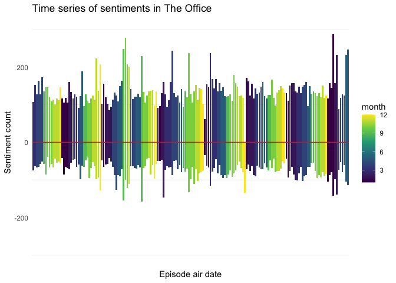
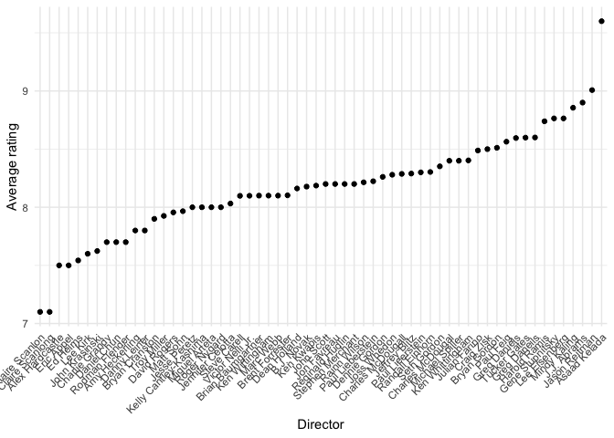
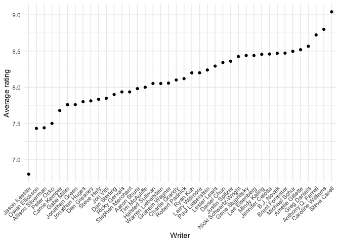

Tidy\_Tuesday\_2020\_03\_25
================

Tidy Tuesday: The Office
========================

The objective of this week is to do sentiment analyses with data from The Office. The data was downloaded directly from package `schrute`. In order to do sentiment analyses, the package `tidytext` was used. This is a good [resource](https://www.tidytextmining.com/sentiment.html) to learn about text mining and this particular analysis. The vignette for the package can be found [here](https://cran.r-project.org/web/packages/tidytext/vignettes/tidytext.html).

Load libraries
--------------

``` r
library(tidyverse)
library(tidytext)
library(schrute) #https://bradlindblad.github.io/schrute/articles/theoffice.html
library(lubridate)
```

Get Data
--------

``` r
office_data <- schrute::theoffice
```

Data Wrangle
------------

``` r
office_dialogue<- office_data %>%
  unnest_tokens(word, text)

reduced_office_dialogue<- office_dialogue %>%
  anti_join(get_stopwords())

positive <- get_sentiments("bing") %>%
  filter(sentiment == "positive")
negative <- get_sentiments("bing") %>%
  filter(sentiment == "negative")
sentiments<- rbind(positive, negative)

reduced_office_dialogue <- reduced_office_dialogue %>%
  left_join(sentiments)

#sentiment and popularity
xx<- reduced_office_dialogue %>%
  select(season, episode, director, writer, character, imdb_rating, sentiment, air_date) %>%
  filter(!is.na(sentiment)) %>%
  filter(!is.na(air_date)) %>%
  group_by(sentiment, air_date) %>%
  summarise(sentiment_count= n()) %>%
  mutate(sentiment_count= ifelse(sentiment == "negative", -1*sentiment_count, sentiment_count))%>%
  mutate(month= month(air_date))

#popularity and director/writer
xxx<- reduced_office_dialogue %>%
  select(season, episode, director, writer, character, imdb_rating, sentiment, air_date) %>%
  filter(!is.na(sentiment)) %>%
  filter(!is.na(air_date)) %>%
  separate_rows(director, sep = ";") %>%
  separate_rows(writer, sep = ";") 

x4<-xxx %>% group_by(director) %>%
  summarise(ave_imdb_rating = mean(imdb_rating)) %>%
  arrange(desc(ave_imdb_rating)) %>%
  mutate(director=as.factor(director))

x4$director <- factor(x4$director , levels = x4$director [order(x4$ave_imdb_rating)])
levels(x4$director)
```

    ##  [1] "Claire Scanlon"        "Claire Scanlong"      
    ##  [3] "Alex Hardcastle"       "Eric Appel"           
    ##  [5] "Ed Helms"              "Lee Kirk"             
    ##  [7] "John Krasinski"        "Charlie Grandy"       
    ##  [9] "Daniel Chun"           "Rodman Flender"       
    ## [11] "Amy Heckerling"        "Danny Leiner"         
    ## [13] "Bryan Cranston"        "Troy Miller"          
    ## [15] "David Rogers"          "Matt Sohn"            
    ## [17] "Jesse Peretz"          "Kelly Cantley-Kashima"
    ## [19] "Miguel Arteta"         "Roger Nygard"         
    ## [21] "Jennifer Celotta"      "Steve Carell"         
    ## [23] "Victor Nelli Jr."      "Brian Baumgartner"    
    ## [25] "Ken Wittingham"        "Marc Webb"            
    ## [27] "Brent Forrester"       "Dean Holland"         
    ## [29] "B.J. Novak"            "Ken Kwapis"           
    ## [31] "John Scott"            "Jon Favreau"          
    ## [33] "Reginald Hudlin"       "Stephen Merchant"     
    ## [35] "Rainn Wilson"          "Paul Lieberstein"     
    ## [37] "Dennie Gordon"         "Joss Whedon"          
    ## [39] "Charles McDougall"     "Jeffrey Blitz"        
    ## [41] "Paul Lieerstein"       "Randall Einhorn"      
    ## [43] "Seth Gordon"           "Charles McDougal"     
    ## [45] "Michael Spiller"       "Ken Whittingham"      
    ## [47] "Julian Farino"         "Craig Zisk"           
    ## [49] "Bryan Gordon"          "Paul Feig"            
    ## [51] "Greg Daniels"          "Tucker Gates"         
    ## [53] "Greg Daneils"          "Harold Ramis"         
    ## [55] "Gene Stupnitsky"       "Lee Eisenberg"        
    ## [57] "Mindy Kaling"          "J.J. Abrams"          
    ## [59] "Jason Reitman"         "Asaad Kelada"

``` r
x5<-xxx %>% group_by(writer) %>%
  summarise(ave_imdb_rating = mean(imdb_rating)) %>%
  arrange(desc(ave_imdb_rating)) %>%
  mutate(writer=as.factor(writer))
  
x5$writer <- factor(x5$writer , levels = x5$writer [order(x5$ave_imdb_rating)])
levels(x5$writer)
```

    ##  [1] "Jason Kessler"         "Owen Ellickson"       
    ##  [3] "Allison Silverman"     "Peter Ocko"           
    ##  [5] "Carrie Kemper"         "Gabe Miller"          
    ##  [7] "Jonathan Green"        "Jonathan Huges"       
    ##  [9] "Dan Greaney"           "Steve Hely"           
    ## [11] "Jon Vitti"             "Dan Sterling"         
    ## [13] "Ricky Gervais"         "Stephen Merchant"     
    ## [15] "Aaron Shure"           "Tim McAuliffe"        
    ## [17] "Halsted Sullivan"      "Warren Lieberstein"   
    ## [19] "Graham Wagner"         "Charlie Grandy"       
    ## [21] "Robert Padnick"        "Ryan Koh"             
    ## [23] "Larry Willmore"        "Paul Lieberstein"     
    ## [25] "Lester Lewis"          "Daniel Chun"          
    ## [27] "Justin Spitzer"        "Nicki Schwartz-Wright"
    ## [29] "Gene Stupnitsky"       "Lee Eisenberg"        
    ## [31] "Mindy Kaling"          "Jennifer Celotta"     
    ## [33] "B.J. Novak"            "Brent Forrester"      
    ## [35] "Michael Schur"         "Amelie Gillette"      
    ## [37] "Greg Daniels"          "Anthony Q. Farrell"   
    ## [39] "Caroline Williams"     "Steve Carell"

``` r
x4 %>% top_n(10)
```

    ## # A tibble: 10 x 2
    ##    director        ave_imdb_rating
    ##    <fct>                     <dbl>
    ##  1 Asaad Kelada               9.6 
    ##  2 Jason Reitman              9.01
    ##  3 J.J. Abrams                8.9 
    ##  4 Mindy Kaling               8.86
    ##  5 Gene Stupnitsky            8.76
    ##  6 Lee Eisenberg              8.76
    ##  7 Harold Ramis               8.74
    ##  8 Greg Daneils               8.6 
    ##  9 Tucker Gates               8.60
    ## 10 Greg Daniels               8.60

``` r
x5 %>% top_n(10)
```

    ## # A tibble: 10 x 2
    ##    writer             ave_imdb_rating
    ##    <fct>                        <dbl>
    ##  1 Steve Carell                  9.04
    ##  2 Caroline Williams             8.8 
    ##  3 Anthony Q. Farrell            8.72
    ##  4 Greg Daniels                  8.57
    ##  5 Amelie Gillette               8.52
    ##  6 Michael Schur                 8.50
    ##  7 Brent Forrester               8.47
    ##  8 B.J. Novak                    8.47
    ##  9 Jennifer Celotta              8.46
    ## 10 Mindy Kaling                  8.45

Plots
-----

``` r
ggplot(xx) +
  theme_minimal() +
  geom_bar(aes(air_date, sentiment_count, fill=month), stat = "identity") +
  geom_hline(yintercept = 0, color= "red") +
  theme(axis.text.x = element_blank(), axis.ticks.x = element_blank(), panel.grid.major = element_blank()) +
  ylab("Sentiment count") +
  xlab("Episode air date") +
  ggtitle("Time series of sentiments in The Office") +
  scale_fill_viridis_c() +
  scale_y_continuous(limits = c(-300,300))
```



``` r
ggplot(x4) +
  theme_minimal() +
  geom_point(aes(director, ave_imdb_rating)) +
  theme(axis.text.x = element_text(angle = 45, hjust = 1)) +
  xlab("Director") +
  ylab("Average rating")
```



``` r
ggplot(x5) +
  theme_minimal() +
  geom_point(aes(writer, ave_imdb_rating)) +
  theme(axis.text.x = element_text(angle = 45, hjust = 1)) +
  xlab("Writer") +
  ylab("Average rating")
```


