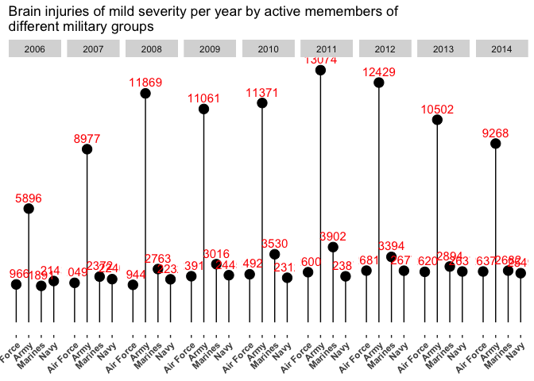
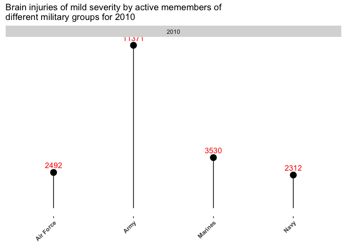
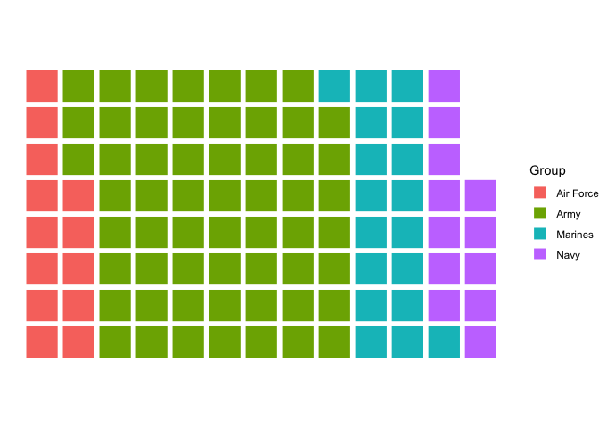

Tidy\_Tuesday\_2020\_03\_30
================

Tidy Tuesday: Brain Injuries
============================

My objective this week was to try out three different ways of showing the same data. I will be using [lollipop plots](https://www.statology.org/how-to-create-a-lollipop-chart-in-r/), [waffle plots](https://github.com/liamgilbey/ggwaffle), and [pie charts](https://rpubs.com/ageek/ggplot-adv-part2) to show the proportions of service groups with members on active service that had mild brain injuries in the year 2010.

Load libraries
--------------

``` r
library(tidyverse)
library(skimr)
library(ggwaffle)
library(hrbrthemes)
```

Get Data
--------

``` r
tbi_age <- readr::read_csv('https://raw.githubusercontent.com/rfordatascience/tidytuesday/master/data/2020/2020-03-24/tbi_age.csv')
tbi_year <- readr::read_csv('https://raw.githubusercontent.com/rfordatascience/tidytuesday/master/data/2020/2020-03-24/tbi_year.csv')
tbi_military <- readr::read_csv('https://raw.githubusercontent.com/rfordatascience/tidytuesday/master/data/2020/2020-03-24/tbi_military.csv')
```

Data Wrangling
--------------

``` r
tbi_military_df<- tbi_military %>% 
         filter(component=="Active") %>%
         filter(severity=="Mild")
         
total_diagnosed<- tbi_military_df %>% 
  group_by(year) %>% 
  summarise(total_diagnosed= sum(diagnosed))

tbi_military_df_waffle<- tbi_military_df %>%
  left_join(total_diagnosed) %>%
  mutate(proportion=round(100*diagnosed/total_diagnosed)) %>% 
  filter(year=="2010") %>%
  select(service, proportion) %>%
  slice(rep(row_number(), proportion))

waffle_data <- waffle_iron(tbi_military_df_waffle , aes_d(group = service)) %>%
  rename(Group="group")
```

Plots
-----

The first plot shows the data for active members of the military with mild brain injuries for all years. Subsequent plots show *only* the data for year 2010.

``` r
#Lollipop plot
ggplot(tbi_military_df, aes(x=service, y=diagnosed)) + 
  geom_point(size=4) + 
  geom_segment(aes(x=service, xend=service,  y=0, yend=diagnosed)) + 
  facet_grid(~year) +
  geom_text(color="red", size=4, vjust=-0.8, aes(label=diagnosed)) +
  theme(axis.text.x = element_text(angle=45, hjust = 1, face = "bold"),
        axis.text.y = element_blank(),
        axis.ticks.y = element_blank(), 
        axis.title = element_blank(),
        panel.background = element_blank()) +
  ggtitle("Brain injuries of mild severity per year by active memembers of \ndifferent military groups")
```



``` r
#Chose year 2010, this time I'm doing data wrangling inside the ggplot call. 
ggplot(tbi_military_df %>%
         filter(year=="2010"), 
       aes(x=service, y=diagnosed)) + 
  geom_point(size=4) + 
  geom_segment(aes(x=service, xend=service,  y=0, yend=diagnosed)) + 
  facet_grid(~year) +
  geom_text(color="red", size=4, vjust=-0.8, aes(label=diagnosed)) +
  theme(axis.text.x = element_text(angle=45, hjust = 1, face = "bold"),
        axis.text.y = element_blank(),
        axis.ticks.y = element_blank(), 
        axis.title = element_blank(),
        panel.background = element_blank()) +
  ggtitle("Brain injuries of mild severity by active memembers of \ndifferent military groups for 2010")
```



``` r
#Waffle chart
ggplot(waffle_data , aes(x, y, fill = Group)) + 
  geom_waffle() +
  coord_equal() + 
  theme_void()
```



``` r
#Pie chart
ggplot(tbi_military_df %>%
         filter(year=="2010"), aes(x = "", y=diagnosed, fill = factor(service))) + 
  geom_bar(width = 1, stat="identity") +
  geom_text(aes(label=diagnosed), 
            size=6,
            position = position_stack(vjust = 0.5)) +
  coord_polar(theta = "y") +
  scale_fill_discrete(name = "Group") +
  theme_void()
```


