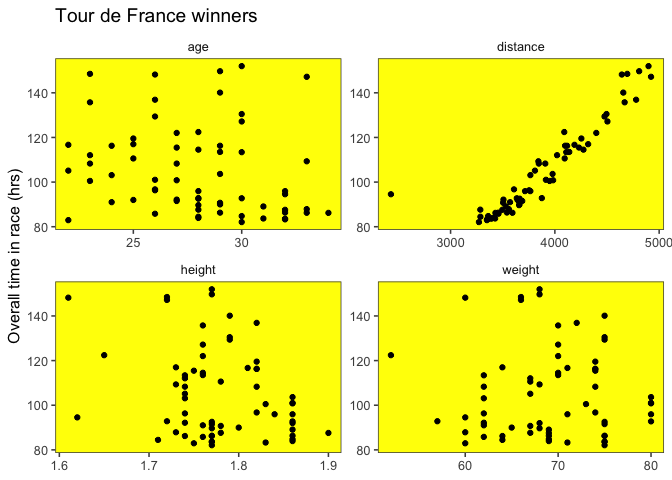
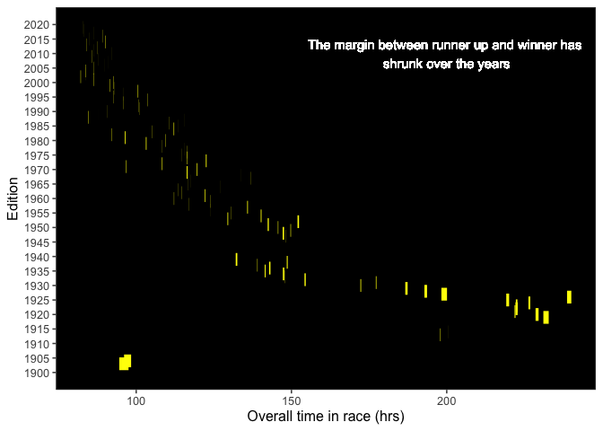

Tidy\_Tuesday\_2020\_04\_14
================

Tidy Tuesday: Tour de France
============================

The objective for this week is to analyse data about Tour de France. We often forget that tables are very useful visualization and prefered in [certain situations](https://flourish.studio/2019/03/11/how-make-interactive-table/). Because of this, I decided to give the package `gt` a try. This package allows you to showcase *great looking tables* using gramar of tables much like ggplot2 grammar of graphics. You can find an introductury tutorial [here](https://blog.rstudio.com/2020/04/08/great-looking-tables-gt-0-2/).

Back to traditional visualization, I would like to see the effect of the numeric variables (age, height, weight, distance) on the overall time (time\_overall) to complete the race.

Also of interest is the age of the winner, assuming the won at peak athletic performance and the age the participant died at.

margin between winner and runner up

Load libraries
--------------

``` r
library(tidyverse)
library(lubridate)
library(gt)
library(skimr)
library(ggthemes)
```

Get Data
--------

``` r
tdf_winners <- readr::read_csv('https://raw.githubusercontent.com/rfordatascience/tidytuesday/master/data/2020/2020-04-07/tdf_winners.csv')
```

Data structure
--------------

``` r
skim(tdf_winners)
```

|                                                  |              |
|:-------------------------------------------------|:-------------|
| Name                                             | tdf\_winners |
| Number of rows                                   | 106          |
| Number of columns                                | 19           |
| \_\_\_\_\_\_\_\_\_\_\_\_\_\_\_\_\_\_\_\_\_\_\_   |              |
| Column type frequency:                           |              |
| character                                        | 7            |
| Date                                             | 3            |
| numeric                                          | 9            |
| \_\_\_\_\_\_\_\_\_\_\_\_\_\_\_\_\_\_\_\_\_\_\_\_ |              |
| Group variables                                  | None         |

**Variable type: character**

| skim\_variable |  n\_missing|  complete\_rate|  min|  max|  empty|  n\_unique|  whitespace|
|:---------------|-----------:|---------------:|----:|----:|------:|----------:|-----------:|
| winner\_name   |           0|            1.00|   10|   19|      0|         63|           0|
| winner\_team   |           0|            1.00|    3|   33|      0|         48|           0|
| full\_name     |          60|            0.43|   15|   33|      0|         23|           0|
| nickname       |          32|            0.70|    1|   95|      0|         37|           0|
| birth\_town    |           0|            1.00|    3|   28|      0|         58|           0|
| birth\_country |           0|            1.00|    3|   11|      0|         15|           0|
| nationality    |           0|            1.00|    6|   14|      0|         14|         106|

**Variable type: Date**

| skim\_variable |  n\_missing|  complete\_rate| min        | max        | median     |  n\_unique|
|:---------------|-----------:|---------------:|:-----------|:-----------|:-----------|----------:|
| start\_date    |           0|            1.00| 1903-07-01 | 2019-07-06 | 1966-12-24 |        106|
| born           |           0|            1.00| 1871-03-03 | 1997-01-13 | 1940-12-27 |         63|
| died           |          50|            0.53| 1907-01-25 | 2019-08-16 | 1980-04-10 |         38|

**Variable type: numeric**

| skim\_variable |  n\_missing|  complete\_rate|     mean|      sd|       p0|      p25|      p50|      p75|     p100| hist  |
|:---------------|-----------:|---------------:|--------:|-------:|--------:|--------:|--------:|--------:|--------:|:------|
| edition        |           0|            1.00|    53.50|   30.74|     1.00|    27.25|    53.50|    79.75|   106.00| ▇▇▇▇▇ |
| distance       |           0|            1.00|  4212.06|  704.28|  2428.00|  3657.88|  4155.50|  4652.50|  5745.00| ▁▇▇▆▃ |
| time\_overall  |           8|            0.92|   125.75|   41.56|    82.09|    92.60|   115.03|   142.68|   238.74| ▇▅▂▁▂ |
| time\_margin   |           8|            0.92|     0.27|    0.48|     0.00|     0.05|     0.10|     0.25|     2.99| ▇▁▁▁▁ |
| stage\_wins    |           0|            1.00|     2.74|    1.84|     0.00|     1.00|     2.00|     4.00|     8.00| ▆▇▃▂▁ |
| stages\_led    |           0|            1.00|    10.79|    5.31|     1.00|     6.25|    12.00|    14.00|    22.00| ▆▇▇▇▃ |
| height         |          40|            0.62|     1.78|    0.06|     1.61|     1.74|     1.77|     1.82|     1.90| ▁▁▇▃▂ |
| weight         |          39|            0.63|    69.25|    6.59|    52.00|    64.50|    69.00|    74.00|    88.00| ▁▆▇▇▁ |
| age            |           0|            1.00|    27.72|    3.35|    19.00|    26.00|    28.00|    30.00|    36.00| ▁▃▇▃▂ |

Data Wrangling
--------------

``` r
#gt

tdf_winners %>%
  select(winner_name, birth_country, birth_town) %>%
  distinct %>%
  group_by(birth_country, birth_town) %>%
  summarize(Winners= n()) %>%
  gt(rowname_col = "birth_town") %>%
  tab_header(title = md("&#128690; Tour de France &#128690;")) %>%
  summary_rows(
    groups = TRUE,
    columns = vars(Winners),
    fns = list(TOTAL = "sum"),
    formatter = fmt_number,
    decimals = 0,
    use_seps = TRUE
  ) %>%
  opt_all_caps(locations = "row_group") %>%
  tab_options(
    summary_row.background.color = "black",
    row_group.background.color = "yellow",
    heading.background.color = "white",
    heading.title.font.size = 20,
    column_labels.background.color = "black",
    stub.background.color = "white",
    stub.border.style = "dashed",
    stub.border.width = "1px",
    summary_row.border.color = "#989898",
    table.width = "50%"
  )
```

<!--html_preserve-->
<style>html {
  font-family: -apple-system, BlinkMacSystemFont, 'Segoe UI', Roboto, Oxygen, Ubuntu, Cantarell, 'Helvetica Neue', 'Fira Sans', 'Droid Sans', Arial, sans-serif;
}

#iqzflouixu .gt_table {
  display: table;
  border-collapse: collapse;
  margin-left: auto;
  margin-right: auto;
  color: #333333;
  font-size: 16px;
  background-color: #FFFFFF;
  width: 50%;
  border-top-style: solid;
  border-top-width: 2px;
  border-top-color: #A8A8A8;
  border-right-style: none;
  border-right-width: 2px;
  border-right-color: #D3D3D3;
  border-bottom-style: solid;
  border-bottom-width: 2px;
  border-bottom-color: #A8A8A8;
  border-left-style: none;
  border-left-width: 2px;
  border-left-color: #D3D3D3;
}

#iqzflouixu .gt_heading {
  background-color: white;
  text-align: center;
  border-bottom-color: #FFFFFF;
  border-left-style: none;
  border-left-width: 1px;
  border-left-color: #D3D3D3;
  border-right-style: none;
  border-right-width: 1px;
  border-right-color: #D3D3D3;
}

#iqzflouixu .gt_title {
  color: #333333;
  font-size: 20px;
  font-weight: initial;
  padding-top: 4px;
  padding-bottom: 4px;
  border-bottom-color: #FFFFFF;
  border-bottom-width: 0;
}

#iqzflouixu .gt_subtitle {
  color: #333333;
  font-size: 85%;
  font-weight: initial;
  padding-top: 0;
  padding-bottom: 4px;
  border-top-color: #FFFFFF;
  border-top-width: 0;
}

#iqzflouixu .gt_bottom_border {
  border-bottom-style: solid;
  border-bottom-width: 2px;
  border-bottom-color: #D3D3D3;
}

#iqzflouixu .gt_col_headings {
  border-top-style: solid;
  border-top-width: 2px;
  border-top-color: #D3D3D3;
  border-bottom-style: solid;
  border-bottom-width: 2px;
  border-bottom-color: #D3D3D3;
  border-left-style: none;
  border-left-width: 1px;
  border-left-color: #D3D3D3;
  border-right-style: none;
  border-right-width: 1px;
  border-right-color: #D3D3D3;
}

#iqzflouixu .gt_col_heading {
  color: #FFFFFF;
  background-color: black;
  font-size: 100%;
  font-weight: normal;
  text-transform: inherit;
  border-left-style: none;
  border-left-width: 1px;
  border-left-color: #D3D3D3;
  border-right-style: none;
  border-right-width: 1px;
  border-right-color: #D3D3D3;
  vertical-align: bottom;
  padding-top: 5px;
  padding-bottom: 6px;
  padding-left: 5px;
  padding-right: 5px;
  overflow-x: hidden;
}

#iqzflouixu .gt_column_spanner_outer {
  color: #FFFFFF;
  background-color: black;
  font-size: 100%;
  font-weight: normal;
  text-transform: inherit;
  padding-top: 0;
  padding-bottom: 0;
  padding-left: 4px;
  padding-right: 4px;
}

#iqzflouixu .gt_column_spanner_outer:first-child {
  padding-left: 0;
}

#iqzflouixu .gt_column_spanner_outer:last-child {
  padding-right: 0;
}

#iqzflouixu .gt_column_spanner {
  border-bottom-style: solid;
  border-bottom-width: 2px;
  border-bottom-color: #D3D3D3;
  vertical-align: bottom;
  padding-top: 5px;
  padding-bottom: 6px;
  overflow-x: hidden;
  display: inline-block;
  width: 100%;
}

#iqzflouixu .gt_group_heading {
  padding: 8px;
  color: #333333;
  background-color: yellow;
  font-size: 80%;
  font-weight: bolder;
  text-transform: uppercase;
  border-top-style: solid;
  border-top-width: 2px;
  border-top-color: #D3D3D3;
  border-bottom-style: solid;
  border-bottom-width: 2px;
  border-bottom-color: #D3D3D3;
  border-left-style: none;
  border-left-width: 1px;
  border-left-color: #D3D3D3;
  border-right-style: none;
  border-right-width: 1px;
  border-right-color: #D3D3D3;
  vertical-align: middle;
}

#iqzflouixu .gt_empty_group_heading {
  padding: 0.5px;
  color: #333333;
  background-color: yellow;
  font-size: 80%;
  font-weight: bolder;
  border-top-style: solid;
  border-top-width: 2px;
  border-top-color: #D3D3D3;
  border-bottom-style: solid;
  border-bottom-width: 2px;
  border-bottom-color: #D3D3D3;
  vertical-align: middle;
}

#iqzflouixu .gt_striped {
  background-color: rgba(128, 128, 128, 0.05);
}

#iqzflouixu .gt_from_md > :first-child {
  margin-top: 0;
}

#iqzflouixu .gt_from_md > :last-child {
  margin-bottom: 0;
}

#iqzflouixu .gt_row {
  padding-top: 8px;
  padding-bottom: 8px;
  padding-left: 5px;
  padding-right: 5px;
  margin: 10px;
  border-top-style: solid;
  border-top-width: 1px;
  border-top-color: #D3D3D3;
  border-left-style: none;
  border-left-width: 1px;
  border-left-color: #D3D3D3;
  border-right-style: none;
  border-right-width: 1px;
  border-right-color: #D3D3D3;
  vertical-align: middle;
  overflow-x: hidden;
}

#iqzflouixu .gt_stub {
  color: #333333;
  background-color: white;
  font-size: 100%;
  font-weight: initial;
  text-transform: inherit;
  border-right-style: dashed;
  border-right-width: 1px;
  border-right-color: #D3D3D3;
  padding-left: 12px;
}

#iqzflouixu .gt_summary_row {
  color: #FFFFFF;
  background-color: black;
  text-transform: inherit;
  padding-top: 8px;
  padding-bottom: 8px;
  padding-left: 5px;
  padding-right: 5px;
}

#iqzflouixu .gt_first_summary_row {
  padding-top: 8px;
  padding-bottom: 8px;
  padding-left: 5px;
  padding-right: 5px;
  border-top-style: solid;
  border-top-width: 2px;
  border-top-color: #989898;
}

#iqzflouixu .gt_grand_summary_row {
  color: #333333;
  background-color: #FFFFFF;
  text-transform: inherit;
  padding-top: 8px;
  padding-bottom: 8px;
  padding-left: 5px;
  padding-right: 5px;
}

#iqzflouixu .gt_first_grand_summary_row {
  padding-top: 8px;
  padding-bottom: 8px;
  padding-left: 5px;
  padding-right: 5px;
  border-top-style: double;
  border-top-width: 6px;
  border-top-color: #D3D3D3;
}

#iqzflouixu .gt_table_body {
  border-top-style: solid;
  border-top-width: 2px;
  border-top-color: #D3D3D3;
  border-bottom-style: solid;
  border-bottom-width: 2px;
  border-bottom-color: #D3D3D3;
}

#iqzflouixu .gt_footnotes {
  color: #333333;
  background-color: #FFFFFF;
  border-bottom-style: none;
  border-bottom-width: 2px;
  border-bottom-color: #D3D3D3;
  border-left-style: none;
  border-left-width: 2px;
  border-left-color: #D3D3D3;
  border-right-style: none;
  border-right-width: 2px;
  border-right-color: #D3D3D3;
}

#iqzflouixu .gt_footnote {
  margin: 0px;
  font-size: 90%;
  padding: 4px;
}

#iqzflouixu .gt_sourcenotes {
  color: #333333;
  background-color: #FFFFFF;
  border-bottom-style: none;
  border-bottom-width: 2px;
  border-bottom-color: #D3D3D3;
  border-left-style: none;
  border-left-width: 2px;
  border-left-color: #D3D3D3;
  border-right-style: none;
  border-right-width: 2px;
  border-right-color: #D3D3D3;
}

#iqzflouixu .gt_sourcenote {
  font-size: 90%;
  padding: 4px;
}

#iqzflouixu .gt_left {
  text-align: left;
}

#iqzflouixu .gt_center {
  text-align: center;
}

#iqzflouixu .gt_right {
  text-align: right;
  font-variant-numeric: tabular-nums;
}

#iqzflouixu .gt_font_normal {
  font-weight: normal;
}

#iqzflouixu .gt_font_bold {
  font-weight: bold;
}

#iqzflouixu .gt_font_italic {
  font-style: italic;
}

#iqzflouixu .gt_super {
  font-size: 65%;
}

#iqzflouixu .gt_footnote_marks {
  font-style: italic;
  font-size: 65%;
}
</style>
<table class="gt_table">
<thead class="gt_header">
    <tr>
      <th colspan="2" class="gt_heading gt_title gt_font_normal" style>🚲 Tour de France 🚲</th>
    </tr>
    <tr>
      <th colspan="2" class="gt_heading gt_subtitle gt_font_normal gt_bottom_border" style></th>
    </tr>

</thead>
<thead class="gt_col_headings">
    <tr>
      <th class="gt_col_heading gt_columns_bottom_border gt_left" rowspan="1" colspan="1"></th>
      <th class="gt_col_heading gt_columns_bottom_border gt_center" rowspan="1" colspan="1">Winners</th>
    </tr>

</thead>
<tbody class="gt_table_body">
    <tr class="gt_group_heading_row">
      <td colspan="2" class="gt_group_heading">Australia</td>
    </tr>
    <tr>
      <td class="gt_row gt_left gt_stub">Katherine</td>
      <td class="gt_row gt_center">1</td>
    </tr>
    <tr>
      <td class="gt_row gt_stub gt_right gt_summary_row gt_first_summary_row">TOTAL</td>
      <td class="gt_row gt_center gt_summary_row gt_first_summary_row">1</td>
    </tr>
    <tr class="gt_group_heading_row">
      <td colspan="2" class="gt_group_heading">Belgium</td>
    </tr>
    <tr>
      <td class="gt_row gt_left gt_stub">Anderlecht</td>
      <td class="gt_row gt_center">1</td>
    </tr>
    <tr>
      <td class="gt_row gt_left gt_stub">Florennes</td>
      <td class="gt_row gt_center">2</td>
    </tr>
    <tr>
      <td class="gt_row gt_left gt_stub">Ghent</td>
      <td class="gt_row gt_center">1</td>
    </tr>
    <tr>
      <td class="gt_row gt_left gt_stub">Lovendegem</td>
      <td class="gt_row gt_center">1</td>
    </tr>
    <tr>
      <td class="gt_row gt_left gt_stub">Meensel-Kiezegem</td>
      <td class="gt_row gt_center">1</td>
    </tr>
    <tr>
      <td class="gt_row gt_left gt_stub">Mere</td>
      <td class="gt_row gt_center">1</td>
    </tr>
    <tr>
      <td class="gt_row gt_left gt_stub">Rumbeke</td>
      <td class="gt_row gt_center">1</td>
    </tr>
    <tr>
      <td class="gt_row gt_left gt_stub">Wontergem</td>
      <td class="gt_row gt_center">1</td>
    </tr>
    <tr>
      <td class="gt_row gt_left gt_stub">Zerkegem</td>
      <td class="gt_row gt_center">1</td>
    </tr>
    <tr>
      <td class="gt_row gt_left gt_stub">Zevekote</td>
      <td class="gt_row gt_center">1</td>
    </tr>
    <tr>
      <td class="gt_row gt_stub gt_right gt_summary_row gt_first_summary_row">TOTAL</td>
      <td class="gt_row gt_center gt_summary_row gt_first_summary_row">11</td>
    </tr>
    <tr class="gt_group_heading_row">
      <td colspan="2" class="gt_group_heading">Columbia</td>
    </tr>
    <tr>
      <td class="gt_row gt_left gt_stub">Bogotá</td>
      <td class="gt_row gt_center">1</td>
    </tr>
    <tr>
      <td class="gt_row gt_stub gt_right gt_summary_row gt_first_summary_row">TOTAL</td>
      <td class="gt_row gt_center gt_summary_row gt_first_summary_row">1</td>
    </tr>
    <tr class="gt_group_heading_row">
      <td colspan="2" class="gt_group_heading">Denmark</td>
    </tr>
    <tr>
      <td class="gt_row gt_left gt_stub">Herning</td>
      <td class="gt_row gt_center">1</td>
    </tr>
    <tr>
      <td class="gt_row gt_stub gt_right gt_summary_row gt_first_summary_row">TOTAL</td>
      <td class="gt_row gt_center gt_summary_row gt_first_summary_row">1</td>
    </tr>
    <tr class="gt_group_heading_row">
      <td colspan="2" class="gt_group_heading">France</td>
    </tr>
    <tr>
      <td class="gt_row gt_left gt_stub">Aulnay-sur-Iton</td>
      <td class="gt_row gt_center">1</td>
    </tr>
    <tr>
      <td class="gt_row gt_left gt_stub">Bayonne</td>
      <td class="gt_row gt_center">1</td>
    </tr>
    <tr>
      <td class="gt_row gt_left gt_stub">Desvres</td>
      <td class="gt_row gt_center">1</td>
    </tr>
    <tr>
      <td class="gt_row gt_left gt_stub">Hauteville-Lompnes</td>
      <td class="gt_row gt_center">1</td>
    </tr>
    <tr>
      <td class="gt_row gt_left gt_stub">Hyères</td>
      <td class="gt_row gt_center">1</td>
    </tr>
    <tr>
      <td class="gt_row gt_left gt_stub">Mont-Saint-Aignan</td>
      <td class="gt_row gt_center">1</td>
    </tr>
    <tr>
      <td class="gt_row gt_left gt_stub">Montluçon</td>
      <td class="gt_row gt_center">1</td>
    </tr>
    <tr>
      <td class="gt_row gt_left gt_stub">Moret-sur-Loing</td>
      <td class="gt_row gt_center">1</td>
    </tr>
    <tr>
      <td class="gt_row gt_left gt_stub">Paris</td>
      <td class="gt_row gt_center">5</td>
    </tr>
    <tr>
      <td class="gt_row gt_left gt_stub">Plessé</td>
      <td class="gt_row gt_center">1</td>
    </tr>
    <tr>
      <td class="gt_row gt_left gt_stub">Saint-Julien-de-Civry</td>
      <td class="gt_row gt_center">1</td>
    </tr>
    <tr>
      <td class="gt_row gt_left gt_stub">Saint-Méen-le-Grand</td>
      <td class="gt_row gt_center">1</td>
    </tr>
    <tr>
      <td class="gt_row gt_left gt_stub">Saint-Ouen</td>
      <td class="gt_row gt_center">1</td>
    </tr>
    <tr>
      <td class="gt_row gt_left gt_stub">Vabres</td>
      <td class="gt_row gt_center">1</td>
    </tr>
    <tr>
      <td class="gt_row gt_left gt_stub">Vouziers</td>
      <td class="gt_row gt_center">1</td>
    </tr>
    <tr>
      <td class="gt_row gt_left gt_stub">Yffiniac</td>
      <td class="gt_row gt_center">1</td>
    </tr>
    <tr>
      <td class="gt_row gt_left gt_stub">Ytrac</td>
      <td class="gt_row gt_center">1</td>
    </tr>
    <tr>
      <td class="gt_row gt_stub gt_right gt_summary_row gt_first_summary_row">TOTAL</td>
      <td class="gt_row gt_center gt_summary_row gt_first_summary_row">21</td>
    </tr>
    <tr class="gt_group_heading_row">
      <td colspan="2" class="gt_group_heading">Germany</td>
    </tr>
    <tr>
      <td class="gt_row gt_left gt_stub">Rostock</td>
      <td class="gt_row gt_center">1</td>
    </tr>
    <tr>
      <td class="gt_row gt_stub gt_right gt_summary_row gt_first_summary_row">TOTAL</td>
      <td class="gt_row gt_center gt_summary_row gt_first_summary_row">1</td>
    </tr>
    <tr class="gt_group_heading_row">
      <td colspan="2" class="gt_group_heading">Ireland</td>
    </tr>
    <tr>
      <td class="gt_row gt_left gt_stub">Dundrum</td>
      <td class="gt_row gt_center">1</td>
    </tr>
    <tr>
      <td class="gt_row gt_stub gt_right gt_summary_row gt_first_summary_row">TOTAL</td>
      <td class="gt_row gt_center gt_summary_row gt_first_summary_row">1</td>
    </tr>
    <tr class="gt_group_heading_row">
      <td colspan="2" class="gt_group_heading">Italy</td>
    </tr>
    <tr>
      <td class="gt_row gt_left gt_stub">Arvier</td>
      <td class="gt_row gt_center">1</td>
    </tr>
    <tr>
      <td class="gt_row gt_left gt_stub">Barberino di Mugello</td>
      <td class="gt_row gt_center">1</td>
    </tr>
    <tr>
      <td class="gt_row gt_left gt_stub">Castellania</td>
      <td class="gt_row gt_center">1</td>
    </tr>
    <tr>
      <td class="gt_row gt_left gt_stub">Cesena</td>
      <td class="gt_row gt_center">1</td>
    </tr>
    <tr>
      <td class="gt_row gt_left gt_stub">Messina</td>
      <td class="gt_row gt_center">1</td>
    </tr>
    <tr>
      <td class="gt_row gt_left gt_stub">Ponte e Ema</td>
      <td class="gt_row gt_center">1</td>
    </tr>
    <tr>
      <td class="gt_row gt_left gt_stub">San Martino di Colle Umberto</td>
      <td class="gt_row gt_center">1</td>
    </tr>
    <tr>
      <td class="gt_row gt_left gt_stub">Sedrina</td>
      <td class="gt_row gt_center">1</td>
    </tr>
    <tr>
      <td class="gt_row gt_stub gt_right gt_summary_row gt_first_summary_row">TOTAL</td>
      <td class="gt_row gt_center gt_summary_row gt_first_summary_row">8</td>
    </tr>
    <tr class="gt_group_heading_row">
      <td colspan="2" class="gt_group_heading">Kenya</td>
    </tr>
    <tr>
      <td class="gt_row gt_left gt_stub">Nairobi</td>
      <td class="gt_row gt_center">1</td>
    </tr>
    <tr>
      <td class="gt_row gt_stub gt_right gt_summary_row gt_first_summary_row">TOTAL</td>
      <td class="gt_row gt_center gt_summary_row gt_first_summary_row">1</td>
    </tr>
    <tr class="gt_group_heading_row">
      <td colspan="2" class="gt_group_heading">Luxembourg</td>
    </tr>
    <tr>
      <td class="gt_row gt_left gt_stub">Luxembourg City</td>
      <td class="gt_row gt_center">1</td>
    </tr>
    <tr>
      <td class="gt_row gt_left gt_stub">Mamer</td>
      <td class="gt_row gt_center">1</td>
    </tr>
    <tr>
      <td class="gt_row gt_left gt_stub">Pfaffenthal</td>
      <td class="gt_row gt_center">1</td>
    </tr>
    <tr>
      <td class="gt_row gt_stub gt_right gt_summary_row gt_first_summary_row">TOTAL</td>
      <td class="gt_row gt_center gt_summary_row gt_first_summary_row">3</td>
    </tr>
    <tr class="gt_group_heading_row">
      <td colspan="2" class="gt_group_heading">Netherlands</td>
    </tr>
    <tr>
      <td class="gt_row gt_left gt_stub">Nootdorp</td>
      <td class="gt_row gt_center">1</td>
    </tr>
    <tr>
      <td class="gt_row gt_left gt_stub">The Hague</td>
      <td class="gt_row gt_center">1</td>
    </tr>
    <tr>
      <td class="gt_row gt_stub gt_right gt_summary_row gt_first_summary_row">TOTAL</td>
      <td class="gt_row gt_center gt_summary_row gt_first_summary_row">2</td>
    </tr>
    <tr class="gt_group_heading_row">
      <td colspan="2" class="gt_group_heading">Spain</td>
    </tr>
    <tr>
      <td class="gt_row gt_left gt_stub">Leganés</td>
      <td class="gt_row gt_center">1</td>
    </tr>
    <tr>
      <td class="gt_row gt_left gt_stub">Mos</td>
      <td class="gt_row gt_center">1</td>
    </tr>
    <tr>
      <td class="gt_row gt_left gt_stub">Pinto</td>
      <td class="gt_row gt_center">1</td>
    </tr>
    <tr>
      <td class="gt_row gt_left gt_stub">Priego</td>
      <td class="gt_row gt_center">1</td>
    </tr>
    <tr>
      <td class="gt_row gt_left gt_stub">Santo Domingo-Caudilla</td>
      <td class="gt_row gt_center">1</td>
    </tr>
    <tr>
      <td class="gt_row gt_left gt_stub">Segovia</td>
      <td class="gt_row gt_center">1</td>
    </tr>
    <tr>
      <td class="gt_row gt_left gt_stub">Villava</td>
      <td class="gt_row gt_center">1</td>
    </tr>
    <tr>
      <td class="gt_row gt_stub gt_right gt_summary_row gt_first_summary_row">TOTAL</td>
      <td class="gt_row gt_center gt_summary_row gt_first_summary_row">7</td>
    </tr>
    <tr class="gt_group_heading_row">
      <td colspan="2" class="gt_group_heading">Switzerland</td>
    </tr>
    <tr>
      <td class="gt_row gt_left gt_stub">Marthalen</td>
      <td class="gt_row gt_center">1</td>
    </tr>
    <tr>
      <td class="gt_row gt_left gt_stub">Zürich</td>
      <td class="gt_row gt_center">1</td>
    </tr>
    <tr>
      <td class="gt_row gt_stub gt_right gt_summary_row gt_first_summary_row">TOTAL</td>
      <td class="gt_row gt_center gt_summary_row gt_first_summary_row">2</td>
    </tr>
    <tr class="gt_group_heading_row">
      <td colspan="2" class="gt_group_heading">USA</td>
    </tr>
    <tr>
      <td class="gt_row gt_left gt_stub">Lakewood</td>
      <td class="gt_row gt_center">1</td>
    </tr>
    <tr>
      <td class="gt_row gt_left gt_stub">Plano</td>
      <td class="gt_row gt_center">1</td>
    </tr>
    <tr>
      <td class="gt_row gt_stub gt_right gt_summary_row gt_first_summary_row">TOTAL</td>
      <td class="gt_row gt_center gt_summary_row gt_first_summary_row">2</td>
    </tr>
    <tr class="gt_group_heading_row">
      <td colspan="2" class="gt_group_heading">Wales</td>
    </tr>
    <tr>
      <td class="gt_row gt_left gt_stub">Cardiff</td>
      <td class="gt_row gt_center">1</td>
    </tr>
    <tr>
      <td class="gt_row gt_stub gt_right gt_summary_row gt_first_summary_row">TOTAL</td>
      <td class="gt_row gt_center gt_summary_row gt_first_summary_row">1</td>
    </tr>

</tbody>
</table>

<!--/html_preserve-->
``` r
tdf_time<- tdf_winners %>%
  select(age, height, weight, distance, time_overall) %>%
  drop_na() %>%
  gather(variable, value, -time_overall)

tdf_margin<- tdf_winners %>%
  mutate(overall_second= time_overall + time_margin, year= year(start_date)) %>%
  select(year, time_overall, overall_second) %>%
  drop_na()
```

Visualizations
--------------

``` r
ggplot(tdf_time) +
  theme_few() +
  geom_point(aes(value, time_overall)) +
  facet_wrap(~variable, scales = "free") +
  ylab("Overall time in race (hrs)") +
  ggtitle("Tour de France winners ") +
  theme(axis.title.x = element_blank()) +
  theme(panel.background = element_rect(fill="yellow")) 
```



``` r
ggplot(tdf_margin) +
  theme_few() +
  geom_segment(aes(x=overall_second, xend=time_overall, y= year, yend=year), size=5, color="yellow") +
  scale_y_continuous(limits = c(1900, 2020), breaks = seq(1900, 2020, by = 5)) +
  ylab("Edition") +
  xlab("Overall time in race (hrs)") +
  theme(panel.background = element_rect(fill="black")) +
  geom_text(aes(200, 2010), label="The margin between runner up and winner has \nshrunk over the years", color= "white")
```


