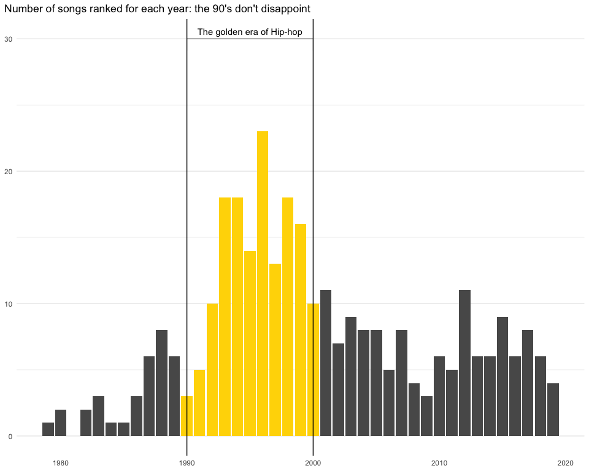

Tidy\_Tuesday\_2020\_04\_21
================

Tidy Tuesday: Best Rap Artists
==============================

Load libraries
--------------

``` r
library(tidyverse)
library(skimr)
library(patchwork)
library(ggpubr)
library(cowplot)
```

Get Data
--------

``` r
polls <- readr::read_csv('https://raw.githubusercontent.com/rfordatascience/tidytuesday/master/data/2020/2020-04-14/polls.csv')
rankings <- readr::read_csv('https://raw.githubusercontent.com/rfordatascience/tidytuesday/master/data/2020/2020-04-14/rankings.csv')
```

Data structure
--------------

``` r
skim(polls)
```

|                                                  |       |
|:-------------------------------------------------|:------|
| Name                                             | polls |
| Number of rows                                   | 535   |
| Number of columns                                | 9     |
| \_\_\_\_\_\_\_\_\_\_\_\_\_\_\_\_\_\_\_\_\_\_\_   |       |
| Column type frequency:                           |       |
| character                                        | 7     |
| numeric                                          | 2     |
| \_\_\_\_\_\_\_\_\_\_\_\_\_\_\_\_\_\_\_\_\_\_\_\_ |       |
| Group variables                                  | None  |

**Variable type: character**

| skim\_variable   |  n\_missing|  complete\_rate|  min|  max|  empty|  n\_unique|  whitespace|
|:-----------------|-----------:|---------------:|----:|----:|------:|----------:|-----------:|
| title            |           0|            1.00|    2|   59|      0|        309|           0|
| artist           |           0|            1.00|    3|   56|      0|        207|           0|
| gender           |           0|            1.00|    4|    6|      0|          3|           0|
| critic\_name     |           0|            1.00|    6|   23|      0|        107|           0|
| critic\_rols     |           0|            1.00|    2|   28|      0|         48|           0|
| critic\_country  |           0|            1.00|    2|   18|      0|         13|           0|
| critic\_country2 |         530|            0.01|    9|    9|      0|          1|           0|

**Variable type: numeric**

| skim\_variable |  n\_missing|  complete\_rate|     mean|    sd|    p0|   p25|   p50|   p75|  p100| hist  |
|:---------------|-----------:|---------------:|--------:|-----:|-----:|-----:|-----:|-----:|-----:|:------|
| rank           |           0|               1|     3.00|  1.42|     1|     2|     3|     4|     5| ▇▇▇▇▇ |
| year           |           0|               1|  1998.15|  8.89|  1979|  1993|  1996|  2003|  2019| ▂▇▆▂▂ |

``` r
skim(rankings)
```

|                                                  |          |
|:-------------------------------------------------|:---------|
| Name                                             | rankings |
| Number of rows                                   | 311      |
| Number of columns                                | 12       |
| \_\_\_\_\_\_\_\_\_\_\_\_\_\_\_\_\_\_\_\_\_\_\_   |          |
| Column type frequency:                           |          |
| character                                        | 3        |
| numeric                                          | 9        |
| \_\_\_\_\_\_\_\_\_\_\_\_\_\_\_\_\_\_\_\_\_\_\_\_ |          |
| Group variables                                  | None     |

**Variable type: character**

| skim\_variable |  n\_missing|  complete\_rate|  min|  max|  empty|  n\_unique|  whitespace|
|:---------------|-----------:|---------------:|----:|----:|------:|----------:|-----------:|
| title          |           0|               1|    2|   59|      0|        309|           0|
| artist         |           0|               1|    3|   56|      0|        207|           0|
| gender         |           0|               1|    4|    6|      0|          3|           0|

**Variable type: numeric**

| skim\_variable |  n\_missing|  complete\_rate|     mean|     sd|    p0|     p25|   p50|     p75|  p100| hist  |
|:---------------|-----------:|---------------:|--------:|------:|-----:|-------:|-----:|-------:|-----:|:------|
| ID             |           0|               1|   156.00|  89.92|     1|    78.5|   156|   233.5|   311| ▇▇▇▇▇ |
| year           |           0|               1|  2000.41|   9.20|  1979|  1994.0|  1999|  2007.0|  2019| ▂▆▇▃▅ |
| points         |           0|               1|    10.32|  14.64|     2|     4.0|     6|    10.0|   140| ▇▁▁▁▁ |
| n              |           0|               1|     1.72|   2.01|     1|     1.0|     1|     2.0|    18| ▇▁▁▁▁ |
| n1             |           0|               1|     0.34|   0.89|     0|     0.0|     0|     0.0|     9| ▇▁▁▁▁ |
| n2             |           0|               1|     0.34|   0.69|     0|     0.0|     0|     1.0|     5| ▇▁▁▁▁ |
| n3             |           0|               1|     0.34|   0.59|     0|     0.0|     0|     1.0|     3| ▇▃▁▁▁ |
| n4             |           0|               1|     0.34|   0.62|     0|     0.0|     0|     1.0|     4| ▇▃▁▁▁ |
| n5             |           0|               1|     0.34|   0.60|     0|     0.0|     0|     1.0|     5| ▇▁▁▁▁ |

Data Wrangling
--------------

``` r
rank_freq<- rankings %>% 
  group_by(year) %>% 
  summarise(Freq= n())

rank_top<- rankings %>% 
  group_by(gender) %>% 
  top_n(1, points) %>% 
  mutate(label= paste(title, artist, year, sep = "\n"))
```

Visualizations
--------------

``` r
p1<-ggplot() +
  theme_minimal() +
  geom_bar(data= rank_freq, aes(year, Freq), stat = "identity") +
  geom_bar(data= rank_freq %>% filter(year>=1990 & year<=2000), aes(year, Freq), stat = "identity", fill = "gold") +
  geom_vline(xintercept = 1990) +
  geom_vline(xintercept = 2000) +
  geom_bracket(xmin = 1990, xmax = 2000, y.position = 30,
    label = "The golden era of Hip-hop") +
  ylab("Frequency") 


p2<- ggplot() +
  theme_minimal() +
  geom_point(data= rankings, aes(year, points, color=gender), alpha=0.8, size=2)  +
  geom_vline(xintercept = 1990) +
  geom_vline(xintercept = 2000) +
  theme(legend.position = "none") +
  ylab("Points") +
  geom_point(data= rankings, aes(year, points, color=gender), alpha=0.8, size=2, shape= 1, color="black") +
  geom_curve(data= rank_top, aes(xend=year , yend= points, x = c(2012, 2005, 2010), y=points + 20),
             curvature = .2, arrow = arrow(length = unit(1, "mm")), color="gold") +
  geom_label(data=rank_top, aes(x=c(2012, 2005, 2010), points + 20, label=label, fill=gender), color= "gold", fontface = "bold") +
  scale_color_manual(values=c("grey", "black", "white")) +
  scale_fill_manual(values=c("grey", "black", "white")) 

p1
```



``` r
p2
```


