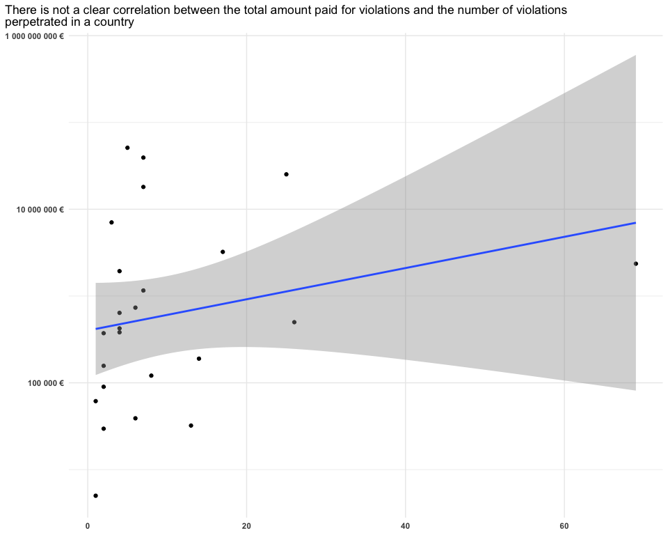
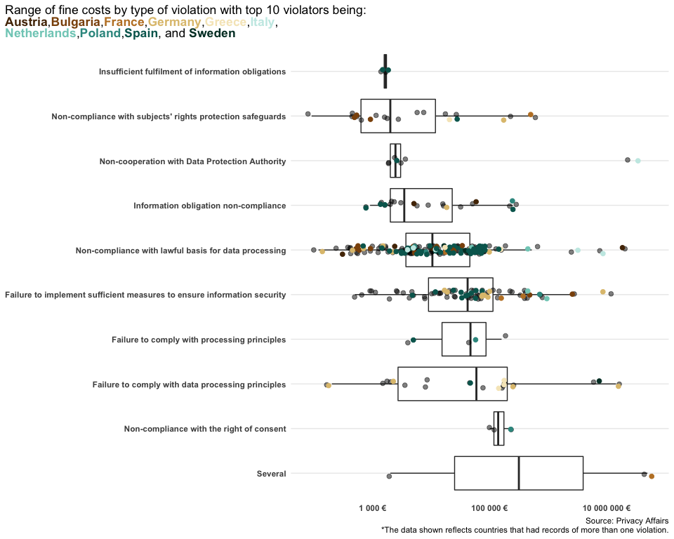
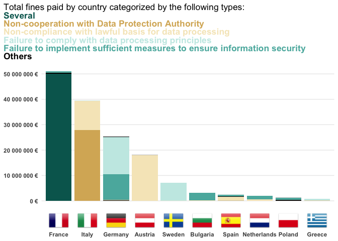

Tidy\_Tuesday\_2020\_04\_28
================

Tidy Tuesday: GDPR violations
=============================

This week's objective is to visualize <a href="https://github.com/rfordatascience/tidytuesday/blob/master/data/2020/2020-04-21/readme.md" target="_blank">data</a> on violations of General Data Protection Regulation in Europe.

I will be applying the principles described last week.

The objectives of this exercise are:
1. Inspect if there is any relationship between a countries number of violations and the amount of fines paid.
2. What are the most common violations and what is the distribution of fine cost associated with it.
3. Incorporate images as axis labels, since the data provides links of svg files for countries flags.

I also downloaded package <a href="https://github.com/MilesMcBain/datapasta" target="_blank">'datapasta'</a> which can copy from a table and paste as a vector definition among others. This was useful when manually reodering factors.

The colors used in manual scales were extracted from a divergent pallete found in this <a href="https://colorbrewer2.org/#type=sequential&amp;scheme=BuGn&amp;n=3" target="_blank">cartography application</a>

Load libraries
--------------

``` r
library(tidyverse)
library(skimr)
library(ggtext)
library(scales)
library(datapasta)
```

Get Data
--------

``` r
gdpr_violations <- readr::read_tsv('https://raw.githubusercontent.com/rfordatascience/tidytuesday/master/data/2020/2020-04-21/gdpr_violations.tsv')
gdpr_text <- readr::read_tsv('https://raw.githubusercontent.com/rfordatascience/tidytuesday/master/data/2020/2020-04-21/gdpr_text.tsv')
```

Data structure
--------------

``` r
skim(gdpr_violations)
```

|                                                  |                  |
|:-------------------------------------------------|:-----------------|
| Name                                             | gdpr\_violations |
| Number of rows                                   | 250              |
| Number of columns                                | 11               |
| \_\_\_\_\_\_\_\_\_\_\_\_\_\_\_\_\_\_\_\_\_\_\_   |                  |
| Column type frequency:                           |                  |
| character                                        | 9                |
| numeric                                          | 2                |
| \_\_\_\_\_\_\_\_\_\_\_\_\_\_\_\_\_\_\_\_\_\_\_\_ |                  |
| Group variables                                  | None             |

**Variable type: character**

| skim\_variable    |  n\_missing|  complete\_rate|  min|   max|  empty|  n\_unique|  whitespace|
|:------------------|-----------:|---------------:|----:|-----:|------:|----------:|-----------:|
| picture           |           0|               1|   67|    80|      0|         25|           0|
| name              |           0|               1|    5|    14|      0|         25|           0|
| authority         |           0|               1|   14|    86|      0|         40|           0|
| date              |           0|               1|   10|    10|      0|        140|           0|
| controller        |           0|               1|    2|    93|      0|        187|           0|
| article\_violated |           0|               1|    7|    87|      0|         86|           0|
| type              |           0|               1|    7|   143|      0|         22|           0|
| source            |           0|               1|   29|   209|      0|        218|           0|
| summary           |           0|               1|   13|  1550|      0|        238|           0|

**Variable type: numeric**

| skim\_variable |  n\_missing|  complete\_rate|      mean|          sd|   p0|      p25|      p50|       p75|     p100| hist  |
|:---------------|-----------:|---------------:|---------:|-----------:|----:|--------:|--------:|---------:|--------:|:------|
| id             |           0|               1|     125.5|       72.31|    1|    63.25|    125.5|    187.75|  2.5e+02| ▇▇▇▇▇ |
| price          |           0|               1|  613214.0|  3980371.95|    0|  2500.00|  10500.0|  60000.00|  5.0e+07| ▇▁▁▁▁ |

Data Wrangling
--------------

``` r
#number + amount of violations
summary_violations<- gdpr_violations %>%
  filter(price>0) %>%
  group_by(name) %>%
  summarise(num_violations= n(), amount_violations= sum(price))

#statistcs on the amount for fine paid per violation type
mean_amount_type<-  gdpr_violations %>%
  filter(price>0) %>%
  group_by(type) %>%
  summarise(num_violations= n(), mean_amount= mean(price), sd_amount= sd(price), median_amount= median(price)) %>%
  filter(num_violations>1) %>%
  mutate(type=as.factor(type)) %>%
  mutate(type= fct_reorder(type, median_amount, desc))

#all data for types of violation recorded more than once
all_g1_violations<- gdpr_violations %>% 
  filter(price>0) %>%
  filter(type %in% mean_amount_type$type) %>%
  mutate(type=fct_relevel(type, levels(mean_amount_type$type)))


#fines by country
summary_violations_type<- gdpr_violations %>%
  filter(price>0) %>%
  group_by(name, type, picture) %>%
  summarise(num_violations= n(), amount_violations= sum(price)) %>%
  filter(name %in% top_n(summary_violations, 10, amount_violations)$name)

fine_country<- summary_violations_type %>% 
  ungroup() %>% 
  mutate(name=fct_relevel(name, c("France", "Italy", "Germany", "Austria", "Sweden", "Bulgaria", "Spain", "Netherlands", "Poland", "Greece"))) %>%
  mutate(type=as.factor(type))


picture_labels<- summary_violations_type %>%
  ungroup() %>%
  select(name, picture) %>%
  distinct() %>%
  mutate(image= paste0("<br>", name)) %>%
  column_to_rownames("name") %>%
  select(-picture)

final_label<- picture_labels[levels(fine_country$name), "image"]
names(final_label)<- levels(fine_country$name)
```

Visualizations
--------------

``` r
#scale package only has dollar sign, here's a solution from https://stackoverflow.com/questions/11935797/euro-sign-in-ggplot-scales-package
euroFormat <- function(x) { paste0(format(x, big.mark = " ", decimal.mark = ",", trim = TRUE, scientific = FALSE)," €") }

#correlation between amount and number?
ggplot(summary_violations, aes(num_violations, amount_violations)) +
  theme_minimal() +
  geom_point() +
  geom_smooth(method = lm) +
  scale_y_log10(labels = euroFormat) +
  labs(title = "There is not a clear correlation between the total amount paid for violations and the number of violations<br> perpetrated in a country") +
  theme(axis.title = element_blank(),
        axis.text = element_text(face="bold"), 
        plot.title = element_markdown(),
        plot.title.position = "plot",
        panel.grid.minor.x = element_blank())
```



As expected there is no clear relationship between the number of violations and the total amount of fines. The amount to pay for a fine might depend on the type of violations. Let's see...

``` r
ggplot() +
  theme_minimal() +
  geom_boxplot(data=all_g1_violations, aes(type, price), alfa= 0.5, outlier.shape = NA) +
  geom_jitter(data=all_g1_violations, aes(type, price), alpha=0.5, size=2, position = position_jitter(width = 0.1, height = 0.1, seed = 123)) +
  geom_jitter(data=all_g1_violations %>% filter(name %in% c("France", "Italy", "Germany", "Austria", "Sweden", "Bulgaria", "Spain", "Netherlands", "Poland", "Greece")), aes(type, price, color=name), size=2, position = position_jitter(width = 0.1, height = 0.1, seed = 123))+
  scale_y_log10(labels = euroFormat) +
  coord_flip() +
  labs(title = "Range of fine costs by type of violation with top 10 violators being:<br><span style='color:#543005;'>**Austria**</span></b>,<span style='color:#8c510a;'>**Bulgaria**</span></b>,<span style='color:#bf812d;'>**France**</span></b>,<span style='color:#dfc27d;'>**Germany**</span></b>,<span style='color:#f6e8c3;'>**Greece**</span></b>,<span style='color:#c7eae5;'>**Italy**</span></b>,<br><span style='color:#80cdc1;'>**Netherlands**</span></b>,<span style='color:#35978f;'>**Poland**</span></b>,<span style='color:#01665e;'>**Spain**</span></b>, and <span style='color:#003c30;'>**Sweden**</span></b>", caption = "Source: Privacy Affairs\n*The data shown reflects countries that had records of more than one violation.") +
  scale_color_manual(values = c("#543005", "#8c510a", "#bf812d", "#dfc27d", "#f6e8c3", "#c7eae5", "#80cdc1", "#35978f", "#01665e", "#003c30")) +
  theme(axis.title = element_blank(),
        axis.text = element_text(face="bold"),
        plot.title = element_markdown(),
        plot.title.position = "plot",
        panel.grid.major.x = element_blank(),
        panel.grid.minor.x = element_blank(),
        legend.position = "none")
```



Actually, the fine amount is not always consistent with type. Some other considerations are taken to assign the degree of violation to amount of fine.

Now let's take a look at the top 10 countries which have paid more in fines.

``` r
summary_violations %>% arrange(desc(amount_violations)) %>% select(name)
```

    ## # A tibble: 24 x 1
    ##    name       
    ##    <chr>      
    ##  1 France     
    ##  2 Italy      
    ##  3 Germany    
    ##  4 Austria    
    ##  5 Sweden     
    ##  6 Bulgaria   
    ##  7 Spain      
    ##  8 Netherlands
    ##  9 Poland     
    ## 10 Greece     
    ## # … with 14 more rows

``` r
fine_country %>% select(type) %>% distinct()
```

    ## # A tibble: 17 x 1
    ##    type                                                                    
    ##    <fct>                                                                   
    ##  1 Information obligation non-compliance                                   
    ##  2 Non-compliance with lawful basis for data processing                    
    ##  3 Unknown                                                                 
    ##  4 Failure to implement sufficient measures to ensure information security 
    ##  5 Lack of cooperation with Data Protection Authority                      
    ##  6 Non-compliance with subjects' rights protection safeguards              
    ##  7 Several                                                                 
    ##  8 Failure to appoint a data protection officer                            
    ##  9 Failure to collect sufficient data processing consent                   
    ## 10 Failure to comply with data processing principles                       
    ## 11 https://dataprivacy.foxrothschild.com/2019/01/articles/european-union/h…
    ## 12 No data protection officer appointed                                    
    ## 13 Non-cooperation with Data Protection Authority                          
    ## 14 Failure to comply with processing principles                            
    ## 15 Non-compliance with the right of consent                                
    ## 16 Failure to cooperate with supervisory authority                         
    ## 17 Insufficient fulfilment of information obligations

``` r
ggplot(fine_country, aes(name, amount_violations, fill= type)) +
  theme_minimal()+
  geom_bar(stat = "identity") +
  scale_y_continuous(labels = euroFormat) +
  scale_x_discrete(name = NULL, 
                   labels = final_label) +
  scale_fill_manual(values = c("Several"="#01665e", 
                               "Non-cooperation with Data Protection Authority"="#d8b365",
                               "Non-compliance with lawful basis for data processing"="#f6e8c3",
                               "Failure to comply with data processing principles"="#c7eae5",
                               "Failure to implement sufficient measures to ensure information security"="#5ab4ac",
                               "Failure to appoint a data protection officer"="black",
                               "Failure to collect sufficient data processing consent"="black",
                               "Failure to comply with processing principles"="black",
                               "Failure to cooperate with supervisory authority"="black",
                               "https://dataprivacy.foxrothschild.com/2019/01/articles/european-union/hessian-dpa-fines-shipping-company-for-missing-data-processing-agreement/"="black",
                               "Information obligation non-compliance"="black",
                               "Insufficient fulfilment of information obligations"="black",
                               "Lack of cooperation with Data Protection Authority"="black",
                               "No data protection officer appointed"="black",
                               "Non-compliance with subjects' rights protection safeguards"="black",
                               "Non-compliance with the right of consent"="black",
                               "Unknown"="black")) +
  labs(title = "Total fines paid by country categorized by the following types:<br><span style='color:#01665e;'>**Several**</span></b><br><span style='color:#d8b365;'>**Non-cooperation with Data Protection Authority**</span></b><br><span style='color:#f6e8c3;'>**Non-compliance with lawful basis for data processing**</span></b><br><span style='color:#c7eae5;'>**Failure to comply with data processing principles**</span></b><br><span style='color:#5ab4ac;'>**Failure to implement sufficient measures to ensure information security**</span></b><br><span>**Others**</span></b>",
       x="") +
  theme(plot.title = element_markdown(),
      plot.title.position = "plot", 
      axis.title = element_blank(), 
      panel.grid.major.x = element_blank(), 
      panel.grid.minor.x = element_blank(),
      legend.position = "none",
      axis.text.x  = element_markdown(face = "bold"),
      axis.text.y = element_text(face="bold"),
      panel.grid.minor.y = element_blank()) 
```


