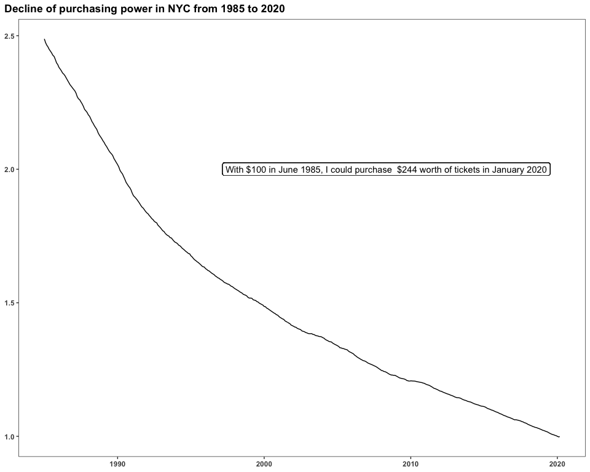
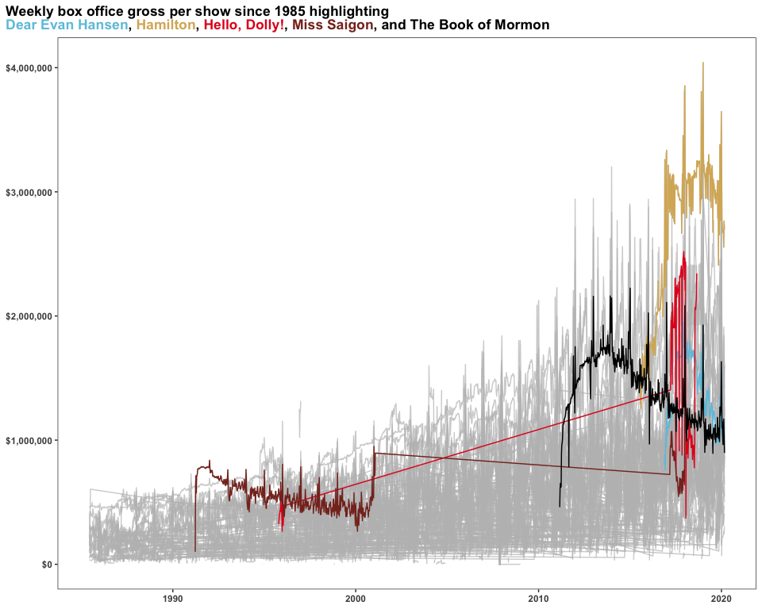
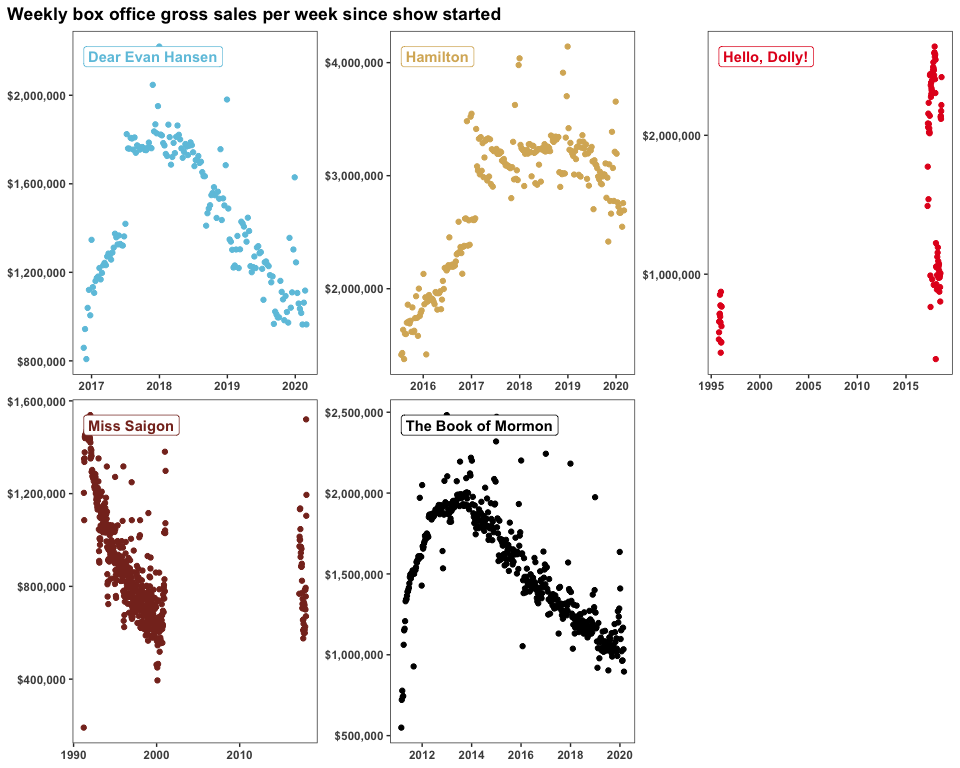
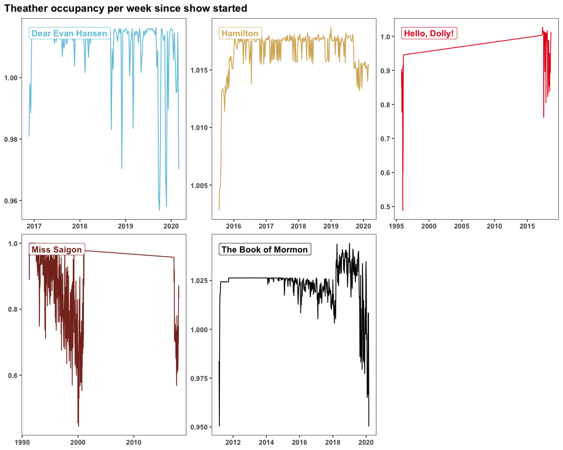
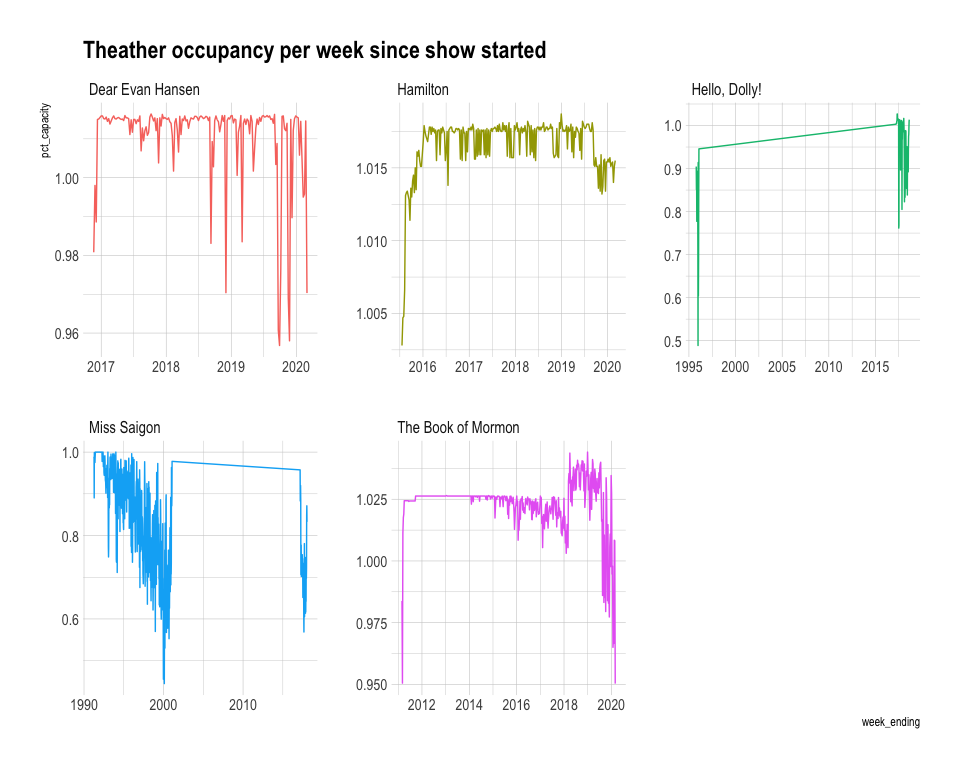

Tidy\_Tuesday\_2020\_05\_06
================

Tidy Tuesday: Broadway
======================

This week's objective is to visualize Broadway <a href="https://github.com/rfordatascience/tidytuesday/blob/master/data/2020/2020-04-28/readme.md" target="_blank">data</a>.

Watching Broadway shows is one of my hobbies! So the main objective of this exercise is to take a closer look at shows I've seen live:
\* Hamilton
\* Miss Saigon
\* Hello, Dolly!
\* Dear Evan Hansen
\* The Book of Mormon

Objectives:

1.  Get an idea on revenue changes across time
2.  Highlight particular shows in context to all other shows

For this week I'll use a new package: `gghighlight`, an extension to ggplot for, you guessed it, highlithing data.

First things first, looking at the <a href="https://www.alexcookson.com/post/most-successful-broadway-show-of-all-time/" target="_blank">blogpost</a> where this week's data came from, we can see that the monetary values are not adjusted for inflation. That's why we're provided with the cpi data. CPI stands for consumer price index. A **Consumer Price Index** measures changes in the price level of a weighted average market basket of consumer goods and services purchased by households. The CPI is a statistical estimate constructed using the prices of a sample of representative items whose prices are collected periodically (Source: <a href="https://en.wikipedia.org/wiki/Consumer_price_index" taget="_blank">Wikipedia</a>). Therefore, we'll <a href="https://en.wikipedia.org/wiki/Real_versus_nominal_value_(economics)" target="_blank">adjust</a> **nominal** value of dollars (i.e. not adjusted for inflation) to **real** dollars.

I'll use colors related to the <a href="https://www.playbill.com/article/the-evolution-of-the-playbill-design-from-18852018" target="_blank">playbill</a> of each show.

I will also be using the package `hrbrthemes` which provides typography-centric themes, and compare to another plot using my custom theme. More extensive discussion about fonts and the package can be found <a href="https://github.com/hrbrmstr/hrbrthemes" target="_blank">here</a>

Load libraries
--------------

``` r
library(tidyverse)
library(lubridate)
library(scales)
library(ggtext)
library(skimr)
library(gghighlight)
library(hrbrthemes)
```

Get Data
--------

``` r
grosses <- readr::read_csv('https://raw.githubusercontent.com/rfordatascience/tidytuesday/master/data/2020/2020-04-28/grosses.csv', guess_max = 40000)
synopses <- readr::read_csv('https://raw.githubusercontent.com/rfordatascience/tidytuesday/master/data/2020/2020-04-28/synopses.csv')
cpi <- readr::read_csv('https://raw.githubusercontent.com/rfordatascience/tidytuesday/master/data/2020/2020-04-28/cpi.csv')
```

Data Wrangling
--------------

``` r
#Inflation adjustemnt factor
cpi <- cpi %>%  
  mutate(jan_2020_dollars = cpi[year_month == "2020-01-01"] / cpi) %>%
  mutate(year = year(year_month)) %>%
  mutate(month = month(year_month)) 

#Join data
adjusted_grosses<- grosses %>%
  left_join(synopses) %>%
  mutate(year = year(week_ending)) %>%
  mutate(month = month(week_ending)) %>%
  left_join(cpi) %>%
  mutate(weekly_gross_adjusted = weekly_gross * jan_2020_dollars) %>%
  mutate(avg_ticket_price_adjusted = avg_ticket_price * jan_2020_dollars) %>%
  mutate(color=plyr::mapvalues(show, c("Dear Evan Hansen", "Hamilton", "Hello, Dolly!", "Miss Saigon", "The Book of Mormon"), c("#6dc4df","#d8b365", "#E42020", "#863024", "black" )))

col <- as.character(adjusted_grosses$color)
names(col) <- as.character(adjusted_grosses$show)

slected_adjusted_grosses<- adjusted_grosses %>% 
  filter(show %in% c("Hamilton", "Miss Saigon", "Hello, Dolly!", "Dear Evan Hansen", "The Book of Mormon"))

labels<- slected_adjusted_grosses %>%
  group_by(show, color) %>%
  summarise(x= min(week_ending), y = max(weekly_gross_adjusted), y2=max(pct_capacity))

col2 <- as.character(slected_adjusted_grosses$color)
names(col2) <- as.character(slected_adjusted_grosses$show)
```

Data structure
--------------

``` r
skim(adjusted_grosses)
```

|                                                  |                   |
|:-------------------------------------------------|:------------------|
| Name                                             | adjusted\_grosses |
| Number of rows                                   | 47524             |
| Number of columns                                | 23                |
| \_\_\_\_\_\_\_\_\_\_\_\_\_\_\_\_\_\_\_\_\_\_\_   |                   |
| Column type frequency:                           |                   |
| character                                        | 4                 |
| Date                                             | 2                 |
| numeric                                          | 17                |
| \_\_\_\_\_\_\_\_\_\_\_\_\_\_\_\_\_\_\_\_\_\_\_\_ |                   |
| Group variables                                  | None              |

**Variable type: character**

| skim\_variable |  n\_missing|  complete\_rate|  min|   max|  empty|  n\_unique|  whitespace|
|:---------------|-----------:|---------------:|----:|-----:|------:|----------:|-----------:|
| show           |           0|            1.00|    2|    87|      0|       1122|           0|
| theatre        |           0|            1.00|    9|    35|      0|         58|           0|
| synopsis       |       10167|            0.79|   26|  1273|      0|        934|           0|
| color          |           0|            1.00|    2|    87|      0|       1122|           0|

**Variable type: Date**

| skim\_variable |  n\_missing|  complete\_rate| min        | max        | median     |  n\_unique|
|:---------------|-----------:|---------------:|:-----------|:-----------|:-----------|----------:|
| week\_ending   |           0|               1| 1985-06-09 | 2020-03-01 | 2005-01-02 |       1812|
| year\_month    |           0|               1| 1985-06-01 | 2020-03-01 | 2005-01-01 |        418|

**Variable type: numeric**

| skim\_variable               |  n\_missing|  complete\_rate|         mean|          sd|         p0|         p25|          p50|          p75|         p100| hist  |
|:-----------------------------|-----------:|---------------:|------------:|-----------:|----------:|-----------:|------------:|------------:|------------:|:------|
| week\_number                 |           0|            1.00|        27.37|       15.31|        1.0|       14.00|        28.00|        41.00|        53.00| ▇▆▇▆▇ |
| weekly\_gross\_overall       |           0|            1.00|  16693026.41|  9520197.87|  2474396.0|  9093031.00|  15060671.00|  22897588.00|  57807272.33| ▇▆▃▁▁ |
| weekly\_gross                |           0|            1.00|    574486.77|   443346.99|        0.0|   262229.25|    470064.50|    758438.05|   4041493.00| ▇▂▁▁▁ |
| potential\_gross             |       12613|            0.73|    939598.20|   419323.33|     7754.0|   629523.00|    903150.00|   1190502.00|   3559306.00| ▅▇▂▁▁ |
| avg\_ticket\_price           |           0|            1.00|        67.91|       38.59|        0.0|       43.37|        60.23|        84.65|       511.58| ▇▁▁▁▁ |
| top\_ticket\_price           |       11357|            0.76|       189.68|      112.30|        4.0|       85.00|       200.00|       250.00|       998.00| ▇▆▁▁▁ |
| seats\_sold                  |           0|            1.00|      7893.45|     3186.02|        0.0|     5442.00|      7736.00|     10187.00|     24305.00| ▃▇▅▁▁ |
| seats\_in\_theatre           |           0|            1.00|      1237.79|      358.36|        0.0|     1021.00|      1181.00|      1509.00|      1969.00| ▁▂▇▆▅ |
| pct\_capacity                |           0|            1.00|         0.80|        0.18|        0.0|        0.69|         0.83|         0.95|         1.55| ▁▂▇▅▁ |
| performances                 |           0|            1.00|         7.24|        2.23|        0.0|        8.00|         8.00|         8.00|        17.00| ▁▁▇▁▁ |
| previews                     |           0|            1.00|         0.58|        1.93|        0.0|        0.00|         0.00|         0.00|        16.00| ▇▁▁▁▁ |
| year                         |           0|            1.00|      2003.89|        9.75|     1985.0|     1996.00|      2005.00|      2012.00|      2020.00| ▆▆▇▇▇ |
| month                        |           0|            1.00|         6.54|        3.46|        1.0|        4.00|         6.00|        10.00|        12.00| ▇▆▅▅▇ |
| cpi                          |           0|            1.00|       196.43|       42.22|      109.1|      166.80|       199.00|       230.66|       267.07| ▅▅▇▇▇ |
| jan\_2020\_dollars           |           0|            1.00|         1.43|        0.36|        1.0|        1.16|         1.34|         1.60|         2.44| ▇▅▂▁▁ |
| weekly\_gross\_adjusted      |           0|            1.00|    742684.27|   479806.13|        0.0|   387733.49|    659684.78|    991695.57|   4142380.32| ▇▃▁▁▁ |
| avg\_ticket\_price\_adjusted |           0|            1.00|        88.24|       35.87|        0.0|       68.37|        84.12|       100.78|       532.88| ▇▂▁▁▁ |

Visualizations
--------------

For the conversion of dollars, in order to adjust for inflation, we used the CPI value reccommeded by the original data scraper. The CPI measure used is: “All items less food and energy in U.S. city average, all urban consumers, seasonally adjusted”. The rationale behind it is that, this metric will be representative of the purchasing power of a New York City theatre-goer.

``` r
my_theme<- theme_bw() +
  theme(legend.position = "none",
        axis.title = element_blank(), 
        plot.title = element_markdown(face = "bold"),
        plot.title.position = "plot",
        axis.text = element_text(face="bold"),
        panel.grid.minor = element_blank(),
        panel.grid.major = element_blank())

ggplot(cpi, aes(year_month, jan_2020_dollars)) +
  geom_line() +
  labs(title= "Decline of purchasing power in NYC from 1985 to 2020") +
  my_theme +
  geom_label(x=14000, y=2, label= "With $100 in June 1985, I could purchase  $244 worth of tickets in January 2020")
```



``` r
ggplot(adjusted_grosses) +
  geom_line(aes(week_ending, weekly_gross, group=show, color=show)) +
  labs(title = "Weekly box office gross per show since 1985 highlighting <br><span style='color:#6dc4df;'>Dear Evan Hansen</span>,  <span style='color:#d8b365;'>Hamilton</span>, <span style='color:#E42020;'>Hello, Dolly!</span>, <span style='color:#863024;'>Miss Saigon</span>, and <span style='color:black;'>The Book of Mormon</span></br>") +
  scale_y_continuous(labels = scales::dollar) +
  gghighlight(show %in% c("Hamilton", "Miss Saigon", "Hello, Dolly!", "Dear Evan Hansen", "The Book of Mormon"),
              use_direct_label = FALSE) +
  scale_color_manual(values = col) +
  my_theme
```



``` r
ggplot() +
  geom_point(dat = slected_adjusted_grosses, aes(week_ending, weekly_gross_adjusted, color=show)) +
  facet_wrap(~show, scales = "free") +
  labs(title = "Weekly box office gross sales per week since show started") +
  scale_y_continuous(labels = scales::dollar)  +
  my_theme +
  theme(strip.background = element_blank(),
        strip.text = element_blank()) +
  geom_label(data= labels, aes(x,y, label=show), color= labels$color, fontface="bold",  vjust = "inward", hjust = "inward") +
  scale_color_manual(values = c("#6dc4df","#d8b365", "#E42020", "#863024", "black" ))
```



``` r
ggplot(slected_adjusted_grosses) +
  geom_line(aes(week_ending, pct_capacity, color=show)) +
  facet_wrap(~show, scales = "free") +
  labs(title = "Theather occupancy per week since show started")+
  my_theme +
  theme(strip.background = element_blank(),
        strip.text = element_blank()) +
  geom_label(data= labels, aes(x,y2, label=show), color= labels$color, fontface="bold",  vjust = "inward", hjust = "inward") +
  scale_color_manual(values = c("#6dc4df","#d8b365", "#E42020", "#863024", "black" ))
```



``` r
ggplot(slected_adjusted_grosses) +
  geom_line(aes(week_ending, pct_capacity, color=show)) +
  facet_wrap(~show, scales = "free") +
  labs(title = "Theather occupancy per week since show started") +
  theme_ipsum() +
  theme(legend.position = "none")
```


