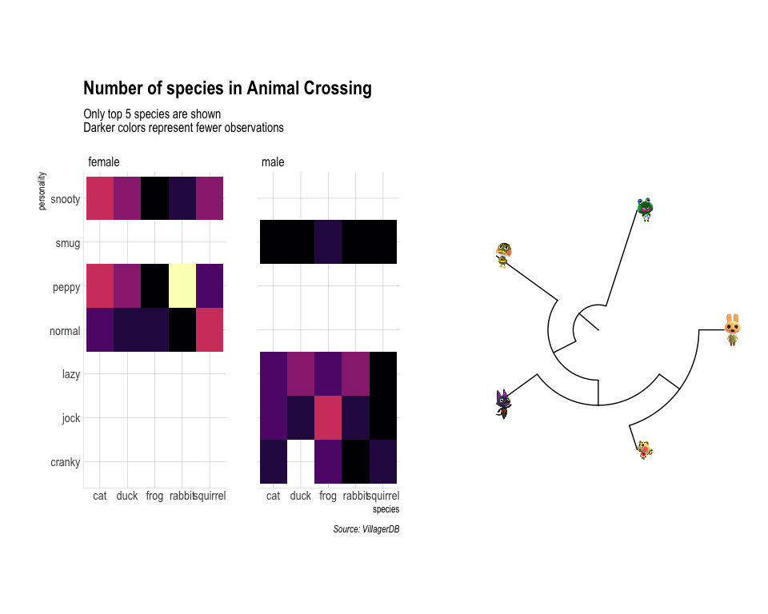

Tidy\_Tuesday\_2020\_05\_12
================

Tidy Tuesday: Animal Crossing
=============================

The objective this week is to visualize <a href="https://github.com/rfordatascience/tidytuesday/blob/master/data/2020/2020-05-05/readme.md" target="_blank">data</a> from Animal Crossing, a video game released by Nintendo. Particularly, I want to visualize the distribution of character personalities by different species/gender. Additionally, I will represent real evolutionary distances between top species with a phylogenetic tree with tips labeled as character of that particular species. The newick tree was generated using <a href="https://phylot.biobyte.de/index.cgi" target="_blank">phyloTree</a>.

Load libraries
--------------

``` r
library(tidyverse)
library(readxl)
library(ggimage)
library(ggtree)
library(ggtext)
library(gcookbook)
library(hrbrthemes)
library(extrafont)
library(patchwork)
library(gt)
```

Get Data
--------

``` r
items <- readr::read_csv('https://raw.githubusercontent.com/rfordatascience/tidytuesday/master/data/2020/2020-05-05/items.csv')
villagers <- readr::read_csv('https://raw.githubusercontent.com/rfordatascience/tidytuesday/master/data/2020/2020-05-05/villagers.csv')
mapping_species<- read_excel("species_mapping.xlsx", col_names = c("tip_label", "species"))
phyloT<- read.tree("phyloT.nwk")
```

Data Wrangling
--------------

``` r
#font_import()
#fonts()

villagers_species_gender_personality<- villagers %>%
  group_by(species, gender, personality) %>%
  tally %>%
  filter(!personality=="uchi")


top_5_species<- villagers %>% 
  group_by(species) %>% 
  tally %>% 
  arrange(desc(n)) %>% 
  top_n(5) %>%
  pull(species)

mapping_info<- villagers %>%
  filter(species %in% top_5_species) %>%
  filter(personality=="normal") %>%
  group_by(species) %>%
  filter(row_number()==1) %>%
  select(url) %>%
  left_join(mapping_species) %>%
  mutate(file_name= str_extract(url, "(?<=thumb/).+"))


tree_tip<- as.data.frame(phyloT$tip.label) 
colnames(tree_tip)<- "NCBI"
tree_tip<- tree_tip %>%
  mutate(name= plyr::mapvalues(NCBI, mapping_info$tip_label, mapping_info$file_name))

phyloT$tip.label<- as.character(tree_tip$name)
```

Visualizations
--------------

Table format

``` r
villagers_species_gender_personality %>%
  filter(species %in% top_5_species) %>% 
  ungroup() %>%
  pivot_wider(names_from = species, values_from = n, values_fill = list(n=0)) %>%
  group_by(gender) %>%
  gt(rowname_col = "personality") %>%
  tab_spanner(
    label = "Species",
    columns = vars(cat, duck, frog, rabbit, squirrel)
    ) 
```

<!--html_preserve-->
<style>html {
  font-family: -apple-system, BlinkMacSystemFont, 'Segoe UI', Roboto, Oxygen, Ubuntu, Cantarell, 'Helvetica Neue', 'Fira Sans', 'Droid Sans', Arial, sans-serif;
}

#szvdaddkwq .gt_table {
  display: table;
  border-collapse: collapse;
  margin-left: auto;
  margin-right: auto;
  color: #333333;
  font-size: 16px;
  background-color: #FFFFFF;
  width: auto;
  border-top-style: solid;
  border-top-width: 2px;
  border-top-color: #A8A8A8;
  border-right-style: none;
  border-right-width: 2px;
  border-right-color: #D3D3D3;
  border-bottom-style: solid;
  border-bottom-width: 2px;
  border-bottom-color: #A8A8A8;
  border-left-style: none;
  border-left-width: 2px;
  border-left-color: #D3D3D3;
}

#szvdaddkwq .gt_heading {
  background-color: #FFFFFF;
  text-align: center;
  border-bottom-color: #FFFFFF;
  border-left-style: none;
  border-left-width: 1px;
  border-left-color: #D3D3D3;
  border-right-style: none;
  border-right-width: 1px;
  border-right-color: #D3D3D3;
}

#szvdaddkwq .gt_title {
  color: #333333;
  font-size: 125%;
  font-weight: initial;
  padding-top: 4px;
  padding-bottom: 4px;
  border-bottom-color: #FFFFFF;
  border-bottom-width: 0;
}

#szvdaddkwq .gt_subtitle {
  color: #333333;
  font-size: 85%;
  font-weight: initial;
  padding-top: 0;
  padding-bottom: 4px;
  border-top-color: #FFFFFF;
  border-top-width: 0;
}

#szvdaddkwq .gt_bottom_border {
  border-bottom-style: solid;
  border-bottom-width: 2px;
  border-bottom-color: #D3D3D3;
}

#szvdaddkwq .gt_col_headings {
  border-top-style: solid;
  border-top-width: 2px;
  border-top-color: #D3D3D3;
  border-bottom-style: solid;
  border-bottom-width: 2px;
  border-bottom-color: #D3D3D3;
  border-left-style: none;
  border-left-width: 1px;
  border-left-color: #D3D3D3;
  border-right-style: none;
  border-right-width: 1px;
  border-right-color: #D3D3D3;
}

#szvdaddkwq .gt_col_heading {
  color: #333333;
  background-color: #FFFFFF;
  font-size: 100%;
  font-weight: normal;
  text-transform: inherit;
  border-left-style: none;
  border-left-width: 1px;
  border-left-color: #D3D3D3;
  border-right-style: none;
  border-right-width: 1px;
  border-right-color: #D3D3D3;
  vertical-align: bottom;
  padding-top: 5px;
  padding-bottom: 6px;
  padding-left: 5px;
  padding-right: 5px;
  overflow-x: hidden;
}

#szvdaddkwq .gt_column_spanner_outer {
  color: #333333;
  background-color: #FFFFFF;
  font-size: 100%;
  font-weight: normal;
  text-transform: inherit;
  padding-top: 0;
  padding-bottom: 0;
  padding-left: 4px;
  padding-right: 4px;
}

#szvdaddkwq .gt_column_spanner_outer:first-child {
  padding-left: 0;
}

#szvdaddkwq .gt_column_spanner_outer:last-child {
  padding-right: 0;
}

#szvdaddkwq .gt_column_spanner {
  border-bottom-style: solid;
  border-bottom-width: 2px;
  border-bottom-color: #D3D3D3;
  vertical-align: bottom;
  padding-top: 5px;
  padding-bottom: 6px;
  overflow-x: hidden;
  display: inline-block;
  width: 100%;
}

#szvdaddkwq .gt_group_heading {
  padding: 8px;
  color: #333333;
  background-color: #FFFFFF;
  font-size: 100%;
  font-weight: initial;
  text-transform: inherit;
  border-top-style: solid;
  border-top-width: 2px;
  border-top-color: #D3D3D3;
  border-bottom-style: solid;
  border-bottom-width: 2px;
  border-bottom-color: #D3D3D3;
  border-left-style: none;
  border-left-width: 1px;
  border-left-color: #D3D3D3;
  border-right-style: none;
  border-right-width: 1px;
  border-right-color: #D3D3D3;
  vertical-align: middle;
}

#szvdaddkwq .gt_empty_group_heading {
  padding: 0.5px;
  color: #333333;
  background-color: #FFFFFF;
  font-size: 100%;
  font-weight: initial;
  border-top-style: solid;
  border-top-width: 2px;
  border-top-color: #D3D3D3;
  border-bottom-style: solid;
  border-bottom-width: 2px;
  border-bottom-color: #D3D3D3;
  vertical-align: middle;
}

#szvdaddkwq .gt_striped {
  background-color: rgba(128, 128, 128, 0.05);
}

#szvdaddkwq .gt_from_md > :first-child {
  margin-top: 0;
}

#szvdaddkwq .gt_from_md > :last-child {
  margin-bottom: 0;
}

#szvdaddkwq .gt_row {
  padding-top: 8px;
  padding-bottom: 8px;
  padding-left: 5px;
  padding-right: 5px;
  margin: 10px;
  border-top-style: solid;
  border-top-width: 1px;
  border-top-color: #D3D3D3;
  border-left-style: none;
  border-left-width: 1px;
  border-left-color: #D3D3D3;
  border-right-style: none;
  border-right-width: 1px;
  border-right-color: #D3D3D3;
  vertical-align: middle;
  overflow-x: hidden;
}

#szvdaddkwq .gt_stub {
  color: #333333;
  background-color: #FFFFFF;
  font-size: 100%;
  font-weight: initial;
  text-transform: inherit;
  border-right-style: solid;
  border-right-width: 2px;
  border-right-color: #D3D3D3;
  padding-left: 12px;
}

#szvdaddkwq .gt_summary_row {
  color: #333333;
  background-color: #FFFFFF;
  text-transform: inherit;
  padding-top: 8px;
  padding-bottom: 8px;
  padding-left: 5px;
  padding-right: 5px;
}

#szvdaddkwq .gt_first_summary_row {
  padding-top: 8px;
  padding-bottom: 8px;
  padding-left: 5px;
  padding-right: 5px;
  border-top-style: solid;
  border-top-width: 2px;
  border-top-color: #D3D3D3;
}

#szvdaddkwq .gt_grand_summary_row {
  color: #333333;
  background-color: #FFFFFF;
  text-transform: inherit;
  padding-top: 8px;
  padding-bottom: 8px;
  padding-left: 5px;
  padding-right: 5px;
}

#szvdaddkwq .gt_first_grand_summary_row {
  padding-top: 8px;
  padding-bottom: 8px;
  padding-left: 5px;
  padding-right: 5px;
  border-top-style: double;
  border-top-width: 6px;
  border-top-color: #D3D3D3;
}

#szvdaddkwq .gt_table_body {
  border-top-style: solid;
  border-top-width: 2px;
  border-top-color: #D3D3D3;
  border-bottom-style: solid;
  border-bottom-width: 2px;
  border-bottom-color: #D3D3D3;
}

#szvdaddkwq .gt_footnotes {
  color: #333333;
  background-color: #FFFFFF;
  border-bottom-style: none;
  border-bottom-width: 2px;
  border-bottom-color: #D3D3D3;
  border-left-style: none;
  border-left-width: 2px;
  border-left-color: #D3D3D3;
  border-right-style: none;
  border-right-width: 2px;
  border-right-color: #D3D3D3;
}

#szvdaddkwq .gt_footnote {
  margin: 0px;
  font-size: 90%;
  padding: 4px;
}

#szvdaddkwq .gt_sourcenotes {
  color: #333333;
  background-color: #FFFFFF;
  border-bottom-style: none;
  border-bottom-width: 2px;
  border-bottom-color: #D3D3D3;
  border-left-style: none;
  border-left-width: 2px;
  border-left-color: #D3D3D3;
  border-right-style: none;
  border-right-width: 2px;
  border-right-color: #D3D3D3;
}

#szvdaddkwq .gt_sourcenote {
  font-size: 90%;
  padding: 4px;
}

#szvdaddkwq .gt_left {
  text-align: left;
}

#szvdaddkwq .gt_center {
  text-align: center;
}

#szvdaddkwq .gt_right {
  text-align: right;
  font-variant-numeric: tabular-nums;
}

#szvdaddkwq .gt_font_normal {
  font-weight: normal;
}

#szvdaddkwq .gt_font_bold {
  font-weight: bold;
}

#szvdaddkwq .gt_font_italic {
  font-style: italic;
}

#szvdaddkwq .gt_super {
  font-size: 65%;
}

#szvdaddkwq .gt_footnote_marks {
  font-style: italic;
  font-size: 65%;
}
</style>
<table class="gt_table">
<thead class="gt_col_headings">
    <tr>
      <th class="gt_col_heading gt_columns_bottom_border gt_left" rowspan="2" colspan="1"></th>
      <th class="gt_center gt_columns_top_border gt_column_spanner_outer" rowspan="1" colspan="5">
        <span class="gt_column_spanner">Species</span>
      </th>
    </tr>
    <tr>
      <th class="gt_col_heading gt_columns_bottom_border gt_center" rowspan="1" colspan="1">cat</th>
      <th class="gt_col_heading gt_columns_bottom_border gt_center" rowspan="1" colspan="1">duck</th>
      <th class="gt_col_heading gt_columns_bottom_border gt_center" rowspan="1" colspan="1">frog</th>
      <th class="gt_col_heading gt_columns_bottom_border gt_center" rowspan="1" colspan="1">rabbit</th>
      <th class="gt_col_heading gt_columns_bottom_border gt_center" rowspan="1" colspan="1">squirrel</th>
    </tr>

</thead>
<tbody class="gt_table_body">
    <tr class="gt_group_heading_row">
      <td colspan="6" class="gt_group_heading">female</td>
    </tr>
    <tr>
      <td class="gt_row gt_left gt_stub">normal</td>
      <td class="gt_row gt_center">3</td>
      <td class="gt_row gt_center">2</td>
      <td class="gt_row gt_center">2</td>
      <td class="gt_row gt_center">1</td>
      <td class="gt_row gt_center">5</td>
    </tr>
    <tr>
      <td class="gt_row gt_left gt_stub">peppy</td>
      <td class="gt_row gt_center">5</td>
      <td class="gt_row gt_center">4</td>
      <td class="gt_row gt_center">1</td>
      <td class="gt_row gt_center">8</td>
      <td class="gt_row gt_center">3</td>
    </tr>
    <tr>
      <td class="gt_row gt_left gt_stub">snooty</td>
      <td class="gt_row gt_center">5</td>
      <td class="gt_row gt_center">4</td>
      <td class="gt_row gt_center">1</td>
      <td class="gt_row gt_center">2</td>
      <td class="gt_row gt_center">4</td>
    </tr>
    <tr class="gt_group_heading_row">
      <td colspan="6" class="gt_group_heading">male</td>
    </tr>
    <tr>
      <td class="gt_row gt_left gt_stub">cranky</td>
      <td class="gt_row gt_center">2</td>
      <td class="gt_row gt_center">0</td>
      <td class="gt_row gt_center">3</td>
      <td class="gt_row gt_center">1</td>
      <td class="gt_row gt_center">2</td>
    </tr>
    <tr>
      <td class="gt_row gt_left gt_stub">jock</td>
      <td class="gt_row gt_center">3</td>
      <td class="gt_row gt_center">2</td>
      <td class="gt_row gt_center">5</td>
      <td class="gt_row gt_center">2</td>
      <td class="gt_row gt_center">1</td>
    </tr>
    <tr>
      <td class="gt_row gt_left gt_stub">lazy</td>
      <td class="gt_row gt_center">3</td>
      <td class="gt_row gt_center">4</td>
      <td class="gt_row gt_center">3</td>
      <td class="gt_row gt_center">4</td>
      <td class="gt_row gt_center">1</td>
    </tr>
    <tr>
      <td class="gt_row gt_left gt_stub">smug</td>
      <td class="gt_row gt_center">1</td>
      <td class="gt_row gt_center">1</td>
      <td class="gt_row gt_center">2</td>
      <td class="gt_row gt_center">1</td>
      <td class="gt_row gt_center">1</td>
    </tr>

</tbody>
</table>

<!--/html_preserve-->
Heatmap and phylogenetic tree. The character images were chosen quasi randomly.

``` r
hm<- ggplot(villagers_species_gender_personality %>% filter(species %in% top_5_species) , aes(species, personality)) +
  geom_tile(aes(fill=n)) +
  facet_grid(~gender, scale="free") +
  scale_fill_viridis_c(option = "magma") +
  theme_ipsum(grid="XY", axis="xy") +
  theme(legend.position = "none") +
   labs(
    title="Number of species in Animal Crossing",
    subtitle="Only top 5 species are shown \nDarker colors represent fewer observations",
    caption="Source: VillagerDB"
  ) 

pT<- ggtree(phyloT, layout="circular") + 
  geom_tiplab(aes(image=paste0("images/", label)), 
                geom="image")

hm + pT
```


