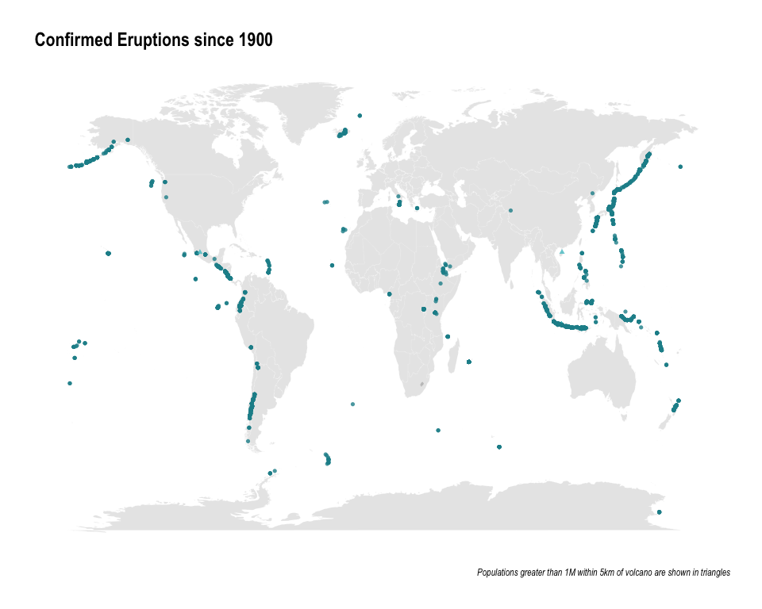

Tidy\_Tuesday\_2020\_05\_19
================

Tidy Tuesday: Volcanoes
=======================

This week's objective was to visualize <a href="https://cran.r-project.org/web/packages/ggvoronoi/vignettes/ggvoronoi.html" target="_blank">volvano data</a>.

Load libraries
--------------

``` r
library(tidyverse)
library(ggtext)
library(hrbrthemes)
library(patchwork)
library(gt)
library(paletteer)
```

Get Data
--------

``` r
volcano <- readr::read_csv('https://raw.githubusercontent.com/rfordatascience/tidytuesday/master/data/2020/2020-05-12/volcano.csv')
eruptions <- readr::read_csv('https://raw.githubusercontent.com/rfordatascience/tidytuesday/master/data/2020/2020-05-12/eruptions.csv')
events <- readr::read_csv('https://raw.githubusercontent.com/rfordatascience/tidytuesday/master/data/2020/2020-05-12/events.csv')
tree_rings <- readr::read_csv('https://raw.githubusercontent.com/rfordatascience/tidytuesday/master/data/2020/2020-05-12/tree_rings.csv')
sulfur <- readr::read_csv('https://raw.githubusercontent.com/rfordatascience/tidytuesday/master/data/2020/2020-05-12/sulfur.csv')
```

Data Wrangling
--------------

``` r
eruptions_df<- eruptions %>%
  filter(eruption_category=="Confirmed Eruption") %>%
  filter(start_year>= 1900) %>%
  left_join(volcano) %>%
  group_by(volcano_name, longitude, latitude, start_year, population_within_5_km) %>%
  tally() %>%
  mutate(last_century= ifelse(start_year>=1920, "YES", "NO")) %>%
  mutate(g1M= ifelse(population_within_5_km>=1000000, "YES", "NO")) %>%
  filter(!is.na(g1M))

world <- map_data("world")

levels(as.factor(eruptions_df$population_within_5_km))
```

    ##   [1] "0"       "1"       "2"       "3"       "5"       "6"       "7"      
    ##   [8] "9"       "10"      "11"      "12"      "14"      "17"      "18"     
    ##  [15] "21"      "27"      "39"      "43"      "45"      "51"      "53"     
    ##  [22] "56"      "58"      "68"      "70"      "73"      "74"      "76"     
    ##  [29] "78"      "79"      "80"      "81"      "86"      "88"      "91"     
    ##  [36] "96"      "98"      "100"     "107"     "116"     "118"     "124"    
    ##  [43] "127"     "128"     "129"     "130"     "131"     "137"     "152"    
    ##  [50] "156"     "158"     "166"     "172"     "173"     "176"     "182"    
    ##  [57] "186"     "189"     "191"     "194"     "198"     "203"     "204"    
    ##  [64] "208"     "210"     "213"     "220"     "226"     "231"     "251"    
    ##  [71] "268"     "271"     "278"     "279"     "290"     "304"     "325"    
    ##  [78] "328"     "376"     "384"     "408"     "428"     "439"     "442"    
    ##  [85] "446"     "449"     "477"     "484"     "489"     "513"     "583"    
    ##  [92] "612"     "632"     "633"     "639"     "647"     "705"     "706"    
    ##  [99] "725"     "746"     "856"     "915"     "968"     "977"     "995"    
    ## [106] "997"     "1079"    "1098"    "1106"    "1179"    "1253"    "1283"   
    ## [113] "1342"    "1367"    "1373"    "1405"    "1465"    "1490"    "1491"   
    ## [120] "1514"    "1544"    "1556"    "1560"    "1575"    "1593"    "1660"   
    ## [127] "1662"    "1667"    "1685"    "1690"    "1818"    "1848"    "1891"   
    ## [134] "1947"    "1978"    "2062"    "2225"    "2381"    "2416"    "2500"   
    ## [141] "2584"    "2685"    "2686"    "2789"    "2836"    "2895"    "2928"   
    ## [148] "3006"    "3032"    "3122"    "3311"    "3354"    "3429"    "3751"   
    ## [155] "3759"    "3849"    "3916"    "4156"    "4250"    "4329"    "4485"   
    ## [162] "4601"    "4612"    "4724"    "4781"    "4840"    "4918"    "5176"   
    ## [169] "5657"    "5682"    "5723"    "5886"    "5966"    "6835"    "6979"   
    ## [176] "7177"    "7243"    "8675"    "8839"    "9155"    "9164"    "10289"  
    ## [183] "10837"   "11514"   "12173"   "12183"   "14072"   "14140"   "17165"  
    ## [190] "18618"   "18686"   "19162"   "20321"   "24509"   "27826"   "29514"  
    ## [197] "30359"   "49205"   "52462"   "55859"   "75559"   "100608"  "103429" 
    ## [204] "130474"  "225379"  "466899"  "717090"  "791276"  "989888"  "1092929"
    ## [211] "1731229" "5783287"

``` r
check_palettes<- palettes_d_names
```

Visualizations
--------------

``` r
ggplot() +
  geom_map(
    data = world, 
    map = world,
    aes(x=long, y=lat, map_id = region),
    color = "white", 
    fill = "gray50", 
    size = 0.05, 
    alpha = 0.2
  ) +
  geom_point(
    data = eruptions_df,
    aes(longitude, latitude, color= g1M, shape= g1M),
    alpha = 0.8
  ) +
  labs(x = NULL, y = NULL) +
  labs(title = "Confirmed Eruptions since 1900", 
       caption = "Populations greater than 1M within 5km of volcano are shown in triangles" ) +
  hrbrthemes::theme_ipsum(axis = FALSE,
                          axis_title_just = "l",
                          grid = FALSE, 
                          axis_text_size = 0) +
  theme(axis.text = element_blank(),
        axis.ticks = element_blank(),
        legend.position = "none") +
  paletteer::scale_color_paletteer_d(palette = "dichromat::BluetoDarkOrange.12") 
```


