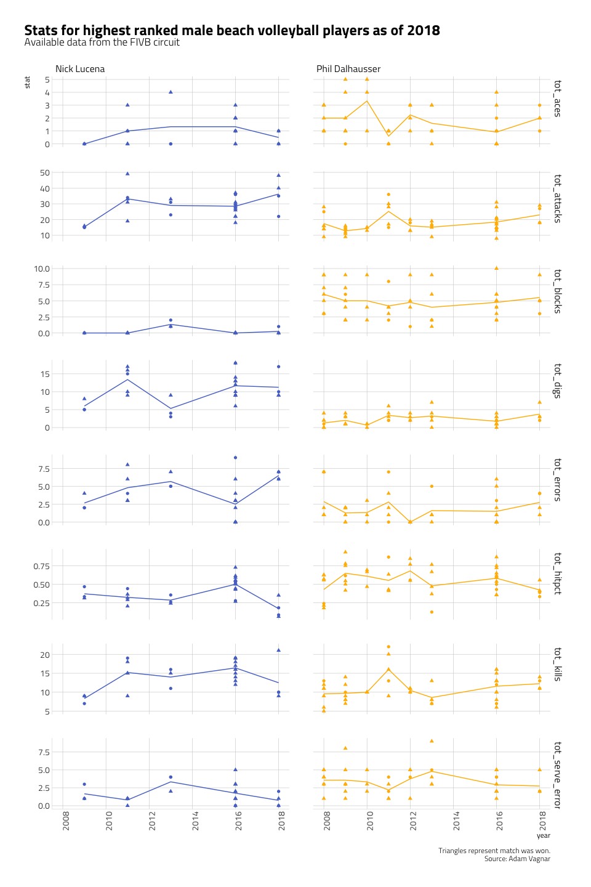

Tidy\_Tuesday\_2020\_05\_26
================

Tidy Tuesday: Beach volleyball
==============================

The objective for this week is to visualize beach <a href="https://github.com/rfordatascience/tidytuesday/blob/master/data/2020/2020-05-19/readme.md" target="_blank">volleyball data</a>. Since the given dataset is quite extensive, I will focus the efforts on looking at the trajectory of the best ranked male and female players according to this <a href="https://en.wikipedia.org/wiki/FIVB_Beach_Volleyball_World_Rankings" target="_blank">wikipedia entry</a>. Top male players as of 2018 are: Phil Dalhausser & Nick Lucena, and top female players as of 2018 are: Melissa Humana-Paredes & Sarah Pavan.

The stats include:
\* tot\_aces: point ending serves
\* tot\_attacks: number of attacks (attacking swings over the net)
\* tot\_blocks: point ending blocks
\* tot\_digs: successful defense of an attack
\* tot\_errors: mistakes
\* tot\_hipct: hitting percentage; effectiveness at scoring
\* tot\_kills:number of kills (point ending attacks)
\* tot\_serve\_errors: mistakes made on serve

Load libraries
--------------

``` r
library(tidyverse)
library(hrbrthemes)
library(ggtext)
library(gt)
library(scales)
library(paletteer)
```

Get Data
--------

``` r
vb_matches <- readr::read_csv('https://raw.githubusercontent.com/rfordatascience/tidytuesday/master/data/2020/2020-05-19/vb_matches.csv', guess_max = 76000)
```

Data Wrangling
--------------

``` r
filtered_vb_matches<- vb_matches %>%
  filter(circuit == "FIVB") %>%
  filter(w_player1 %in% c("Melissa Humana-Paredes", "Sarah Pavan", "Phil Dalhausser",  "Nick Lucena") | 
           w_player2 %in% c("Melissa Humana-Paredes", "Sarah Pavan", "Phil Dalhausser",  "Nick Lucena") | 
           l_player1 %in% c("Melissa Humana-Paredes", "Sarah Pavan", "Phil Dalhausser",  "Nick Lucena")| 
           l_player2 %in% c("Melissa Humana-Paredes", "Sarah Pavan", "Phil Dalhausser",  "Nick Lucena")) %>%
  select(-circuit,
         -tournament, 
         -country,
         -w_p1_age,
         -w_p2_age,
         -l_p1_age,
         -l_p2_age, 
         -w_rank, 
         -l_rank
)

winner_stats<- filtered_vb_matches %>%
  select(year, date, gender, match_num, starts_with("w_")) %>%
  filter(w_player1 %in% c("Melissa Humana-Paredes", "Sarah Pavan", "Phil Dalhausser",  "Nick Lucena") | 
           w_player2 %in% c("Melissa Humana-Paredes", "Sarah Pavan", "Phil Dalhausser",  "Nick Lucena")) %>%
  filter(!is.na(w_p1_tot_attacks))

loser_stats<- filtered_vb_matches %>%
  select(year, date, gender, match_num, starts_with("l_")) %>%
  filter(l_player1 %in% c("Melissa Humana-Paredes", "Sarah Pavan", "Phil Dalhausser",  "Nick Lucena")| 
           l_player2 %in% c("Melissa Humana-Paredes", "Sarah Pavan", "Phil Dalhausser",  "Nick Lucena")) %>%
  filter(!is.na(l_p1_tot_attacks))

w_p1<- winner_stats %>%
  select(-w_p1_hgt, -w_p2_hgt, -match_num, -w_p1_country, -w_p1_birthdate, -w_player2, -starts_with("w_p2_")) %>%
  pivot_longer(cols = starts_with("w_p1_"),
               names_to = "stat_type", 
               values_to = "stat",
               values_drop_na = TRUE, 
               names_ptypes = list(val = 'character'),
               values_ptypes = list(val = 'character')) %>%
  filter(w_player1 %in% c("Melissa Humana-Paredes", "Sarah Pavan", "Phil Dalhausser",  "Nick Lucena")) %>%
  rename(player= "w_player1") %>%
  mutate(outcome="win")


w_p2<- winner_stats %>%
  select(-w_p1_hgt, -w_p2_hgt, -match_num, -w_p2_country, -w_p2_birthdate, -w_player1, -starts_with("w_p1_")) %>%
  pivot_longer(cols = starts_with("w_p2_"),
               names_to = "stat_type", 
               values_to = "stat",
               values_drop_na = TRUE, 
               names_ptypes = list(val = 'character'),
               values_ptypes = list(val = 'character')) %>%
  filter(w_player2 %in% c("Melissa Humana-Paredes", "Sarah Pavan", "Phil Dalhausser",  "Nick Lucena")) %>%
  rename(player= "w_player2") %>%
  mutate(outcome="win")


l_p1<- loser_stats %>%
  select(-l_p1_hgt, -l_p2_hgt, -match_num, -l_p1_country, -l_p1_birthdate, -l_player2, -starts_with("l_p2_")) %>%
  pivot_longer(cols = starts_with("l_p1_"),
               names_to = "stat_type", 
               values_to = "stat",
               values_drop_na = TRUE, 
               names_ptypes = list(val = 'character'),
               values_ptypes = list(val = 'character')) %>%
  filter(l_player1 %in% c("Melissa Humana-Paredes", "Sarah Pavan", "Phil Dalhausser",  "Nick Lucena")) %>%
  rename(player= "l_player1") %>%
  mutate(outcome="loose")


l_p2<- loser_stats %>%
  select(-l_p1_hgt, -l_p2_hgt, -match_num, -l_p2_country, -l_p2_birthdate, -l_player1, -starts_with("l_p1_")) %>%
  pivot_longer(cols = starts_with("l_p2_"),
               names_to = "stat_type", 
               values_to = "stat",
               values_drop_na = TRUE, 
               names_ptypes = list(val = 'character'),
               values_ptypes = list(val = 'character')) %>%
  filter(l_player2 %in% c("Melissa Humana-Paredes", "Sarah Pavan", "Phil Dalhausser",  "Nick Lucena")) %>%
  rename(player= "l_player2") %>%
  mutate(outcome="loose")


all_stats<- bind_rows(w_p1, w_p2, l_p1, l_p2) %>%
  mutate(stat_type= str_remove(stat_type, "w_p1_")) %>%
  mutate(stat_type= str_remove(stat_type, "w_p2_")) %>%
  mutate(stat_type= str_remove(stat_type, "l_p1_")) %>%
  mutate(stat_type= str_remove(stat_type, "l_p2_")) %>%
  mutate(year= as.integer(year))


mean_stat<- all_stats %>%
  group_by(year, player, stat_type, gender) %>%
  summarise(mean_stat=mean(stat))
  
check_palettes<- palettes_d_names
```

Visualizations
--------------

``` r
all_stats %>%
  select(date, player, outcome) %>%
  group_by(player, outcome) %>%
  summarise(counts= n()) %>%
  left_join(filtered_vb_matches[,c("w_player1", "w_p1_birthdate")], by= c("player" = "w_player1")) %>%
  distinct() %>%
  left_join(filtered_vb_matches[,c("w_player2", "w_p2_birthdate")], by= c("player" = "w_player2")) %>%
  distinct() %>%
  mutate(w_p1_birthdate= ifelse(is.na(w_p1_birthdate), w_p2_birthdate, w_p1_birthdate)) %>%
  mutate(w_p1_birthdate= lubridate::as_date(w_p1_birthdate)) %>%
  select(-w_p2_birthdate) %>%
  rename(birthdate="w_p1_birthdate") %>%
  gt()
```

<!--html_preserve-->
<style>html {
  font-family: -apple-system, BlinkMacSystemFont, 'Segoe UI', Roboto, Oxygen, Ubuntu, Cantarell, 'Helvetica Neue', 'Fira Sans', 'Droid Sans', Arial, sans-serif;
}

#cqqaflhsbj .gt_table {
  display: table;
  border-collapse: collapse;
  margin-left: auto;
  margin-right: auto;
  color: #333333;
  font-size: 16px;
  background-color: #FFFFFF;
  width: auto;
  border-top-style: solid;
  border-top-width: 2px;
  border-top-color: #A8A8A8;
  border-right-style: none;
  border-right-width: 2px;
  border-right-color: #D3D3D3;
  border-bottom-style: solid;
  border-bottom-width: 2px;
  border-bottom-color: #A8A8A8;
  border-left-style: none;
  border-left-width: 2px;
  border-left-color: #D3D3D3;
}

#cqqaflhsbj .gt_heading {
  background-color: #FFFFFF;
  text-align: center;
  border-bottom-color: #FFFFFF;
  border-left-style: none;
  border-left-width: 1px;
  border-left-color: #D3D3D3;
  border-right-style: none;
  border-right-width: 1px;
  border-right-color: #D3D3D3;
}

#cqqaflhsbj .gt_title {
  color: #333333;
  font-size: 125%;
  font-weight: initial;
  padding-top: 4px;
  padding-bottom: 4px;
  border-bottom-color: #FFFFFF;
  border-bottom-width: 0;
}

#cqqaflhsbj .gt_subtitle {
  color: #333333;
  font-size: 85%;
  font-weight: initial;
  padding-top: 0;
  padding-bottom: 4px;
  border-top-color: #FFFFFF;
  border-top-width: 0;
}

#cqqaflhsbj .gt_bottom_border {
  border-bottom-style: solid;
  border-bottom-width: 2px;
  border-bottom-color: #D3D3D3;
}

#cqqaflhsbj .gt_col_headings {
  border-top-style: solid;
  border-top-width: 2px;
  border-top-color: #D3D3D3;
  border-bottom-style: solid;
  border-bottom-width: 2px;
  border-bottom-color: #D3D3D3;
  border-left-style: none;
  border-left-width: 1px;
  border-left-color: #D3D3D3;
  border-right-style: none;
  border-right-width: 1px;
  border-right-color: #D3D3D3;
}

#cqqaflhsbj .gt_col_heading {
  color: #333333;
  background-color: #FFFFFF;
  font-size: 100%;
  font-weight: normal;
  text-transform: inherit;
  border-left-style: none;
  border-left-width: 1px;
  border-left-color: #D3D3D3;
  border-right-style: none;
  border-right-width: 1px;
  border-right-color: #D3D3D3;
  vertical-align: bottom;
  padding-top: 5px;
  padding-bottom: 6px;
  padding-left: 5px;
  padding-right: 5px;
  overflow-x: hidden;
}

#cqqaflhsbj .gt_column_spanner_outer {
  color: #333333;
  background-color: #FFFFFF;
  font-size: 100%;
  font-weight: normal;
  text-transform: inherit;
  padding-top: 0;
  padding-bottom: 0;
  padding-left: 4px;
  padding-right: 4px;
}

#cqqaflhsbj .gt_column_spanner_outer:first-child {
  padding-left: 0;
}

#cqqaflhsbj .gt_column_spanner_outer:last-child {
  padding-right: 0;
}

#cqqaflhsbj .gt_column_spanner {
  border-bottom-style: solid;
  border-bottom-width: 2px;
  border-bottom-color: #D3D3D3;
  vertical-align: bottom;
  padding-top: 5px;
  padding-bottom: 6px;
  overflow-x: hidden;
  display: inline-block;
  width: 100%;
}

#cqqaflhsbj .gt_group_heading {
  padding: 8px;
  color: #333333;
  background-color: #FFFFFF;
  font-size: 100%;
  font-weight: initial;
  text-transform: inherit;
  border-top-style: solid;
  border-top-width: 2px;
  border-top-color: #D3D3D3;
  border-bottom-style: solid;
  border-bottom-width: 2px;
  border-bottom-color: #D3D3D3;
  border-left-style: none;
  border-left-width: 1px;
  border-left-color: #D3D3D3;
  border-right-style: none;
  border-right-width: 1px;
  border-right-color: #D3D3D3;
  vertical-align: middle;
}

#cqqaflhsbj .gt_empty_group_heading {
  padding: 0.5px;
  color: #333333;
  background-color: #FFFFFF;
  font-size: 100%;
  font-weight: initial;
  border-top-style: solid;
  border-top-width: 2px;
  border-top-color: #D3D3D3;
  border-bottom-style: solid;
  border-bottom-width: 2px;
  border-bottom-color: #D3D3D3;
  vertical-align: middle;
}

#cqqaflhsbj .gt_striped {
  background-color: rgba(128, 128, 128, 0.05);
}

#cqqaflhsbj .gt_from_md > :first-child {
  margin-top: 0;
}

#cqqaflhsbj .gt_from_md > :last-child {
  margin-bottom: 0;
}

#cqqaflhsbj .gt_row {
  padding-top: 8px;
  padding-bottom: 8px;
  padding-left: 5px;
  padding-right: 5px;
  margin: 10px;
  border-top-style: solid;
  border-top-width: 1px;
  border-top-color: #D3D3D3;
  border-left-style: none;
  border-left-width: 1px;
  border-left-color: #D3D3D3;
  border-right-style: none;
  border-right-width: 1px;
  border-right-color: #D3D3D3;
  vertical-align: middle;
  overflow-x: hidden;
}

#cqqaflhsbj .gt_stub {
  color: #333333;
  background-color: #FFFFFF;
  font-size: 100%;
  font-weight: initial;
  text-transform: inherit;
  border-right-style: solid;
  border-right-width: 2px;
  border-right-color: #D3D3D3;
  padding-left: 12px;
}

#cqqaflhsbj .gt_summary_row {
  color: #333333;
  background-color: #FFFFFF;
  text-transform: inherit;
  padding-top: 8px;
  padding-bottom: 8px;
  padding-left: 5px;
  padding-right: 5px;
}

#cqqaflhsbj .gt_first_summary_row {
  padding-top: 8px;
  padding-bottom: 8px;
  padding-left: 5px;
  padding-right: 5px;
  border-top-style: solid;
  border-top-width: 2px;
  border-top-color: #D3D3D3;
}

#cqqaflhsbj .gt_grand_summary_row {
  color: #333333;
  background-color: #FFFFFF;
  text-transform: inherit;
  padding-top: 8px;
  padding-bottom: 8px;
  padding-left: 5px;
  padding-right: 5px;
}

#cqqaflhsbj .gt_first_grand_summary_row {
  padding-top: 8px;
  padding-bottom: 8px;
  padding-left: 5px;
  padding-right: 5px;
  border-top-style: double;
  border-top-width: 6px;
  border-top-color: #D3D3D3;
}

#cqqaflhsbj .gt_table_body {
  border-top-style: solid;
  border-top-width: 2px;
  border-top-color: #D3D3D3;
  border-bottom-style: solid;
  border-bottom-width: 2px;
  border-bottom-color: #D3D3D3;
}

#cqqaflhsbj .gt_footnotes {
  color: #333333;
  background-color: #FFFFFF;
  border-bottom-style: none;
  border-bottom-width: 2px;
  border-bottom-color: #D3D3D3;
  border-left-style: none;
  border-left-width: 2px;
  border-left-color: #D3D3D3;
  border-right-style: none;
  border-right-width: 2px;
  border-right-color: #D3D3D3;
}

#cqqaflhsbj .gt_footnote {
  margin: 0px;
  font-size: 90%;
  padding: 4px;
}

#cqqaflhsbj .gt_sourcenotes {
  color: #333333;
  background-color: #FFFFFF;
  border-bottom-style: none;
  border-bottom-width: 2px;
  border-bottom-color: #D3D3D3;
  border-left-style: none;
  border-left-width: 2px;
  border-left-color: #D3D3D3;
  border-right-style: none;
  border-right-width: 2px;
  border-right-color: #D3D3D3;
}

#cqqaflhsbj .gt_sourcenote {
  font-size: 90%;
  padding: 4px;
}

#cqqaflhsbj .gt_left {
  text-align: left;
}

#cqqaflhsbj .gt_center {
  text-align: center;
}

#cqqaflhsbj .gt_right {
  text-align: right;
  font-variant-numeric: tabular-nums;
}

#cqqaflhsbj .gt_font_normal {
  font-weight: normal;
}

#cqqaflhsbj .gt_font_bold {
  font-weight: bold;
}

#cqqaflhsbj .gt_font_italic {
  font-style: italic;
}

#cqqaflhsbj .gt_super {
  font-size: 65%;
}

#cqqaflhsbj .gt_footnote_marks {
  font-style: italic;
  font-size: 65%;
}
</style>
<table class="gt_table">
<thead class="gt_col_headings">
    <tr>
      <th class="gt_col_heading gt_columns_bottom_border gt_left" rowspan="1" colspan="1">outcome</th>
      <th class="gt_col_heading gt_columns_bottom_border gt_center" rowspan="1" colspan="1">counts</th>
      <th class="gt_col_heading gt_columns_bottom_border gt_left" rowspan="1" colspan="1">birthdate</th>
    </tr>

</thead>
<tbody class="gt_table_body">
    <tr class="gt_group_heading_row">
      <td colspan="3" class="gt_group_heading">Melissa Humana-Paredes</td>
    </tr>
    <tr>
      <td class="gt_row gt_left">loose</td>
      <td class="gt_row gt_center">32</td>
      <td class="gt_row gt_left">1992-10-10</td>
    </tr>
    <tr>
      <td class="gt_row gt_left">win</td>
      <td class="gt_row gt_center">24</td>
      <td class="gt_row gt_left">1992-10-10</td>
    </tr>
    <tr class="gt_group_heading_row">
      <td colspan="3" class="gt_group_heading">Nick Lucena</td>
    </tr>
    <tr>
      <td class="gt_row gt_left">loose</td>
      <td class="gt_row gt_center">72</td>
      <td class="gt_row gt_left">1979-09-22</td>
    </tr>
    <tr>
      <td class="gt_row gt_left">win</td>
      <td class="gt_row gt_center">144</td>
      <td class="gt_row gt_left">1979-09-22</td>
    </tr>
    <tr class="gt_group_heading_row">
      <td colspan="3" class="gt_group_heading">Phil Dalhausser</td>
    </tr>
    <tr>
      <td class="gt_row gt_left">loose</td>
      <td class="gt_row gt_center">80</td>
      <td class="gt_row gt_left">1980-01-26</td>
    </tr>
    <tr>
      <td class="gt_row gt_left">win</td>
      <td class="gt_row gt_center">296</td>
      <td class="gt_row gt_left">1980-01-26</td>
    </tr>
    <tr class="gt_group_heading_row">
      <td colspan="3" class="gt_group_heading">Sarah Pavan</td>
    </tr>
    <tr>
      <td class="gt_row gt_left">loose</td>
      <td class="gt_row gt_center">56</td>
      <td class="gt_row gt_left">1986-08-16</td>
    </tr>
    <tr>
      <td class="gt_row gt_left">win</td>
      <td class="gt_row gt_center">72</td>
      <td class="gt_row gt_left">1986-08-16</td>
    </tr>

</tbody>
</table>

<!--/html_preserve-->
Chose to visualize male players, since they have a loger trajectory.

``` r
ggplot() +
  geom_point(data = all_stats %>% filter(gender=="M"), aes(x=year, y=stat, color=player, shape=outcome)) +
  geom_line(data = mean_stat %>% filter(gender=="M"), aes(x=year, y=mean_stat, color=player)) +
  facet_grid(stat_type~player, scales = "free_y") +  
  labs(
    title="Stats for highest ranked male beach volleyball players as of 2018",
    subtitle="Available data from the FIVB circuit",
    caption="Triangles represent match was won.\nSource: Adam Vagnar"
  ) +
  theme_ipsum_tw(grid="XY", axis="xy") +
  theme(legend.position="none",
        axis.text.x = element_text(angle = 90)) +
theme(plot.title.position = "plot",
    plot.title = element_textbox_simple()) +
  scale_x_continuous(breaks = breaks_pretty()) +
  paletteer::scale_color_paletteer_d(palette = "ggsci::alternating_igv") 
```


