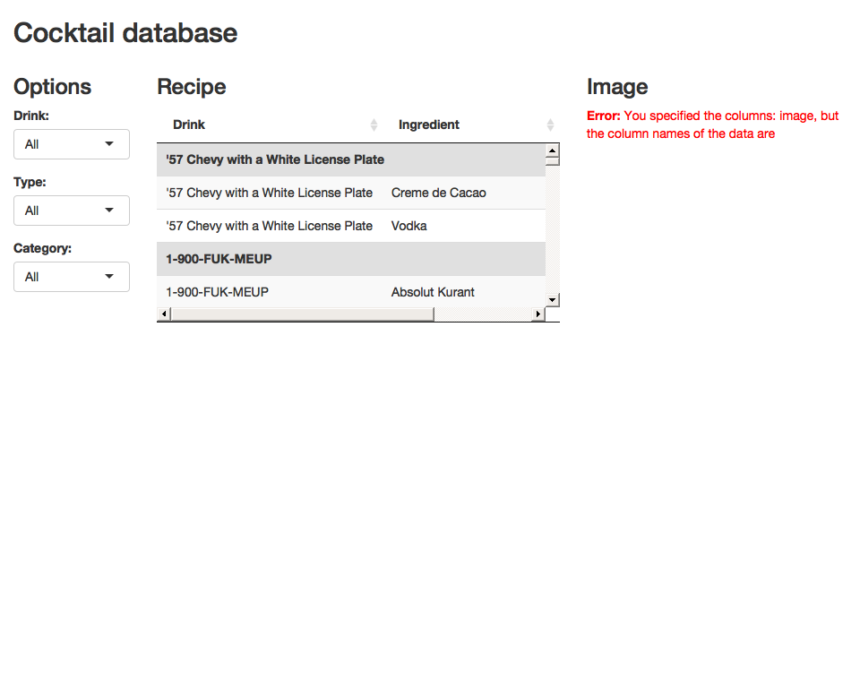

Tidy\_Tuesday\_2020\_06\_02
================

Tidy Tuesday: Cocktails
=======================

This week’s objective was to visualize
<a href="https://github.com/rfordatascience/tidytuesday/blob/master/data/2020/2020-05-26/readme.md" target="_blank">cocktail data</a>.
The idea for this week is to create a searchable table that categorizes
cocktails in the form of a shiny app.

Load libraries
--------------

    library(tidyverse)
    library(DT)
    library(shiny)

Get Data
--------

    cocktails <- readr::read_csv('https://raw.githubusercontent.com/rfordatascience/tidytuesday/master/data/2020/2020-05-26/cocktails.csv')

Data Wrangling
--------------

    df<- cocktails %>%
      rename(Drink="drink",
             Ingredient="ingredient", 
             Measure="measure") %>%
      select(-row_id, -date_modified, -iba, -video, -ingredient_number, -glass) %>%
      filter(!is.na(alcoholic)) %>%
      filter(!is.na(category))

    df_image<- df %>%
      mutate(image= 
               paste("</img>", sep="")
             ) %>%
      select(Drink, image) %>%
      distinct()

    df <- df %>%
      select(-drink_thumb)

Visualizations
--------------

    ####UI#####
    ui <-  fluidPage(
      titlePanel("Cocktail database"),
      fluidRow(
        column(12,
               fluidRow(
                 column(2,
                        h3("Options"),
                        selectInput("dri",
                                    "Drink:",
                                    c("All",
                                      unique(as.character(df$Drink)))),
                        selectInput("alc",
                                    "Type:",
                                    c("All",
                                      unique(as.character(df$alcoholic)))),
                        selectInput("cat",
                                    "Category:",
                                    c("All",
                                      unique(as.character(df$category))))),
                 column(6,
                        h3("Recipe"),
                        DT::dataTableOutput("table")
                 ),
                 column(4,
                        h3("Image"),
                        DT::dataTableOutput("table_img")))
        ))
    )

    ####SERVER#####
    server <-  function(input, output) {
      #####Filter data based on selections##########
      output$table <- DT::renderDataTable(
        DT::datatable({
          data <- df
          if (input$dri != "All") {
            data <- df[df$Drink == input$dri,]
          }
          if (input$alc != "All") {
            data <- df[df$alcoholic == input$alc,]
          }
          if (input$cat != "All") {
            data <- df[df$category == input$cat,]
          }
          data
        },
        rownames = FALSE,
        extensions=c("RowGroup", "Scroller"),
        options = list(rowGroup = list(dataSrc = 0), 
                       pageLength= 100,
                       columnDefs = list(list(visible=FALSE,
                                              targets=c(1,2,3))),
                       lengthChange= FALSE,
                       dom='t',
                       deferRender = TRUE,
                       scrollY = 200,
                       scroller = TRUE),
        escape=FALSE))
      
      #####Image##########
      output$table_img <- DT::renderDataTable(
        DT::datatable({
          data2 <- df_image
          if (input$dri != "All") {
            data2 <- df_image[df_image$Drink == input$dri,]
          }
        },
        rownames = FALSE,
        colnames = '',
        options = list(lengthChange= FALSE,
                       columnDefs = list(list(visible=FALSE,
                                              targets=c(0))),
                       dom='t'),
        escape=FALSE) %>% 
          formatStyle("image",
                      backgroundColor = "white")
      )
      
    }

    ####APP####
    shinyApp(ui = ui, server = server)

<!-- -->
