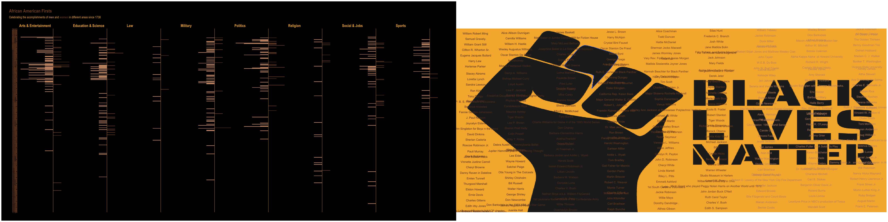

Tidy\_Tuesday\_2020\_06\_16
================

Tidy Tuesday: African American Achivements
==========================================

This week's objective was to visualize the <a href="https://github.com/rfordatascience/tidytuesday/blob/master/data/2020/2020-06-09/readme.md" target="_blank">achievement of African Americans</a>.

Load libraries
--------------

``` r
library(tidyverse)
library(hrbrthemes)
library(scales)
library(ggtext)
library(patchwork)
library(tidytext)
library(png)
library(ggpubr)
```

Get Data
--------

``` r
firsts <- readr::read_csv('https://raw.githubusercontent.com/rfordatascience/tidytuesday/master/data/2020/2020-06-09/firsts.csv')
science <- readr::read_csv('https://raw.githubusercontent.com/rfordatascience/tidytuesday/master/data/2020/2020-06-09/science.csv')

logo_bg<- png::readPNG("images/black-lives-matter-graphic.png")
```

Data Wrangling
--------------

``` r
firsts<- firsts 

x<-   firsts %>%
  mutate(gender= ifelse(grepl("Female", gender), "Female", "Male")) %>%
         group_by(gender, category, year) %>%
         tally() %>%
         arrange(desc(n)) %>%
  mutate(n=ifelse(gender=="Male", -1*n, n))  

person<- firsts %>%
  select(person) %>%
  mutate(clean= gsub("\\[.*?\\]", "", person)) %>%
  mutate(clean= gsub("\\(.*?\\)", "", clean)) %>%
  mutate(clean= gsub("[(]", "", clean)) %>%
  mutate(clean= gsub("[)]", "", clean)) %>%
  mutate(clean= str_remove(clean, "See also")) %>%
  mutate(clean= str_remove(clean, "see also")) %>%
  mutate(clean= gsub("(.*),.*", "", clean)) %>%
  mutate(clean= gsub("(.*);.*", "", clean)) %>%
  select(clean) %>%
  distinct() %>%
  filter(!is.na(clean)) %>%
  mutate(y= rownames(.)) %>%
  mutate(x= rep(c(1,5,10,15,20,25,30,35,40), nrow(.)/9)) %>%
  mutate(manual_col= rep(c("#683F29", "#683F29", "#683F29", "#C3916F", "#C3916F", "#C3916F", "#83502B", "#83502B", "#83502B"), nrow(.)/9))


achievement<- firsts %>%
  select(accomplishment) %>%
  mutate(clean= str_remove(accomplishment, fixed("First African-American"))) %>%
  mutate(clean= str_remove(clean, fixed("First known African-American"))) %>%
  unnest_tokens(word, clean) %>%
  filter(!word %in% c(stopwords::stopwords(), "american", "african", "female", "woman", "male", "man", "appointed", "elected", "inducted", "named", "united", "states")) %>%
  select(word) %>%
  distinct
```

Visualizations
--------------

``` r
p1<- ggplot(x) +
  geom_bar(aes(x=year, y=n, fill=gender), stat = "identity") +
  geom_hline(yintercept = 0, color = "#BE8A56") +
  facet_grid(~category) +
  coord_flip() +
  hrbrthemes::theme_ipsum(axis = FALSE,
                          axis_title_just = "l",
                          grid = FALSE) +
  scale_x_continuous(breaks = pretty_breaks(n=200)) +
  labs(title = "African American Firsts", 
       subtitle = "Celebrating the acomplishments of <span style='color:#C3916F;'>**men**</span> and <span style='color:#683F29;'>**women**</span> in different areas since 1738") +
  theme(plot.title = element_markdown(color = "#83502B"),
        plot.title.position = "plot",
        plot.subtitle = element_markdown(color= "#F6B43B"),
        axis.text.x = element_blank(),
        axis.text.y = element_text(face = "bold", 
                                   color = "#83502B"),
        axis.title.x = element_blank(), 
        strip.text.x = element_text( 
                                    size = 15, 
                                    face = "bold",
                                    color = "#F6B43B"), 
        plot.background = element_rect(fill="black"),
        panel.background = element_rect(fill = "black",
                                colour = "black"),
        panel.spacing.x=unit(0, "lines"),
        panel.spacing.y=unit(0, "lines"),
        legend.position = "none") +
  scale_fill_manual(values=c("#683F29", "#C3916F"))


p2<- ggplot(person)  +
  background_image(logo_bg) +
  geom_text(aes(x, y, label=clean, color= manual_col)) +
  scale_color_manual(values = c("#683F29", "#C3916F", "#83502B")) +
  theme_void() +
  theme(legend.position = "none")

p1 + p2
```


