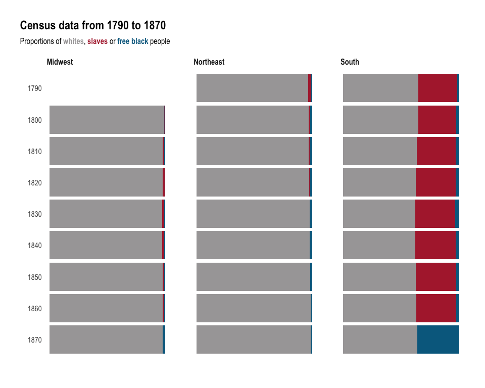

Tidy\_Tuesday\_2020\_06\_23
================

Tidy Tuesday: Slavery in the US
===============================

<a href="https://www.nationalgeographic.com/culture/2019/08/how-slavery-flourished-united-states-chart-maps/#close" class="uri">https://www.nationalgeographic.com/culture/2019/08/how-slavery-flourished-united-states-chart-maps/#close</a>

Load libraries
--------------

    library(tidyverse)
    library(scales)
    library(ggtext)
    library(hrbrthemes)
    library(paletteer)
    library(trelliscopejs)

Get Data
--------

    census <- readr::read_csv('https://raw.githubusercontent.com/rfordatascience/tidytuesday/master/data/2020/2020-06-16/census.csv')
    slave_routes <- readr::read_csv('https://raw.githubusercontent.com/rfordatascience/tidytuesday/master/data/2020/2020-06-16/slave_routes.csv')

Data Wrangling
--------------

    slave_routes_df<- slave_routes %>%
      mutate(port_origin= str_remove(port_origin, ", port unspecified")) %>%
      mutate(port_arrival= str_remove(port_arrival, ", port unspecified"))  %>%
      filter(!is.na(port_arrival)) %>%
      filter(!is.na(n_slaves_arrived)) %>%
      filter(!is.na(year_arrival)) %>%
      mutate_if(is.character, list(~replace_na(., "unknown")))

    census_df<- census %>%
      select(-black) %>%
      mutate_at(c("white", "black_free", "black_slaves"), funs(100* . / total)) %>%
      mutate_at(c("white", "black_free", "black_slaves"), funs(round(.,2))) %>%
      group_by(region, year) %>%
      arrange((desc(total))) %>%
      top_n(1, total) %>%
      select(-total) %>%
      select(-division) %>%
      distinct %>%
      ungroup %>%
      pivot_longer(white:black_slaves, names_to = "group", values_to = "perc")  %>%
      mutate(year = factor(year), 
             year = factor(year, levels = rev(levels(year))))

    ## Warning: `funs()` is deprecated as of dplyr 0.8.0.
    ## Please use a list of either functions or lambdas: 
    ## 
    ##   # Simple named list: 
    ##   list(mean = mean, median = median)
    ## 
    ##   # Auto named with `tibble::lst()`: 
    ##   tibble::lst(mean, median)
    ## 
    ##   # Using lambdas
    ##   list(~ mean(., trim = .2), ~ median(., na.rm = TRUE))
    ## This warning is displayed once every 8 hours.
    ## Call `lifecycle::last_warnings()` to see where this warning was generated.

    check_palettes<- palettes_d_names

Visualizations
--------------

    ggplot(census_df %>% ungroup %>% filter(!region %in% c("USA Total", "West")) %>% filter(!group=="black")) +
      geom_col(aes(year, perc, fill= group), position = "stack") +
      facet_grid(.~region) +
      coord_flip() +
      hrbrthemes::theme_ipsum(axis = FALSE,
                              axis_title_just = "l",
                              grid = FALSE) +
      paletteer::scale_fill_paletteer_d(palette = "ggthemes::wsj_dem_rep") +
      labs(title = "Census data from 1790 to 1870", 
           subtitle = "Proportions of **whites**, **slaves** or **free black** people") +
      theme(axis.title = element_text(color = "white"), 
            axis.text.x = element_blank(),
            plot.subtitle = element_markdown(),
            plot.title.position = "plot",
            legend.position = "none",
            strip.text = element_textbox(face = "bold"))

<!-- -->

Interactive visualization
-------------------------

    qplot(year_arrival, n_slaves_arrived, data = slave_routes_df) +
      theme_bw() +
      facet_trelliscope(~ port_arrival, nrow = 2, ncol = 7, width = 300)
