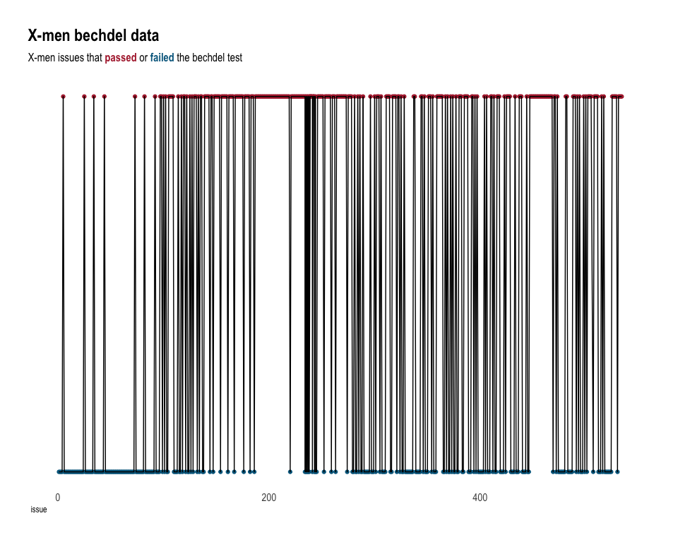
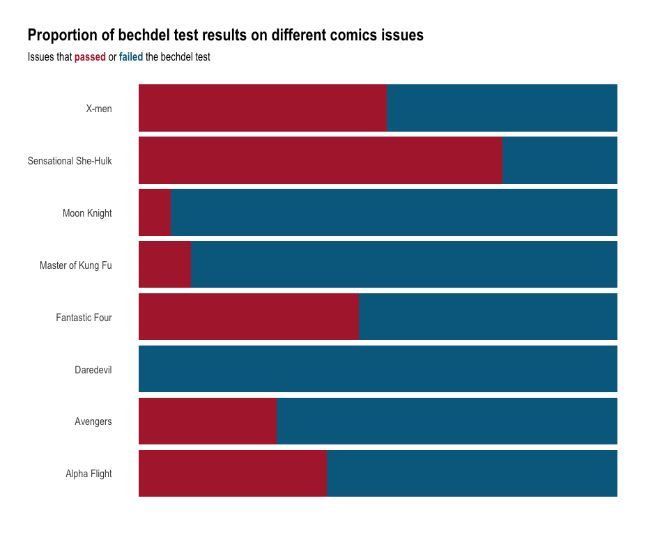
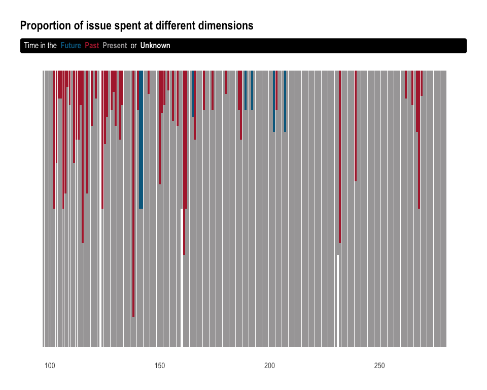

TidyTuesday\_2020\_07\_07
================

Tidy Tuesday: X-men
===================

In this edition of TidyTuesday I will be looking at female representation in comics. The objective is to use <a href="https://github.com/rfordatascience/tidytuesday/blob/master/data/2020/2020-06-30/readme.md" target="_blank">X-men data</a> and look at the Bechdel test indicator, which -according to <a href="https://en.wikipedia.org/wiki/Bechdel_test" target="_blank">Wikipedia</a>- is a measure of the representation of women in fiction. It asks whether a work features at least two women who talk to each other about something other than a man. The requirement that the two women must be named is sometimes added.

Load libraries
--------------

``` r
library(tidyverse)
library(ggtext)
library(hrbrthemes)
library(paletteer)
```

Get Data
--------

``` r
comic_bechdel <- readr::read_csv('https://raw.githubusercontent.com/rfordatascience/tidytuesday/master/data/2020/2020-06-30/comic_bechdel.csv')

xmen_bechdel <- readr::read_csv('https://raw.githubusercontent.com/rfordatascience/tidytuesday/master/data/2020/2020-06-30/xmen_bechdel.csv')

locations <- readr::read_csv('https://raw.githubusercontent.com/rfordatascience/tidytuesday/master/data/2020/2020-06-30/locations.csv')
```

Data Wrangling
--------------

``` r
bechdel.df<- bind_rows(xmen_bechdel %>%
  select(issue, pass_bechdel) %>%
  mutate(series = "X-men",
         issue= as.integer(issue)),  
  comic_bechdel %>%
    select(series, issue, pass_bechdel)) %>%
  mutate(pass=ifelse(pass_bechdel=="yes", 1, 0))


bechdel.df.prop<- bechdel.df %>%
  filter(!is.na(pass_bechdel)) %>%
  group_by(series, pass_bechdel) %>%
  summarise(n = n()) %>%
  mutate(freq = n / sum(n))

location.df<- locations %>%
  select(issue, context) %>%
  mutate(context=ifelse(context=="Future*", "Future", context))%>%
  mutate(context=ifelse(context%in% c("past", "Past*","Past**"), "Past", context)) %>%
  mutate(context=ifelse(context%in% c("present", "Present**"), "Present", context)) %>%
  mutate(context=ifelse(context%in% c("Unknown time", "Unknown time*", "unspecified time*", "Unspecified time*"), "Unknown", context)) %>%
  filter(!context=="Dream") %>%
  group_by(issue, context) %>%
  summarise(n = n()) %>%
  mutate(freq = n / sum(n))
```

Visualizations
--------------

``` r
##Bechdel test X-men only
ggplot(bechdel.df %>% 
         filter(series=="X-men") %>% 
         filter(!is.na(pass_bechdel))) +
  geom_point(aes(issue, pass, color=pass_bechdel)) +
  geom_path(aes(issue, pass))  +
  hrbrthemes::theme_ipsum(axis = FALSE,
                          axis_title_just = "l",
                          grid = FALSE) +
  paletteer::scale_color_paletteer_d(palette = "ggthemes::wsj_dem_rep") + labs(title = "X-men bechdel data", 
       subtitle = "X-men issues that <span style='color:#B12839;'>**passed**</span> or <span style='color:#00698E;'>**failed**</span> the bechdel test") +
  theme(axis.title.y = element_blank(), 
        axis.text.y = element_blank(),
        plot.subtitle = element_markdown(),
        plot.title.position = "plot",
        legend.position = "none",
        strip.text = element_textbox(face = "bold"))
```



``` r
##Bechdel test comparison 
ggplot(bechdel.df.prop) +
  geom_bar(aes(series, freq, fill=pass_bechdel), stat = "identity") +
  hrbrthemes::theme_ipsum(axis = FALSE,
                          axis_title_just = "l",
                          grid = FALSE) +
  paletteer::scale_fill_paletteer_d(palette = "ggthemes::wsj_dem_rep") + labs(title = "Proportion of bechdel test results on different comics issues", 
                                                                               subtitle = "Issues that <span style='color:#B12839;'>**passed**</span> or <span style='color:#00698E;'>**failed**</span> the bechdel test") +
  theme(axis.title.x = element_blank(), axis.title.y = element_blank(), 
        axis.text.x = element_blank(),
        plot.subtitle = element_markdown(),
        plot.title.position = "plot",
        legend.position = "none",
        strip.text = element_textbox(face = "bold")) +
  coord_flip()
```



``` r
##Time dimension
ggplot(location.df) +
  geom_bar(aes(issue, freq, fill=context), stat = "identity") +
  hrbrthemes::theme_ipsum(axis = FALSE,
                          axis_title_just = "l",
                          grid = FALSE) +
  paletteer::scale_fill_paletteer_d(palette = "ggthemes::wsj_dem_rep") + labs(title = "Proportion of issue spent at different dimensions", 
                                                                              subtitle = "<span style='color:#FFFFFF;'>Time in the</span> <span style='color:#00698E;'>**Future**</span>, <span style='color:#B12839;'>**Past**</span>, <span style='color:#A8A6A7;'>**Present**</span> <span style='color:#FFFFFF;'>or</span> <span style='color:#FFFFFF;'>**Unknown**</span> dimension") +
  theme(axis.title.y = element_blank(), 
        axis.title.x = element_blank(), 
        axis.text.y = element_blank(),
        plot.subtitle = element_textbox_simple(
          fill = "black", 
          padding = margin(5.5, 5.5, 5.5, 5.5),
          margin = margin(0, 0, 5.5, 0)
        ),
        plot.title.position = "plot",
        legend.position = "none",
        strip.text = element_textbox(face = "bold"))
```


