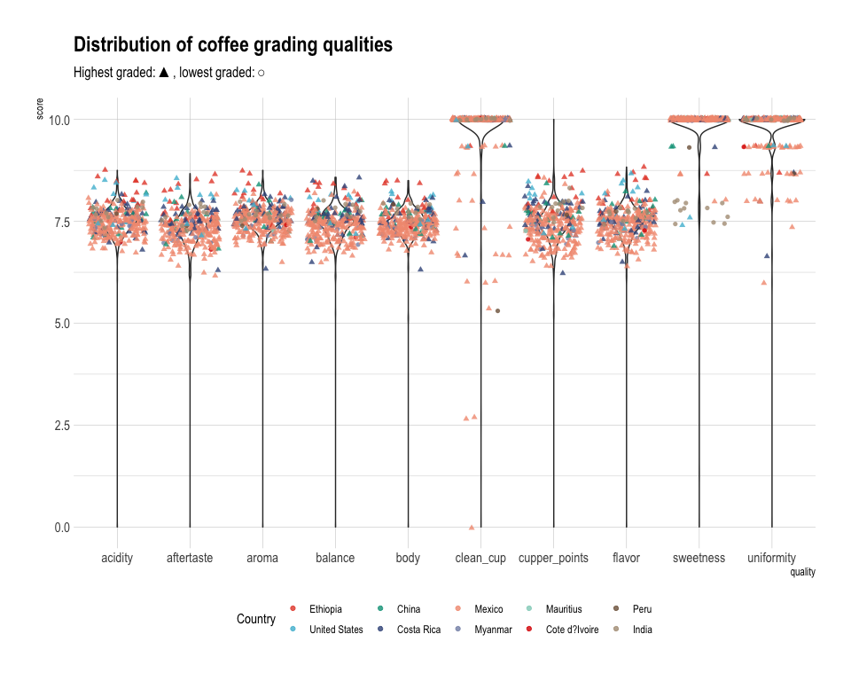
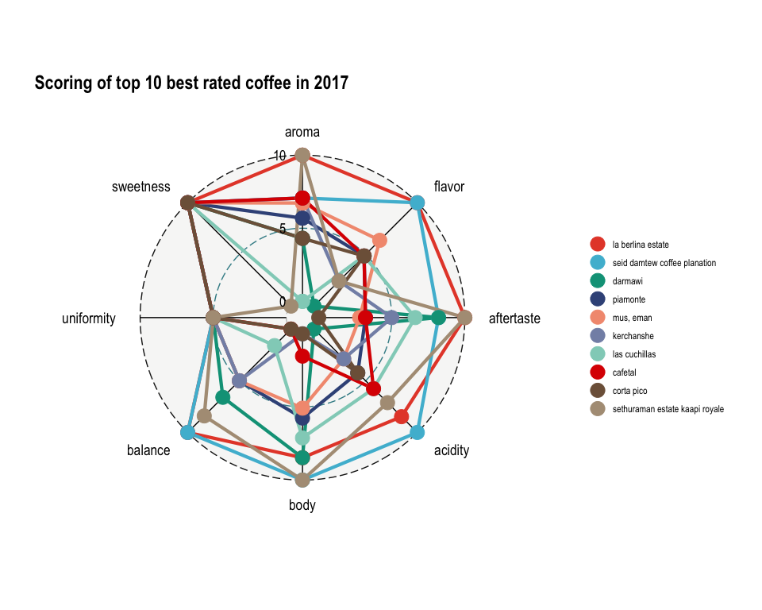
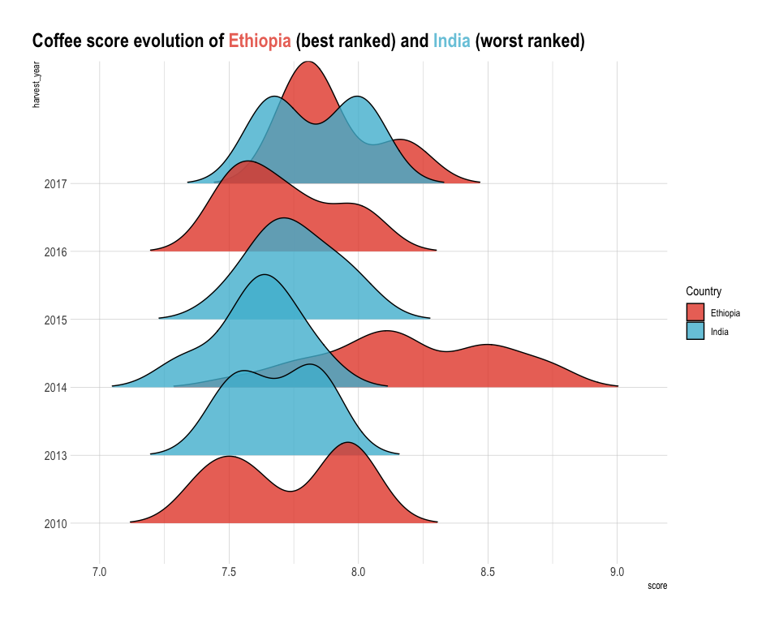

TidyTuesday\_2020\_07\_14
================

Tidy Tuesday: Coffee
====================

Examine the distribution of scores by characteristics that are used to grade good quality coffee. What does it take to get the best cup in 2017?

Load libraries
--------------

``` r
library(skimr)
library(ggradar)
suppressPackageStartupMessages(library(tidyverse))
library(scales)
library(stringr)
library(hrbrthemes)
library(paletteer)
library(ggridges)
library(ggtext)
```

Get Data
--------

``` r
coffee_ratings <- readr::read_csv('https://raw.githubusercontent.com/rfordatascience/tidytuesday/master/data/2020/2020-07-07/coffee_ratings.csv')
```

Inspect Data
------------

``` r
skim(coffee_ratings)
```

|                                                  |                 |
|:-------------------------------------------------|:----------------|
| Name                                             | coffee\_ratings |
| Number of rows                                   | 1339            |
| Number of columns                                | 43              |
| \_\_\_\_\_\_\_\_\_\_\_\_\_\_\_\_\_\_\_\_\_\_\_   |                 |
| Column type frequency:                           |                 |
| character                                        | 24              |
| numeric                                          | 19              |
| \_\_\_\_\_\_\_\_\_\_\_\_\_\_\_\_\_\_\_\_\_\_\_\_ |                 |
| Group variables                                  |                 |

**Variable type: character**

| skim\_variable         |  n\_missing|  complete\_rate|  min|  max|  empty|  n\_unique|  whitespace|
|:-----------------------|-----------:|---------------:|----:|----:|------:|----------:|-----------:|
| species                |           0|            1.00|    7|    7|      0|          2|           0|
| owner                  |           7|            0.99|    3|   50|      0|        315|           0|
| country\_of\_origin    |           1|            1.00|    4|   28|      0|         36|           0|
| farm\_name             |         359|            0.73|    1|   73|      0|        571|           0|
| lot\_number            |        1063|            0.21|    1|   71|      0|        227|           0|
| mill                   |         315|            0.76|    1|   77|      0|        460|           0|
| ico\_number            |         151|            0.89|    1|   40|      0|        847|           0|
| company                |         209|            0.84|    3|   73|      0|        281|           0|
| altitude               |         226|            0.83|    1|   41|      0|        396|           0|
| region                 |          59|            0.96|    2|   76|      0|        356|           0|
| producer               |         231|            0.83|    1|  100|      0|        691|           0|
| bag\_weight            |           0|            1.00|    1|    8|      0|         56|           0|
| in\_country\_partner   |           0|            1.00|    7|   85|      0|         27|           0|
| harvest\_year          |          47|            0.96|    3|   24|      0|         46|           0|
| grading\_date          |           0|            1.00|   13|   20|      0|        567|           0|
| owner\_1               |           7|            0.99|    3|   50|      0|        319|           0|
| variety                |         226|            0.83|    4|   21|      0|         29|           0|
| processing\_method     |         170|            0.87|    5|   25|      0|          5|           0|
| color                  |         218|            0.84|    4|   12|      0|          4|           0|
| expiration             |           0|            1.00|   13|   20|      0|        566|           0|
| certification\_body    |           0|            1.00|    7|   85|      0|         26|           0|
| certification\_address |           0|            1.00|   40|   40|      0|         32|           0|
| certification\_contact |           0|            1.00|   40|   40|      0|         29|           0|
| unit\_of\_measurement  |           0|            1.00|    1|    2|      0|          2|           0|

**Variable type: numeric**

| skim\_variable         |  n\_missing|  complete\_rate|     mean|       sd|   p0|      p25|      p50|      p75|       p100| hist  |
|:-----------------------|-----------:|---------------:|--------:|--------:|----:|--------:|--------:|--------:|----------:|:------|
| total\_cup\_points     |           0|            1.00|    82.09|     3.50|    0|    81.08|    82.50|    83.67|      90.58| ▁▁▁▁▇ |
| number\_of\_bags       |           0|            1.00|   154.18|   129.99|    0|    14.00|   175.00|   275.00|    1062.00| ▇▇▁▁▁ |
| aroma                  |           0|            1.00|     7.57|     0.38|    0|     7.42|     7.58|     7.75|       8.75| ▁▁▁▁▇ |
| flavor                 |           0|            1.00|     7.52|     0.40|    0|     7.33|     7.58|     7.75|       8.83| ▁▁▁▁▇ |
| aftertaste             |           0|            1.00|     7.40|     0.40|    0|     7.25|     7.42|     7.58|       8.67| ▁▁▁▁▇ |
| acidity                |           0|            1.00|     7.54|     0.38|    0|     7.33|     7.58|     7.75|       8.75| ▁▁▁▁▇ |
| body                   |           0|            1.00|     7.52|     0.37|    0|     7.33|     7.50|     7.67|       8.58| ▁▁▁▁▇ |
| balance                |           0|            1.00|     7.52|     0.41|    0|     7.33|     7.50|     7.75|       8.75| ▁▁▁▁▇ |
| uniformity             |           0|            1.00|     9.83|     0.55|    0|    10.00|    10.00|    10.00|      10.00| ▁▁▁▁▇ |
| clean\_cup             |           0|            1.00|     9.84|     0.76|    0|    10.00|    10.00|    10.00|      10.00| ▁▁▁▁▇ |
| sweetness              |           0|            1.00|     9.86|     0.62|    0|    10.00|    10.00|    10.00|      10.00| ▁▁▁▁▇ |
| cupper\_points         |           0|            1.00|     7.50|     0.47|    0|     7.25|     7.50|     7.75|      10.00| ▁▁▁▇▁ |
| moisture               |           0|            1.00|     0.09|     0.05|    0|     0.09|     0.11|     0.12|       0.28| ▃▇▅▁▁ |
| category\_one\_defects |           0|            1.00|     0.48|     2.55|    0|     0.00|     0.00|     0.00|      63.00| ▇▁▁▁▁ |
| quakers                |           1|            1.00|     0.17|     0.83|    0|     0.00|     0.00|     0.00|      11.00| ▇▁▁▁▁ |
| category\_two\_defects |           0|            1.00|     3.56|     5.31|    0|     0.00|     2.00|     4.00|      55.00| ▇▁▁▁▁ |
| altitude\_low\_meters  |         230|            0.83|  1750.71|  8669.44|    1|  1100.00|  1310.64|  1600.00|  190164.00| ▇▁▁▁▁ |
| altitude\_high\_meters |         230|            0.83|  1799.35|  8668.81|    1|  1100.00|  1350.00|  1650.00|  190164.00| ▇▁▁▁▁ |
| altitude\_mean\_meters |         230|            0.83|  1775.03|  8668.63|    1|  1100.00|  1310.64|  1600.00|  190164.00| ▇▁▁▁▁ |

Data Wrangling
--------------

``` r
#wrangle
coffee_df<- coffee_ratings %>% 
  select(which(sapply(.,class)=="numeric"), country_of_origin, farm_name, harvest_year, grading_date) %>%
  select(-quakers, -number_of_bags, -starts_with("category"), -starts_with("altitude"))  %>%
  mutate(grading_year= word(grading_date,-1)) %>%
  filter(!grepl("/" , harvest_year)) %>%
  filter(!grepl("-" , harvest_year)) %>%
  filter(!grepl("January|March |Mayo|Spring |August |TEST| mmm |Fall| July"  , harvest_year)) %>%
  filter(!is.na(farm_name)) %>%
  filter(!is.na(harvest_year))  %>%
  mutate(harvest_year = as.numeric(harvest_year)) 

##violin plot for distribution
coffee_df_violin<- coffee_df %>%
  select(-total_cup_points, -moisture, -grading_date, -grading_year, -harvest_year) %>%
  pivot_longer(aroma:cupper_points, names_to = "quality", values_to = "score") 

#35 countries; top 5, bottom 5
coffee_df_violin_country<- coffee_df %>%
  select(country_of_origin, total_cup_points) %>%
  group_by(country_of_origin) %>%
  top_n(1, total_cup_points) %>%
  select(country_of_origin) %>%
  distinct() %>%
  pull(country_of_origin)

coffee_df_violin_2<- coffee_df_violin %>%
                filter(country_of_origin %in% c(coffee_df_violin_country[1:5],coffee_df_violin_country[(length(coffee_df_violin_country)-4):length(coffee_df_violin_country)])) %>%
  mutate(grade= ifelse(country_of_origin %in% coffee_df_violin_country[1:5], "top", "bottom")) %>%
  mutate(country_of_origin= fct_relevel(country_of_origin, c(coffee_df_violin_country[1:5], coffee_df_violin_country[(length(coffee_df_violin_country)-4):length(coffee_df_violin_country)])))

##radar plot
coffee_df_radar<- coffee_df %>%
  filter(harvest_year==2017) %>%
  top_n(11, total_cup_points) %>%
  group_by(farm_name) %>%
  top_n(1, total_cup_points) %>%
  ungroup() %>%
  select(farm_name, aroma, flavor, aftertaste, acidity, body, balance, uniformity, sweetness) 

coffee_df_radar_table<- coffee_df %>%
  filter(farm_name %in% coffee_df_radar$farm_name) %>%
  filter(harvest_year==2017) %>% 
  select(farm_name, country_of_origin, total_cup_points) %>%
  group_by(farm_name) %>%
  top_n(1, total_cup_points) %>%
  rename(Farm = "farm_name", Country = "country_of_origin", "Total points" = "total_cup_points")

coffee_df_radar <- coffee_df_radar %>%
  mutate(farm_name= fct_relevel(farm_name, coffee_df_radar_table$Farm)) %>% 
  rename(group= "farm_name") %>% 
  mutate_each(funs(rescale), -group) 
```

    ## Warning: `funs()` is deprecated as of dplyr 0.8.0.
    ## Please use a list of either functions or lambdas: 
    ## 
    ##   # Simple named list: 
    ##   list(mean = mean, median = median)
    ## 
    ##   # Auto named with `tibble::lst()`: 
    ##   tibble::lst(mean, median)
    ## 
    ##   # Using lambdas
    ##   list(~ mean(., trim = .2), ~ median(., na.rm = TRUE))
    ## This warning is displayed once every 8 hours.
    ## Call `lifecycle::last_warnings()` to see where this warning was generated.

    ## Warning: `mutate_each_()` is deprecated as of dplyr 0.7.0.
    ## Please use `across()` instead.
    ## This warning is displayed once every 8 hours.
    ## Call `lifecycle::last_warnings()` to see where this warning was generated.

Visualizations
--------------

``` r
##violin plot for distribution
ggplot() +
  geom_violin(data= coffee_df_violin, aes(quality, score)) +
  geom_jitter(data= coffee_df_violin_2 ,
              aes(quality, score, color= country_of_origin, shape=grade), alpha=0.8) +
  hrbrthemes::theme_ipsum() +
  scale_color_paletteer_d("ggsci::nrc_npg") +
  ggtitle("Distribution of coffee grading qualities", subtitle = "Highest graded: ▲, lowest graded: ○") +
  theme(legend.position = "bottom") +
  labs(color = "Country") +
  guides(shape = FALSE)
```



``` r
##radar plot
coffee_df_radar %>%
  ggradar(font.radar = "Arial Narrow",
          values.radar = c("0", "5", "10"), 
          axis.line.colour = "black",
          gridline.max.colour = "black") +
  hrbrthemes::theme_ipsum() +
  theme(axis.text.x = element_blank()) +
  theme(axis.text.y = element_blank()) +
  ggtitle("Scoring of top 10 best rated coffee in 2017") +
  scale_color_paletteer_d("ggsci::nrc_npg") +
  theme(panel.grid.major = element_blank(), 
        panel.grid.minor = element_blank())
```



``` r
##radar plot table
kableExtra::kable(coffee_df_radar_table)
```

<table>
<thead>
<tr>
<th style="text-align:left;">
Farm
</th>
<th style="text-align:left;">
Country
</th>
<th style="text-align:right;">
Total points
</th>
</tr>
</thead>
<tbody>
<tr>
<td style="text-align:left;">
la berlina estate
</td>
<td style="text-align:left;">
Panama
</td>
<td style="text-align:right;">
85.83
</td>
</tr>
<tr>
<td style="text-align:left;">
seid damtew coffee planation
</td>
<td style="text-align:left;">
Ethiopia
</td>
<td style="text-align:right;">
85.75
</td>
</tr>
<tr>
<td style="text-align:left;">
darmawi
</td>
<td style="text-align:left;">
Indonesia
</td>
<td style="text-align:right;">
84.42
</td>
</tr>
<tr>
<td style="text-align:left;">
piamonte
</td>
<td style="text-align:left;">
Guatemala
</td>
<td style="text-align:right;">
84.17
</td>
</tr>
<tr>
<td style="text-align:left;">
mus, eman
</td>
<td style="text-align:left;">
Indonesia
</td>
<td style="text-align:right;">
84.13
</td>
</tr>
<tr>
<td style="text-align:left;">
kerchanshe
</td>
<td style="text-align:left;">
Ethiopia
</td>
<td style="text-align:right;">
84.00
</td>
</tr>
<tr>
<td style="text-align:left;">
las cuchillas
</td>
<td style="text-align:left;">
Honduras
</td>
<td style="text-align:right;">
84.00
</td>
</tr>
<tr>
<td style="text-align:left;">
cafetal
</td>
<td style="text-align:left;">
Mexico
</td>
<td style="text-align:right;">
83.92
</td>
</tr>
<tr>
<td style="text-align:left;">
corta pico
</td>
<td style="text-align:left;">
Mexico
</td>
<td style="text-align:right;">
83.25
</td>
</tr>
<tr>
<td style="text-align:left;">
sethuraman estate kaapi royale
</td>
<td style="text-align:left;">
India
</td>
<td style="text-align:right;">
83.50
</td>
</tr>
</tbody>
</table>
``` r
#ggridges best and worst
ggplot(coffee_df %>% 
         filter(country_of_origin %in% c("Ethiopia", "India")) %>%
         pivot_longer(aroma:cupper_points, names_to = "quality", values_to = "score") %>%
         filter(quality %in% c("acidity", "aroma")) %>%
         mutate(harvest_year=as.character(harvest_year)), 
       aes(y=harvest_year, x=score, fill= country_of_origin)) + 
  geom_density_ridges(rel_min_height = 0.01, alpha=0.8) +
  labs(fill="Country") +
  hrbrthemes::theme_ipsum() +
  scale_fill_paletteer_d("ggsci::nrc_npg") +
  ggtitle("")  +
  labs(title = "Coffee score evolution of <span style='color:#EB7467;'>**Ethiopia**</span> (best ranked) and <span style='color:#78C9DE;'>**India**</span> (worst ranked)")  +
  theme(axis.title = element_blank(), 
        plot.title = element_markdown(),
        plot.title.position = "plot")
```



``` r
ggridges::geom_density_ridges()
```

    ## geom_density_ridges: na.rm = FALSE, panel_scaling = TRUE
    ## stat_density_ridges: na.rm = FALSE
    ## position_points_sina
