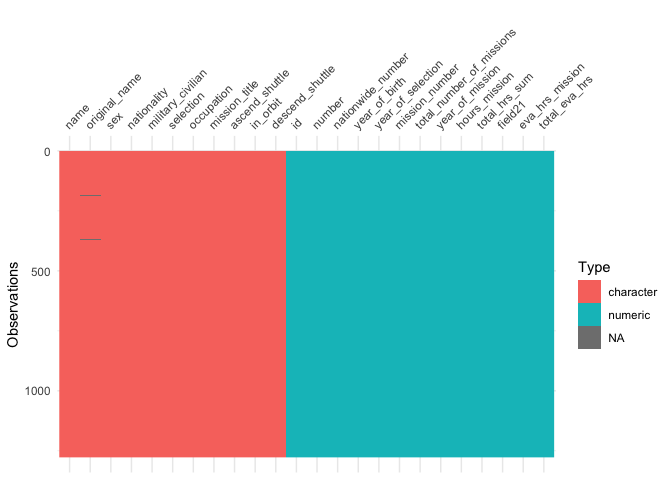
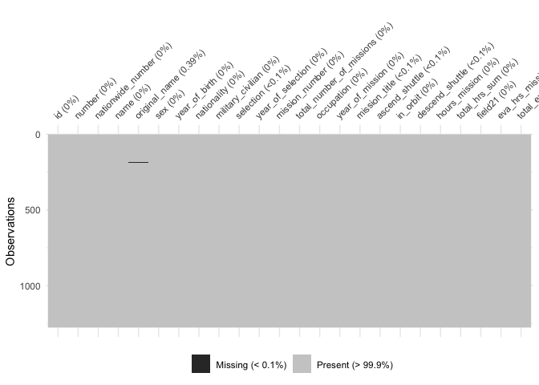
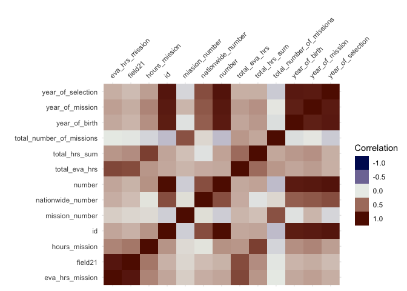
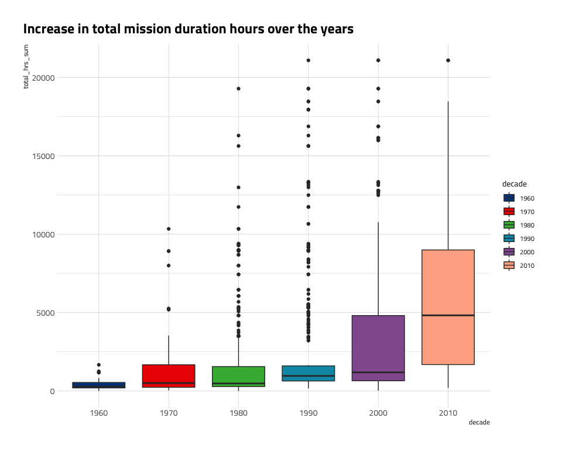
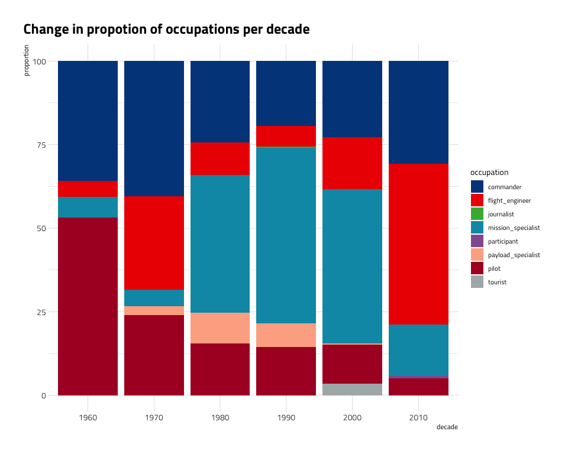
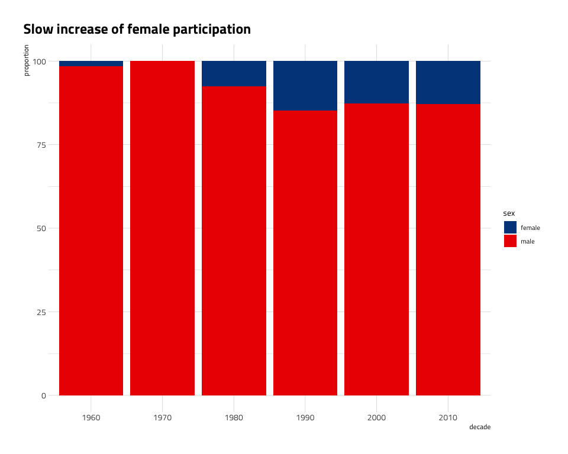

TidyTuesday\_2020\_07\_21
================

Tidy Tuesday: Astronauts
========================

`dataMaid` package produces similar output to `skimr`, but generates a pdf report. <https://github.com/ekstroem/dataMaid> `visdat` <https://docs.ropensci.org/visdat/> `janitor` <https://github.com/sfirke/janitor>

Load libraries
--------------

``` r
suppressPackageStartupMessages(library(tidyverse))
library(skimr)
library(dataMaid)
library(hrbrthemes)
library(paletteer)
library(ggtext)

library(visdat)
```

Get Data
--------

``` r
astronauts <- readr::read_csv('https://raw.githubusercontent.com/rfordatascience/tidytuesday/master/data/2020/2020-07-14/astronauts.csv')
```

Inspect Data
------------

``` r
skim(astronauts)
```

|                                                  |            |
|:-------------------------------------------------|:-----------|
| Name                                             | astronauts |
| Number of rows                                   | 1277       |
| Number of columns                                | 24         |
| \_\_\_\_\_\_\_\_\_\_\_\_\_\_\_\_\_\_\_\_\_\_\_   |            |
| Column type frequency:                           |            |
| character                                        | 11         |
| numeric                                          | 13         |
| \_\_\_\_\_\_\_\_\_\_\_\_\_\_\_\_\_\_\_\_\_\_\_\_ |            |
| Group variables                                  |            |

**Variable type: character**

| skim\_variable     |  n\_missing|  complete\_rate|  min|  max|  empty|  n\_unique|  whitespace|
|:-------------------|-----------:|---------------:|----:|----:|------:|----------:|-----------:|
| name               |           0|               1|    9|   34|      0|        564|           0|
| original\_name     |           5|               1|    2|   34|      0|        560|           0|
| sex                |           0|               1|    4|    6|      0|          2|           0|
| nationality        |           0|               1|    3|   24|      0|         40|           0|
| military\_civilian |           0|               1|    8|    8|      0|          2|           0|
| selection          |           1|               1|    2|   60|      0|        229|           0|
| occupation         |           0|               1|    3|   23|      0|         12|           0|
| mission\_title     |           1|               1|    1|   27|      0|        361|           0|
| ascend\_shuttle    |           1|               1|    4|   16|      0|        436|           0|
| in\_orbit          |           0|               1|    3|   17|      0|        289|           0|
| descend\_shuttle   |           1|               1|    4|   17|      0|        432|           0|

**Variable type: numeric**

| skim\_variable              |  n\_missing|  complete\_rate|     mean|       sd|       p0|      p25|   p50|      p75|      p100| hist  |
|:----------------------------|-----------:|---------------:|--------:|--------:|--------:|--------:|-----:|--------:|---------:|:------|
| id                          |           0|               1|   639.00|   368.78|     1.00|   320.00|   639|   958.00|   1277.00| ▇▇▇▇▇ |
| number                      |           0|               1|   274.23|   148.19|     1.00|   153.00|   278|   390.00|    565.00| ▅▆▇▆▅ |
| nationwide\_number          |           0|               1|   128.75|    97.26|     1.00|    47.00|   110|   204.00|    433.00| ▇▅▅▂▁ |
| year\_of\_birth             |           0|               1|  1951.68|    11.44|  1921.00|  1944.00|  1952|  1959.00|   1983.00| ▂▃▇▅▁ |
| year\_of\_selection         |           0|               1|  1985.59|    12.22|  1959.00|  1978.00|  1987|  1995.00|   2018.00| ▃▅▇▅▁ |
| mission\_number             |           0|               1|     1.99|     1.15|     1.00|     1.00|     2|     3.00|      7.00| ▇▂▁▁▁ |
| total\_number\_of\_missions |           0|               1|     2.98|     1.40|     1.00|     2.00|     3|     4.00|      7.00| ▇▅▅▂▁ |
| year\_of\_mission           |           0|               1|  1994.60|    12.58|  1961.00|  1986.00|  1995|  2003.00|   2019.00| ▂▃▇▇▅ |
| hours\_mission              |           0|               1|  1050.88|  1714.79|     0.00|   190.03|   261|   382.00|  10505.00| ▇▁▁▁▁ |
| total\_hrs\_sum             |           0|               1|  2968.34|  4214.72|     0.61|   482.00|   932|  4264.00|  21083.52| ▇▂▁▁▁ |
| field21                     |           0|               1|     0.63|     1.17|     0.00|     0.00|     0|     1.00|      7.00| ▇▁▁▁▁ |
| eva\_hrs\_mission           |           0|               1|     3.66|     7.29|     0.00|     0.00|     0|     4.72|     89.13| ▇▁▁▁▁ |
| total\_eva\_hrs             |           0|               1|    10.76|    16.05|     0.00|     0.00|     0|    19.52|     78.80| ▇▂▁▁▁ |

``` r
#makeDataReport(astronauts)

#cumulative hours by single astronaut
astronauts %>%
  group_by(name, nationality) %>%
  summarise(max_hrs= max(total_hrs_sum)) %>%
  arrange(desc(max_hrs))
```

    ## # A tibble: 565 x 3
    ## # Groups:   name [564]
    ##    name               nationality    max_hrs
    ##    <chr>              <chr>            <dbl>
    ##  1 Padalka, Gennady   U.S.S.R/Russia  21084.
    ##  2 Krikalev, Sergei   U.S.S.R/Russia  19282.
    ##  3 Kaleri, Aleksandr  U.S.S.R/Russia  18463.
    ##  4 Avdeyev, Sergei    U.S.S.R/Russia  17942.
    ##  5 Malenchenko, Yuri  U.S.S.R/Russia  16872.
    ##  6 Polyakov, Valeri   U.S.S.R/Russia  16289.
    ##  7 Yurchikhin, Fyodor U.S.S.R/Russia  16147 
    ##  8 Kononenko, Oleg D. U.S.S.R/Russia  16081 
    ##  9 Whitson, Peggy A.  U.S.            15982 
    ## 10 Solovyev, Anatoly  U.S.S.R/Russia  15624.
    ## # … with 555 more rows

``` r
#number of astronauts per nationality
astronauts %>%
  select(name, nationality) %>%
  distinct() %>%
  group_by(nationality) %>%
  summarise(astronauts= n()) %>%
  arrange(desc(astronauts))
```

    ## # A tibble: 40 x 2
    ##    nationality    astronauts
    ##    <chr>               <int>
    ##  1 U.S.                  344
    ##  2 U.S.S.R/Russia        122
    ##  3 Japan                  12
    ##  4 China                  11
    ##  5 Germany                11
    ##  6 Canada                 10
    ##  7 France                 10
    ##  8 Italy                   7
    ##  9 U.K./U.S.               3
    ## 10 Belgium                 2
    ## # … with 30 more rows

``` r
astronauts %>%
  select(name, nationality, occupation, military_civilian) %>%
  distinct() %>%
  group_by(nationality, occupation, military_civilian) %>%
  summarise(astronauts= n()) %>%
  arrange(desc(astronauts))
```

    ## # A tibble: 90 x 4
    ## # Groups:   nationality, occupation [71]
    ##    nationality    occupation      military_civilian astronauts
    ##    <chr>          <chr>           <chr>                  <int>
    ##  1 U.S.           pilot           military                 110
    ##  2 U.S.           MSP             civilian                  98
    ##  3 U.S.           commander       military                  85
    ##  4 U.S.           MSP             military                  74
    ##  5 U.S.S.R/Russia commander       military                  62
    ##  6 U.S.S.R/Russia flight engineer civilian                  31
    ##  7 U.S.           flight engineer military                  27
    ##  8 U.S.S.R/Russia flight engineer military                  24
    ##  9 U.S.           PSP             civilian                  23
    ## 10 U.S.           flight engineer civilian                  21
    ## # … with 80 more rows

``` r
# number of missions: total_number_of_missions
# age: year_of_birth
# age first mission: year_of_selection
# occupation
# military_civilian
# nationality
# sex
```

Data Wrangling
--------------

``` r
astronauts_df<- astronauts %>%
  mutate(occupation= ifelse(occupation %in% c("flight engineer", "Flight engineer"), "flight_engineer", occupation)) %>%
  mutate(occupation= ifelse(occupation %in% c("Other (space tourist)", "Other (Space tourist)", "Space tourist"), "tourist", occupation)) %>%
  mutate(occupation= ifelse(occupation %in% c("pilot", "Pilot"), "pilot", occupation)) %>%
  mutate(occupation= ifelse(occupation == "MSP", "mission_specialist", occupation)) %>%
  mutate(occupation= ifelse(occupation == "PSP", "payload_specialist", occupation)) %>%
  mutate(occupation= ifelse(occupation == "Other (Journalist)", "journalist", occupation)) %>%
  mutate(occupation= ifelse(occupation == "spaceflight participant", "participant", occupation))

vis_dat(astronauts_df)
```



``` r
vis_miss(astronauts_df)
```



``` r
vis_cor(astronauts_df %>%
          select(which(sapply(.,class)=="numeric")))
```



``` r
astronaut_df_hrs<- astronauts_df %>%
  select(name, year_of_mission, total_hrs_sum) %>%
  distinct() %>%
  mutate(decade = floor(year_of_mission/10)*10) %>%
  mutate(decade=as.character(decade))

#occupation as astronaut --> fix 
levels(as.factor(astronauts$occupation))
```

    ##  [1] "commander"               "flight engineer"        
    ##  [3] "Flight engineer"         "MSP"                    
    ##  [5] "Other (Journalist)"      "Other (space tourist)"  
    ##  [7] "Other (Space tourist)"   "pilot"                  
    ##  [9] "Pilot"                   "PSP"                    
    ## [11] "Space tourist"           "spaceflight participant"

``` r
janitor::make_clean_names(levels(as.factor(astronauts$occupation)))
```

    ##  [1] "commander"               "flight_engineer"        
    ##  [3] "flight_engineer_2"       "msp"                    
    ##  [5] "other_journalist"        "other_space_tourist"    
    ##  [7] "other_space_tourist_2"   "pilot"                  
    ##  [9] "pilot_2"                 "psp"                    
    ## [11] "space_tourist"           "spaceflight_participant"

``` r
astronaut_df_occupation<- astronauts_df %>%
  select(name, year_of_mission, occupation) %>%
  distinct() %>%
  mutate(decade = floor(year_of_mission/10)*10) %>%
  group_by(decade, occupation) %>%
  summarise(counts= n()) %>%
  ungroup() %>%
  group_by(decade) %>%
  mutate(total= sum(counts)) %>%
  mutate(proportion= 100*counts/total) %>%
  mutate(decade=as.character(decade))

astronaut_df_sex<- astronauts_df %>%
  select(name, year_of_mission, sex) %>%
  distinct() %>%
  mutate(decade = floor(year_of_mission/10)*10) %>%
  group_by(decade, sex) %>%
  summarise(counts= n()) %>%
  ungroup() %>%
  group_by(decade) %>%
  mutate(total= sum(counts)) %>%
  mutate(proportion= 100*counts/total) %>%
  mutate(decade=as.character(decade))
```

Visualizations
--------------

``` r
ggplot(astronaut_df_hrs) +
  geom_boxplot(aes(decade, total_hrs_sum, fill=decade)) +
  scale_fill_paletteer_d("ggsci::lanonc_lancet") +
  labs(title = "Increase in total mission duration hours over the years") +
  hrbrthemes::theme_ipsum_tw() +
  theme(axis.title = element_blank(), 
        plot.title = element_markdown(),
        plot.title.position = "plot")
```



``` r
ggplot(astronaut_df_occupation) +
  geom_bar(aes(decade, proportion, fill= occupation), stat = "identity") +
  scale_fill_paletteer_d("ggsci::lanonc_lancet") +
  labs(title = "Change in propotion of occupations per decade")   +
  hrbrthemes::theme_ipsum_tw() +
  theme(axis.title = element_blank(), 
        plot.title = element_markdown(),
        plot.title.position = "plot")
```



``` r
ggplot(astronaut_df_sex) +
  geom_bar(aes(decade, proportion, fill= sex), stat = "identity") +
  scale_fill_paletteer_d("ggsci::lanonc_lancet") +
  labs(title = "Slow increase of female participation")   +
  hrbrthemes::theme_ipsum_tw() +
  theme(axis.title = element_blank(), 
        plot.title = element_markdown(),
        plot.title.position = "plot")
```


