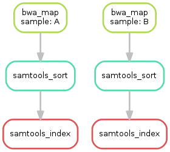

# The aim: [Reproducible research](https://nbisweden.github.io/RaukR-2019/rr/presentation/rr_presentation.html#1)

--
- The ultimate objective for our research is to generate and disseminate *usable* knowledge.   

--

- In this iterative process, ideally, we would like our projects to have one or more of the following characteristics:  
--

```{r xaringan-editable, echo=FALSE}
xaringanExtra::use_editable(expires = 1)
```
.pull-left[
.can-edit[
- thing one
- thing two
]
]
---

# The aim: [Reproducible research](https://nbisweden.github.io/RaukR-2019/rr/presentation/rr_presentation.html#1)


- The ultimate objective for our research is to generate and disseminate *usable* knowledge.   


- In this iterative process, ideally, we would like our projects to have one or more of the following characteristics:  

.pull-right[
- Ability to rerun **workflows**  
- Incorporate feedback and make changes [Additional data/New data]  
- Return to a project  
- Hand off projects  
- Collaborate with others 
]

---
# Workflow

--
- Put simply, a workflow allows us to perform **predictable** and **repetitive** tasks.  

--

- It consists of  multiple steps that take raw data or previous outputs as input, execute a set of instructions and outputs something.

--

- Generally, we want to:   
  - Manage data (wrangle, input)  
  - Do an analysis  
  - Make tables and plots  
  - Integrate the tables and graphs into a manuscript
  
---

# The means: workflow managers

There are several tools to do this:  
- Snakemake  

- Nexflow  

- Drake

---

# The means: workflow managers

There are several tools to do this:  
- **Snakemake**  

- Nexflow  

- Drake

---

# Snakemake

- [Snakemake](https://snakemake.readthedocs.io/en/stable/index.html) is "a tool to create reproducible and scalable data analyses". It allows for **automation** of commands in a single script and **scalability** for reproducible data analyses handling *parallelization* all while being *portable*.  

- It was created by [Koesters et al](https://academic.oup.com/bioinformatics/article/28/19/2520/290322) in 2012.  

- The three essential elements of a SNAKEMAKE workflow are:  

(1) Inputs: user defined/provided or outputs  
(2) Rules/steps/jobs: workflow definitions that use inputs and return outputs  
(3) Output: target that does not exist


---

# Three phases of workflow execution

.pull-left[
```{r echo=FALSE, message=FALSE, warning=FALSE}
library(DiagrammeR)

# Create an empty graph
graph <- create_graph() %>%
  add_node(label = "Parsing", node_aes = node_aes(shape="rectangle", fixedsize=F)) %>%
  add_node(label = "DAG built", node_aes = node_aes(shape="rectangle", fixedsize=F)) %>%
  add_node(label = "Execution of DAG", node_aes = node_aes(shape="rectangle", fixedsize=F)) %>%
  add_edge(from = "Parsing", 
           to = "DAG built",
           rel = "A") %>%
  add_edge(from="DAG built", 
           to= "Execution of DAG", 
           rel= "B") 

render_graph(graph, layout = "tree")

```
]

.pull-right[
- DAG is a directed acyclic graph (DAG) of jobs where the edges represent dependencies.  

- Take a look at this useful [example workflow](https://snakemake.readthedocs.io/en/stable/tutorial/basics.html) and [these](https://slides.com/johanneskoester/snakemake-tutorial#/) complimentary slides. ] 

---

# How does it work?

.pull-left[
Today: Minimal example  

Read Mapping

  
]
--

.pull-right[
Another day: Complete  

Read mapping


]
--

```{r eval=FALSE, highlight.output = 3:4}

snakemake --dag --cores all --use-conda mapped/{A,B,C}.bam | dot -Tsvg > dag.svg

```

