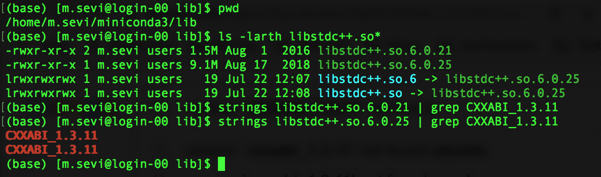
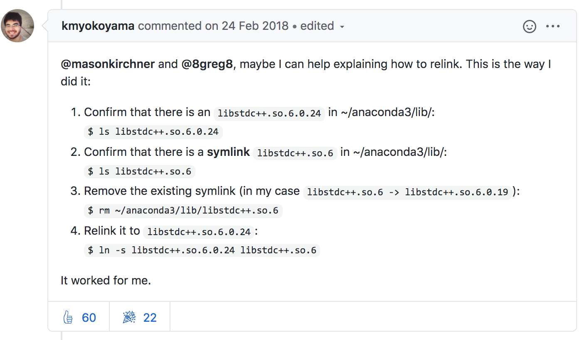
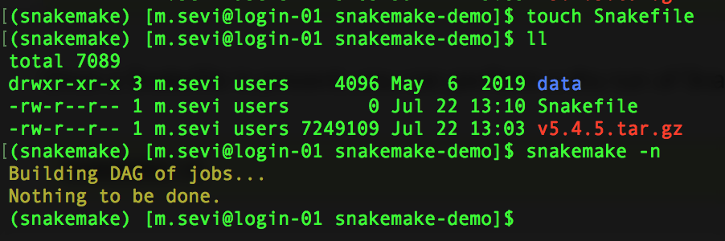
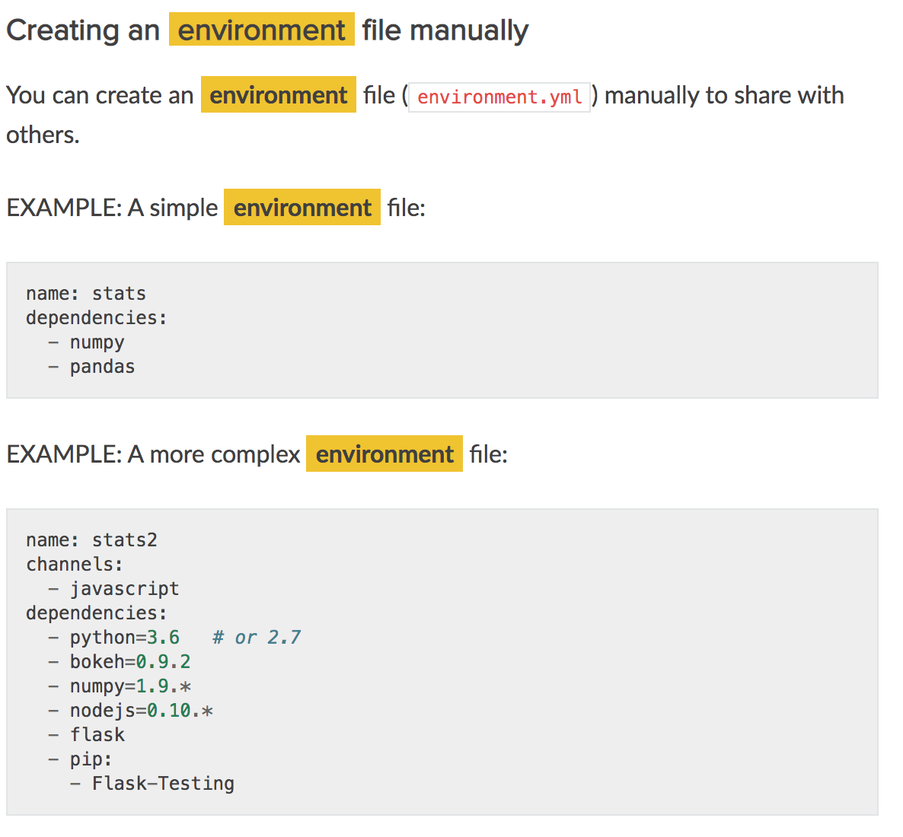
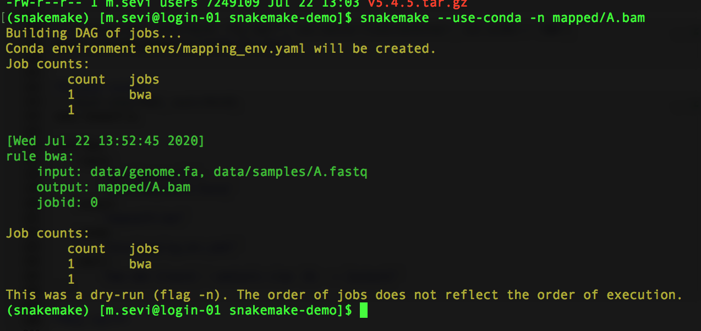
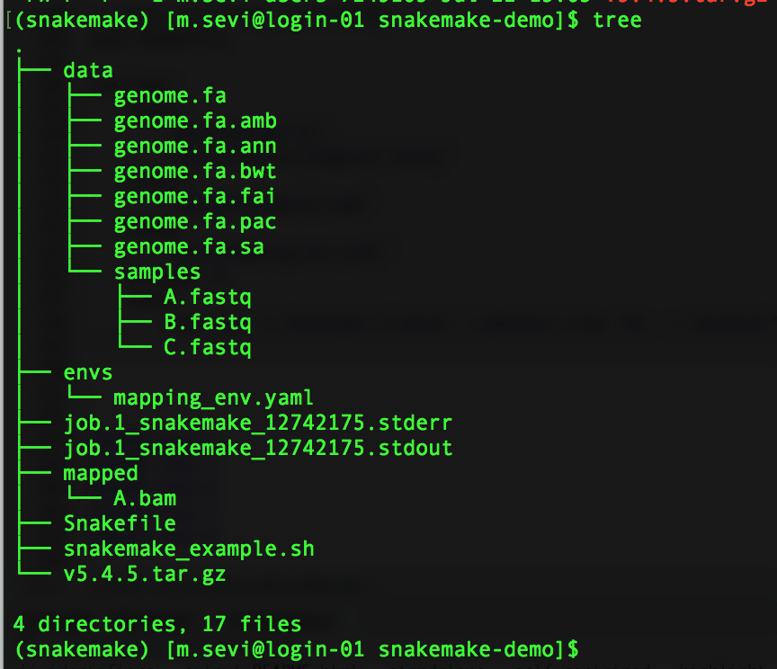
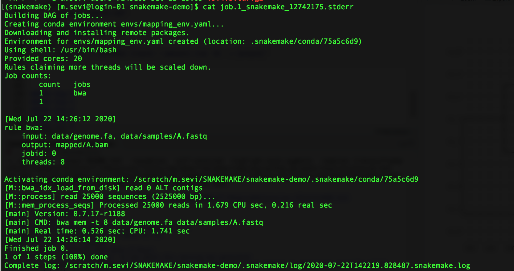
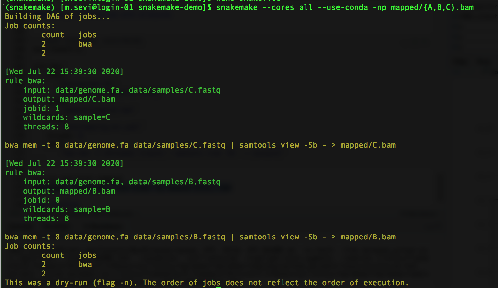
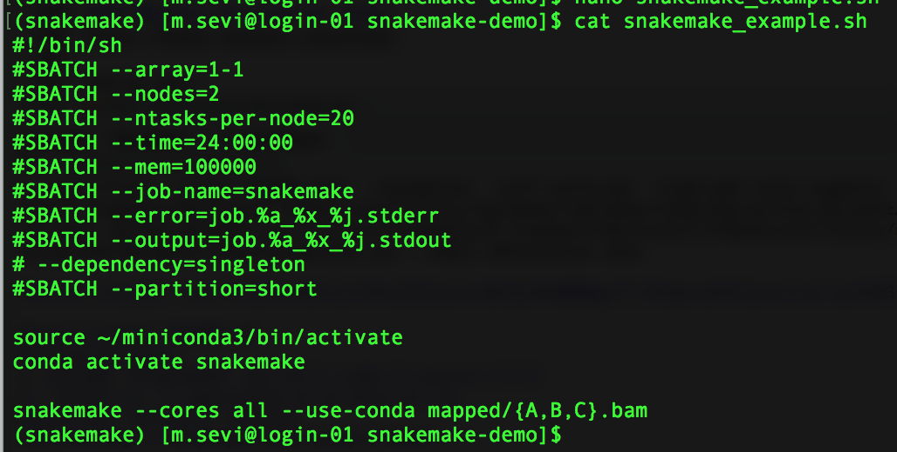
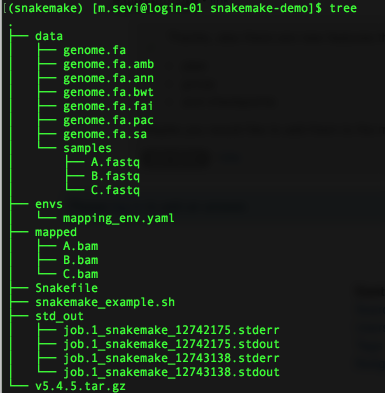

```{r setup, include=FALSE}
knitr::opts_chunk$set(echo = TRUE)
```

# Snakemake: Installation
Following the readthedocs suggestion, we can use conda to install snakemake.

```{bash echo=TRUE, eval=FALSE}

<!-- new conda solver -->
conda install -c conda-forge mamba

<!-- installation with mamba into isolated snakemake environment -->

mamba create -c conda-forge -c bioconda -n snakemake snakemake

```

When running the above command, ran into a symbolic link issue:  

it was looking for a specific version `CXXABI_1.3.11' that was not found in libstdc++.so.6.0.21, the solution was to remove existing links and relink to libstdc++.so.6.0.25 

```{r image3, echo=FALSE, fig.cap="", out.extra="class=external"}

```

Thanks [kmyokoyama](https://github.com/ContinuumIO/anaconda-issues/issues/5191){target="_blank"}

```{r image4, echo=FALSE, fig.cap="", out.extra="class=external"}

```


```{bash echo=TRUE, eval=FALSE}
conda activate snakemake
snakemake --help
```


# Snakemake: Minimal example - Read mapping
Copy data from [readthedocs](https://snakemake.readthedocs.io/en/stable/tutorial/short.html){target="_blank"}

```{bash echo=TRUE, eval=FALSE}
mkdir snakemake-demo
cd snakemake-demo
wget https://github.com/snakemake/snakemake-tutorial-data/archive/v5.4.5.tar.gz
tar --wildcards -xf v5.4.5.tar.gz --strip 1 "*/data"
```

The objective is to map sample fastq reads to reference genome using BWA.

The three essential elements of THIS SNAKEMAKE workflow are:  

(1) **Inputs**: samples & reference genome  
(2) **Rules**: bwa mapping  
(3) **Output**: sam/bam files

## Step 1 Workflow file and dry run

`touch Snakefile`  

`snakemake -n`

```{r step1, echo=FALSE, fig.cap="", out.extra="class=external"}

```


## Step 2 Inspect data and create rules

```{r step2, echo=FALSE, fig.cap="", out.extra="class=external"}
knitr::include_graphics("02_Step.png")
```

For full reproducibility we can provide the software and version required to run the workflow. 
conda environment definition: `envs/mapping_env.yaml`

```{bash echo=TRUE, eval=FALSE}
mkdir envs
touch envs/mapping_env.yaml
nano envs/mapping_env.yaml
cat envs/mapping_env.yaml

channels:
  - bioconda
  - conda-forge
dependencies:
  - bwa =0.7.17
  - samtools =1.9
```

```{r conda_env, echo=FALSE, fig.cap="", out.extra="class=external"}

```

### **Create rule**
```{bash echo=TRUE, eval=FALSE}
nano Snakefile

rule bwa:
    input:
        "data/genome.fa",
        "data/samples/A.fastq"
    output:
        "mapped/A.bam"
    conda:
        "envs/mapping_env.yaml"
    threads: 8    
    shell:
        "bwa mem -t {threads} {input} | samtools view -Sb - > {output}"
```

### **Dry run:**  
I will run this in a shell script to use Discovery's SLURM system  

`snakemake --use-conda -n mapped/A.bam`

```{r dryRun, echo=FALSE, fig.cap="", out.extra="class=external"}

```


### **Execute**  

`snakemake --cores all --use-conda mapped/A.bam`

```{bash echo=TRUE, eval=FALSE}
cat snakemake_example.sh 

#!/bin/sh
#SBATCH --array=1-1
#SBATCH --nodes=2
#SBATCH --ntasks-per-node=20
#SBATCH --time=24:00:00
#SBATCH --mem=100000
#SBATCH --job-name=snakemake
#SBATCH --error=job.%a_%x_%j.stderr
#SBATCH --output=job.%a_%x_%j.stdout
# --dependency=singleton
#SBATCH --partition=short

source ~/miniconda3/bin/activate
conda activate snakemake

snakemake --cores all --use-conda mapped/A.bam

```


```{r outputS2, echo=FALSE, fig.cap="", out.extra="class=external"}


```

```{r 2outputS2, echo=FALSE, fig.cap="", out.extra="class=external"}


```

## Step 3 Generalize with wildcards


```{bash echo=TRUE, eval=FALSE}
nano Snakefile

rule bwa:
    input:
       "data/genome.fa",
       "data/samples/{sample}.fastq"
    output:
        "mapped/{sample}.bam"
    conda:
        "envs/mapping_env.yaml"
    threads: 8    
    shell:
        "bwa mem -t {threads} {input} | samtools view -Sb - > {output}"
```

### **Dry-run and print command**  

`snakemake --cores all --use-conda -np mapped/{A,B,C}.bam`

```{r wildcardS3, echo=FALSE, fig.cap="", out.extra="class=external"}

```

See anything unexpected/different?

```{r slurmS3, echo=FALSE, fig.cap="", out.extra="class=external"}

```


### **Output**  

```{r outputS3, echo=FALSE, fig.cap="", out.extra="class=external"}

```

## Snakemake: parallelization 
[Coming soon!](http://bluegenes.github.io/snakemake-via-slurm/){target="_blank"}

## Nextflow
Coming soon!- Chris

## ROpenSci alternative: [drake](https://books.ropensci.org/drake/){target="_blank"}
[Coming soon!](https://www.garrickadenbuie.com/talk/drake-intro-biodataclub/){target="_blank"}

