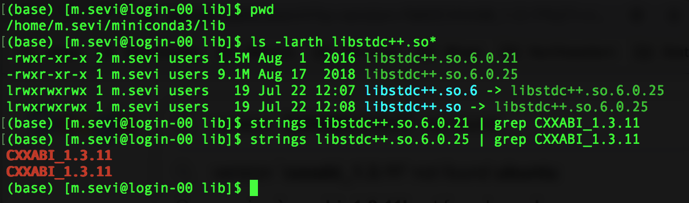
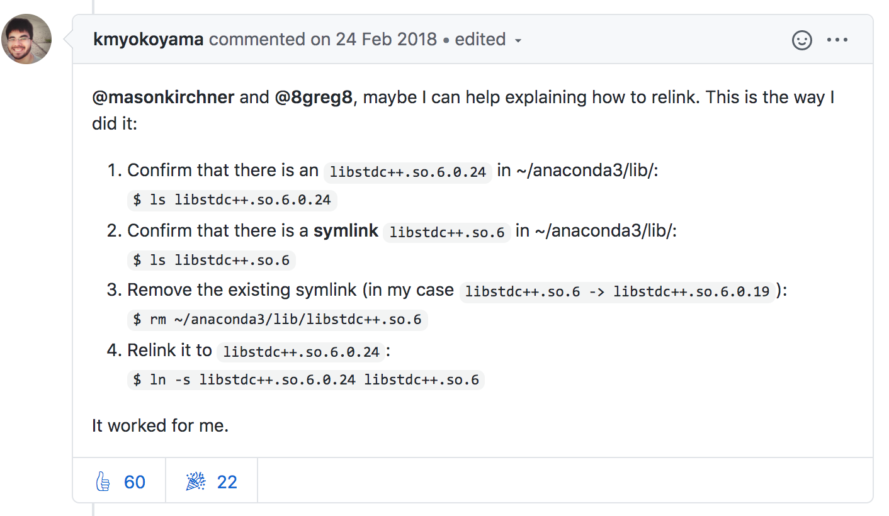
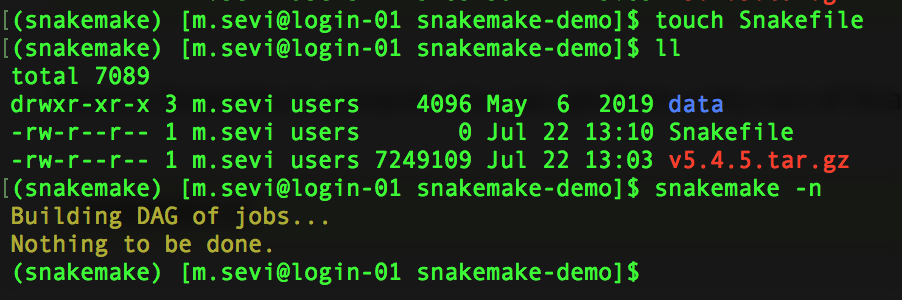
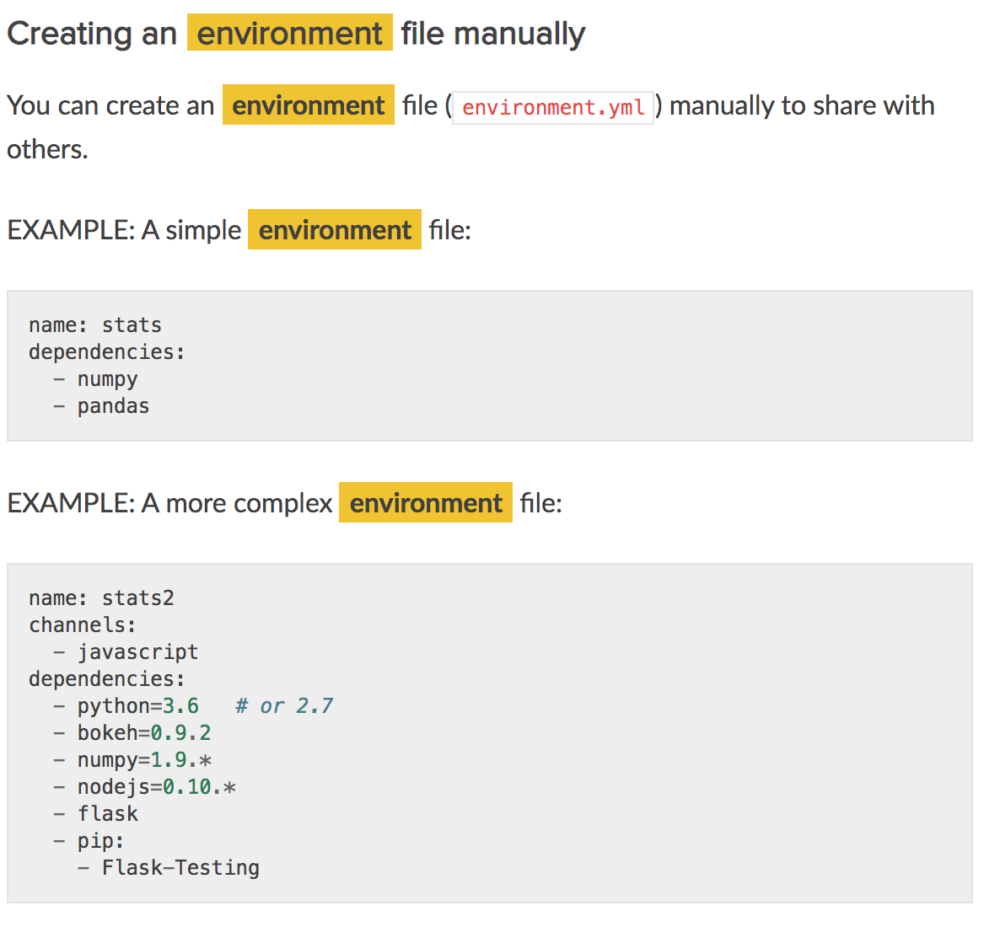
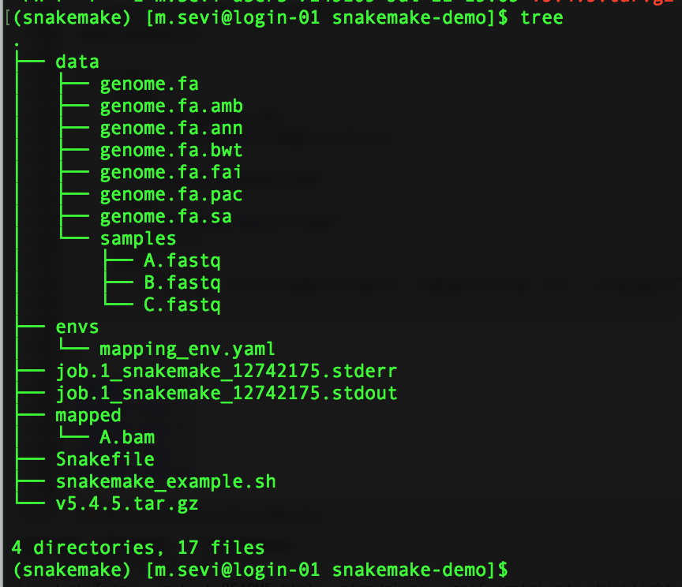
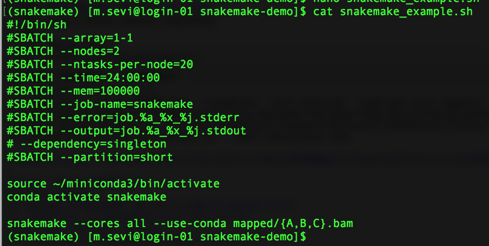
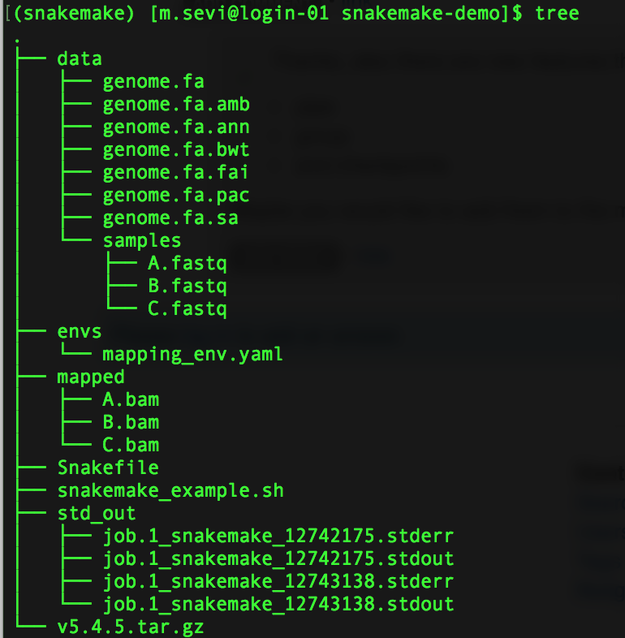

Snakemake
================

Reproducibility
---------------

### The aim: <a href="https://nbisweden.github.io/RaukR-2019/rr/presentation/rr_presentation.html#1" target="_blank">Reproducible research</a>

The ultimate objective for our research is to generate and disseminate *usable* knowledge.

In this iterative process, ideally, we would like our projects to have one or more of the following characteristics:
- Ability to rerun **workflows**
- Incorporate feedback and make changes \[Additional data/New data\]
- Return to a project
- Hand off projects
- Collaborate with others

### Workflow

Put simply, a workflow consists of multiple steps that take raw data or previous outputs as input, execute a set of instructions and outputs something.

Generally, we want to:
- Manage data (wrangle, input)
- Do an analysis
- Make tables and plots
- Integrate the tables and graphs into a manuscript

### The means: <a href="" target="_blank">workflow managers</a>

One way to manage workflows in a reproducible manner is to use:

#### Snakemake

<a href="https://snakemake.readthedocs.io/en/stable/index.html" target="_blank">Snakemake</a> is "a tool to create reproducible and scalable data analyses". It allows for **automation** of commands in a single script and **scalability** for reproducible data analyses handling *parallelization* all while being *portable*. It was created by <a href="https://academic.oup.com/bioinformatics/article/28/19/2520/290322" target="_blank">Koesters et al</a> in 2012

The three essential elements of a SNAKEMAKE workflow are:

1.  Inputs: user defined/provided or outputs
2.  Rules/steps/jobs: workflow definitions that use inputs and return outputs
3.  Output: target that does not exist

-   Rules can use commands written in shell or Python or external Python or R scripts. Further rules can be generalized by named wildcards.


-   We can execute Snakemake workflows in a distributed computing (e.g. cluster) without modification, scheduling can be constrained by resources like e.g. available CPU cores, memory or GPUs.


-   We can use conda to call/install software and singularity contained docker images

##### Three phases of workflow execution

 DAG is a directed acyclic graph (DAG) of jobs where the edges represent dependencies.

Take a look at this useful <a href="https://snakemake.readthedocs.io/en/stable/tutorial/basics.html" target="_blank">example workflow</a> and <a href="https://slides.com/johanneskoester/snakemake-tutorial#/" target="_blank">these</a> complimentary slides.

If you want to incorporate Rmarkdown here's a simple script:

``` bash
rule exploratory_analysis:
    input:
        "data/tec_sceset_qc.rds", "analysis/02_exploratory_analysis.html"
    output:
        "data/tec_sceset_clusters.rds",
        "analysis/02_exploratory_analysis.Rmd",
        "data/deseq2_results.csv"
    shell:
        "Rscript -e \"rmarkdown::render('analysis/02_exploratory_analysis.Rmd')\""
```

##### Snakemake: Installation

Following the readthedocs suggestion, we can use conda to install snakemake.

``` bash

<!-- new conda solver -->
conda install -c conda-forge mamba

<!-- installation with mamba into isolated snakemake environment -->

mamba create -c conda-forge -c bioconda -n snakemake snakemake
```

When running the above command, ran into a symbolic link issue:

it was looking for a specific version \`CXXABI\_1.3.11' that was not found in libstdc++.so.6.0.21, the solution was to remove existing links and relink to libstdc++.so.6.0.25



Thanks <a href="https://github.com/ContinuumIO/anaconda-issues/issues/5191" target="_blank">kmyokoyama</a>



``` bash
conda activate snakemake
snakemake --help
```

##### Snakemake: Minimal example - Read mapping

Copy data from <https://snakemake.readthedocs.io/en/stable/tutorial/short.html>

The objective is to map sample fastq reads to reference genome using BWA.

The three essential elements of THIS SNAKEMAKE workflow are:

1.  Inputs: samples & reference genome
2.  Rules: bwa mapping
3.  Output: sam/bam files

``` bash
mkdir snakemake-demo
cd snakemake-demo
wget https://github.com/snakemake/snakemake-tutorial-data/archive/v5.4.5.tar.gz
tar --wildcards -xf v5.4.5.tar.gz --strip 1 "*/data"
```

###### Step 1 Workflow file and dry run

`touch Snakefile`

`snakemake -n`



###### Step 2 Inspect data and create rules


For full reproducibility we can provide the software and version required to run the workflow. conda environment definition: `envs/mapping_env.yaml`

``` bash
mkdir envs
touch envs/mapping_env.yaml
nano envs/mapping_env.yaml
cat envs/mapping_env.yaml

channels:
  - bioconda
  - conda-forge
dependencies:
  - bwa =0.7.17
  - samtools =1.9
```



**Create rule**

``` bash
nano Snakefile

rule bwa:
    input:
        "data/genome.fa",
        "data/samples/A.fastq"
    output:
        "mapped/A.bam"
    conda:
        "envs/mapping_env.yaml"
    threads: 8    
    shell:
        "bwa mem -t {threads} {input} | samtools view -Sb - > {output}"
```

**Dry run:**
I will run this in a shell script to use Discovery's SLURM system

`snakemake --use-conda -n mapped/A.bam`


**Execute**

`snakemake --cores all --use-conda mapped/A.bam`

``` bash
cat snakemake_example.sh 

#!/bin/sh
#SBATCH --array=1-1
#SBATCH --nodes=2
#SBATCH --ntasks-per-node=20
#SBATCH --time=24:00:00
#SBATCH --mem=100000
#SBATCH --job-name=snakemake
#SBATCH --error=job.%a_%x_%j.stderr
#SBATCH --output=job.%a_%x_%j.stdout
# --dependency=singleton
#SBATCH --partition=short

source ~/miniconda3/bin/activate
conda activate snakemake

snakemake --cores all --use-conda mapped/A.bam
```




###### Step 3 Generalize with wildcards

``` bash
nano Snakefile

rule bwa:
    input:
       "data/genome.fa",
       "data/samples/{sample}.fastq"
    output:
        "mapped/{sample}.bam"
    conda:
        "envs/mapping_env.yaml"
    threads: 8    
    shell:
        "bwa mem -t {threads} {input} | samtools view -Sb - > {output}"
```

**Dry-run and print command**

`snakemake --cores all --use-conda -np mapped/{A,B,C}.bam`


See anything unexpected/different?



**Output**



##### Snakemake: parallelization

Coming soon!

#### Nextflow

Coming soon!

#### ROpenSci alternative: <a href="https://books.ropensci.org/drake/" target="_blank">drake</a>

Coming soon!
