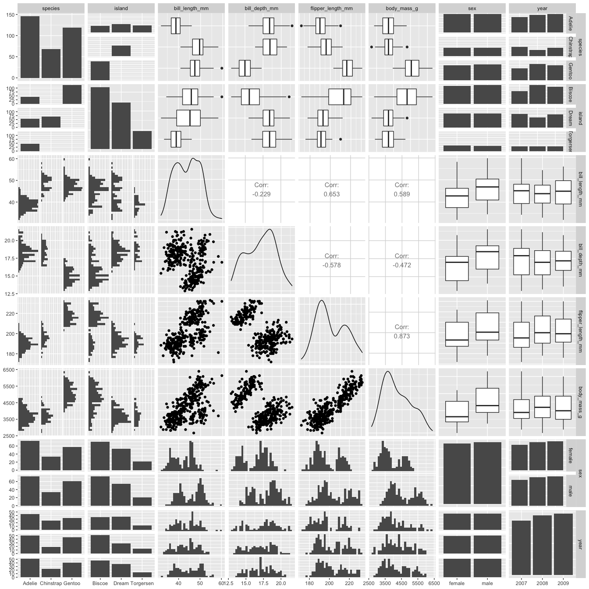

# Tidy Tuesday: Penguins

The objectives for this week are manyfold. 
First, last week we talked about `yaml` files briefly, but I've never manipulated this metadata intentionally in the past. Second, after watching [this](https://rstudio.com/resources/rstudioconf-2020/of-teacups-giraffes-r-markdown/){target="_blank"} talk by [Desirée De Leon](https://desiree.rbind.io/){target="_blank"} I wanted to attempt some of the principles that were used to create [**Teacups, giraffes and statistics**](https://tinystats.github.io/teacups-giraffes-and-statistics/){target="_blank"}:

1. good characters  
2. good play  
3. good design  

Third, I wanted to further explore the TidyTuesday dataset on [Penguins](https://github.com/rfordatascience/tidytuesday/blob/master/data/2020/2020-07-28/readme.md){target="_blank"} using the `GGally` package.   

<br>
**Let's get started!**


- We got the **good characters** art down since it is provided by [Dr. Allison Horst](https://twitter.com/allison_horst), along with data collected and made available by [Dr. Kristen Gorman](https://www.uaf.edu/cfos/people/faculty/detail/kristen-gorman.php){target="_blank"}, and a nice package that was developed with [Dr. Allison Hill](https://alison.rbind.io/){target="_blank"}: `palmerpenguins`, think of iris, but with penguins.

- For the **good play** I will incorporate an interactive component to this Rmarkdown. Aside from using `plotly` for visualization, we could use the package `learnr` which present data/information in a format that has optimal tutorial elements (e.g. equations, videos, code exercise, quizzes, shiny components).

- In the **good design** criteria I've incorporated *div tips* to make the document stand out a bit. Here's a [link](https://desiree.rbind.io/post/2019/making-tip-boxes-with-bookdown-and-rmarkdown/){target="_blank"} on how to make them.  

<div class="note">
There are a few options incorporated into the YAML configuration.The header used was imported from an HTML file targeting a local image file of Iter penguins. 
<br> Available highlighting styles for code chunks can be listed with the following line in the terminal: `pandoc --list-highlight-styles`. For this file, I used `zenburn`. File themes can also be updated from the default using pre-packaged themes, or we can download R packages with additional themes, check out this [blogpost](https://www.datadreaming.org/post/r-markdown-theme-gallery/){target="_blank"}, in this document I used `simplex` theme.
<br>For all the div tips used here, I incorporated the colors from the Iter penguins artwork using color slurp and the Google font Indie Flower was imported to the CSS style file. The images within div tips are courtesy of Desirée De Leon.</b>
</div>

## Load libraries
  
<div class="fyi">
We will use `plotly` for interactive plots, `GGally` for scatterplot matrix correlograms.
</div>


```r
suppressPackageStartupMessages(library(tidyverse))
library(plotly)
library(skimr)
library(GGally)
```

## Get Data


```r
penguins<- readr::read_csv('https://raw.githubusercontent.com/rfordatascience/tidytuesday/master/data/2020/2020-07-28/penguins.csv')
```

## Inspect Data


```r
skim(penguins)
```


Table: Data summary

|                         |         |
|:------------------------|:--------|
|Name                     |penguins |
|Number of rows           |344      |
|Number of columns        |8        |
|_______________________  |         |
|Column type frequency:   |         |
|character                |3        |
|numeric                  |5        |
|________________________ |         |
|Group variables          |         |


**Variable type: character**

|skim_variable | n_missing| complete_rate| min| max| empty| n_unique| whitespace|
|:-------------|---------:|-------------:|---:|---:|-----:|--------:|----------:|
|species       |         0|          1.00|   6|   9|     0|        3|          0|
|island        |         0|          1.00|   5|   9|     0|        3|          0|
|sex           |        11|          0.97|   4|   6|     0|        2|          0|


**Variable type: numeric**

|skim_variable     | n_missing| complete_rate|    mean|     sd|     p0|     p25|     p50|    p75|   p100|hist  |
|:-----------------|---------:|-------------:|-------:|------:|------:|-------:|-------:|------:|------:|:-----|
|bill_length_mm    |         2|          0.99|   43.92|   5.46|   32.1|   39.23|   44.45|   48.5|   59.6|▃▇▇▆▁ |
|bill_depth_mm     |         2|          0.99|   17.15|   1.97|   13.1|   15.60|   17.30|   18.7|   21.5|▅▅▇▇▂ |
|flipper_length_mm |         2|          0.99|  200.92|  14.06|  172.0|  190.00|  197.00|  213.0|  231.0|▂▇▃▅▂ |
|body_mass_g       |         2|          0.99| 4201.75| 801.95| 2700.0| 3550.00| 4050.00| 4750.0| 6300.0|▃▇▆▃▂ |
|year              |         0|          1.00| 2008.03|   0.82| 2007.0| 2007.00| 2008.00| 2009.0| 2009.0|▇▁▇▁▇ |


## Data Wrangling 

<div class="puzzle">
The downloaded data is pretty clean, besides filtering missing data from the sex variable, I just tallied observations.
</div>


```r
penguins_df<- penguins %>%
  drop_na() %>%
  mutate(year=as.factor(year))
```

## Visualization


```r
ggpairs(penguins_df)
```

<!-- -->

## Interactive

<div class="demo">
Click on legend label to remove observations from plots!
</div>


```r
p<- ggplot(penguins_df, aes(flipper_length_mm, bill_length_mm, fill= species, color=species)) +
  geom_point() +
  geom_smooth(method='lm', formula= y~x) +
  hrbrthemes::theme_ipsum() +
  scale_fill_manual(values = c("#FF8000", "#C85BCA", "#0E7274")) +
  scale_color_manual(values = c("#FF8000", "#C85BCA", "#0E7274"))

ggplotly(p, height = 800, width = 800)
```

<!--html_preserve--><div id="htmlwidget-6c4a0e606983bffb623b" style="width:800px;height:800px;" class="plotly html-widget"></div>
<script type="application/json" data-for="htmlwidget-6c4a0e606983bffb623b">{"x":{"data":[{"x":[181,186,195,193,190,181,195,182,191,198,185,195,197,184,194,174,180,189,185,180,187,183,187,172,180,178,178,188,184,195,196,190,180,181,184,182,195,186,196,185,190,182,190,191,186,188,190,200,187,191,186,193,181,194,185,195,185,192,184,192,195,188,190,198,190,190,196,197,190,195,191,184,187,195,189,196,187,193,191,194,190,189,189,190,202,205,185,186,187,208,190,196,178,192,192,203,183,190,193,184,199,190,181,197,198,191,193,197,191,196,188,199,189,189,187,198,176,202,186,199,191,195,191,210,190,197,193,199,187,190,191,200,185,193,193,187,188,190,192,185,190,184,195,193,187,201],"y":[39.1,39.5,40.3,36.7,39.3,38.9,39.2,41.1,38.6,34.6,36.6,38.7,42.5,34.4,46,37.8,37.7,35.9,38.2,38.8,35.3,40.6,40.5,37.9,40.5,39.5,37.2,39.5,40.9,36.4,39.2,38.8,42.2,37.6,39.8,36.5,40.8,36,44.1,37,39.6,41.1,36,42.3,39.6,40.1,35,42,34.5,41.4,39,40.6,36.5,37.6,35.7,41.3,37.6,41.1,36.4,41.6,35.5,41.1,35.9,41.8,33.5,39.7,39.6,45.8,35.5,42.8,40.9,37.2,36.2,42.1,34.6,42.9,36.7,35.1,37.3,41.3,36.3,36.9,38.3,38.9,35.7,41.1,34,39.6,36.2,40.8,38.1,40.3,33.1,43.2,35,41,37.7,37.8,37.9,39.7,38.6,38.2,38.1,43.2,38.1,45.6,39.7,42.2,39.6,42.7,38.6,37.3,35.7,41.1,36.2,37.7,40.2,41.4,35.2,40.6,38.8,41.5,39,44.1,38.5,43.1,36.8,37.5,38.1,41.1,35.6,40.2,37,39.7,40.2,40.6,32.1,40.7,37.3,39,39.2,36.6,36,37.8,36,41.5],"text":["flipper_length_mm: 181<br />bill_length_mm: 39.1<br />species: Adelie<br />species: Adelie","flipper_length_mm: 186<br />bill_length_mm: 39.5<br />species: Adelie<br />species: Adelie","flipper_length_mm: 195<br />bill_length_mm: 40.3<br />species: Adelie<br />species: Adelie","flipper_length_mm: 193<br />bill_length_mm: 36.7<br />species: Adelie<br />species: Adelie","flipper_length_mm: 190<br />bill_length_mm: 39.3<br />species: Adelie<br />species: Adelie","flipper_length_mm: 181<br />bill_length_mm: 38.9<br />species: Adelie<br />species: Adelie","flipper_length_mm: 195<br />bill_length_mm: 39.2<br />species: Adelie<br />species: Adelie","flipper_length_mm: 182<br />bill_length_mm: 41.1<br />species: Adelie<br />species: Adelie","flipper_length_mm: 191<br />bill_length_mm: 38.6<br />species: Adelie<br />species: Adelie","flipper_length_mm: 198<br />bill_length_mm: 34.6<br />species: Adelie<br />species: Adelie","flipper_length_mm: 185<br />bill_length_mm: 36.6<br />species: Adelie<br />species: Adelie","flipper_length_mm: 195<br />bill_length_mm: 38.7<br />species: Adelie<br />species: Adelie","flipper_length_mm: 197<br />bill_length_mm: 42.5<br />species: Adelie<br />species: Adelie","flipper_length_mm: 184<br />bill_length_mm: 34.4<br />species: Adelie<br />species: Adelie","flipper_length_mm: 194<br />bill_length_mm: 46.0<br />species: Adelie<br />species: Adelie","flipper_length_mm: 174<br />bill_length_mm: 37.8<br />species: Adelie<br />species: Adelie","flipper_length_mm: 180<br />bill_length_mm: 37.7<br />species: Adelie<br />species: Adelie","flipper_length_mm: 189<br />bill_length_mm: 35.9<br />species: Adelie<br />species: Adelie","flipper_length_mm: 185<br />bill_length_mm: 38.2<br />species: Adelie<br />species: Adelie","flipper_length_mm: 180<br />bill_length_mm: 38.8<br />species: Adelie<br />species: Adelie","flipper_length_mm: 187<br />bill_length_mm: 35.3<br />species: Adelie<br />species: Adelie","flipper_length_mm: 183<br />bill_length_mm: 40.6<br />species: Adelie<br />species: Adelie","flipper_length_mm: 187<br />bill_length_mm: 40.5<br />species: Adelie<br />species: Adelie","flipper_length_mm: 172<br />bill_length_mm: 37.9<br />species: Adelie<br />species: Adelie","flipper_length_mm: 180<br />bill_length_mm: 40.5<br />species: Adelie<br />species: Adelie","flipper_length_mm: 178<br />bill_length_mm: 39.5<br />species: Adelie<br />species: Adelie","flipper_length_mm: 178<br />bill_length_mm: 37.2<br />species: Adelie<br />species: Adelie","flipper_length_mm: 188<br />bill_length_mm: 39.5<br />species: Adelie<br />species: Adelie","flipper_length_mm: 184<br />bill_length_mm: 40.9<br />species: Adelie<br />species: Adelie","flipper_length_mm: 195<br />bill_length_mm: 36.4<br />species: Adelie<br />species: Adelie","flipper_length_mm: 196<br />bill_length_mm: 39.2<br />species: Adelie<br />species: Adelie","flipper_length_mm: 190<br />bill_length_mm: 38.8<br />species: Adelie<br />species: Adelie","flipper_length_mm: 180<br />bill_length_mm: 42.2<br />species: Adelie<br />species: Adelie","flipper_length_mm: 181<br />bill_length_mm: 37.6<br />species: Adelie<br />species: Adelie","flipper_length_mm: 184<br />bill_length_mm: 39.8<br />species: Adelie<br />species: Adelie","flipper_length_mm: 182<br />bill_length_mm: 36.5<br />species: Adelie<br />species: Adelie","flipper_length_mm: 195<br />bill_length_mm: 40.8<br />species: Adelie<br />species: Adelie","flipper_length_mm: 186<br />bill_length_mm: 36.0<br />species: Adelie<br />species: Adelie","flipper_length_mm: 196<br />bill_length_mm: 44.1<br />species: Adelie<br />species: Adelie","flipper_length_mm: 185<br />bill_length_mm: 37.0<br />species: Adelie<br />species: Adelie","flipper_length_mm: 190<br />bill_length_mm: 39.6<br />species: Adelie<br />species: Adelie","flipper_length_mm: 182<br />bill_length_mm: 41.1<br />species: Adelie<br />species: Adelie","flipper_length_mm: 190<br />bill_length_mm: 36.0<br />species: Adelie<br />species: Adelie","flipper_length_mm: 191<br />bill_length_mm: 42.3<br />species: Adelie<br />species: Adelie","flipper_length_mm: 186<br />bill_length_mm: 39.6<br />species: Adelie<br />species: Adelie","flipper_length_mm: 188<br />bill_length_mm: 40.1<br />species: Adelie<br />species: Adelie","flipper_length_mm: 190<br />bill_length_mm: 35.0<br />species: Adelie<br />species: Adelie","flipper_length_mm: 200<br />bill_length_mm: 42.0<br />species: Adelie<br />species: Adelie","flipper_length_mm: 187<br />bill_length_mm: 34.5<br />species: Adelie<br />species: Adelie","flipper_length_mm: 191<br />bill_length_mm: 41.4<br />species: Adelie<br />species: Adelie","flipper_length_mm: 186<br />bill_length_mm: 39.0<br />species: Adelie<br />species: Adelie","flipper_length_mm: 193<br />bill_length_mm: 40.6<br />species: Adelie<br />species: Adelie","flipper_length_mm: 181<br />bill_length_mm: 36.5<br />species: Adelie<br />species: Adelie","flipper_length_mm: 194<br />bill_length_mm: 37.6<br />species: Adelie<br />species: Adelie","flipper_length_mm: 185<br />bill_length_mm: 35.7<br />species: Adelie<br />species: Adelie","flipper_length_mm: 195<br />bill_length_mm: 41.3<br />species: Adelie<br />species: Adelie","flipper_length_mm: 185<br />bill_length_mm: 37.6<br />species: Adelie<br />species: Adelie","flipper_length_mm: 192<br />bill_length_mm: 41.1<br />species: Adelie<br />species: Adelie","flipper_length_mm: 184<br />bill_length_mm: 36.4<br />species: Adelie<br />species: Adelie","flipper_length_mm: 192<br />bill_length_mm: 41.6<br />species: Adelie<br />species: Adelie","flipper_length_mm: 195<br />bill_length_mm: 35.5<br />species: Adelie<br />species: Adelie","flipper_length_mm: 188<br />bill_length_mm: 41.1<br />species: Adelie<br />species: Adelie","flipper_length_mm: 190<br />bill_length_mm: 35.9<br />species: Adelie<br />species: Adelie","flipper_length_mm: 198<br />bill_length_mm: 41.8<br />species: Adelie<br />species: Adelie","flipper_length_mm: 190<br />bill_length_mm: 33.5<br />species: Adelie<br />species: Adelie","flipper_length_mm: 190<br />bill_length_mm: 39.7<br />species: Adelie<br />species: Adelie","flipper_length_mm: 196<br />bill_length_mm: 39.6<br />species: Adelie<br />species: Adelie","flipper_length_mm: 197<br />bill_length_mm: 45.8<br />species: Adelie<br />species: Adelie","flipper_length_mm: 190<br />bill_length_mm: 35.5<br />species: Adelie<br />species: Adelie","flipper_length_mm: 195<br />bill_length_mm: 42.8<br />species: Adelie<br />species: Adelie","flipper_length_mm: 191<br />bill_length_mm: 40.9<br />species: Adelie<br />species: Adelie","flipper_length_mm: 184<br />bill_length_mm: 37.2<br />species: Adelie<br />species: Adelie","flipper_length_mm: 187<br />bill_length_mm: 36.2<br />species: Adelie<br />species: Adelie","flipper_length_mm: 195<br />bill_length_mm: 42.1<br />species: Adelie<br />species: Adelie","flipper_length_mm: 189<br />bill_length_mm: 34.6<br />species: Adelie<br />species: Adelie","flipper_length_mm: 196<br />bill_length_mm: 42.9<br />species: Adelie<br />species: Adelie","flipper_length_mm: 187<br />bill_length_mm: 36.7<br />species: Adelie<br />species: Adelie","flipper_length_mm: 193<br />bill_length_mm: 35.1<br />species: Adelie<br />species: Adelie","flipper_length_mm: 191<br />bill_length_mm: 37.3<br />species: Adelie<br />species: Adelie","flipper_length_mm: 194<br />bill_length_mm: 41.3<br />species: Adelie<br />species: Adelie","flipper_length_mm: 190<br />bill_length_mm: 36.3<br />species: Adelie<br />species: Adelie","flipper_length_mm: 189<br />bill_length_mm: 36.9<br />species: Adelie<br />species: Adelie","flipper_length_mm: 189<br />bill_length_mm: 38.3<br />species: Adelie<br />species: Adelie","flipper_length_mm: 190<br />bill_length_mm: 38.9<br />species: Adelie<br />species: Adelie","flipper_length_mm: 202<br />bill_length_mm: 35.7<br />species: Adelie<br />species: Adelie","flipper_length_mm: 205<br />bill_length_mm: 41.1<br />species: Adelie<br />species: Adelie","flipper_length_mm: 185<br />bill_length_mm: 34.0<br />species: Adelie<br />species: Adelie","flipper_length_mm: 186<br />bill_length_mm: 39.6<br />species: Adelie<br />species: Adelie","flipper_length_mm: 187<br />bill_length_mm: 36.2<br />species: Adelie<br />species: Adelie","flipper_length_mm: 208<br />bill_length_mm: 40.8<br />species: Adelie<br />species: Adelie","flipper_length_mm: 190<br />bill_length_mm: 38.1<br />species: Adelie<br />species: Adelie","flipper_length_mm: 196<br />bill_length_mm: 40.3<br />species: Adelie<br />species: Adelie","flipper_length_mm: 178<br />bill_length_mm: 33.1<br />species: Adelie<br />species: Adelie","flipper_length_mm: 192<br />bill_length_mm: 43.2<br />species: Adelie<br />species: Adelie","flipper_length_mm: 192<br />bill_length_mm: 35.0<br />species: Adelie<br />species: Adelie","flipper_length_mm: 203<br />bill_length_mm: 41.0<br />species: Adelie<br />species: Adelie","flipper_length_mm: 183<br />bill_length_mm: 37.7<br />species: Adelie<br />species: Adelie","flipper_length_mm: 190<br />bill_length_mm: 37.8<br />species: Adelie<br />species: Adelie","flipper_length_mm: 193<br />bill_length_mm: 37.9<br />species: Adelie<br />species: Adelie","flipper_length_mm: 184<br />bill_length_mm: 39.7<br />species: Adelie<br />species: Adelie","flipper_length_mm: 199<br />bill_length_mm: 38.6<br />species: Adelie<br />species: Adelie","flipper_length_mm: 190<br />bill_length_mm: 38.2<br />species: Adelie<br />species: Adelie","flipper_length_mm: 181<br />bill_length_mm: 38.1<br />species: Adelie<br />species: Adelie","flipper_length_mm: 197<br />bill_length_mm: 43.2<br />species: Adelie<br />species: Adelie","flipper_length_mm: 198<br />bill_length_mm: 38.1<br />species: Adelie<br />species: Adelie","flipper_length_mm: 191<br />bill_length_mm: 45.6<br />species: Adelie<br />species: Adelie","flipper_length_mm: 193<br />bill_length_mm: 39.7<br />species: Adelie<br />species: Adelie","flipper_length_mm: 197<br />bill_length_mm: 42.2<br />species: Adelie<br />species: Adelie","flipper_length_mm: 191<br />bill_length_mm: 39.6<br />species: Adelie<br />species: Adelie","flipper_length_mm: 196<br />bill_length_mm: 42.7<br />species: Adelie<br />species: Adelie","flipper_length_mm: 188<br />bill_length_mm: 38.6<br />species: Adelie<br />species: Adelie","flipper_length_mm: 199<br />bill_length_mm: 37.3<br />species: Adelie<br />species: Adelie","flipper_length_mm: 189<br />bill_length_mm: 35.7<br />species: Adelie<br />species: Adelie","flipper_length_mm: 189<br />bill_length_mm: 41.1<br />species: Adelie<br />species: Adelie","flipper_length_mm: 187<br />bill_length_mm: 36.2<br />species: Adelie<br />species: Adelie","flipper_length_mm: 198<br />bill_length_mm: 37.7<br />species: Adelie<br />species: Adelie","flipper_length_mm: 176<br />bill_length_mm: 40.2<br />species: Adelie<br />species: Adelie","flipper_length_mm: 202<br />bill_length_mm: 41.4<br />species: Adelie<br />species: Adelie","flipper_length_mm: 186<br />bill_length_mm: 35.2<br />species: Adelie<br />species: Adelie","flipper_length_mm: 199<br />bill_length_mm: 40.6<br />species: Adelie<br />species: Adelie","flipper_length_mm: 191<br />bill_length_mm: 38.8<br />species: Adelie<br />species: Adelie","flipper_length_mm: 195<br />bill_length_mm: 41.5<br />species: Adelie<br />species: Adelie","flipper_length_mm: 191<br />bill_length_mm: 39.0<br />species: Adelie<br />species: Adelie","flipper_length_mm: 210<br />bill_length_mm: 44.1<br />species: Adelie<br />species: Adelie","flipper_length_mm: 190<br />bill_length_mm: 38.5<br />species: Adelie<br />species: Adelie","flipper_length_mm: 197<br />bill_length_mm: 43.1<br />species: Adelie<br />species: Adelie","flipper_length_mm: 193<br />bill_length_mm: 36.8<br />species: Adelie<br />species: Adelie","flipper_length_mm: 199<br />bill_length_mm: 37.5<br />species: Adelie<br />species: Adelie","flipper_length_mm: 187<br />bill_length_mm: 38.1<br />species: Adelie<br />species: Adelie","flipper_length_mm: 190<br />bill_length_mm: 41.1<br />species: Adelie<br />species: Adelie","flipper_length_mm: 191<br />bill_length_mm: 35.6<br />species: Adelie<br />species: Adelie","flipper_length_mm: 200<br />bill_length_mm: 40.2<br />species: Adelie<br />species: Adelie","flipper_length_mm: 185<br />bill_length_mm: 37.0<br />species: Adelie<br />species: Adelie","flipper_length_mm: 193<br />bill_length_mm: 39.7<br />species: Adelie<br />species: Adelie","flipper_length_mm: 193<br />bill_length_mm: 40.2<br />species: Adelie<br />species: Adelie","flipper_length_mm: 187<br />bill_length_mm: 40.6<br />species: Adelie<br />species: Adelie","flipper_length_mm: 188<br />bill_length_mm: 32.1<br />species: Adelie<br />species: Adelie","flipper_length_mm: 190<br />bill_length_mm: 40.7<br />species: Adelie<br />species: Adelie","flipper_length_mm: 192<br />bill_length_mm: 37.3<br />species: Adelie<br />species: Adelie","flipper_length_mm: 185<br />bill_length_mm: 39.0<br />species: Adelie<br />species: Adelie","flipper_length_mm: 190<br />bill_length_mm: 39.2<br />species: Adelie<br />species: Adelie","flipper_length_mm: 184<br />bill_length_mm: 36.6<br />species: Adelie<br />species: Adelie","flipper_length_mm: 195<br />bill_length_mm: 36.0<br />species: Adelie<br />species: Adelie","flipper_length_mm: 193<br />bill_length_mm: 37.8<br />species: Adelie<br />species: Adelie","flipper_length_mm: 187<br />bill_length_mm: 36.0<br />species: Adelie<br />species: Adelie","flipper_length_mm: 201<br />bill_length_mm: 41.5<br />species: Adelie<br />species: Adelie"],"type":"scatter","mode":"markers","marker":{"autocolorscale":false,"color":"rgba(255,128,0,1)","opacity":1,"size":5.66929133858268,"symbol":"circle","line":{"width":1.88976377952756,"color":"rgba(255,128,0,1)"}},"hoveron":"points","name":"Adelie","legendgroup":"Adelie","showlegend":true,"xaxis":"x","yaxis":"y","hoverinfo":"text","frame":null},{"x":[192,196,193,188,197,198,178,197,195,198,193,194,185,201,190,201,197,181,190,195,181,191,187,193,195,197,200,200,191,205,187,201,187,203,195,199,195,210,192,205,210,187,196,196,196,201,190,212,187,198,199,201,193,203,187,197,191,203,202,194,206,189,195,207,202,193,210,198],"y":[46.5,50,51.3,45.4,52.7,45.2,46.1,51.3,46,51.3,46.6,51.7,47,52,45.9,50.5,50.3,58,46.4,49.2,42.4,48.5,43.2,50.6,46.7,52,50.5,49.5,46.4,52.8,40.9,54.2,42.5,51,49.7,47.5,47.6,52,46.9,53.5,49,46.2,50.9,45.5,50.9,50.8,50.1,49,51.5,49.8,48.1,51.4,45.7,50.7,42.5,52.2,45.2,49.3,50.2,45.6,51.9,46.8,45.7,55.8,43.5,49.6,50.8,50.2],"text":["flipper_length_mm: 192<br />bill_length_mm: 46.5<br />species: Chinstrap<br />species: Chinstrap","flipper_length_mm: 196<br />bill_length_mm: 50.0<br />species: Chinstrap<br />species: Chinstrap","flipper_length_mm: 193<br />bill_length_mm: 51.3<br />species: Chinstrap<br />species: Chinstrap","flipper_length_mm: 188<br />bill_length_mm: 45.4<br />species: Chinstrap<br />species: Chinstrap","flipper_length_mm: 197<br />bill_length_mm: 52.7<br />species: Chinstrap<br />species: Chinstrap","flipper_length_mm: 198<br />bill_length_mm: 45.2<br />species: Chinstrap<br />species: Chinstrap","flipper_length_mm: 178<br />bill_length_mm: 46.1<br />species: Chinstrap<br />species: Chinstrap","flipper_length_mm: 197<br />bill_length_mm: 51.3<br />species: Chinstrap<br />species: Chinstrap","flipper_length_mm: 195<br />bill_length_mm: 46.0<br />species: Chinstrap<br />species: Chinstrap","flipper_length_mm: 198<br />bill_length_mm: 51.3<br />species: Chinstrap<br />species: Chinstrap","flipper_length_mm: 193<br />bill_length_mm: 46.6<br />species: Chinstrap<br />species: Chinstrap","flipper_length_mm: 194<br />bill_length_mm: 51.7<br />species: Chinstrap<br />species: Chinstrap","flipper_length_mm: 185<br />bill_length_mm: 47.0<br />species: Chinstrap<br />species: Chinstrap","flipper_length_mm: 201<br />bill_length_mm: 52.0<br />species: Chinstrap<br />species: Chinstrap","flipper_length_mm: 190<br />bill_length_mm: 45.9<br />species: Chinstrap<br />species: Chinstrap","flipper_length_mm: 201<br />bill_length_mm: 50.5<br />species: Chinstrap<br />species: Chinstrap","flipper_length_mm: 197<br />bill_length_mm: 50.3<br />species: Chinstrap<br />species: Chinstrap","flipper_length_mm: 181<br />bill_length_mm: 58.0<br />species: Chinstrap<br />species: Chinstrap","flipper_length_mm: 190<br />bill_length_mm: 46.4<br />species: Chinstrap<br />species: Chinstrap","flipper_length_mm: 195<br />bill_length_mm: 49.2<br />species: Chinstrap<br />species: Chinstrap","flipper_length_mm: 181<br />bill_length_mm: 42.4<br />species: Chinstrap<br />species: Chinstrap","flipper_length_mm: 191<br />bill_length_mm: 48.5<br />species: Chinstrap<br />species: Chinstrap","flipper_length_mm: 187<br />bill_length_mm: 43.2<br />species: Chinstrap<br />species: Chinstrap","flipper_length_mm: 193<br />bill_length_mm: 50.6<br />species: Chinstrap<br />species: Chinstrap","flipper_length_mm: 195<br />bill_length_mm: 46.7<br />species: Chinstrap<br />species: Chinstrap","flipper_length_mm: 197<br />bill_length_mm: 52.0<br />species: Chinstrap<br />species: Chinstrap","flipper_length_mm: 200<br />bill_length_mm: 50.5<br />species: Chinstrap<br />species: Chinstrap","flipper_length_mm: 200<br />bill_length_mm: 49.5<br />species: Chinstrap<br />species: Chinstrap","flipper_length_mm: 191<br />bill_length_mm: 46.4<br />species: Chinstrap<br />species: Chinstrap","flipper_length_mm: 205<br />bill_length_mm: 52.8<br />species: Chinstrap<br />species: Chinstrap","flipper_length_mm: 187<br />bill_length_mm: 40.9<br />species: Chinstrap<br />species: Chinstrap","flipper_length_mm: 201<br />bill_length_mm: 54.2<br />species: Chinstrap<br />species: Chinstrap","flipper_length_mm: 187<br />bill_length_mm: 42.5<br />species: Chinstrap<br />species: Chinstrap","flipper_length_mm: 203<br />bill_length_mm: 51.0<br />species: Chinstrap<br />species: Chinstrap","flipper_length_mm: 195<br />bill_length_mm: 49.7<br />species: Chinstrap<br />species: Chinstrap","flipper_length_mm: 199<br />bill_length_mm: 47.5<br />species: Chinstrap<br />species: Chinstrap","flipper_length_mm: 195<br />bill_length_mm: 47.6<br />species: Chinstrap<br />species: Chinstrap","flipper_length_mm: 210<br />bill_length_mm: 52.0<br />species: Chinstrap<br />species: Chinstrap","flipper_length_mm: 192<br />bill_length_mm: 46.9<br />species: Chinstrap<br />species: Chinstrap","flipper_length_mm: 205<br />bill_length_mm: 53.5<br />species: Chinstrap<br />species: Chinstrap","flipper_length_mm: 210<br />bill_length_mm: 49.0<br />species: Chinstrap<br />species: Chinstrap","flipper_length_mm: 187<br />bill_length_mm: 46.2<br />species: Chinstrap<br />species: Chinstrap","flipper_length_mm: 196<br />bill_length_mm: 50.9<br />species: Chinstrap<br />species: Chinstrap","flipper_length_mm: 196<br />bill_length_mm: 45.5<br />species: Chinstrap<br />species: Chinstrap","flipper_length_mm: 196<br />bill_length_mm: 50.9<br />species: Chinstrap<br />species: Chinstrap","flipper_length_mm: 201<br />bill_length_mm: 50.8<br />species: Chinstrap<br />species: Chinstrap","flipper_length_mm: 190<br />bill_length_mm: 50.1<br />species: Chinstrap<br />species: Chinstrap","flipper_length_mm: 212<br />bill_length_mm: 49.0<br />species: Chinstrap<br />species: Chinstrap","flipper_length_mm: 187<br />bill_length_mm: 51.5<br />species: Chinstrap<br />species: Chinstrap","flipper_length_mm: 198<br />bill_length_mm: 49.8<br />species: Chinstrap<br />species: Chinstrap","flipper_length_mm: 199<br />bill_length_mm: 48.1<br />species: Chinstrap<br />species: Chinstrap","flipper_length_mm: 201<br />bill_length_mm: 51.4<br />species: Chinstrap<br />species: Chinstrap","flipper_length_mm: 193<br />bill_length_mm: 45.7<br />species: Chinstrap<br />species: Chinstrap","flipper_length_mm: 203<br />bill_length_mm: 50.7<br />species: Chinstrap<br />species: Chinstrap","flipper_length_mm: 187<br />bill_length_mm: 42.5<br />species: Chinstrap<br />species: Chinstrap","flipper_length_mm: 197<br />bill_length_mm: 52.2<br />species: Chinstrap<br />species: Chinstrap","flipper_length_mm: 191<br />bill_length_mm: 45.2<br />species: Chinstrap<br />species: Chinstrap","flipper_length_mm: 203<br />bill_length_mm: 49.3<br />species: Chinstrap<br />species: Chinstrap","flipper_length_mm: 202<br />bill_length_mm: 50.2<br />species: Chinstrap<br />species: Chinstrap","flipper_length_mm: 194<br />bill_length_mm: 45.6<br />species: Chinstrap<br />species: Chinstrap","flipper_length_mm: 206<br />bill_length_mm: 51.9<br />species: Chinstrap<br />species: Chinstrap","flipper_length_mm: 189<br />bill_length_mm: 46.8<br />species: Chinstrap<br />species: Chinstrap","flipper_length_mm: 195<br />bill_length_mm: 45.7<br />species: Chinstrap<br />species: Chinstrap","flipper_length_mm: 207<br />bill_length_mm: 55.8<br />species: Chinstrap<br />species: Chinstrap","flipper_length_mm: 202<br />bill_length_mm: 43.5<br />species: Chinstrap<br />species: Chinstrap","flipper_length_mm: 193<br />bill_length_mm: 49.6<br />species: Chinstrap<br />species: Chinstrap","flipper_length_mm: 210<br />bill_length_mm: 50.8<br />species: Chinstrap<br />species: Chinstrap","flipper_length_mm: 198<br />bill_length_mm: 50.2<br />species: Chinstrap<br />species: Chinstrap"],"type":"scatter","mode":"markers","marker":{"autocolorscale":false,"color":"rgba(200,91,202,1)","opacity":1,"size":5.66929133858268,"symbol":"circle","line":{"width":1.88976377952756,"color":"rgba(200,91,202,1)"}},"hoveron":"points","name":"Chinstrap","legendgroup":"Chinstrap","showlegend":true,"xaxis":"x","yaxis":"y","hoverinfo":"text","frame":null},{"x":[211,230,210,218,215,210,211,219,209,215,214,216,214,213,210,217,210,221,209,222,218,215,213,215,215,215,215,210,220,222,209,207,230,220,220,213,219,208,208,208,225,210,216,222,217,210,225,213,215,210,220,210,225,217,220,208,220,208,224,208,221,214,231,219,230,229,220,223,216,221,221,217,216,230,209,220,215,223,212,221,212,224,212,228,218,218,212,230,218,228,212,224,214,226,216,222,203,225,219,228,215,228,215,210,219,208,209,216,229,213,230,217,230,222,214,215,222,212,213],"y":[46.1,50,48.7,50,47.6,46.5,45.4,46.7,43.3,46.8,40.9,49,45.5,48.4,45.8,49.3,42,49.2,46.2,48.7,50.2,45.1,46.5,46.3,42.9,46.1,47.8,48.2,50,47.3,42.8,45.1,59.6,49.1,48.4,42.6,44.4,44,48.7,42.7,49.6,45.3,49.6,50.5,43.6,45.5,50.5,44.9,45.2,46.6,48.5,45.1,50.1,46.5,45,43.8,45.5,43.2,50.4,45.3,46.2,45.7,54.3,45.8,49.8,49.5,43.5,50.7,47.7,46.4,48.2,46.5,46.4,48.6,47.5,51.1,45.2,45.2,49.1,52.5,47.4,50,44.9,50.8,43.4,51.3,47.5,52.1,47.5,52.2,45.5,49.5,44.5,50.8,49.4,46.9,48.4,51.1,48.5,55.9,47.2,49.1,46.8,41.7,53.4,43.3,48.1,50.5,49.8,43.5,51.5,46.2,55.1,48.8,47.2,46.8,50.4,45.2,49.9],"text":["flipper_length_mm: 211<br />bill_length_mm: 46.1<br />species: Gentoo<br />species: Gentoo","flipper_length_mm: 230<br />bill_length_mm: 50.0<br />species: Gentoo<br />species: Gentoo","flipper_length_mm: 210<br />bill_length_mm: 48.7<br />species: Gentoo<br />species: Gentoo","flipper_length_mm: 218<br />bill_length_mm: 50.0<br />species: Gentoo<br />species: Gentoo","flipper_length_mm: 215<br />bill_length_mm: 47.6<br />species: Gentoo<br />species: Gentoo","flipper_length_mm: 210<br />bill_length_mm: 46.5<br />species: Gentoo<br />species: Gentoo","flipper_length_mm: 211<br />bill_length_mm: 45.4<br />species: Gentoo<br />species: Gentoo","flipper_length_mm: 219<br />bill_length_mm: 46.7<br />species: Gentoo<br />species: Gentoo","flipper_length_mm: 209<br />bill_length_mm: 43.3<br />species: Gentoo<br />species: Gentoo","flipper_length_mm: 215<br />bill_length_mm: 46.8<br />species: Gentoo<br />species: Gentoo","flipper_length_mm: 214<br />bill_length_mm: 40.9<br />species: Gentoo<br />species: Gentoo","flipper_length_mm: 216<br />bill_length_mm: 49.0<br />species: Gentoo<br />species: Gentoo","flipper_length_mm: 214<br />bill_length_mm: 45.5<br />species: Gentoo<br />species: Gentoo","flipper_length_mm: 213<br />bill_length_mm: 48.4<br />species: Gentoo<br />species: Gentoo","flipper_length_mm: 210<br />bill_length_mm: 45.8<br />species: Gentoo<br />species: Gentoo","flipper_length_mm: 217<br />bill_length_mm: 49.3<br />species: Gentoo<br />species: Gentoo","flipper_length_mm: 210<br />bill_length_mm: 42.0<br />species: Gentoo<br />species: Gentoo","flipper_length_mm: 221<br />bill_length_mm: 49.2<br />species: Gentoo<br />species: Gentoo","flipper_length_mm: 209<br />bill_length_mm: 46.2<br />species: Gentoo<br />species: Gentoo","flipper_length_mm: 222<br />bill_length_mm: 48.7<br />species: Gentoo<br />species: Gentoo","flipper_length_mm: 218<br />bill_length_mm: 50.2<br />species: Gentoo<br />species: Gentoo","flipper_length_mm: 215<br />bill_length_mm: 45.1<br />species: Gentoo<br />species: Gentoo","flipper_length_mm: 213<br />bill_length_mm: 46.5<br />species: Gentoo<br />species: Gentoo","flipper_length_mm: 215<br />bill_length_mm: 46.3<br />species: Gentoo<br />species: Gentoo","flipper_length_mm: 215<br />bill_length_mm: 42.9<br />species: Gentoo<br />species: Gentoo","flipper_length_mm: 215<br />bill_length_mm: 46.1<br />species: Gentoo<br />species: Gentoo","flipper_length_mm: 215<br />bill_length_mm: 47.8<br />species: Gentoo<br />species: Gentoo","flipper_length_mm: 210<br />bill_length_mm: 48.2<br />species: Gentoo<br />species: Gentoo","flipper_length_mm: 220<br />bill_length_mm: 50.0<br />species: Gentoo<br />species: Gentoo","flipper_length_mm: 222<br />bill_length_mm: 47.3<br />species: Gentoo<br />species: Gentoo","flipper_length_mm: 209<br />bill_length_mm: 42.8<br />species: Gentoo<br />species: Gentoo","flipper_length_mm: 207<br />bill_length_mm: 45.1<br />species: Gentoo<br />species: Gentoo","flipper_length_mm: 230<br />bill_length_mm: 59.6<br />species: Gentoo<br />species: Gentoo","flipper_length_mm: 220<br />bill_length_mm: 49.1<br />species: Gentoo<br />species: Gentoo","flipper_length_mm: 220<br />bill_length_mm: 48.4<br />species: Gentoo<br />species: Gentoo","flipper_length_mm: 213<br />bill_length_mm: 42.6<br />species: Gentoo<br />species: Gentoo","flipper_length_mm: 219<br />bill_length_mm: 44.4<br />species: Gentoo<br />species: Gentoo","flipper_length_mm: 208<br />bill_length_mm: 44.0<br />species: Gentoo<br />species: Gentoo","flipper_length_mm: 208<br />bill_length_mm: 48.7<br />species: Gentoo<br />species: Gentoo","flipper_length_mm: 208<br />bill_length_mm: 42.7<br />species: Gentoo<br />species: Gentoo","flipper_length_mm: 225<br />bill_length_mm: 49.6<br />species: Gentoo<br />species: Gentoo","flipper_length_mm: 210<br />bill_length_mm: 45.3<br />species: Gentoo<br />species: Gentoo","flipper_length_mm: 216<br />bill_length_mm: 49.6<br />species: Gentoo<br />species: Gentoo","flipper_length_mm: 222<br />bill_length_mm: 50.5<br />species: Gentoo<br />species: Gentoo","flipper_length_mm: 217<br />bill_length_mm: 43.6<br />species: Gentoo<br />species: Gentoo","flipper_length_mm: 210<br />bill_length_mm: 45.5<br />species: Gentoo<br />species: Gentoo","flipper_length_mm: 225<br />bill_length_mm: 50.5<br />species: Gentoo<br />species: Gentoo","flipper_length_mm: 213<br />bill_length_mm: 44.9<br />species: Gentoo<br />species: Gentoo","flipper_length_mm: 215<br />bill_length_mm: 45.2<br />species: Gentoo<br />species: Gentoo","flipper_length_mm: 210<br />bill_length_mm: 46.6<br />species: Gentoo<br />species: Gentoo","flipper_length_mm: 220<br />bill_length_mm: 48.5<br />species: Gentoo<br />species: Gentoo","flipper_length_mm: 210<br />bill_length_mm: 45.1<br />species: Gentoo<br />species: Gentoo","flipper_length_mm: 225<br />bill_length_mm: 50.1<br />species: Gentoo<br />species: Gentoo","flipper_length_mm: 217<br />bill_length_mm: 46.5<br />species: Gentoo<br />species: Gentoo","flipper_length_mm: 220<br />bill_length_mm: 45.0<br />species: Gentoo<br />species: Gentoo","flipper_length_mm: 208<br />bill_length_mm: 43.8<br />species: Gentoo<br />species: Gentoo","flipper_length_mm: 220<br />bill_length_mm: 45.5<br />species: Gentoo<br />species: Gentoo","flipper_length_mm: 208<br />bill_length_mm: 43.2<br />species: Gentoo<br />species: Gentoo","flipper_length_mm: 224<br />bill_length_mm: 50.4<br />species: Gentoo<br />species: Gentoo","flipper_length_mm: 208<br />bill_length_mm: 45.3<br />species: Gentoo<br />species: Gentoo","flipper_length_mm: 221<br />bill_length_mm: 46.2<br />species: Gentoo<br />species: Gentoo","flipper_length_mm: 214<br />bill_length_mm: 45.7<br />species: Gentoo<br />species: Gentoo","flipper_length_mm: 231<br />bill_length_mm: 54.3<br />species: Gentoo<br />species: Gentoo","flipper_length_mm: 219<br />bill_length_mm: 45.8<br />species: Gentoo<br />species: Gentoo","flipper_length_mm: 230<br />bill_length_mm: 49.8<br />species: Gentoo<br />species: Gentoo","flipper_length_mm: 229<br />bill_length_mm: 49.5<br />species: Gentoo<br />species: Gentoo","flipper_length_mm: 220<br />bill_length_mm: 43.5<br />species: Gentoo<br />species: Gentoo","flipper_length_mm: 223<br />bill_length_mm: 50.7<br />species: Gentoo<br />species: Gentoo","flipper_length_mm: 216<br />bill_length_mm: 47.7<br />species: Gentoo<br />species: Gentoo","flipper_length_mm: 221<br />bill_length_mm: 46.4<br />species: Gentoo<br />species: Gentoo","flipper_length_mm: 221<br />bill_length_mm: 48.2<br />species: Gentoo<br />species: Gentoo","flipper_length_mm: 217<br />bill_length_mm: 46.5<br />species: Gentoo<br />species: Gentoo","flipper_length_mm: 216<br />bill_length_mm: 46.4<br />species: Gentoo<br />species: Gentoo","flipper_length_mm: 230<br />bill_length_mm: 48.6<br />species: Gentoo<br />species: Gentoo","flipper_length_mm: 209<br />bill_length_mm: 47.5<br />species: Gentoo<br />species: Gentoo","flipper_length_mm: 220<br />bill_length_mm: 51.1<br />species: Gentoo<br />species: Gentoo","flipper_length_mm: 215<br />bill_length_mm: 45.2<br />species: Gentoo<br />species: Gentoo","flipper_length_mm: 223<br />bill_length_mm: 45.2<br />species: Gentoo<br />species: Gentoo","flipper_length_mm: 212<br />bill_length_mm: 49.1<br />species: Gentoo<br />species: Gentoo","flipper_length_mm: 221<br />bill_length_mm: 52.5<br />species: Gentoo<br />species: Gentoo","flipper_length_mm: 212<br />bill_length_mm: 47.4<br />species: Gentoo<br />species: Gentoo","flipper_length_mm: 224<br />bill_length_mm: 50.0<br />species: Gentoo<br />species: Gentoo","flipper_length_mm: 212<br />bill_length_mm: 44.9<br />species: Gentoo<br />species: Gentoo","flipper_length_mm: 228<br />bill_length_mm: 50.8<br />species: Gentoo<br />species: Gentoo","flipper_length_mm: 218<br />bill_length_mm: 43.4<br />species: Gentoo<br />species: Gentoo","flipper_length_mm: 218<br />bill_length_mm: 51.3<br />species: Gentoo<br />species: Gentoo","flipper_length_mm: 212<br />bill_length_mm: 47.5<br />species: Gentoo<br />species: Gentoo","flipper_length_mm: 230<br />bill_length_mm: 52.1<br />species: Gentoo<br />species: Gentoo","flipper_length_mm: 218<br />bill_length_mm: 47.5<br />species: Gentoo<br />species: Gentoo","flipper_length_mm: 228<br />bill_length_mm: 52.2<br />species: Gentoo<br />species: Gentoo","flipper_length_mm: 212<br />bill_length_mm: 45.5<br />species: Gentoo<br />species: Gentoo","flipper_length_mm: 224<br />bill_length_mm: 49.5<br />species: Gentoo<br />species: Gentoo","flipper_length_mm: 214<br />bill_length_mm: 44.5<br />species: Gentoo<br />species: Gentoo","flipper_length_mm: 226<br />bill_length_mm: 50.8<br />species: Gentoo<br />species: Gentoo","flipper_length_mm: 216<br />bill_length_mm: 49.4<br />species: Gentoo<br />species: Gentoo","flipper_length_mm: 222<br />bill_length_mm: 46.9<br />species: Gentoo<br />species: Gentoo","flipper_length_mm: 203<br />bill_length_mm: 48.4<br />species: Gentoo<br />species: Gentoo","flipper_length_mm: 225<br />bill_length_mm: 51.1<br />species: Gentoo<br />species: Gentoo","flipper_length_mm: 219<br />bill_length_mm: 48.5<br />species: Gentoo<br />species: Gentoo","flipper_length_mm: 228<br />bill_length_mm: 55.9<br />species: Gentoo<br />species: Gentoo","flipper_length_mm: 215<br />bill_length_mm: 47.2<br />species: Gentoo<br />species: Gentoo","flipper_length_mm: 228<br />bill_length_mm: 49.1<br />species: Gentoo<br />species: Gentoo","flipper_length_mm: 215<br />bill_length_mm: 46.8<br />species: Gentoo<br />species: Gentoo","flipper_length_mm: 210<br />bill_length_mm: 41.7<br />species: Gentoo<br />species: Gentoo","flipper_length_mm: 219<br />bill_length_mm: 53.4<br />species: Gentoo<br />species: Gentoo","flipper_length_mm: 208<br />bill_length_mm: 43.3<br />species: Gentoo<br />species: Gentoo","flipper_length_mm: 209<br />bill_length_mm: 48.1<br />species: Gentoo<br />species: Gentoo","flipper_length_mm: 216<br />bill_length_mm: 50.5<br />species: Gentoo<br />species: Gentoo","flipper_length_mm: 229<br />bill_length_mm: 49.8<br />species: Gentoo<br />species: Gentoo","flipper_length_mm: 213<br />bill_length_mm: 43.5<br />species: Gentoo<br />species: Gentoo","flipper_length_mm: 230<br />bill_length_mm: 51.5<br />species: Gentoo<br />species: Gentoo","flipper_length_mm: 217<br />bill_length_mm: 46.2<br />species: Gentoo<br />species: Gentoo","flipper_length_mm: 230<br />bill_length_mm: 55.1<br />species: Gentoo<br />species: Gentoo","flipper_length_mm: 222<br />bill_length_mm: 48.8<br />species: Gentoo<br />species: Gentoo","flipper_length_mm: 214<br />bill_length_mm: 47.2<br />species: Gentoo<br />species: Gentoo","flipper_length_mm: 215<br />bill_length_mm: 46.8<br />species: Gentoo<br />species: Gentoo","flipper_length_mm: 222<br />bill_length_mm: 50.4<br />species: Gentoo<br />species: Gentoo","flipper_length_mm: 212<br />bill_length_mm: 45.2<br />species: Gentoo<br />species: Gentoo","flipper_length_mm: 213<br />bill_length_mm: 49.9<br />species: Gentoo<br />species: Gentoo"],"type":"scatter","mode":"markers","marker":{"autocolorscale":false,"color":"rgba(14,114,116,1)","opacity":1,"size":5.66929133858268,"symbol":"circle","line":{"width":1.88976377952756,"color":"rgba(14,114,116,1)"}},"hoveron":"points","name":"Gentoo","legendgroup":"Gentoo","showlegend":true,"xaxis":"x","yaxis":"y","hoverinfo":"text","frame":null},{"x":[172,172.481012658228,172.962025316456,173.443037974684,173.924050632911,174.405063291139,174.886075949367,175.367088607595,175.848101265823,176.329113924051,176.810126582278,177.291139240506,177.772151898734,178.253164556962,178.73417721519,179.215189873418,179.696202531646,180.177215189873,180.658227848101,181.139240506329,181.620253164557,182.101265822785,182.582278481013,183.063291139241,183.544303797468,184.025316455696,184.506329113924,184.987341772152,185.46835443038,185.949367088608,186.430379746835,186.911392405063,187.392405063291,187.873417721519,188.354430379747,188.835443037975,189.316455696203,189.79746835443,190.278481012658,190.759493670886,191.240506329114,191.721518987342,192.20253164557,192.683544303797,193.164556962025,193.645569620253,194.126582278481,194.607594936709,195.088607594937,195.569620253165,196.050632911392,196.53164556962,197.012658227848,197.493670886076,197.974683544304,198.455696202532,198.936708860759,199.417721518987,199.898734177215,200.379746835443,200.860759493671,201.341772151899,201.822784810127,202.303797468354,202.784810126582,203.26582278481,203.746835443038,204.227848101266,204.708860759494,205.189873417722,205.670886075949,206.151898734177,206.632911392405,207.113924050633,207.594936708861,208.075949367089,208.556962025316,209.037974683544,209.518987341772,210],"y":[36.3682637217654,36.433515008286,36.4987662948067,36.5640175813273,36.6292688678479,36.6945201543685,36.7597714408891,36.8250227274097,36.8902740139304,36.955525300451,37.0207765869716,37.0860278734922,37.1512791600128,37.2165304465334,37.2817817330541,37.3470330195747,37.4122843060953,37.4775355926159,37.5427868791365,37.6080381656571,37.6732894521778,37.7385407386984,37.803792025219,37.8690433117396,37.9342945982602,37.9995458847809,38.0647971713015,38.1300484578221,38.1952997443427,38.2605510308633,38.3258023173839,38.3910536039045,38.4563048904252,38.5215561769458,38.5868074634664,38.652058749987,38.7173100365076,38.7825613230282,38.8478126095489,38.9130638960695,38.9783151825901,39.0435664691107,39.1088177556313,39.1740690421519,39.2393203286726,39.3045716151932,39.3698229017138,39.4350741882344,39.500325474755,39.5655767612757,39.6308280477963,39.6960793343169,39.7613306208375,39.8265819073581,39.8918331938787,39.9570844803994,40.02233576692,40.0875870534406,40.1528383399612,40.2180896264818,40.2833409130024,40.3485921995231,40.4138434860437,40.4790947725643,40.5443460590849,40.6095973456055,40.6748486321261,40.7400999186468,40.8053512051674,40.870602491688,40.9358537782086,41.0011050647292,41.0663563512498,41.1316076377705,41.1968589242911,41.2621102108117,41.3273614973323,41.3926127838529,41.4578640703735,41.5231153568942],"text":["flipper_length_mm: 172.0000<br />bill_length_mm: 36.36826<br />species: Adelie<br />species: Adelie","flipper_length_mm: 172.4810<br />bill_length_mm: 36.43352<br />species: Adelie<br />species: Adelie","flipper_length_mm: 172.9620<br />bill_length_mm: 36.49877<br />species: Adelie<br />species: Adelie","flipper_length_mm: 173.4430<br />bill_length_mm: 36.56402<br />species: Adelie<br />species: Adelie","flipper_length_mm: 173.9241<br />bill_length_mm: 36.62927<br />species: Adelie<br />species: Adelie","flipper_length_mm: 174.4051<br />bill_length_mm: 36.69452<br />species: Adelie<br />species: Adelie","flipper_length_mm: 174.8861<br />bill_length_mm: 36.75977<br />species: Adelie<br />species: Adelie","flipper_length_mm: 175.3671<br />bill_length_mm: 36.82502<br />species: Adelie<br />species: Adelie","flipper_length_mm: 175.8481<br />bill_length_mm: 36.89027<br />species: Adelie<br />species: Adelie","flipper_length_mm: 176.3291<br />bill_length_mm: 36.95553<br />species: Adelie<br />species: Adelie","flipper_length_mm: 176.8101<br />bill_length_mm: 37.02078<br />species: Adelie<br />species: Adelie","flipper_length_mm: 177.2911<br />bill_length_mm: 37.08603<br />species: Adelie<br />species: Adelie","flipper_length_mm: 177.7722<br />bill_length_mm: 37.15128<br />species: Adelie<br />species: Adelie","flipper_length_mm: 178.2532<br />bill_length_mm: 37.21653<br />species: Adelie<br />species: Adelie","flipper_length_mm: 178.7342<br />bill_length_mm: 37.28178<br />species: Adelie<br />species: Adelie","flipper_length_mm: 179.2152<br />bill_length_mm: 37.34703<br />species: Adelie<br />species: Adelie","flipper_length_mm: 179.6962<br />bill_length_mm: 37.41228<br />species: Adelie<br />species: Adelie","flipper_length_mm: 180.1772<br />bill_length_mm: 37.47754<br />species: Adelie<br />species: Adelie","flipper_length_mm: 180.6582<br />bill_length_mm: 37.54279<br />species: Adelie<br />species: Adelie","flipper_length_mm: 181.1392<br />bill_length_mm: 37.60804<br />species: Adelie<br />species: Adelie","flipper_length_mm: 181.6203<br />bill_length_mm: 37.67329<br />species: Adelie<br />species: Adelie","flipper_length_mm: 182.1013<br />bill_length_mm: 37.73854<br />species: Adelie<br />species: Adelie","flipper_length_mm: 182.5823<br />bill_length_mm: 37.80379<br />species: Adelie<br />species: Adelie","flipper_length_mm: 183.0633<br />bill_length_mm: 37.86904<br />species: Adelie<br />species: Adelie","flipper_length_mm: 183.5443<br />bill_length_mm: 37.93429<br />species: Adelie<br />species: Adelie","flipper_length_mm: 184.0253<br />bill_length_mm: 37.99955<br />species: Adelie<br />species: Adelie","flipper_length_mm: 184.5063<br />bill_length_mm: 38.06480<br />species: Adelie<br />species: Adelie","flipper_length_mm: 184.9873<br />bill_length_mm: 38.13005<br />species: Adelie<br />species: Adelie","flipper_length_mm: 185.4684<br />bill_length_mm: 38.19530<br />species: Adelie<br />species: Adelie","flipper_length_mm: 185.9494<br />bill_length_mm: 38.26055<br />species: Adelie<br />species: Adelie","flipper_length_mm: 186.4304<br />bill_length_mm: 38.32580<br />species: Adelie<br />species: Adelie","flipper_length_mm: 186.9114<br />bill_length_mm: 38.39105<br />species: Adelie<br />species: Adelie","flipper_length_mm: 187.3924<br />bill_length_mm: 38.45630<br />species: Adelie<br />species: Adelie","flipper_length_mm: 187.8734<br />bill_length_mm: 38.52156<br />species: Adelie<br />species: Adelie","flipper_length_mm: 188.3544<br />bill_length_mm: 38.58681<br />species: Adelie<br />species: Adelie","flipper_length_mm: 188.8354<br />bill_length_mm: 38.65206<br />species: Adelie<br />species: Adelie","flipper_length_mm: 189.3165<br />bill_length_mm: 38.71731<br />species: Adelie<br />species: Adelie","flipper_length_mm: 189.7975<br />bill_length_mm: 38.78256<br />species: Adelie<br />species: Adelie","flipper_length_mm: 190.2785<br />bill_length_mm: 38.84781<br />species: Adelie<br />species: Adelie","flipper_length_mm: 190.7595<br />bill_length_mm: 38.91306<br />species: Adelie<br />species: Adelie","flipper_length_mm: 191.2405<br />bill_length_mm: 38.97832<br />species: Adelie<br />species: Adelie","flipper_length_mm: 191.7215<br />bill_length_mm: 39.04357<br />species: Adelie<br />species: Adelie","flipper_length_mm: 192.2025<br />bill_length_mm: 39.10882<br />species: Adelie<br />species: Adelie","flipper_length_mm: 192.6835<br />bill_length_mm: 39.17407<br />species: Adelie<br />species: Adelie","flipper_length_mm: 193.1646<br />bill_length_mm: 39.23932<br />species: Adelie<br />species: Adelie","flipper_length_mm: 193.6456<br />bill_length_mm: 39.30457<br />species: Adelie<br />species: Adelie","flipper_length_mm: 194.1266<br />bill_length_mm: 39.36982<br />species: Adelie<br />species: Adelie","flipper_length_mm: 194.6076<br />bill_length_mm: 39.43507<br />species: Adelie<br />species: Adelie","flipper_length_mm: 195.0886<br />bill_length_mm: 39.50033<br />species: Adelie<br />species: Adelie","flipper_length_mm: 195.5696<br />bill_length_mm: 39.56558<br />species: Adelie<br />species: Adelie","flipper_length_mm: 196.0506<br />bill_length_mm: 39.63083<br />species: Adelie<br />species: Adelie","flipper_length_mm: 196.5316<br />bill_length_mm: 39.69608<br />species: Adelie<br />species: Adelie","flipper_length_mm: 197.0127<br />bill_length_mm: 39.76133<br />species: Adelie<br />species: Adelie","flipper_length_mm: 197.4937<br />bill_length_mm: 39.82658<br />species: Adelie<br />species: Adelie","flipper_length_mm: 197.9747<br />bill_length_mm: 39.89183<br />species: Adelie<br />species: Adelie","flipper_length_mm: 198.4557<br />bill_length_mm: 39.95708<br />species: Adelie<br />species: Adelie","flipper_length_mm: 198.9367<br />bill_length_mm: 40.02234<br />species: Adelie<br />species: Adelie","flipper_length_mm: 199.4177<br />bill_length_mm: 40.08759<br />species: Adelie<br />species: Adelie","flipper_length_mm: 199.8987<br />bill_length_mm: 40.15284<br />species: Adelie<br />species: Adelie","flipper_length_mm: 200.3797<br />bill_length_mm: 40.21809<br />species: Adelie<br />species: Adelie","flipper_length_mm: 200.8608<br />bill_length_mm: 40.28334<br />species: Adelie<br />species: Adelie","flipper_length_mm: 201.3418<br />bill_length_mm: 40.34859<br />species: Adelie<br />species: Adelie","flipper_length_mm: 201.8228<br />bill_length_mm: 40.41384<br />species: Adelie<br />species: Adelie","flipper_length_mm: 202.3038<br />bill_length_mm: 40.47909<br />species: Adelie<br />species: Adelie","flipper_length_mm: 202.7848<br />bill_length_mm: 40.54435<br />species: Adelie<br />species: Adelie","flipper_length_mm: 203.2658<br />bill_length_mm: 40.60960<br />species: Adelie<br />species: Adelie","flipper_length_mm: 203.7468<br />bill_length_mm: 40.67485<br />species: Adelie<br />species: Adelie","flipper_length_mm: 204.2278<br />bill_length_mm: 40.74010<br />species: Adelie<br />species: Adelie","flipper_length_mm: 204.7089<br />bill_length_mm: 40.80535<br />species: Adelie<br />species: Adelie","flipper_length_mm: 205.1899<br />bill_length_mm: 40.87060<br />species: Adelie<br />species: Adelie","flipper_length_mm: 205.6709<br />bill_length_mm: 40.93585<br />species: Adelie<br />species: Adelie","flipper_length_mm: 206.1519<br />bill_length_mm: 41.00111<br />species: Adelie<br />species: Adelie","flipper_length_mm: 206.6329<br />bill_length_mm: 41.06636<br />species: Adelie<br />species: Adelie","flipper_length_mm: 207.1139<br />bill_length_mm: 41.13161<br />species: Adelie<br />species: Adelie","flipper_length_mm: 207.5949<br />bill_length_mm: 41.19686<br />species: Adelie<br />species: Adelie","flipper_length_mm: 208.0759<br />bill_length_mm: 41.26211<br />species: Adelie<br />species: Adelie","flipper_length_mm: 208.5570<br />bill_length_mm: 41.32736<br />species: Adelie<br />species: Adelie","flipper_length_mm: 209.0380<br />bill_length_mm: 41.39261<br />species: Adelie<br />species: Adelie","flipper_length_mm: 209.5190<br />bill_length_mm: 41.45786<br />species: Adelie<br />species: Adelie","flipper_length_mm: 210.0000<br />bill_length_mm: 41.52312<br />species: Adelie<br />species: Adelie"],"type":"scatter","mode":"lines","name":"Adelie","line":{"width":3.77952755905512,"color":"rgba(255,128,0,1)","dash":"solid"},"hoveron":"points","legendgroup":"Adelie","showlegend":false,"xaxis":"x","yaxis":"y","hoverinfo":"text","frame":null},{"x":[178,178.430379746835,178.860759493671,179.291139240506,179.721518987342,180.151898734177,180.582278481013,181.012658227848,181.443037974684,181.873417721519,182.303797468354,182.73417721519,183.164556962025,183.594936708861,184.025316455696,184.455696202532,184.886075949367,185.316455696203,185.746835443038,186.177215189873,186.607594936709,187.037974683544,187.46835443038,187.898734177215,188.329113924051,188.759493670886,189.189873417722,189.620253164557,190.050632911392,190.481012658228,190.911392405063,191.341772151899,191.772151898734,192.20253164557,192.632911392405,193.063291139241,193.493670886076,193.924050632911,194.354430379747,194.784810126582,195.215189873418,195.645569620253,196.075949367089,196.506329113924,196.936708860759,197.367088607595,197.79746835443,198.227848101266,198.658227848101,199.088607594937,199.518987341772,199.949367088608,200.379746835443,200.810126582278,201.240506329114,201.670886075949,202.101265822785,202.53164556962,202.962025316456,203.392405063291,203.822784810127,204.253164556962,204.683544303797,205.113924050633,205.544303797468,205.974683544304,206.405063291139,206.835443037975,207.26582278481,207.696202531646,208.126582278481,208.556962025316,208.987341772152,209.417721518987,209.848101265823,210.278481012658,210.708860759494,211.139240506329,211.569620253165,212],"y":[44.8981504815825,44.9931840706557,45.0882176597289,45.1832512488021,45.2782848378753,45.3733184269485,45.4683520160217,45.5633856050949,45.6584191941681,45.7534527832413,45.8484863723145,45.9435199613877,46.0385535504609,46.1335871395341,46.2286207286073,46.3236543176805,46.4186879067537,46.5137214958269,46.6087550849002,46.7037886739734,46.7988222630466,46.8938558521198,46.988889441193,47.0839230302662,47.1789566193394,47.2739902084126,47.3690237974858,47.464057386559,47.5590909756322,47.6541245647054,47.7491581537786,47.8441917428518,47.939225331925,48.0342589209982,48.1292925100714,48.2243260991447,48.3193596882179,48.4143932772911,48.5094268663643,48.6044604554375,48.6994940445107,48.7945276335839,48.8895612226571,48.9845948117303,49.0796284008035,49.1746619898767,49.2696955789499,49.3647291680231,49.4597627570963,49.5547963461695,49.6498299352427,49.7448635243159,49.8398971133891,49.9349307024624,50.0299642915356,50.1249978806088,50.220031469682,50.3150650587552,50.4100986478284,50.5051322369016,50.6001658259748,50.695199415048,50.7902330041212,50.8852665931944,50.9803001822676,51.0753337713408,51.170367360414,51.2654009494872,51.3604345385604,51.4554681276336,51.5505017167068,51.6455353057801,51.7405688948533,51.8356024839265,51.9306360729997,52.0256696620729,52.1207032511461,52.2157368402193,52.3107704292925,52.4058040183657],"text":["flipper_length_mm: 178.0000<br />bill_length_mm: 44.89815<br />species: Chinstrap<br />species: Chinstrap","flipper_length_mm: 178.4304<br />bill_length_mm: 44.99318<br />species: Chinstrap<br />species: Chinstrap","flipper_length_mm: 178.8608<br />bill_length_mm: 45.08822<br />species: Chinstrap<br />species: Chinstrap","flipper_length_mm: 179.2911<br />bill_length_mm: 45.18325<br />species: Chinstrap<br />species: Chinstrap","flipper_length_mm: 179.7215<br />bill_length_mm: 45.27828<br />species: Chinstrap<br />species: Chinstrap","flipper_length_mm: 180.1519<br />bill_length_mm: 45.37332<br />species: Chinstrap<br />species: Chinstrap","flipper_length_mm: 180.5823<br />bill_length_mm: 45.46835<br />species: Chinstrap<br />species: Chinstrap","flipper_length_mm: 181.0127<br />bill_length_mm: 45.56339<br />species: Chinstrap<br />species: Chinstrap","flipper_length_mm: 181.4430<br />bill_length_mm: 45.65842<br />species: Chinstrap<br />species: Chinstrap","flipper_length_mm: 181.8734<br />bill_length_mm: 45.75345<br />species: Chinstrap<br />species: Chinstrap","flipper_length_mm: 182.3038<br />bill_length_mm: 45.84849<br />species: Chinstrap<br />species: Chinstrap","flipper_length_mm: 182.7342<br />bill_length_mm: 45.94352<br />species: Chinstrap<br />species: Chinstrap","flipper_length_mm: 183.1646<br />bill_length_mm: 46.03855<br />species: Chinstrap<br />species: Chinstrap","flipper_length_mm: 183.5949<br />bill_length_mm: 46.13359<br />species: Chinstrap<br />species: Chinstrap","flipper_length_mm: 184.0253<br />bill_length_mm: 46.22862<br />species: Chinstrap<br />species: Chinstrap","flipper_length_mm: 184.4557<br />bill_length_mm: 46.32365<br />species: Chinstrap<br />species: Chinstrap","flipper_length_mm: 184.8861<br />bill_length_mm: 46.41869<br />species: Chinstrap<br />species: Chinstrap","flipper_length_mm: 185.3165<br />bill_length_mm: 46.51372<br />species: Chinstrap<br />species: Chinstrap","flipper_length_mm: 185.7468<br />bill_length_mm: 46.60876<br />species: Chinstrap<br />species: Chinstrap","flipper_length_mm: 186.1772<br />bill_length_mm: 46.70379<br />species: Chinstrap<br />species: Chinstrap","flipper_length_mm: 186.6076<br />bill_length_mm: 46.79882<br />species: Chinstrap<br />species: Chinstrap","flipper_length_mm: 187.0380<br />bill_length_mm: 46.89386<br />species: Chinstrap<br />species: Chinstrap","flipper_length_mm: 187.4684<br />bill_length_mm: 46.98889<br />species: Chinstrap<br />species: Chinstrap","flipper_length_mm: 187.8987<br />bill_length_mm: 47.08392<br />species: Chinstrap<br />species: Chinstrap","flipper_length_mm: 188.3291<br />bill_length_mm: 47.17896<br />species: Chinstrap<br />species: Chinstrap","flipper_length_mm: 188.7595<br />bill_length_mm: 47.27399<br />species: Chinstrap<br />species: Chinstrap","flipper_length_mm: 189.1899<br />bill_length_mm: 47.36902<br />species: Chinstrap<br />species: Chinstrap","flipper_length_mm: 189.6203<br />bill_length_mm: 47.46406<br />species: Chinstrap<br />species: Chinstrap","flipper_length_mm: 190.0506<br />bill_length_mm: 47.55909<br />species: Chinstrap<br />species: Chinstrap","flipper_length_mm: 190.4810<br />bill_length_mm: 47.65412<br />species: Chinstrap<br />species: Chinstrap","flipper_length_mm: 190.9114<br />bill_length_mm: 47.74916<br />species: Chinstrap<br />species: Chinstrap","flipper_length_mm: 191.3418<br />bill_length_mm: 47.84419<br />species: Chinstrap<br />species: Chinstrap","flipper_length_mm: 191.7722<br />bill_length_mm: 47.93923<br />species: Chinstrap<br />species: Chinstrap","flipper_length_mm: 192.2025<br />bill_length_mm: 48.03426<br />species: Chinstrap<br />species: Chinstrap","flipper_length_mm: 192.6329<br />bill_length_mm: 48.12929<br />species: Chinstrap<br />species: Chinstrap","flipper_length_mm: 193.0633<br />bill_length_mm: 48.22433<br />species: Chinstrap<br />species: Chinstrap","flipper_length_mm: 193.4937<br />bill_length_mm: 48.31936<br />species: Chinstrap<br />species: Chinstrap","flipper_length_mm: 193.9241<br />bill_length_mm: 48.41439<br />species: Chinstrap<br />species: Chinstrap","flipper_length_mm: 194.3544<br />bill_length_mm: 48.50943<br />species: Chinstrap<br />species: Chinstrap","flipper_length_mm: 194.7848<br />bill_length_mm: 48.60446<br />species: Chinstrap<br />species: Chinstrap","flipper_length_mm: 195.2152<br />bill_length_mm: 48.69949<br />species: Chinstrap<br />species: Chinstrap","flipper_length_mm: 195.6456<br />bill_length_mm: 48.79453<br />species: Chinstrap<br />species: Chinstrap","flipper_length_mm: 196.0759<br />bill_length_mm: 48.88956<br />species: Chinstrap<br />species: Chinstrap","flipper_length_mm: 196.5063<br />bill_length_mm: 48.98459<br />species: Chinstrap<br />species: Chinstrap","flipper_length_mm: 196.9367<br />bill_length_mm: 49.07963<br />species: Chinstrap<br />species: Chinstrap","flipper_length_mm: 197.3671<br />bill_length_mm: 49.17466<br />species: Chinstrap<br />species: Chinstrap","flipper_length_mm: 197.7975<br />bill_length_mm: 49.26970<br />species: Chinstrap<br />species: Chinstrap","flipper_length_mm: 198.2278<br />bill_length_mm: 49.36473<br />species: Chinstrap<br />species: Chinstrap","flipper_length_mm: 198.6582<br />bill_length_mm: 49.45976<br />species: Chinstrap<br />species: Chinstrap","flipper_length_mm: 199.0886<br />bill_length_mm: 49.55480<br />species: Chinstrap<br />species: Chinstrap","flipper_length_mm: 199.5190<br />bill_length_mm: 49.64983<br />species: Chinstrap<br />species: Chinstrap","flipper_length_mm: 199.9494<br />bill_length_mm: 49.74486<br />species: Chinstrap<br />species: Chinstrap","flipper_length_mm: 200.3797<br />bill_length_mm: 49.83990<br />species: Chinstrap<br />species: Chinstrap","flipper_length_mm: 200.8101<br />bill_length_mm: 49.93493<br />species: Chinstrap<br />species: Chinstrap","flipper_length_mm: 201.2405<br />bill_length_mm: 50.02996<br />species: Chinstrap<br />species: Chinstrap","flipper_length_mm: 201.6709<br />bill_length_mm: 50.12500<br />species: Chinstrap<br />species: Chinstrap","flipper_length_mm: 202.1013<br />bill_length_mm: 50.22003<br />species: Chinstrap<br />species: Chinstrap","flipper_length_mm: 202.5316<br />bill_length_mm: 50.31507<br />species: Chinstrap<br />species: Chinstrap","flipper_length_mm: 202.9620<br />bill_length_mm: 50.41010<br />species: Chinstrap<br />species: Chinstrap","flipper_length_mm: 203.3924<br />bill_length_mm: 50.50513<br />species: Chinstrap<br />species: Chinstrap","flipper_length_mm: 203.8228<br />bill_length_mm: 50.60017<br />species: Chinstrap<br />species: Chinstrap","flipper_length_mm: 204.2532<br />bill_length_mm: 50.69520<br />species: Chinstrap<br />species: Chinstrap","flipper_length_mm: 204.6835<br />bill_length_mm: 50.79023<br />species: Chinstrap<br />species: Chinstrap","flipper_length_mm: 205.1139<br />bill_length_mm: 50.88527<br />species: Chinstrap<br />species: Chinstrap","flipper_length_mm: 205.5443<br />bill_length_mm: 50.98030<br />species: Chinstrap<br />species: Chinstrap","flipper_length_mm: 205.9747<br />bill_length_mm: 51.07533<br />species: Chinstrap<br />species: Chinstrap","flipper_length_mm: 206.4051<br />bill_length_mm: 51.17037<br />species: Chinstrap<br />species: Chinstrap","flipper_length_mm: 206.8354<br />bill_length_mm: 51.26540<br />species: Chinstrap<br />species: Chinstrap","flipper_length_mm: 207.2658<br />bill_length_mm: 51.36043<br />species: Chinstrap<br />species: Chinstrap","flipper_length_mm: 207.6962<br />bill_length_mm: 51.45547<br />species: Chinstrap<br />species: Chinstrap","flipper_length_mm: 208.1266<br />bill_length_mm: 51.55050<br />species: Chinstrap<br />species: Chinstrap","flipper_length_mm: 208.5570<br />bill_length_mm: 51.64554<br />species: Chinstrap<br />species: Chinstrap","flipper_length_mm: 208.9873<br />bill_length_mm: 51.74057<br />species: Chinstrap<br />species: Chinstrap","flipper_length_mm: 209.4177<br />bill_length_mm: 51.83560<br />species: Chinstrap<br />species: Chinstrap","flipper_length_mm: 209.8481<br />bill_length_mm: 51.93064<br />species: Chinstrap<br />species: Chinstrap","flipper_length_mm: 210.2785<br />bill_length_mm: 52.02567<br />species: Chinstrap<br />species: Chinstrap","flipper_length_mm: 210.7089<br />bill_length_mm: 52.12070<br />species: Chinstrap<br />species: Chinstrap","flipper_length_mm: 211.1392<br />bill_length_mm: 52.21574<br />species: Chinstrap<br />species: Chinstrap","flipper_length_mm: 211.5696<br />bill_length_mm: 52.31077<br />species: Chinstrap<br />species: Chinstrap","flipper_length_mm: 212.0000<br />bill_length_mm: 52.40580<br />species: Chinstrap<br />species: Chinstrap"],"type":"scatter","mode":"lines","name":"Chinstrap","line":{"width":3.77952755905512,"color":"rgba(200,91,202,1)","dash":"solid"},"hoveron":"points","legendgroup":"Chinstrap","showlegend":false,"xaxis":"x","yaxis":"y","hoverinfo":"text","frame":null},{"x":[203,203.354430379747,203.708860759494,204.063291139241,204.417721518987,204.772151898734,205.126582278481,205.481012658228,205.835443037975,206.189873417722,206.544303797468,206.898734177215,207.253164556962,207.607594936709,207.962025316456,208.316455696203,208.670886075949,209.025316455696,209.379746835443,209.73417721519,210.088607594937,210.443037974684,210.79746835443,211.151898734177,211.506329113924,211.860759493671,212.215189873418,212.569620253165,212.924050632911,213.278481012658,213.632911392405,213.987341772152,214.341772151899,214.696202531646,215.050632911392,215.405063291139,215.759493670886,216.113924050633,216.46835443038,216.822784810127,217.177215189873,217.53164556962,217.886075949367,218.240506329114,218.594936708861,218.949367088608,219.303797468354,219.658227848101,220.012658227848,220.367088607595,220.721518987342,221.075949367089,221.430379746835,221.784810126582,222.139240506329,222.493670886076,222.848101265823,223.20253164557,223.556962025316,223.911392405063,224.26582278481,224.620253164557,224.974683544304,225.329113924051,225.683544303797,226.037974683544,226.392405063291,226.746835443038,227.101265822785,227.455696202532,227.810126582278,228.164556962025,228.518987341772,228.873417721519,229.227848101266,229.582278481013,229.936708860759,230.291139240506,230.645569620253,231],"y":[43.1084026851809,43.2194394213381,43.3304761574954,43.4415128936526,43.5525496298098,43.6635863659671,43.7746231021243,43.8856598382815,43.9966965744387,44.107733310596,44.2187700467532,44.3298067829104,44.4408435190676,44.5518802552249,44.6629169913821,44.7739537275393,44.8849904636966,44.9960271998538,45.107063936011,45.2181006721682,45.3291374083255,45.4401741444827,45.5512108806399,45.6622476167972,45.7732843529544,45.8843210891116,45.9953578252688,46.1063945614261,46.2174312975833,46.3284680337405,46.4395047698977,46.550541506055,46.6615782422122,46.7726149783694,46.8836517145267,46.9946884506839,47.1057251868411,47.2167619229983,47.3277986591556,47.4388353953128,47.54987213147,47.6609088676272,47.7719456037845,47.8829823399417,47.9940190760989,48.1050558122562,48.2160925484134,48.3271292845706,48.4381660207279,48.5492027568851,48.6602394930423,48.7712762291995,48.8823129653568,48.993349701514,49.1043864376712,49.2154231738284,49.3264599099857,49.4374966461429,49.5485333823001,49.6595701184573,49.7706068546146,49.8816435907718,49.992680326929,50.1037170630863,50.2147537992435,50.3257905354007,50.4368272715579,50.5478640077152,50.6589007438724,50.7699374800296,50.8809742161869,50.9920109523441,51.1030476885013,51.2140844246585,51.3251211608158,51.436157896973,51.5471946331302,51.6582313692875,51.7692681054447,51.8803048416019],"text":["flipper_length_mm: 203.0000<br />bill_length_mm: 43.10840<br />species: Gentoo<br />species: Gentoo","flipper_length_mm: 203.3544<br />bill_length_mm: 43.21944<br />species: Gentoo<br />species: Gentoo","flipper_length_mm: 203.7089<br />bill_length_mm: 43.33048<br />species: Gentoo<br />species: Gentoo","flipper_length_mm: 204.0633<br />bill_length_mm: 43.44151<br />species: Gentoo<br />species: Gentoo","flipper_length_mm: 204.4177<br />bill_length_mm: 43.55255<br />species: Gentoo<br />species: Gentoo","flipper_length_mm: 204.7722<br />bill_length_mm: 43.66359<br />species: Gentoo<br />species: Gentoo","flipper_length_mm: 205.1266<br />bill_length_mm: 43.77462<br />species: Gentoo<br />species: Gentoo","flipper_length_mm: 205.4810<br />bill_length_mm: 43.88566<br />species: Gentoo<br />species: Gentoo","flipper_length_mm: 205.8354<br />bill_length_mm: 43.99670<br />species: Gentoo<br />species: Gentoo","flipper_length_mm: 206.1899<br />bill_length_mm: 44.10773<br />species: Gentoo<br />species: Gentoo","flipper_length_mm: 206.5443<br />bill_length_mm: 44.21877<br />species: Gentoo<br />species: Gentoo","flipper_length_mm: 206.8987<br />bill_length_mm: 44.32981<br />species: Gentoo<br />species: Gentoo","flipper_length_mm: 207.2532<br />bill_length_mm: 44.44084<br />species: Gentoo<br />species: Gentoo","flipper_length_mm: 207.6076<br />bill_length_mm: 44.55188<br />species: Gentoo<br />species: Gentoo","flipper_length_mm: 207.9620<br />bill_length_mm: 44.66292<br />species: Gentoo<br />species: Gentoo","flipper_length_mm: 208.3165<br />bill_length_mm: 44.77395<br />species: Gentoo<br />species: Gentoo","flipper_length_mm: 208.6709<br />bill_length_mm: 44.88499<br />species: Gentoo<br />species: Gentoo","flipper_length_mm: 209.0253<br />bill_length_mm: 44.99603<br />species: Gentoo<br />species: Gentoo","flipper_length_mm: 209.3797<br />bill_length_mm: 45.10706<br />species: Gentoo<br />species: Gentoo","flipper_length_mm: 209.7342<br />bill_length_mm: 45.21810<br />species: Gentoo<br />species: Gentoo","flipper_length_mm: 210.0886<br />bill_length_mm: 45.32914<br />species: Gentoo<br />species: Gentoo","flipper_length_mm: 210.4430<br />bill_length_mm: 45.44017<br />species: Gentoo<br />species: Gentoo","flipper_length_mm: 210.7975<br />bill_length_mm: 45.55121<br />species: Gentoo<br />species: Gentoo","flipper_length_mm: 211.1519<br />bill_length_mm: 45.66225<br />species: Gentoo<br />species: Gentoo","flipper_length_mm: 211.5063<br />bill_length_mm: 45.77328<br />species: Gentoo<br />species: Gentoo","flipper_length_mm: 211.8608<br />bill_length_mm: 45.88432<br />species: Gentoo<br />species: Gentoo","flipper_length_mm: 212.2152<br />bill_length_mm: 45.99536<br />species: Gentoo<br />species: Gentoo","flipper_length_mm: 212.5696<br />bill_length_mm: 46.10639<br />species: Gentoo<br />species: Gentoo","flipper_length_mm: 212.9241<br />bill_length_mm: 46.21743<br />species: Gentoo<br />species: Gentoo","flipper_length_mm: 213.2785<br />bill_length_mm: 46.32847<br />species: Gentoo<br />species: Gentoo","flipper_length_mm: 213.6329<br />bill_length_mm: 46.43950<br />species: Gentoo<br />species: Gentoo","flipper_length_mm: 213.9873<br />bill_length_mm: 46.55054<br />species: Gentoo<br />species: Gentoo","flipper_length_mm: 214.3418<br />bill_length_mm: 46.66158<br />species: Gentoo<br />species: Gentoo","flipper_length_mm: 214.6962<br />bill_length_mm: 46.77261<br />species: Gentoo<br />species: Gentoo","flipper_length_mm: 215.0506<br />bill_length_mm: 46.88365<br />species: Gentoo<br />species: Gentoo","flipper_length_mm: 215.4051<br />bill_length_mm: 46.99469<br />species: Gentoo<br />species: Gentoo","flipper_length_mm: 215.7595<br />bill_length_mm: 47.10573<br />species: Gentoo<br />species: Gentoo","flipper_length_mm: 216.1139<br />bill_length_mm: 47.21676<br />species: Gentoo<br />species: Gentoo","flipper_length_mm: 216.4684<br />bill_length_mm: 47.32780<br />species: Gentoo<br />species: Gentoo","flipper_length_mm: 216.8228<br />bill_length_mm: 47.43884<br />species: Gentoo<br />species: Gentoo","flipper_length_mm: 217.1772<br />bill_length_mm: 47.54987<br />species: Gentoo<br />species: Gentoo","flipper_length_mm: 217.5316<br />bill_length_mm: 47.66091<br />species: Gentoo<br />species: Gentoo","flipper_length_mm: 217.8861<br />bill_length_mm: 47.77195<br />species: Gentoo<br />species: Gentoo","flipper_length_mm: 218.2405<br />bill_length_mm: 47.88298<br />species: Gentoo<br />species: Gentoo","flipper_length_mm: 218.5949<br />bill_length_mm: 47.99402<br />species: Gentoo<br />species: Gentoo","flipper_length_mm: 218.9494<br />bill_length_mm: 48.10506<br />species: Gentoo<br />species: Gentoo","flipper_length_mm: 219.3038<br />bill_length_mm: 48.21609<br />species: Gentoo<br />species: Gentoo","flipper_length_mm: 219.6582<br />bill_length_mm: 48.32713<br />species: Gentoo<br />species: Gentoo","flipper_length_mm: 220.0127<br />bill_length_mm: 48.43817<br />species: Gentoo<br />species: Gentoo","flipper_length_mm: 220.3671<br />bill_length_mm: 48.54920<br />species: Gentoo<br />species: Gentoo","flipper_length_mm: 220.7215<br />bill_length_mm: 48.66024<br />species: Gentoo<br />species: Gentoo","flipper_length_mm: 221.0759<br />bill_length_mm: 48.77128<br />species: Gentoo<br />species: Gentoo","flipper_length_mm: 221.4304<br />bill_length_mm: 48.88231<br />species: Gentoo<br />species: Gentoo","flipper_length_mm: 221.7848<br />bill_length_mm: 48.99335<br />species: Gentoo<br />species: Gentoo","flipper_length_mm: 222.1392<br />bill_length_mm: 49.10439<br />species: Gentoo<br />species: Gentoo","flipper_length_mm: 222.4937<br />bill_length_mm: 49.21542<br />species: Gentoo<br />species: Gentoo","flipper_length_mm: 222.8481<br />bill_length_mm: 49.32646<br />species: Gentoo<br />species: Gentoo","flipper_length_mm: 223.2025<br />bill_length_mm: 49.43750<br />species: Gentoo<br />species: Gentoo","flipper_length_mm: 223.5570<br />bill_length_mm: 49.54853<br />species: Gentoo<br />species: Gentoo","flipper_length_mm: 223.9114<br />bill_length_mm: 49.65957<br />species: Gentoo<br />species: Gentoo","flipper_length_mm: 224.2658<br />bill_length_mm: 49.77061<br />species: Gentoo<br />species: Gentoo","flipper_length_mm: 224.6203<br />bill_length_mm: 49.88164<br />species: Gentoo<br />species: Gentoo","flipper_length_mm: 224.9747<br />bill_length_mm: 49.99268<br />species: Gentoo<br />species: Gentoo","flipper_length_mm: 225.3291<br />bill_length_mm: 50.10372<br />species: Gentoo<br />species: Gentoo","flipper_length_mm: 225.6835<br />bill_length_mm: 50.21475<br />species: Gentoo<br />species: Gentoo","flipper_length_mm: 226.0380<br />bill_length_mm: 50.32579<br />species: Gentoo<br />species: Gentoo","flipper_length_mm: 226.3924<br />bill_length_mm: 50.43683<br />species: Gentoo<br />species: Gentoo","flipper_length_mm: 226.7468<br />bill_length_mm: 50.54786<br />species: Gentoo<br />species: Gentoo","flipper_length_mm: 227.1013<br />bill_length_mm: 50.65890<br />species: Gentoo<br />species: Gentoo","flipper_length_mm: 227.4557<br />bill_length_mm: 50.76994<br />species: Gentoo<br />species: Gentoo","flipper_length_mm: 227.8101<br />bill_length_mm: 50.88097<br />species: Gentoo<br />species: Gentoo","flipper_length_mm: 228.1646<br />bill_length_mm: 50.99201<br />species: Gentoo<br />species: Gentoo","flipper_length_mm: 228.5190<br />bill_length_mm: 51.10305<br />species: Gentoo<br />species: Gentoo","flipper_length_mm: 228.8734<br />bill_length_mm: 51.21408<br />species: Gentoo<br />species: Gentoo","flipper_length_mm: 229.2278<br />bill_length_mm: 51.32512<br />species: Gentoo<br />species: Gentoo","flipper_length_mm: 229.5823<br />bill_length_mm: 51.43616<br />species: Gentoo<br />species: Gentoo","flipper_length_mm: 229.9367<br />bill_length_mm: 51.54719<br />species: Gentoo<br />species: Gentoo","flipper_length_mm: 230.2911<br />bill_length_mm: 51.65823<br />species: Gentoo<br />species: Gentoo","flipper_length_mm: 230.6456<br />bill_length_mm: 51.76927<br />species: Gentoo<br />species: Gentoo","flipper_length_mm: 231.0000<br />bill_length_mm: 51.88030<br />species: Gentoo<br />species: Gentoo"],"type":"scatter","mode":"lines","name":"Gentoo","line":{"width":3.77952755905512,"color":"rgba(14,114,116,1)","dash":"solid"},"hoveron":"points","legendgroup":"Gentoo","showlegend":false,"xaxis":"x","yaxis":"y","hoverinfo":"text","frame":null},{"x":[172,172.481012658228,172.962025316456,173.443037974684,173.924050632911,174.405063291139,174.886075949367,175.367088607595,175.848101265823,176.329113924051,176.810126582278,177.291139240506,177.772151898734,178.253164556962,178.73417721519,179.215189873418,179.696202531646,180.177215189873,180.658227848101,181.139240506329,181.620253164557,182.101265822785,182.582278481013,183.063291139241,183.544303797468,184.025316455696,184.506329113924,184.987341772152,185.46835443038,185.949367088608,186.430379746835,186.911392405063,187.392405063291,187.873417721519,188.354430379747,188.835443037975,189.316455696203,189.79746835443,190.278481012658,190.759493670886,191.240506329114,191.721518987342,192.20253164557,192.683544303797,193.164556962025,193.645569620253,194.126582278481,194.607594936709,195.088607594937,195.569620253165,196.050632911392,196.53164556962,197.012658227848,197.493670886076,197.974683544304,198.455696202532,198.936708860759,199.417721518987,199.898734177215,200.379746835443,200.860759493671,201.341772151899,201.822784810127,202.303797468354,202.784810126582,203.26582278481,203.746835443038,204.227848101266,204.708860759494,205.189873417722,205.670886075949,206.151898734177,206.632911392405,207.113924050633,207.594936708861,208.075949367089,208.556962025316,209.037974683544,209.518987341772,210,210,209.518987341772,209.037974683544,208.556962025316,208.075949367089,207.594936708861,207.113924050633,206.632911392405,206.151898734177,205.670886075949,205.189873417722,204.708860759494,204.227848101266,203.746835443038,203.26582278481,202.784810126582,202.303797468354,201.822784810127,201.341772151899,200.860759493671,200.379746835443,199.898734177215,199.417721518987,198.936708860759,198.455696202532,197.974683544304,197.493670886076,197.012658227848,196.53164556962,196.050632911392,195.569620253165,195.088607594937,194.607594936709,194.126582278481,193.645569620253,193.164556962025,192.683544303797,192.20253164557,191.721518987342,191.240506329114,190.759493670886,190.278481012658,189.79746835443,189.316455696203,188.835443037975,188.354430379747,187.873417721519,187.392405063291,186.911392405063,186.430379746835,185.949367088608,185.46835443038,184.987341772152,184.506329113924,184.025316455696,183.544303797468,183.063291139241,182.582278481013,182.101265822785,181.620253164557,181.139240506329,180.658227848101,180.177215189873,179.696202531646,179.215189873418,178.73417721519,178.253164556962,177.772151898734,177.291139240506,176.810126582278,176.329113924051,175.848101265823,175.367088607595,174.886075949367,174.405063291139,173.924050632911,173.443037974684,172.962025316456,172.481012658228,172,172],"y":[35.1483279174308,35.2422485061209,35.3360754812191,35.4298017671375,35.5234195857791,35.6169203712936,35.7102946728514,35.8035320435777,35.8966209134987,35.9895484440118,36.0823003610118,36.1748607633833,36.2672119031067,36.3593339327398,36.4512046155488,36.5427989931101,36.6340890048626,36.7250430539587,36.815625514001,36.9057961721152,36.9955096056357,37.0847144929722,37.1733528646657,37.2613593091077,37.3486601599906,37.435172710492,37.5208045235908,37.6054529393446,37.6890049175994,37.7713373950106,37.8523183707095,37.9318089519493,38.0096665699941,38.0857494944105,38.159922612313,38.2320641975425,38.3020731061187,38.3698755721578,38.4354306435015,38.4987333767886,38.5598152317764,38.6187415936721,38.6756068634683,38.7305279327574,38.783637005855,38.8350746482145,38.8849837019298,38.9335044187814,38.980770902118,39.026908764636,39.0720338069557,39.1162514866533,39.1596569563043,39.2023354811799,39.2443630872817,39.2858073292806,39.3267281011856,39.3671784388477,39.4072052829768,39.4468501852621,39.4861499496474,39.525137206974,39.5638409249947,39.6022868579316,39.6404979408303,39.6784946343438,39.7162952255271,39.7539160899297,39.7913719198363,39.8286759230302,39.865839995958,39.9028748747078,39.9397902667792,39.9765949662289,40.0132969544303,40.0499034883767,40.0864211781914,40.1228560552788,40.1592136323472,40.1954989563666,42.8507317574217,42.7565145083999,42.6623695124271,42.5683018164732,42.4743169332467,42.3804208941518,42.2866203093121,42.1929224357205,42.0993352547506,42.0058675604592,41.9125290603457,41.8193304904985,41.7262837473638,41.6334020387251,41.5407000568673,41.4481941773395,41.355902687197,41.2638460470926,41.1720471920721,41.0805318763575,40.9893290677016,40.8984713969456,40.8079956680335,40.7179434326544,40.6283616315181,40.5393033004758,40.4508283335364,40.3630042853707,40.2759071819805,40.1896222886368,40.1042447579153,40.019880047392,39.9366439576874,39.8546621014978,39.7740685821719,39.6950036514902,39.6176101515465,39.5420286477944,39.4683913445493,39.3968151334037,39.3273944153504,39.2601945755962,39.1952470738987,39.1325469668966,39.0720533024316,39.0136923146198,38.9573628594811,38.9029432108562,38.8502982558598,38.7992862640583,38.749764666716,38.701594571086,38.6546439762996,38.6087898190122,38.5639190590697,38.5199290365298,38.4767273143715,38.4342311857723,38.3923669844245,38.3510692987198,38.310280159199,38.2699482442721,38.2300281312731,38.190479607328,38.1512670460393,38.1123588505593,38.0737269603271,38.035346416919,37.9971949836011,37.9592528129313,37.9215021568901,37.883927114362,37.8465134112418,37.8092482089268,37.7721199374434,37.7351181499167,37.698233395517,37.6614571083942,37.6247815104512,37.5881995261001,35.1483279174308],"text":["flipper_length_mm: 172.0000<br />bill_length_mm: 36.36826<br />species: Adelie<br />species: Adelie","flipper_length_mm: 172.4810<br />bill_length_mm: 36.43352<br />species: Adelie<br />species: Adelie","flipper_length_mm: 172.9620<br />bill_length_mm: 36.49877<br />species: Adelie<br />species: Adelie","flipper_length_mm: 173.4430<br />bill_length_mm: 36.56402<br />species: Adelie<br />species: Adelie","flipper_length_mm: 173.9241<br />bill_length_mm: 36.62927<br />species: Adelie<br />species: Adelie","flipper_length_mm: 174.4051<br />bill_length_mm: 36.69452<br />species: Adelie<br />species: Adelie","flipper_length_mm: 174.8861<br />bill_length_mm: 36.75977<br />species: Adelie<br />species: Adelie","flipper_length_mm: 175.3671<br />bill_length_mm: 36.82502<br />species: Adelie<br />species: Adelie","flipper_length_mm: 175.8481<br />bill_length_mm: 36.89027<br />species: Adelie<br />species: Adelie","flipper_length_mm: 176.3291<br />bill_length_mm: 36.95553<br />species: Adelie<br />species: Adelie","flipper_length_mm: 176.8101<br />bill_length_mm: 37.02078<br />species: Adelie<br />species: Adelie","flipper_length_mm: 177.2911<br />bill_length_mm: 37.08603<br />species: Adelie<br />species: Adelie","flipper_length_mm: 177.7722<br />bill_length_mm: 37.15128<br />species: Adelie<br />species: Adelie","flipper_length_mm: 178.2532<br />bill_length_mm: 37.21653<br />species: Adelie<br />species: Adelie","flipper_length_mm: 178.7342<br />bill_length_mm: 37.28178<br />species: Adelie<br />species: Adelie","flipper_length_mm: 179.2152<br />bill_length_mm: 37.34703<br />species: Adelie<br />species: Adelie","flipper_length_mm: 179.6962<br />bill_length_mm: 37.41228<br />species: Adelie<br />species: Adelie","flipper_length_mm: 180.1772<br />bill_length_mm: 37.47754<br />species: Adelie<br />species: Adelie","flipper_length_mm: 180.6582<br />bill_length_mm: 37.54279<br />species: Adelie<br />species: Adelie","flipper_length_mm: 181.1392<br />bill_length_mm: 37.60804<br />species: Adelie<br />species: Adelie","flipper_length_mm: 181.6203<br />bill_length_mm: 37.67329<br />species: Adelie<br />species: Adelie","flipper_length_mm: 182.1013<br />bill_length_mm: 37.73854<br />species: Adelie<br />species: Adelie","flipper_length_mm: 182.5823<br />bill_length_mm: 37.80379<br />species: Adelie<br />species: Adelie","flipper_length_mm: 183.0633<br />bill_length_mm: 37.86904<br />species: Adelie<br />species: Adelie","flipper_length_mm: 183.5443<br />bill_length_mm: 37.93429<br />species: Adelie<br />species: Adelie","flipper_length_mm: 184.0253<br />bill_length_mm: 37.99955<br />species: Adelie<br />species: Adelie","flipper_length_mm: 184.5063<br />bill_length_mm: 38.06480<br />species: Adelie<br />species: Adelie","flipper_length_mm: 184.9873<br />bill_length_mm: 38.13005<br />species: Adelie<br />species: Adelie","flipper_length_mm: 185.4684<br />bill_length_mm: 38.19530<br />species: Adelie<br />species: Adelie","flipper_length_mm: 185.9494<br />bill_length_mm: 38.26055<br />species: Adelie<br />species: Adelie","flipper_length_mm: 186.4304<br />bill_length_mm: 38.32580<br />species: Adelie<br />species: Adelie","flipper_length_mm: 186.9114<br />bill_length_mm: 38.39105<br />species: Adelie<br />species: Adelie","flipper_length_mm: 187.3924<br />bill_length_mm: 38.45630<br />species: Adelie<br />species: Adelie","flipper_length_mm: 187.8734<br />bill_length_mm: 38.52156<br />species: Adelie<br />species: Adelie","flipper_length_mm: 188.3544<br />bill_length_mm: 38.58681<br />species: Adelie<br />species: Adelie","flipper_length_mm: 188.8354<br />bill_length_mm: 38.65206<br />species: Adelie<br />species: Adelie","flipper_length_mm: 189.3165<br />bill_length_mm: 38.71731<br />species: Adelie<br />species: Adelie","flipper_length_mm: 189.7975<br />bill_length_mm: 38.78256<br />species: Adelie<br />species: Adelie","flipper_length_mm: 190.2785<br />bill_length_mm: 38.84781<br />species: Adelie<br />species: Adelie","flipper_length_mm: 190.7595<br />bill_length_mm: 38.91306<br />species: Adelie<br />species: Adelie","flipper_length_mm: 191.2405<br />bill_length_mm: 38.97832<br />species: Adelie<br />species: Adelie","flipper_length_mm: 191.7215<br />bill_length_mm: 39.04357<br />species: Adelie<br />species: Adelie","flipper_length_mm: 192.2025<br />bill_length_mm: 39.10882<br />species: Adelie<br />species: Adelie","flipper_length_mm: 192.6835<br />bill_length_mm: 39.17407<br />species: Adelie<br />species: Adelie","flipper_length_mm: 193.1646<br />bill_length_mm: 39.23932<br />species: Adelie<br />species: Adelie","flipper_length_mm: 193.6456<br />bill_length_mm: 39.30457<br />species: Adelie<br />species: Adelie","flipper_length_mm: 194.1266<br />bill_length_mm: 39.36982<br />species: Adelie<br />species: Adelie","flipper_length_mm: 194.6076<br />bill_length_mm: 39.43507<br />species: Adelie<br />species: Adelie","flipper_length_mm: 195.0886<br />bill_length_mm: 39.50033<br />species: Adelie<br />species: Adelie","flipper_length_mm: 195.5696<br />bill_length_mm: 39.56558<br />species: Adelie<br />species: Adelie","flipper_length_mm: 196.0506<br />bill_length_mm: 39.63083<br />species: Adelie<br />species: Adelie","flipper_length_mm: 196.5316<br />bill_length_mm: 39.69608<br />species: Adelie<br />species: Adelie","flipper_length_mm: 197.0127<br />bill_length_mm: 39.76133<br />species: Adelie<br />species: Adelie","flipper_length_mm: 197.4937<br />bill_length_mm: 39.82658<br />species: Adelie<br />species: Adelie","flipper_length_mm: 197.9747<br />bill_length_mm: 39.89183<br />species: Adelie<br />species: Adelie","flipper_length_mm: 198.4557<br />bill_length_mm: 39.95708<br />species: Adelie<br />species: Adelie","flipper_length_mm: 198.9367<br />bill_length_mm: 40.02234<br />species: Adelie<br />species: Adelie","flipper_length_mm: 199.4177<br />bill_length_mm: 40.08759<br />species: Adelie<br />species: Adelie","flipper_length_mm: 199.8987<br />bill_length_mm: 40.15284<br />species: Adelie<br />species: Adelie","flipper_length_mm: 200.3797<br />bill_length_mm: 40.21809<br />species: Adelie<br />species: Adelie","flipper_length_mm: 200.8608<br />bill_length_mm: 40.28334<br />species: Adelie<br />species: Adelie","flipper_length_mm: 201.3418<br />bill_length_mm: 40.34859<br />species: Adelie<br />species: Adelie","flipper_length_mm: 201.8228<br />bill_length_mm: 40.41384<br />species: Adelie<br />species: Adelie","flipper_length_mm: 202.3038<br />bill_length_mm: 40.47909<br />species: Adelie<br />species: Adelie","flipper_length_mm: 202.7848<br />bill_length_mm: 40.54435<br />species: Adelie<br />species: Adelie","flipper_length_mm: 203.2658<br />bill_length_mm: 40.60960<br />species: Adelie<br />species: Adelie","flipper_length_mm: 203.7468<br />bill_length_mm: 40.67485<br />species: Adelie<br />species: Adelie","flipper_length_mm: 204.2278<br />bill_length_mm: 40.74010<br />species: Adelie<br />species: Adelie","flipper_length_mm: 204.7089<br />bill_length_mm: 40.80535<br />species: Adelie<br />species: Adelie","flipper_length_mm: 205.1899<br />bill_length_mm: 40.87060<br />species: Adelie<br />species: Adelie","flipper_length_mm: 205.6709<br />bill_length_mm: 40.93585<br />species: Adelie<br />species: Adelie","flipper_length_mm: 206.1519<br />bill_length_mm: 41.00111<br />species: Adelie<br />species: Adelie","flipper_length_mm: 206.6329<br />bill_length_mm: 41.06636<br />species: Adelie<br />species: Adelie","flipper_length_mm: 207.1139<br />bill_length_mm: 41.13161<br />species: Adelie<br />species: Adelie","flipper_length_mm: 207.5949<br />bill_length_mm: 41.19686<br />species: Adelie<br />species: Adelie","flipper_length_mm: 208.0759<br />bill_length_mm: 41.26211<br />species: Adelie<br />species: Adelie","flipper_length_mm: 208.5570<br />bill_length_mm: 41.32736<br />species: Adelie<br />species: Adelie","flipper_length_mm: 209.0380<br />bill_length_mm: 41.39261<br />species: Adelie<br />species: Adelie","flipper_length_mm: 209.5190<br />bill_length_mm: 41.45786<br />species: Adelie<br />species: Adelie","flipper_length_mm: 210.0000<br />bill_length_mm: 41.52312<br />species: Adelie<br />species: Adelie","flipper_length_mm: 210.0000<br />bill_length_mm: 41.52312<br />species: Adelie<br />species: Adelie","flipper_length_mm: 209.5190<br />bill_length_mm: 41.45786<br />species: Adelie<br />species: Adelie","flipper_length_mm: 209.0380<br />bill_length_mm: 41.39261<br />species: Adelie<br />species: Adelie","flipper_length_mm: 208.5570<br />bill_length_mm: 41.32736<br />species: Adelie<br />species: Adelie","flipper_length_mm: 208.0759<br />bill_length_mm: 41.26211<br />species: Adelie<br />species: Adelie","flipper_length_mm: 207.5949<br />bill_length_mm: 41.19686<br />species: Adelie<br />species: Adelie","flipper_length_mm: 207.1139<br />bill_length_mm: 41.13161<br />species: Adelie<br />species: Adelie","flipper_length_mm: 206.6329<br />bill_length_mm: 41.06636<br />species: Adelie<br />species: Adelie","flipper_length_mm: 206.1519<br />bill_length_mm: 41.00111<br />species: Adelie<br />species: Adelie","flipper_length_mm: 205.6709<br />bill_length_mm: 40.93585<br />species: Adelie<br />species: Adelie","flipper_length_mm: 205.1899<br />bill_length_mm: 40.87060<br />species: Adelie<br />species: Adelie","flipper_length_mm: 204.7089<br />bill_length_mm: 40.80535<br />species: Adelie<br />species: Adelie","flipper_length_mm: 204.2278<br />bill_length_mm: 40.74010<br />species: Adelie<br />species: Adelie","flipper_length_mm: 203.7468<br />bill_length_mm: 40.67485<br />species: Adelie<br />species: Adelie","flipper_length_mm: 203.2658<br />bill_length_mm: 40.60960<br />species: Adelie<br />species: Adelie","flipper_length_mm: 202.7848<br />bill_length_mm: 40.54435<br />species: Adelie<br />species: Adelie","flipper_length_mm: 202.3038<br />bill_length_mm: 40.47909<br />species: Adelie<br />species: Adelie","flipper_length_mm: 201.8228<br />bill_length_mm: 40.41384<br />species: Adelie<br />species: Adelie","flipper_length_mm: 201.3418<br />bill_length_mm: 40.34859<br />species: Adelie<br />species: Adelie","flipper_length_mm: 200.8608<br />bill_length_mm: 40.28334<br />species: Adelie<br />species: Adelie","flipper_length_mm: 200.3797<br />bill_length_mm: 40.21809<br />species: Adelie<br />species: Adelie","flipper_length_mm: 199.8987<br />bill_length_mm: 40.15284<br />species: Adelie<br />species: Adelie","flipper_length_mm: 199.4177<br />bill_length_mm: 40.08759<br />species: Adelie<br />species: Adelie","flipper_length_mm: 198.9367<br />bill_length_mm: 40.02234<br />species: Adelie<br />species: Adelie","flipper_length_mm: 198.4557<br />bill_length_mm: 39.95708<br />species: Adelie<br />species: Adelie","flipper_length_mm: 197.9747<br />bill_length_mm: 39.89183<br />species: Adelie<br />species: Adelie","flipper_length_mm: 197.4937<br />bill_length_mm: 39.82658<br />species: Adelie<br />species: Adelie","flipper_length_mm: 197.0127<br />bill_length_mm: 39.76133<br />species: Adelie<br />species: Adelie","flipper_length_mm: 196.5316<br />bill_length_mm: 39.69608<br />species: Adelie<br />species: Adelie","flipper_length_mm: 196.0506<br />bill_length_mm: 39.63083<br />species: Adelie<br />species: Adelie","flipper_length_mm: 195.5696<br />bill_length_mm: 39.56558<br />species: Adelie<br />species: Adelie","flipper_length_mm: 195.0886<br />bill_length_mm: 39.50033<br />species: Adelie<br />species: Adelie","flipper_length_mm: 194.6076<br />bill_length_mm: 39.43507<br />species: Adelie<br />species: Adelie","flipper_length_mm: 194.1266<br />bill_length_mm: 39.36982<br />species: Adelie<br />species: Adelie","flipper_length_mm: 193.6456<br />bill_length_mm: 39.30457<br />species: Adelie<br />species: Adelie","flipper_length_mm: 193.1646<br />bill_length_mm: 39.23932<br />species: Adelie<br />species: Adelie","flipper_length_mm: 192.6835<br />bill_length_mm: 39.17407<br />species: Adelie<br />species: Adelie","flipper_length_mm: 192.2025<br />bill_length_mm: 39.10882<br />species: Adelie<br />species: Adelie","flipper_length_mm: 191.7215<br />bill_length_mm: 39.04357<br />species: Adelie<br />species: Adelie","flipper_length_mm: 191.2405<br />bill_length_mm: 38.97832<br />species: Adelie<br />species: Adelie","flipper_length_mm: 190.7595<br />bill_length_mm: 38.91306<br />species: Adelie<br />species: Adelie","flipper_length_mm: 190.2785<br />bill_length_mm: 38.84781<br />species: Adelie<br />species: Adelie","flipper_length_mm: 189.7975<br />bill_length_mm: 38.78256<br />species: Adelie<br />species: Adelie","flipper_length_mm: 189.3165<br />bill_length_mm: 38.71731<br />species: Adelie<br />species: Adelie","flipper_length_mm: 188.8354<br />bill_length_mm: 38.65206<br />species: Adelie<br />species: Adelie","flipper_length_mm: 188.3544<br />bill_length_mm: 38.58681<br />species: Adelie<br />species: Adelie","flipper_length_mm: 187.8734<br />bill_length_mm: 38.52156<br />species: Adelie<br />species: Adelie","flipper_length_mm: 187.3924<br />bill_length_mm: 38.45630<br />species: Adelie<br />species: Adelie","flipper_length_mm: 186.9114<br />bill_length_mm: 38.39105<br />species: Adelie<br />species: Adelie","flipper_length_mm: 186.4304<br />bill_length_mm: 38.32580<br />species: Adelie<br />species: Adelie","flipper_length_mm: 185.9494<br />bill_length_mm: 38.26055<br />species: Adelie<br />species: Adelie","flipper_length_mm: 185.4684<br />bill_length_mm: 38.19530<br />species: Adelie<br />species: Adelie","flipper_length_mm: 184.9873<br />bill_length_mm: 38.13005<br />species: Adelie<br />species: Adelie","flipper_length_mm: 184.5063<br />bill_length_mm: 38.06480<br />species: Adelie<br />species: Adelie","flipper_length_mm: 184.0253<br />bill_length_mm: 37.99955<br />species: Adelie<br />species: Adelie","flipper_length_mm: 183.5443<br />bill_length_mm: 37.93429<br />species: Adelie<br />species: Adelie","flipper_length_mm: 183.0633<br />bill_length_mm: 37.86904<br />species: Adelie<br />species: Adelie","flipper_length_mm: 182.5823<br />bill_length_mm: 37.80379<br />species: Adelie<br />species: Adelie","flipper_length_mm: 182.1013<br />bill_length_mm: 37.73854<br />species: Adelie<br />species: Adelie","flipper_length_mm: 181.6203<br />bill_length_mm: 37.67329<br />species: Adelie<br />species: Adelie","flipper_length_mm: 181.1392<br />bill_length_mm: 37.60804<br />species: Adelie<br />species: Adelie","flipper_length_mm: 180.6582<br />bill_length_mm: 37.54279<br />species: Adelie<br />species: Adelie","flipper_length_mm: 180.1772<br />bill_length_mm: 37.47754<br />species: Adelie<br />species: Adelie","flipper_length_mm: 179.6962<br />bill_length_mm: 37.41228<br />species: Adelie<br />species: Adelie","flipper_length_mm: 179.2152<br />bill_length_mm: 37.34703<br />species: Adelie<br />species: Adelie","flipper_length_mm: 178.7342<br />bill_length_mm: 37.28178<br />species: Adelie<br />species: Adelie","flipper_length_mm: 178.2532<br />bill_length_mm: 37.21653<br />species: Adelie<br />species: Adelie","flipper_length_mm: 177.7722<br />bill_length_mm: 37.15128<br />species: Adelie<br />species: Adelie","flipper_length_mm: 177.2911<br />bill_length_mm: 37.08603<br />species: Adelie<br />species: Adelie","flipper_length_mm: 176.8101<br />bill_length_mm: 37.02078<br />species: Adelie<br />species: Adelie","flipper_length_mm: 176.3291<br />bill_length_mm: 36.95553<br />species: Adelie<br />species: Adelie","flipper_length_mm: 175.8481<br />bill_length_mm: 36.89027<br />species: Adelie<br />species: Adelie","flipper_length_mm: 175.3671<br />bill_length_mm: 36.82502<br />species: Adelie<br />species: Adelie","flipper_length_mm: 174.8861<br />bill_length_mm: 36.75977<br />species: Adelie<br />species: Adelie","flipper_length_mm: 174.4051<br />bill_length_mm: 36.69452<br />species: Adelie<br />species: Adelie","flipper_length_mm: 173.9241<br />bill_length_mm: 36.62927<br />species: Adelie<br />species: Adelie","flipper_length_mm: 173.4430<br />bill_length_mm: 36.56402<br />species: Adelie<br />species: Adelie","flipper_length_mm: 172.9620<br />bill_length_mm: 36.49877<br />species: Adelie<br />species: Adelie","flipper_length_mm: 172.4810<br />bill_length_mm: 36.43352<br />species: Adelie<br />species: Adelie","flipper_length_mm: 172.0000<br />bill_length_mm: 36.36826<br />species: Adelie<br />species: Adelie","flipper_length_mm: 172.0000<br />bill_length_mm: 36.36826<br />species: Adelie<br />species: Adelie"],"type":"scatter","mode":"lines","line":{"width":3.77952755905512,"color":"transparent","dash":"solid"},"fill":"toself","fillcolor":"rgba(255,128,0,0.4)","hoveron":"points","hoverinfo":"x+y","name":"Adelie","legendgroup":"Adelie","showlegend":false,"xaxis":"x","yaxis":"y","frame":null},{"x":[178,178.430379746835,178.860759493671,179.291139240506,179.721518987342,180.151898734177,180.582278481013,181.012658227848,181.443037974684,181.873417721519,182.303797468354,182.73417721519,183.164556962025,183.594936708861,184.025316455696,184.455696202532,184.886075949367,185.316455696203,185.746835443038,186.177215189873,186.607594936709,187.037974683544,187.46835443038,187.898734177215,188.329113924051,188.759493670886,189.189873417722,189.620253164557,190.050632911392,190.481012658228,190.911392405063,191.341772151899,191.772151898734,192.20253164557,192.632911392405,193.063291139241,193.493670886076,193.924050632911,194.354430379747,194.784810126582,195.215189873418,195.645569620253,196.075949367089,196.506329113924,196.936708860759,197.367088607595,197.79746835443,198.227848101266,198.658227848101,199.088607594937,199.518987341772,199.949367088608,200.379746835443,200.810126582278,201.240506329114,201.670886075949,202.101265822785,202.53164556962,202.962025316456,203.392405063291,203.822784810127,204.253164556962,204.683544303797,205.113924050633,205.544303797468,205.974683544304,206.405063291139,206.835443037975,207.26582278481,207.696202531646,208.126582278481,208.556962025316,208.987341772152,209.417721518987,209.848101265823,210.278481012658,210.708860759494,211.139240506329,211.569620253165,212,212,211.569620253165,211.139240506329,210.708860759494,210.278481012658,209.848101265823,209.417721518987,208.987341772152,208.556962025316,208.126582278481,207.696202531646,207.26582278481,206.835443037975,206.405063291139,205.974683544304,205.544303797468,205.113924050633,204.683544303797,204.253164556962,203.822784810127,203.392405063291,202.962025316456,202.53164556962,202.101265822785,201.670886075949,201.240506329114,200.810126582278,200.379746835443,199.949367088608,199.518987341772,199.088607594937,198.658227848101,198.227848101266,197.79746835443,197.367088607595,196.936708860759,196.506329113924,196.075949367089,195.645569620253,195.215189873418,194.784810126582,194.354430379747,193.924050632911,193.493670886076,193.063291139241,192.632911392405,192.20253164557,191.772151898734,191.341772151899,190.911392405063,190.481012658228,190.050632911392,189.620253164557,189.189873417722,188.759493670886,188.329113924051,187.898734177215,187.46835443038,187.037974683544,186.607594936709,186.177215189873,185.746835443038,185.316455696203,184.886075949367,184.455696202532,184.025316455696,183.594936708861,183.164556962025,182.73417721519,182.303797468354,181.873417721519,181.443037974684,181.012658227848,180.582278481013,180.151898734177,179.721518987342,179.291139240506,178.860759493671,178.430379746835,178,178],"y":[42.9521948600377,43.0877460196965,43.2231548794471,43.3584119939444,43.4935071035133,43.6284290495359,43.7631656798496,43.8977037428965,44.0320287692169,44.1661249387122,44.2999749319339,44.433559763472,44.5668585953436,44.6998485281151,44.8325043673547,44.964798362927,45.0966999186432,45.2281752699074,45.3591871273359,45.489694284935,45.6196511924443,45.749007493024,45.8777075297892,46.0056898280016,46.1328865643104,46.2592230405762,46.3846171878285,46.508979136004,46.632210897328,46.7542062252106,46.8748507254166,46.9940223102405,47.111592096529,47.2274258503785,47.3413860697583,47.4533347653048,47.5631369443433,47.6706647225225,47.7758018863295,47.8784486216415,47.9785260302269,48.0759800041557,48.1707840407564,48.2629406687966,48.3524813110524,48.4394646003401,48.5239733542862,48.6061105586672,48.6859947841919,48.7637554618581,48.8395283810424,48.9134516768211,48.9856624647721,49.0562941832071,49.125474626383,49.1933246014521,49.2599571146713,49.3254769835785,49.3899807755988,49.453556984587,49.5162863711245,49.5782424072179,49.6394917797955,49.7000949192533,49.7601065290346,49.8195760998948,49.8785483983574,49.9370639232058,49.9951593269714,50.0528678015619,50.1102194286322,50.1672414962434,50.2239587839101,50.2803938184273,50.3365671029736,50.3924973219678,50.4482015240628,50.5036952855143,50.558992855996,50.6141072887542,54.1975007479772,54.062548002589,53.9277783949243,53.7932049782294,53.658842002178,53.5247050430258,53.3908111494256,53.2571790057964,53.1238291153167,52.9907840047815,52.8580684537054,52.7257097501495,52.5937379757687,52.4621863224706,52.3310914427869,52.2004938355006,52.0704382671355,51.9409742284469,51.812156422878,51.6840452808251,51.5567074892162,51.430216520058,51.3046531339318,51.1801058246927,51.0566711597655,50.9344539566881,50.8135672217176,50.6941317620062,50.5762753718108,50.4601314894431,50.3458372304809,50.2335307300008,50.123347777379,50.0154178036136,49.9098593794133,49.8067754905546,49.706248954664,49.6083384045578,49.513075263012,49.4204620587945,49.3304722892334,49.243051846399,49.1581218320597,49.0755824320925,48.9953174329845,48.9171989503846,48.841091991618,48.7668585673211,48.6943611754631,48.6234655821406,48.5540429042002,48.4859710539364,48.419135637114,48.3534304071431,48.288757376249,48.2250266743683,48.1621562325308,48.1000713525968,48.0387042112155,47.9779933336489,47.9178830630117,47.8583230424644,47.7992677217465,47.7406758948643,47.682510272434,47.62473708986,47.5673257509531,47.5102485055782,47.4534801593035,47.3969978126951,47.3407806277704,47.2848096191193,47.2290674672932,47.1735383521938,47.1182078043611,47.0630625722373,47.0080905036597,46.9532804400106,46.8986221216148,46.8441061031272,42.9521948600377],"text":["flipper_length_mm: 178.0000<br />bill_length_mm: 44.89815<br />species: Chinstrap<br />species: Chinstrap","flipper_length_mm: 178.4304<br />bill_length_mm: 44.99318<br />species: Chinstrap<br />species: Chinstrap","flipper_length_mm: 178.8608<br />bill_length_mm: 45.08822<br />species: Chinstrap<br />species: Chinstrap","flipper_length_mm: 179.2911<br />bill_length_mm: 45.18325<br />species: Chinstrap<br />species: Chinstrap","flipper_length_mm: 179.7215<br />bill_length_mm: 45.27828<br />species: Chinstrap<br />species: Chinstrap","flipper_length_mm: 180.1519<br />bill_length_mm: 45.37332<br />species: Chinstrap<br />species: Chinstrap","flipper_length_mm: 180.5823<br />bill_length_mm: 45.46835<br />species: Chinstrap<br />species: Chinstrap","flipper_length_mm: 181.0127<br />bill_length_mm: 45.56339<br />species: Chinstrap<br />species: Chinstrap","flipper_length_mm: 181.4430<br />bill_length_mm: 45.65842<br />species: Chinstrap<br />species: Chinstrap","flipper_length_mm: 181.8734<br />bill_length_mm: 45.75345<br />species: Chinstrap<br />species: Chinstrap","flipper_length_mm: 182.3038<br />bill_length_mm: 45.84849<br />species: Chinstrap<br />species: Chinstrap","flipper_length_mm: 182.7342<br />bill_length_mm: 45.94352<br />species: Chinstrap<br />species: Chinstrap","flipper_length_mm: 183.1646<br />bill_length_mm: 46.03855<br />species: Chinstrap<br />species: Chinstrap","flipper_length_mm: 183.5949<br />bill_length_mm: 46.13359<br />species: Chinstrap<br />species: Chinstrap","flipper_length_mm: 184.0253<br />bill_length_mm: 46.22862<br />species: Chinstrap<br />species: Chinstrap","flipper_length_mm: 184.4557<br />bill_length_mm: 46.32365<br />species: Chinstrap<br />species: Chinstrap","flipper_length_mm: 184.8861<br />bill_length_mm: 46.41869<br />species: Chinstrap<br />species: Chinstrap","flipper_length_mm: 185.3165<br />bill_length_mm: 46.51372<br />species: Chinstrap<br />species: Chinstrap","flipper_length_mm: 185.7468<br />bill_length_mm: 46.60876<br />species: Chinstrap<br />species: Chinstrap","flipper_length_mm: 186.1772<br />bill_length_mm: 46.70379<br />species: Chinstrap<br />species: Chinstrap","flipper_length_mm: 186.6076<br />bill_length_mm: 46.79882<br />species: Chinstrap<br />species: Chinstrap","flipper_length_mm: 187.0380<br />bill_length_mm: 46.89386<br />species: Chinstrap<br />species: Chinstrap","flipper_length_mm: 187.4684<br />bill_length_mm: 46.98889<br />species: Chinstrap<br />species: Chinstrap","flipper_length_mm: 187.8987<br />bill_length_mm: 47.08392<br />species: Chinstrap<br />species: Chinstrap","flipper_length_mm: 188.3291<br />bill_length_mm: 47.17896<br />species: Chinstrap<br />species: Chinstrap","flipper_length_mm: 188.7595<br />bill_length_mm: 47.27399<br />species: Chinstrap<br />species: Chinstrap","flipper_length_mm: 189.1899<br />bill_length_mm: 47.36902<br />species: Chinstrap<br />species: Chinstrap","flipper_length_mm: 189.6203<br />bill_length_mm: 47.46406<br />species: Chinstrap<br />species: Chinstrap","flipper_length_mm: 190.0506<br />bill_length_mm: 47.55909<br />species: Chinstrap<br />species: Chinstrap","flipper_length_mm: 190.4810<br />bill_length_mm: 47.65412<br />species: Chinstrap<br />species: Chinstrap","flipper_length_mm: 190.9114<br />bill_length_mm: 47.74916<br />species: Chinstrap<br />species: Chinstrap","flipper_length_mm: 191.3418<br />bill_length_mm: 47.84419<br />species: Chinstrap<br />species: Chinstrap","flipper_length_mm: 191.7722<br />bill_length_mm: 47.93923<br />species: Chinstrap<br />species: Chinstrap","flipper_length_mm: 192.2025<br />bill_length_mm: 48.03426<br />species: Chinstrap<br />species: Chinstrap","flipper_length_mm: 192.6329<br />bill_length_mm: 48.12929<br />species: Chinstrap<br />species: Chinstrap","flipper_length_mm: 193.0633<br />bill_length_mm: 48.22433<br />species: Chinstrap<br />species: Chinstrap","flipper_length_mm: 193.4937<br />bill_length_mm: 48.31936<br />species: Chinstrap<br />species: Chinstrap","flipper_length_mm: 193.9241<br />bill_length_mm: 48.41439<br />species: Chinstrap<br />species: Chinstrap","flipper_length_mm: 194.3544<br />bill_length_mm: 48.50943<br />species: Chinstrap<br />species: Chinstrap","flipper_length_mm: 194.7848<br />bill_length_mm: 48.60446<br />species: Chinstrap<br />species: Chinstrap","flipper_length_mm: 195.2152<br />bill_length_mm: 48.69949<br />species: Chinstrap<br />species: Chinstrap","flipper_length_mm: 195.6456<br />bill_length_mm: 48.79453<br />species: Chinstrap<br />species: Chinstrap","flipper_length_mm: 196.0759<br />bill_length_mm: 48.88956<br />species: Chinstrap<br />species: Chinstrap","flipper_length_mm: 196.5063<br />bill_length_mm: 48.98459<br />species: Chinstrap<br />species: Chinstrap","flipper_length_mm: 196.9367<br />bill_length_mm: 49.07963<br />species: Chinstrap<br />species: Chinstrap","flipper_length_mm: 197.3671<br />bill_length_mm: 49.17466<br />species: Chinstrap<br />species: Chinstrap","flipper_length_mm: 197.7975<br />bill_length_mm: 49.26970<br />species: Chinstrap<br />species: Chinstrap","flipper_length_mm: 198.2278<br />bill_length_mm: 49.36473<br />species: Chinstrap<br />species: Chinstrap","flipper_length_mm: 198.6582<br />bill_length_mm: 49.45976<br />species: Chinstrap<br />species: Chinstrap","flipper_length_mm: 199.0886<br />bill_length_mm: 49.55480<br />species: Chinstrap<br />species: Chinstrap","flipper_length_mm: 199.5190<br />bill_length_mm: 49.64983<br />species: Chinstrap<br />species: Chinstrap","flipper_length_mm: 199.9494<br />bill_length_mm: 49.74486<br />species: Chinstrap<br />species: Chinstrap","flipper_length_mm: 200.3797<br />bill_length_mm: 49.83990<br />species: Chinstrap<br />species: Chinstrap","flipper_length_mm: 200.8101<br />bill_length_mm: 49.93493<br />species: Chinstrap<br />species: Chinstrap","flipper_length_mm: 201.2405<br />bill_length_mm: 50.02996<br />species: Chinstrap<br />species: Chinstrap","flipper_length_mm: 201.6709<br />bill_length_mm: 50.12500<br />species: Chinstrap<br />species: Chinstrap","flipper_length_mm: 202.1013<br />bill_length_mm: 50.22003<br />species: Chinstrap<br />species: Chinstrap","flipper_length_mm: 202.5316<br />bill_length_mm: 50.31507<br />species: Chinstrap<br />species: Chinstrap","flipper_length_mm: 202.9620<br />bill_length_mm: 50.41010<br />species: Chinstrap<br />species: Chinstrap","flipper_length_mm: 203.3924<br />bill_length_mm: 50.50513<br />species: Chinstrap<br />species: Chinstrap","flipper_length_mm: 203.8228<br />bill_length_mm: 50.60017<br />species: Chinstrap<br />species: Chinstrap","flipper_length_mm: 204.2532<br />bill_length_mm: 50.69520<br />species: Chinstrap<br />species: Chinstrap","flipper_length_mm: 204.6835<br />bill_length_mm: 50.79023<br />species: Chinstrap<br />species: Chinstrap","flipper_length_mm: 205.1139<br />bill_length_mm: 50.88527<br />species: Chinstrap<br />species: Chinstrap","flipper_length_mm: 205.5443<br />bill_length_mm: 50.98030<br />species: Chinstrap<br />species: Chinstrap","flipper_length_mm: 205.9747<br />bill_length_mm: 51.07533<br />species: Chinstrap<br />species: Chinstrap","flipper_length_mm: 206.4051<br />bill_length_mm: 51.17037<br />species: Chinstrap<br />species: Chinstrap","flipper_length_mm: 206.8354<br />bill_length_mm: 51.26540<br />species: Chinstrap<br />species: Chinstrap","flipper_length_mm: 207.2658<br />bill_length_mm: 51.36043<br />species: Chinstrap<br />species: Chinstrap","flipper_length_mm: 207.6962<br />bill_length_mm: 51.45547<br />species: Chinstrap<br />species: Chinstrap","flipper_length_mm: 208.1266<br />bill_length_mm: 51.55050<br />species: Chinstrap<br />species: Chinstrap","flipper_length_mm: 208.5570<br />bill_length_mm: 51.64554<br />species: Chinstrap<br />species: Chinstrap","flipper_length_mm: 208.9873<br />bill_length_mm: 51.74057<br />species: Chinstrap<br />species: Chinstrap","flipper_length_mm: 209.4177<br />bill_length_mm: 51.83560<br />species: Chinstrap<br />species: Chinstrap","flipper_length_mm: 209.8481<br />bill_length_mm: 51.93064<br />species: Chinstrap<br />species: Chinstrap","flipper_length_mm: 210.2785<br />bill_length_mm: 52.02567<br />species: Chinstrap<br />species: Chinstrap","flipper_length_mm: 210.7089<br />bill_length_mm: 52.12070<br />species: Chinstrap<br />species: Chinstrap","flipper_length_mm: 211.1392<br />bill_length_mm: 52.21574<br />species: Chinstrap<br />species: Chinstrap","flipper_length_mm: 211.5696<br />bill_length_mm: 52.31077<br />species: Chinstrap<br />species: Chinstrap","flipper_length_mm: 212.0000<br />bill_length_mm: 52.40580<br />species: Chinstrap<br />species: Chinstrap","flipper_length_mm: 212.0000<br />bill_length_mm: 52.40580<br />species: Chinstrap<br />species: Chinstrap","flipper_length_mm: 211.5696<br />bill_length_mm: 52.31077<br />species: Chinstrap<br />species: Chinstrap","flipper_length_mm: 211.1392<br />bill_length_mm: 52.21574<br />species: Chinstrap<br />species: Chinstrap","flipper_length_mm: 210.7089<br />bill_length_mm: 52.12070<br />species: Chinstrap<br />species: Chinstrap","flipper_length_mm: 210.2785<br />bill_length_mm: 52.02567<br />species: Chinstrap<br />species: Chinstrap","flipper_length_mm: 209.8481<br />bill_length_mm: 51.93064<br />species: Chinstrap<br />species: Chinstrap","flipper_length_mm: 209.4177<br />bill_length_mm: 51.83560<br />species: Chinstrap<br />species: Chinstrap","flipper_length_mm: 208.9873<br />bill_length_mm: 51.74057<br />species: Chinstrap<br />species: Chinstrap","flipper_length_mm: 208.5570<br />bill_length_mm: 51.64554<br />species: Chinstrap<br />species: Chinstrap","flipper_length_mm: 208.1266<br />bill_length_mm: 51.55050<br />species: Chinstrap<br />species: Chinstrap","flipper_length_mm: 207.6962<br />bill_length_mm: 51.45547<br />species: Chinstrap<br />species: Chinstrap","flipper_length_mm: 207.2658<br />bill_length_mm: 51.36043<br />species: Chinstrap<br />species: Chinstrap","flipper_length_mm: 206.8354<br />bill_length_mm: 51.26540<br />species: Chinstrap<br />species: Chinstrap","flipper_length_mm: 206.4051<br />bill_length_mm: 51.17037<br />species: Chinstrap<br />species: Chinstrap","flipper_length_mm: 205.9747<br />bill_length_mm: 51.07533<br />species: Chinstrap<br />species: Chinstrap","flipper_length_mm: 205.5443<br />bill_length_mm: 50.98030<br />species: Chinstrap<br />species: Chinstrap","flipper_length_mm: 205.1139<br />bill_length_mm: 50.88527<br />species: Chinstrap<br />species: Chinstrap","flipper_length_mm: 204.6835<br />bill_length_mm: 50.79023<br />species: Chinstrap<br />species: Chinstrap","flipper_length_mm: 204.2532<br />bill_length_mm: 50.69520<br />species: Chinstrap<br />species: Chinstrap","flipper_length_mm: 203.8228<br />bill_length_mm: 50.60017<br />species: Chinstrap<br />species: Chinstrap","flipper_length_mm: 203.3924<br />bill_length_mm: 50.50513<br />species: Chinstrap<br />species: Chinstrap","flipper_length_mm: 202.9620<br />bill_length_mm: 50.41010<br />species: Chinstrap<br />species: Chinstrap","flipper_length_mm: 202.5316<br />bill_length_mm: 50.31507<br />species: Chinstrap<br />species: Chinstrap","flipper_length_mm: 202.1013<br />bill_length_mm: 50.22003<br />species: Chinstrap<br />species: Chinstrap","flipper_length_mm: 201.6709<br />bill_length_mm: 50.12500<br />species: Chinstrap<br />species: Chinstrap","flipper_length_mm: 201.2405<br />bill_length_mm: 50.02996<br />species: Chinstrap<br />species: Chinstrap","flipper_length_mm: 200.8101<br />bill_length_mm: 49.93493<br />species: Chinstrap<br />species: Chinstrap","flipper_length_mm: 200.3797<br />bill_length_mm: 49.83990<br />species: Chinstrap<br />species: Chinstrap","flipper_length_mm: 199.9494<br />bill_length_mm: 49.74486<br />species: Chinstrap<br />species: Chinstrap","flipper_length_mm: 199.5190<br />bill_length_mm: 49.64983<br />species: Chinstrap<br />species: Chinstrap","flipper_length_mm: 199.0886<br />bill_length_mm: 49.55480<br />species: Chinstrap<br />species: Chinstrap","flipper_length_mm: 198.6582<br />bill_length_mm: 49.45976<br />species: Chinstrap<br />species: Chinstrap","flipper_length_mm: 198.2278<br />bill_length_mm: 49.36473<br />species: Chinstrap<br />species: Chinstrap","flipper_length_mm: 197.7975<br />bill_length_mm: 49.26970<br />species: Chinstrap<br />species: Chinstrap","flipper_length_mm: 197.3671<br />bill_length_mm: 49.17466<br />species: Chinstrap<br />species: Chinstrap","flipper_length_mm: 196.9367<br />bill_length_mm: 49.07963<br />species: Chinstrap<br />species: Chinstrap","flipper_length_mm: 196.5063<br />bill_length_mm: 48.98459<br />species: Chinstrap<br />species: Chinstrap","flipper_length_mm: 196.0759<br />bill_length_mm: 48.88956<br />species: Chinstrap<br />species: Chinstrap","flipper_length_mm: 195.6456<br />bill_length_mm: 48.79453<br />species: Chinstrap<br />species: Chinstrap","flipper_length_mm: 195.2152<br />bill_length_mm: 48.69949<br />species: Chinstrap<br />species: Chinstrap","flipper_length_mm: 194.7848<br />bill_length_mm: 48.60446<br />species: Chinstrap<br />species: Chinstrap","flipper_length_mm: 194.3544<br />bill_length_mm: 48.50943<br />species: Chinstrap<br />species: Chinstrap","flipper_length_mm: 193.9241<br />bill_length_mm: 48.41439<br />species: Chinstrap<br />species: Chinstrap","flipper_length_mm: 193.4937<br />bill_length_mm: 48.31936<br />species: Chinstrap<br />species: Chinstrap","flipper_length_mm: 193.0633<br />bill_length_mm: 48.22433<br />species: Chinstrap<br />species: Chinstrap","flipper_length_mm: 192.6329<br />bill_length_mm: 48.12929<br />species: Chinstrap<br />species: Chinstrap","flipper_length_mm: 192.2025<br />bill_length_mm: 48.03426<br />species: Chinstrap<br />species: Chinstrap","flipper_length_mm: 191.7722<br />bill_length_mm: 47.93923<br />species: Chinstrap<br />species: Chinstrap","flipper_length_mm: 191.3418<br />bill_length_mm: 47.84419<br />species: Chinstrap<br />species: Chinstrap","flipper_length_mm: 190.9114<br />bill_length_mm: 47.74916<br />species: Chinstrap<br />species: Chinstrap","flipper_length_mm: 190.4810<br />bill_length_mm: 47.65412<br />species: Chinstrap<br />species: Chinstrap","flipper_length_mm: 190.0506<br />bill_length_mm: 47.55909<br />species: Chinstrap<br />species: Chinstrap","flipper_length_mm: 189.6203<br />bill_length_mm: 47.46406<br />species: Chinstrap<br />species: Chinstrap","flipper_length_mm: 189.1899<br />bill_length_mm: 47.36902<br />species: Chinstrap<br />species: Chinstrap","flipper_length_mm: 188.7595<br />bill_length_mm: 47.27399<br />species: Chinstrap<br />species: Chinstrap","flipper_length_mm: 188.3291<br />bill_length_mm: 47.17896<br />species: Chinstrap<br />species: Chinstrap","flipper_length_mm: 187.8987<br />bill_length_mm: 47.08392<br />species: Chinstrap<br />species: Chinstrap","flipper_length_mm: 187.4684<br />bill_length_mm: 46.98889<br />species: Chinstrap<br />species: Chinstrap","flipper_length_mm: 187.0380<br />bill_length_mm: 46.89386<br />species: Chinstrap<br />species: Chinstrap","flipper_length_mm: 186.6076<br />bill_length_mm: 46.79882<br />species: Chinstrap<br />species: Chinstrap","flipper_length_mm: 186.1772<br />bill_length_mm: 46.70379<br />species: Chinstrap<br />species: Chinstrap","flipper_length_mm: 185.7468<br />bill_length_mm: 46.60876<br />species: Chinstrap<br />species: Chinstrap","flipper_length_mm: 185.3165<br />bill_length_mm: 46.51372<br />species: Chinstrap<br />species: Chinstrap","flipper_length_mm: 184.8861<br />bill_length_mm: 46.41869<br />species: Chinstrap<br />species: Chinstrap","flipper_length_mm: 184.4557<br />bill_length_mm: 46.32365<br />species: Chinstrap<br />species: Chinstrap","flipper_length_mm: 184.0253<br />bill_length_mm: 46.22862<br />species: Chinstrap<br />species: Chinstrap","flipper_length_mm: 183.5949<br />bill_length_mm: 46.13359<br />species: Chinstrap<br />species: Chinstrap","flipper_length_mm: 183.1646<br />bill_length_mm: 46.03855<br />species: Chinstrap<br />species: Chinstrap","flipper_length_mm: 182.7342<br />bill_length_mm: 45.94352<br />species: Chinstrap<br />species: Chinstrap","flipper_length_mm: 182.3038<br />bill_length_mm: 45.84849<br />species: Chinstrap<br />species: Chinstrap","flipper_length_mm: 181.8734<br />bill_length_mm: 45.75345<br />species: Chinstrap<br />species: Chinstrap","flipper_length_mm: 181.4430<br />bill_length_mm: 45.65842<br />species: Chinstrap<br />species: Chinstrap","flipper_length_mm: 181.0127<br />bill_length_mm: 45.56339<br />species: Chinstrap<br />species: Chinstrap","flipper_length_mm: 180.5823<br />bill_length_mm: 45.46835<br />species: Chinstrap<br />species: Chinstrap","flipper_length_mm: 180.1519<br />bill_length_mm: 45.37332<br />species: Chinstrap<br />species: Chinstrap","flipper_length_mm: 179.7215<br />bill_length_mm: 45.27828<br />species: Chinstrap<br />species: Chinstrap","flipper_length_mm: 179.2911<br />bill_length_mm: 45.18325<br />species: Chinstrap<br />species: Chinstrap","flipper_length_mm: 178.8608<br />bill_length_mm: 45.08822<br />species: Chinstrap<br />species: Chinstrap","flipper_length_mm: 178.4304<br />bill_length_mm: 44.99318<br />species: Chinstrap<br />species: Chinstrap","flipper_length_mm: 178.0000<br />bill_length_mm: 44.89815<br />species: Chinstrap<br />species: Chinstrap","flipper_length_mm: 178.0000<br />bill_length_mm: 44.89815<br />species: Chinstrap<br />species: Chinstrap"],"type":"scatter","mode":"lines","line":{"width":3.77952755905512,"color":"transparent","dash":"solid"},"fill":"toself","fillcolor":"rgba(200,91,202,0.4)","hoveron":"points","hoverinfo":"x+y","name":"Chinstrap","legendgroup":"Chinstrap","showlegend":false,"xaxis":"x","yaxis":"y","frame":null},{"x":[203,203.354430379747,203.708860759494,204.063291139241,204.417721518987,204.772151898734,205.126582278481,205.481012658228,205.835443037975,206.189873417722,206.544303797468,206.898734177215,207.253164556962,207.607594936709,207.962025316456,208.316455696203,208.670886075949,209.025316455696,209.379746835443,209.73417721519,210.088607594937,210.443037974684,210.79746835443,211.151898734177,211.506329113924,211.860759493671,212.215189873418,212.569620253165,212.924050632911,213.278481012658,213.632911392405,213.987341772152,214.341772151899,214.696202531646,215.050632911392,215.405063291139,215.759493670886,216.113924050633,216.46835443038,216.822784810127,217.177215189873,217.53164556962,217.886075949367,218.240506329114,218.594936708861,218.949367088608,219.303797468354,219.658227848101,220.012658227848,220.367088607595,220.721518987342,221.075949367089,221.430379746835,221.784810126582,222.139240506329,222.493670886076,222.848101265823,223.20253164557,223.556962025316,223.911392405063,224.26582278481,224.620253164557,224.974683544304,225.329113924051,225.683544303797,226.037974683544,226.392405063291,226.746835443038,227.101265822785,227.455696202532,227.810126582278,228.164556962025,228.518987341772,228.873417721519,229.227848101266,229.582278481013,229.936708860759,230.291139240506,230.645569620253,231,231,231,230.645569620253,230.291139240506,229.936708860759,229.582278481013,229.227848101266,228.873417721519,228.518987341772,228.164556962025,227.810126582278,227.455696202532,227.101265822785,226.746835443038,226.392405063291,226.037974683544,225.683544303797,225.329113924051,224.974683544304,224.620253164557,224.26582278481,223.911392405063,223.556962025316,223.20253164557,222.848101265823,222.493670886076,222.139240506329,221.784810126582,221.430379746835,221.075949367089,220.721518987342,220.367088607595,220.012658227848,219.658227848101,219.303797468354,218.949367088608,218.594936708861,218.240506329114,217.886075949367,217.53164556962,217.177215189873,216.822784810127,216.46835443038,216.113924050633,215.759493670886,215.405063291139,215.050632911392,214.696202531646,214.341772151899,213.987341772152,213.632911392405,213.278481012658,212.924050632911,212.569620253165,212.215189873418,211.860759493671,211.506329113924,211.151898734177,210.79746835443,210.443037974684,210.088607594937,209.73417721519,209.379746835443,209.025316455696,208.670886075949,208.316455696203,207.962025316456,207.607594936709,207.253164556962,206.898734177215,206.544303797468,206.189873417722,205.835443037975,205.481012658228,205.126582278481,204.772151898734,204.417721518987,204.063291139241,203.708860759494,203.354430379747,203,203],"y":[42.0965901413859,42.2283625677219,42.3600385669621,42.4916118536389,42.6230756194838,42.7544224823482,42.8856444296942,43.0167327561006,43.1476779941872,43.2784698383326,43.4090970605411,43.5395474178119,43.6698075503843,43.7998628702968,43.929697439803,44.0592938393724,44.1886330252751,44.3176941771517,44.4464545365286,44.5748892380084,44.7029711358893,44.830670630307,44.9579554986994,45.0847907405168,45.2111384456681,45.3369577001759,45.4622045458372,45.5868320141391,45.7107902579199,45.8340268067457,45.9564869729314,46.0781144336158,46.1988520092041,46.318642648808,46.4374306183713,46.5551628670668,46.6717905235484,46.7872704484461,46.9015667471964,47.0146521328133,47.1265090261452,47.2371302944679,47.3465195578718,47.4546910332755,47.5616689314893,47.6674864656661,47.7721845624977,47.8758103860108,47.978415786592,48.0800557770036,48.1807871168579,48.2806670622662,48.3797523126169,48.478098164846,48.5757578688742,48.6727821665215,48.7692189897124,48.8651132912172,48.9605069814318,49.055438946779,49.1499451283724,49.244058643017,49.3378099320124,49.4312269263362,49.5243352194912,49.6171582415689,49.7097174299186,49.8020323932678,49.8941210672578,49.9859998602093,50.0776837885522,50.1691866018035,50.2605208972901,50.3516982250194,50.4427291832341,50.5336235052592,50.6243901382859,50.7150373147383,50.8055726168582,50.8960030351116,50.8960030351116,52.8646066480922,52.7329635940312,52.6014254238366,52.4699991279746,52.3386922886868,52.2075131383975,52.0764706242977,51.9455744797126,51.8148353028847,51.6842646438215,51.55387509985,51.423680420487,51.2936956221625,51.1639371131972,51.0344228292326,50.9051723789958,50.7762071998364,50.6475507218457,50.5192285385266,50.3912685808568,50.2637012901357,50.1365597831685,50.0098800010686,49.8837008302589,49.7580641811354,49.6330150064682,49.508601238182,49.3848736180966,49.2618853961329,49.1396918692267,49.0183497367665,48.8979162548637,48.7784481831305,48.6600005343291,48.5426251588463,48.4263692207086,48.3112736466079,48.1973716496971,48.0846874407866,47.9732352367949,47.8630186578123,47.7540305711147,47.6462533975506,47.5396598501338,47.434214034301,47.3298728106821,47.2265873079309,47.1243044752203,47.0229685784942,46.9225225668641,46.8229092607353,46.7240723372466,46.6259571087131,46.5285111047004,46.4316844780473,46.3354302602407,46.2397044930775,46.1444662625805,46.0496776586583,45.9553036807617,45.8613121063281,45.7676733354934,45.6743602225558,45.581347902118,45.4886136157063,45.3961365429612,45.303897640153,45.211879487751,45.120066148009,45.0284430329653,44.9369967828594,44.8457151546902,44.7545869204624,44.6636017745544,44.5727502495859,44.4820236401358,44.3914139336663,44.3009137480286,44.2105162749544,44.1202152289759,42.0965901413859],"text":["flipper_length_mm: 203.0000<br />bill_length_mm: 43.10840<br />species: Gentoo<br />species: Gentoo","flipper_length_mm: 203.3544<br />bill_length_mm: 43.21944<br />species: Gentoo<br />species: Gentoo","flipper_length_mm: 203.7089<br />bill_length_mm: 43.33048<br />species: Gentoo<br />species: Gentoo","flipper_length_mm: 204.0633<br />bill_length_mm: 43.44151<br />species: Gentoo<br />species: Gentoo","flipper_length_mm: 204.4177<br />bill_length_mm: 43.55255<br />species: Gentoo<br />species: Gentoo","flipper_length_mm: 204.7722<br />bill_length_mm: 43.66359<br />species: Gentoo<br />species: Gentoo","flipper_length_mm: 205.1266<br />bill_length_mm: 43.77462<br />species: Gentoo<br />species: Gentoo","flipper_length_mm: 205.4810<br />bill_length_mm: 43.88566<br />species: Gentoo<br />species: Gentoo","flipper_length_mm: 205.8354<br />bill_length_mm: 43.99670<br />species: Gentoo<br />species: Gentoo","flipper_length_mm: 206.1899<br />bill_length_mm: 44.10773<br />species: Gentoo<br />species: Gentoo","flipper_length_mm: 206.5443<br />bill_length_mm: 44.21877<br />species: Gentoo<br />species: Gentoo","flipper_length_mm: 206.8987<br />bill_length_mm: 44.32981<br />species: Gentoo<br />species: Gentoo","flipper_length_mm: 207.2532<br />bill_length_mm: 44.44084<br />species: Gentoo<br />species: Gentoo","flipper_length_mm: 207.6076<br />bill_length_mm: 44.55188<br />species: Gentoo<br />species: Gentoo","flipper_length_mm: 207.9620<br />bill_length_mm: 44.66292<br />species: Gentoo<br />species: Gentoo","flipper_length_mm: 208.3165<br />bill_length_mm: 44.77395<br />species: Gentoo<br />species: Gentoo","flipper_length_mm: 208.6709<br />bill_length_mm: 44.88499<br />species: Gentoo<br />species: Gentoo","flipper_length_mm: 209.0253<br />bill_length_mm: 44.99603<br />species: Gentoo<br />species: Gentoo","flipper_length_mm: 209.3797<br />bill_length_mm: 45.10706<br />species: Gentoo<br />species: Gentoo","flipper_length_mm: 209.7342<br />bill_length_mm: 45.21810<br />species: Gentoo<br />species: Gentoo","flipper_length_mm: 210.0886<br />bill_length_mm: 45.32914<br />species: Gentoo<br />species: Gentoo","flipper_length_mm: 210.4430<br />bill_length_mm: 45.44017<br />species: Gentoo<br />species: Gentoo","flipper_length_mm: 210.7975<br />bill_length_mm: 45.55121<br />species: Gentoo<br />species: Gentoo","flipper_length_mm: 211.1519<br />bill_length_mm: 45.66225<br />species: Gentoo<br />species: Gentoo","flipper_length_mm: 211.5063<br />bill_length_mm: 45.77328<br />species: Gentoo<br />species: Gentoo","flipper_length_mm: 211.8608<br />bill_length_mm: 45.88432<br />species: Gentoo<br />species: Gentoo","flipper_length_mm: 212.2152<br />bill_length_mm: 45.99536<br />species: Gentoo<br />species: Gentoo","flipper_length_mm: 212.5696<br />bill_length_mm: 46.10639<br />species: Gentoo<br />species: Gentoo","flipper_length_mm: 212.9241<br />bill_length_mm: 46.21743<br />species: Gentoo<br />species: Gentoo","flipper_length_mm: 213.2785<br />bill_length_mm: 46.32847<br />species: Gentoo<br />species: Gentoo","flipper_length_mm: 213.6329<br />bill_length_mm: 46.43950<br />species: Gentoo<br />species: Gentoo","flipper_length_mm: 213.9873<br />bill_length_mm: 46.55054<br />species: Gentoo<br />species: Gentoo","flipper_length_mm: 214.3418<br />bill_length_mm: 46.66158<br />species: Gentoo<br />species: Gentoo","flipper_length_mm: 214.6962<br />bill_length_mm: 46.77261<br />species: Gentoo<br />species: Gentoo","flipper_length_mm: 215.0506<br />bill_length_mm: 46.88365<br />species: Gentoo<br />species: Gentoo","flipper_length_mm: 215.4051<br />bill_length_mm: 46.99469<br />species: Gentoo<br />species: Gentoo","flipper_length_mm: 215.7595<br />bill_length_mm: 47.10573<br />species: Gentoo<br />species: Gentoo","flipper_length_mm: 216.1139<br />bill_length_mm: 47.21676<br />species: Gentoo<br />species: Gentoo","flipper_length_mm: 216.4684<br />bill_length_mm: 47.32780<br />species: Gentoo<br />species: Gentoo","flipper_length_mm: 216.8228<br />bill_length_mm: 47.43884<br />species: Gentoo<br />species: Gentoo","flipper_length_mm: 217.1772<br />bill_length_mm: 47.54987<br />species: Gentoo<br />species: Gentoo","flipper_length_mm: 217.5316<br />bill_length_mm: 47.66091<br />species: Gentoo<br />species: Gentoo","flipper_length_mm: 217.8861<br />bill_length_mm: 47.77195<br />species: Gentoo<br />species: Gentoo","flipper_length_mm: 218.2405<br />bill_length_mm: 47.88298<br />species: Gentoo<br />species: Gentoo","flipper_length_mm: 218.5949<br />bill_length_mm: 47.99402<br />species: Gentoo<br />species: Gentoo","flipper_length_mm: 218.9494<br />bill_length_mm: 48.10506<br />species: Gentoo<br />species: Gentoo","flipper_length_mm: 219.3038<br />bill_length_mm: 48.21609<br />species: Gentoo<br />species: Gentoo","flipper_length_mm: 219.6582<br />bill_length_mm: 48.32713<br />species: Gentoo<br />species: Gentoo","flipper_length_mm: 220.0127<br />bill_length_mm: 48.43817<br />species: Gentoo<br />species: Gentoo","flipper_length_mm: 220.3671<br />bill_length_mm: 48.54920<br />species: Gentoo<br />species: Gentoo","flipper_length_mm: 220.7215<br />bill_length_mm: 48.66024<br />species: Gentoo<br />species: Gentoo","flipper_length_mm: 221.0759<br />bill_length_mm: 48.77128<br />species: Gentoo<br />species: Gentoo","flipper_length_mm: 221.4304<br />bill_length_mm: 48.88231<br />species: Gentoo<br />species: Gentoo","flipper_length_mm: 221.7848<br />bill_length_mm: 48.99335<br />species: Gentoo<br />species: Gentoo","flipper_length_mm: 222.1392<br />bill_length_mm: 49.10439<br />species: Gentoo<br />species: Gentoo","flipper_length_mm: 222.4937<br />bill_length_mm: 49.21542<br />species: Gentoo<br />species: Gentoo","flipper_length_mm: 222.8481<br />bill_length_mm: 49.32646<br />species: Gentoo<br />species: Gentoo","flipper_length_mm: 223.2025<br />bill_length_mm: 49.43750<br />species: Gentoo<br />species: Gentoo","flipper_length_mm: 223.5570<br />bill_length_mm: 49.54853<br />species: Gentoo<br />species: Gentoo","flipper_length_mm: 223.9114<br />bill_length_mm: 49.65957<br />species: Gentoo<br />species: Gentoo","flipper_length_mm: 224.2658<br />bill_length_mm: 49.77061<br />species: Gentoo<br />species: Gentoo","flipper_length_mm: 224.6203<br />bill_length_mm: 49.88164<br />species: Gentoo<br />species: Gentoo","flipper_length_mm: 224.9747<br />bill_length_mm: 49.99268<br />species: Gentoo<br />species: Gentoo","flipper_length_mm: 225.3291<br />bill_length_mm: 50.10372<br />species: Gentoo<br />species: Gentoo","flipper_length_mm: 225.6835<br />bill_length_mm: 50.21475<br />species: Gentoo<br />species: Gentoo","flipper_length_mm: 226.0380<br />bill_length_mm: 50.32579<br />species: Gentoo<br />species: Gentoo","flipper_length_mm: 226.3924<br />bill_length_mm: 50.43683<br />species: Gentoo<br />species: Gentoo","flipper_length_mm: 226.7468<br />bill_length_mm: 50.54786<br />species: Gentoo<br />species: Gentoo","flipper_length_mm: 227.1013<br />bill_length_mm: 50.65890<br />species: Gentoo<br />species: Gentoo","flipper_length_mm: 227.4557<br />bill_length_mm: 50.76994<br />species: Gentoo<br />species: Gentoo","flipper_length_mm: 227.8101<br />bill_length_mm: 50.88097<br />species: Gentoo<br />species: Gentoo","flipper_length_mm: 228.1646<br />bill_length_mm: 50.99201<br />species: Gentoo<br />species: Gentoo","flipper_length_mm: 228.5190<br />bill_length_mm: 51.10305<br />species: Gentoo<br />species: Gentoo","flipper_length_mm: 228.8734<br />bill_length_mm: 51.21408<br />species: Gentoo<br />species: Gentoo","flipper_length_mm: 229.2278<br />bill_length_mm: 51.32512<br />species: Gentoo<br />species: Gentoo","flipper_length_mm: 229.5823<br />bill_length_mm: 51.43616<br />species: Gentoo<br />species: Gentoo","flipper_length_mm: 229.9367<br />bill_length_mm: 51.54719<br />species: Gentoo<br />species: Gentoo","flipper_length_mm: 230.2911<br />bill_length_mm: 51.65823<br />species: Gentoo<br />species: Gentoo","flipper_length_mm: 230.6456<br />bill_length_mm: 51.76927<br />species: Gentoo<br />species: Gentoo","flipper_length_mm: 231.0000<br />bill_length_mm: 51.88030<br />species: Gentoo<br />species: Gentoo","flipper_length_mm: 231.0000<br />bill_length_mm: 51.88030<br />species: Gentoo<br />species: Gentoo","flipper_length_mm: 231.0000<br />bill_length_mm: 51.88030<br />species: Gentoo<br />species: Gentoo","flipper_length_mm: 230.6456<br />bill_length_mm: 51.76927<br />species: Gentoo<br />species: Gentoo","flipper_length_mm: 230.2911<br />bill_length_mm: 51.65823<br />species: Gentoo<br />species: Gentoo","flipper_length_mm: 229.9367<br />bill_length_mm: 51.54719<br />species: Gentoo<br />species: Gentoo","flipper_length_mm: 229.5823<br />bill_length_mm: 51.43616<br />species: Gentoo<br />species: Gentoo","flipper_length_mm: 229.2278<br />bill_length_mm: 51.32512<br />species: Gentoo<br />species: Gentoo","flipper_length_mm: 228.8734<br />bill_length_mm: 51.21408<br />species: Gentoo<br />species: Gentoo","flipper_length_mm: 228.5190<br />bill_length_mm: 51.10305<br />species: Gentoo<br />species: Gentoo","flipper_length_mm: 228.1646<br />bill_length_mm: 50.99201<br />species: Gentoo<br />species: Gentoo","flipper_length_mm: 227.8101<br />bill_length_mm: 50.88097<br />species: Gentoo<br />species: Gentoo","flipper_length_mm: 227.4557<br />bill_length_mm: 50.76994<br />species: Gentoo<br />species: Gentoo","flipper_length_mm: 227.1013<br />bill_length_mm: 50.65890<br />species: Gentoo<br />species: Gentoo","flipper_length_mm: 226.7468<br />bill_length_mm: 50.54786<br />species: Gentoo<br />species: Gentoo","flipper_length_mm: 226.3924<br />bill_length_mm: 50.43683<br />species: Gentoo<br />species: Gentoo","flipper_length_mm: 226.0380<br />bill_length_mm: 50.32579<br />species: Gentoo<br />species: Gentoo","flipper_length_mm: 225.6835<br />bill_length_mm: 50.21475<br />species: Gentoo<br />species: Gentoo","flipper_length_mm: 225.3291<br />bill_length_mm: 50.10372<br />species: Gentoo<br />species: Gentoo","flipper_length_mm: 224.9747<br />bill_length_mm: 49.99268<br />species: Gentoo<br />species: Gentoo","flipper_length_mm: 224.6203<br />bill_length_mm: 49.88164<br />species: Gentoo<br />species: Gentoo","flipper_length_mm: 224.2658<br />bill_length_mm: 49.77061<br />species: Gentoo<br />species: Gentoo","flipper_length_mm: 223.9114<br />bill_length_mm: 49.65957<br />species: Gentoo<br />species: Gentoo","flipper_length_mm: 223.5570<br />bill_length_mm: 49.54853<br />species: Gentoo<br />species: Gentoo","flipper_length_mm: 223.2025<br />bill_length_mm: 49.43750<br />species: Gentoo<br />species: Gentoo","flipper_length_mm: 222.8481<br />bill_length_mm: 49.32646<br />species: Gentoo<br />species: Gentoo","flipper_length_mm: 222.4937<br />bill_length_mm: 49.21542<br />species: Gentoo<br />species: Gentoo","flipper_length_mm: 222.1392<br />bill_length_mm: 49.10439<br />species: Gentoo<br />species: Gentoo","flipper_length_mm: 221.7848<br />bill_length_mm: 48.99335<br />species: Gentoo<br />species: Gentoo","flipper_length_mm: 221.4304<br />bill_length_mm: 48.88231<br />species: Gentoo<br />species: Gentoo","flipper_length_mm: 221.0759<br />bill_length_mm: 48.77128<br />species: Gentoo<br />species: Gentoo","flipper_length_mm: 220.7215<br />bill_length_mm: 48.66024<br />species: Gentoo<br />species: Gentoo","flipper_length_mm: 220.3671<br />bill_length_mm: 48.54920<br />species: Gentoo<br />species: Gentoo","flipper_length_mm: 220.0127<br />bill_length_mm: 48.43817<br />species: Gentoo<br />species: Gentoo","flipper_length_mm: 219.6582<br />bill_length_mm: 48.32713<br />species: Gentoo<br />species: Gentoo","flipper_length_mm: 219.3038<br />bill_length_mm: 48.21609<br />species: Gentoo<br />species: Gentoo","flipper_length_mm: 218.9494<br />bill_length_mm: 48.10506<br />species: Gentoo<br />species: Gentoo","flipper_length_mm: 218.5949<br />bill_length_mm: 47.99402<br />species: Gentoo<br />species: Gentoo","flipper_length_mm: 218.2405<br />bill_length_mm: 47.88298<br />species: Gentoo<br />species: Gentoo","flipper_length_mm: 217.8861<br />bill_length_mm: 47.77195<br />species: Gentoo<br />species: Gentoo","flipper_length_mm: 217.5316<br />bill_length_mm: 47.66091<br />species: Gentoo<br />species: Gentoo","flipper_length_mm: 217.1772<br />bill_length_mm: 47.54987<br />species: Gentoo<br />species: Gentoo","flipper_length_mm: 216.8228<br />bill_length_mm: 47.43884<br />species: Gentoo<br />species: Gentoo","flipper_length_mm: 216.4684<br />bill_length_mm: 47.32780<br />species: Gentoo<br />species: Gentoo","flipper_length_mm: 216.1139<br />bill_length_mm: 47.21676<br />species: Gentoo<br />species: Gentoo","flipper_length_mm: 215.7595<br />bill_length_mm: 47.10573<br />species: Gentoo<br />species: Gentoo","flipper_length_mm: 215.4051<br />bill_length_mm: 46.99469<br />species: Gentoo<br />species: Gentoo","flipper_length_mm: 215.0506<br />bill_length_mm: 46.88365<br />species: Gentoo<br />species: Gentoo","flipper_length_mm: 214.6962<br />bill_length_mm: 46.77261<br />species: Gentoo<br />species: Gentoo","flipper_length_mm: 214.3418<br />bill_length_mm: 46.66158<br />species: Gentoo<br />species: Gentoo","flipper_length_mm: 213.9873<br />bill_length_mm: 46.55054<br />species: Gentoo<br />species: Gentoo","flipper_length_mm: 213.6329<br />bill_length_mm: 46.43950<br />species: Gentoo<br />species: Gentoo","flipper_length_mm: 213.2785<br />bill_length_mm: 46.32847<br />species: Gentoo<br />species: Gentoo","flipper_length_mm: 212.9241<br />bill_length_mm: 46.21743<br />species: Gentoo<br />species: Gentoo","flipper_length_mm: 212.5696<br />bill_length_mm: 46.10639<br />species: Gentoo<br />species: Gentoo","flipper_length_mm: 212.2152<br />bill_length_mm: 45.99536<br />species: Gentoo<br />species: Gentoo","flipper_length_mm: 211.8608<br />bill_length_mm: 45.88432<br />species: Gentoo<br />species: Gentoo","flipper_length_mm: 211.5063<br />bill_length_mm: 45.77328<br />species: Gentoo<br />species: Gentoo","flipper_length_mm: 211.1519<br />bill_length_mm: 45.66225<br />species: Gentoo<br />species: Gentoo","flipper_length_mm: 210.7975<br />bill_length_mm: 45.55121<br />species: Gentoo<br />species: Gentoo","flipper_length_mm: 210.4430<br />bill_length_mm: 45.44017<br />species: Gentoo<br />species: Gentoo","flipper_length_mm: 210.0886<br />bill_length_mm: 45.32914<br />species: Gentoo<br />species: Gentoo","flipper_length_mm: 209.7342<br />bill_length_mm: 45.21810<br />species: Gentoo<br />species: Gentoo","flipper_length_mm: 209.3797<br />bill_length_mm: 45.10706<br />species: Gentoo<br />species: Gentoo","flipper_length_mm: 209.0253<br />bill_length_mm: 44.99603<br />species: Gentoo<br />species: Gentoo","flipper_length_mm: 208.6709<br />bill_length_mm: 44.88499<br />species: Gentoo<br />species: Gentoo","flipper_length_mm: 208.3165<br />bill_length_mm: 44.77395<br />species: Gentoo<br />species: Gentoo","flipper_length_mm: 207.9620<br />bill_length_mm: 44.66292<br />species: Gentoo<br />species: Gentoo","flipper_length_mm: 207.6076<br />bill_length_mm: 44.55188<br />species: Gentoo<br />species: Gentoo","flipper_length_mm: 207.2532<br />bill_length_mm: 44.44084<br />species: Gentoo<br />species: Gentoo","flipper_length_mm: 206.8987<br />bill_length_mm: 44.32981<br />species: Gentoo<br />species: Gentoo","flipper_length_mm: 206.5443<br />bill_length_mm: 44.21877<br />species: Gentoo<br />species: Gentoo","flipper_length_mm: 206.1899<br />bill_length_mm: 44.10773<br />species: Gentoo<br />species: Gentoo","flipper_length_mm: 205.8354<br />bill_length_mm: 43.99670<br />species: Gentoo<br />species: Gentoo","flipper_length_mm: 205.4810<br />bill_length_mm: 43.88566<br />species: Gentoo<br />species: Gentoo","flipper_length_mm: 205.1266<br />bill_length_mm: 43.77462<br />species: Gentoo<br />species: Gentoo","flipper_length_mm: 204.7722<br />bill_length_mm: 43.66359<br />species: Gentoo<br />species: Gentoo","flipper_length_mm: 204.4177<br />bill_length_mm: 43.55255<br />species: Gentoo<br />species: Gentoo","flipper_length_mm: 204.0633<br />bill_length_mm: 43.44151<br />species: Gentoo<br />species: Gentoo","flipper_length_mm: 203.7089<br />bill_length_mm: 43.33048<br />species: Gentoo<br />species: Gentoo","flipper_length_mm: 203.3544<br />bill_length_mm: 43.21944<br />species: Gentoo<br />species: Gentoo","flipper_length_mm: 203.0000<br />bill_length_mm: 43.10840<br />species: Gentoo<br />species: Gentoo","flipper_length_mm: 203.0000<br />bill_length_mm: 43.10840<br />species: Gentoo<br />species: Gentoo"],"type":"scatter","mode":"lines","line":{"width":3.77952755905512,"color":"transparent","dash":"solid"},"fill":"toself","fillcolor":"rgba(14,114,116,0.4)","hoveron":"points","hoverinfo":"x+y","name":"Gentoo","legendgroup":"Gentoo","showlegend":false,"xaxis":"x","yaxis":"y","frame":null}],"layout":{"margin":{"t":55.8505603985056,"r":39.8505603985056,"b":55.6247405562474,"l":55.6247405562474},"font":{"color":"rgba(0,0,0,1)","family":"Arial Narrow","size":15.2760481527605},"xaxis":{"domain":[0,1],"automargin":true,"type":"linear","autorange":false,"range":[169.05,233.95],"tickmode":"array","ticktext":[null],"categoryorder":"array","categoryarray":[null],"nticks":null,"ticks":"","tickcolor":null,"ticklen":3.81901203819012,"tickwidth":0,"showticklabels":true,"tickfont":{"color":"rgba(77,77,77,1)","family":"Arial Narrow","size":15.2760481527605},"tickangle":-0,"showline":false,"linecolor":null,"linewidth":0,"showgrid":true,"gridcolor":"rgba(204,204,204,1)","gridwidth":0.265670402656704,"zeroline":false,"anchor":"y","title":{"text":"flipper_length_mm","font":{"color":"rgba(0,0,0,1)","family":"Arial Narrow","size":11.9551681195517}},"hoverformat":".2f"},"yaxis":{"domain":[0,1],"automargin":true,"type":"linear","autorange":false,"range":[30.725,60.975],"tickmode":"array","ticktext":[null],"categoryorder":"array","categoryarray":[null],"nticks":null,"ticks":"","tickcolor":null,"ticklen":3.81901203819012,"tickwidth":0,"showticklabels":true,"tickfont":{"color":"rgba(77,77,77,1)","family":"Arial Narrow","size":15.2760481527605},"tickangle":-0,"showline":false,"linecolor":null,"linewidth":0,"showgrid":true,"gridcolor":"rgba(204,204,204,1)","gridwidth":0.265670402656704,"zeroline":false,"anchor":"x","title":{"text":"bill_length_mm","font":{"color":"rgba(0,0,0,1)","family":"Arial Narrow","size":11.9551681195517}},"hoverformat":".2f"},"shapes":[{"type":"rect","fillcolor":null,"line":{"color":null,"width":0,"linetype":[]},"yref":"paper","xref":"paper","x0":0,"x1":1,"y0":0,"y1":1}],"showlegend":true,"legend":{"bgcolor":null,"bordercolor":null,"borderwidth":0,"font":{"color":"rgba(0,0,0,1)","family":"Arial Narrow","size":12.2208385222084},"y":0.959251968503937},"annotations":[{"text":"species","x":1.02,"y":1,"showarrow":false,"ax":0,"ay":0,"font":{"color":"rgba(0,0,0,1)","family":"Arial Narrow","size":15.2760481527605},"xref":"paper","yref":"paper","textangle":-0,"xanchor":"left","yanchor":"bottom","legendTitle":true}],"hovermode":"closest","width":800,"height":800,"barmode":"relative"},"config":{"doubleClick":"reset","showSendToCloud":false},"source":"A","attrs":{"254166af376e":{"x":{},"y":{},"fill":{},"colour":{},"type":"scatter"},"254179604b6c":{"x":{},"y":{},"fill":{},"colour":{}}},"cur_data":"254166af376e","visdat":{"254166af376e":["function (y) ","x"],"254179604b6c":["function (y) ","x"]},"highlight":{"on":"plotly_click","persistent":false,"dynamic":false,"selectize":false,"opacityDim":0.2,"selected":{"opacity":1},"debounce":0},"shinyEvents":["plotly_hover","plotly_click","plotly_selected","plotly_relayout","plotly_brushed","plotly_brushing","plotly_clickannotation","plotly_doubleclick","plotly_deselect","plotly_afterplot"],"base_url":"https://plot.ly"},"evals":[],"jsHooks":[]}</script><!--/html_preserve-->


```r
p2<- ggplot(penguins_df, aes(body_mass_g, island, color=species)) +
  geom_point() +
  facet_grid(~sex)+
  hrbrthemes::theme_ipsum() +
  scale_color_manual(values = c("#FF8000", "#C85BCA", "#0E7274"))

ggplotly(p2, height = 800, width = 800)
```

<!--html_preserve--><div id="htmlwidget-bace91ebebeb220db704" style="width:800px;height:800px;" class="plotly html-widget"></div>
<script type="application/json" data-for="htmlwidget-bace91ebebeb220db704">{"x":{"data":[{"x":[3800,3250,3450,3625,3200,3700,3450,3325,3400,3800,3800,3200,3150,3250,3300,3325,3550,3300,3150,3100,3000,3450,3500,3450,2900,3550,2850,3150,3600,2850,3350,3050,3600,3550,3700,3700,3550,3200,3800,3350,3500,3600,3550,3400,3300,3700,2900,3725,3075,2925,3750,3175,3825,3200,3900,2900,3350,3150,3450,3050,3275,3050,3325,3500,3425,3175,3400,3400,3050,3000,3475,3450,3700],"y":[3,3,3,3,3,3,3,3,1,1,1,1,1,2,2,2,2,2,2,2,2,2,1,1,1,1,1,1,1,1,1,3,3,3,3,3,3,3,3,2,2,2,2,2,2,2,2,1,1,1,1,1,1,1,1,3,3,3,3,3,3,3,3,2,2,2,2,2,2,2,2,2,2],"text":["body_mass_g: 3800<br />island: Torgersen<br />species: Adelie","body_mass_g: 3250<br />island: Torgersen<br />species: Adelie","body_mass_g: 3450<br />island: Torgersen<br />species: Adelie","body_mass_g: 3625<br />island: Torgersen<br />species: Adelie","body_mass_g: 3200<br />island: Torgersen<br />species: Adelie","body_mass_g: 3700<br />island: Torgersen<br />species: Adelie","body_mass_g: 3450<br />island: Torgersen<br />species: Adelie","body_mass_g: 3325<br />island: Torgersen<br />species: Adelie","body_mass_g: 3400<br />island: Biscoe<br />species: Adelie","body_mass_g: 3800<br />island: Biscoe<br />species: Adelie","body_mass_g: 3800<br />island: Biscoe<br />species: Adelie","body_mass_g: 3200<br />island: Biscoe<br />species: Adelie","body_mass_g: 3150<br />island: Biscoe<br />species: Adelie","body_mass_g: 3250<br />island: Dream<br />species: Adelie","body_mass_g: 3300<br />island: Dream<br />species: Adelie","body_mass_g: 3325<br />island: Dream<br />species: Adelie","body_mass_g: 3550<br />island: Dream<br />species: Adelie","body_mass_g: 3300<br />island: Dream<br />species: Adelie","body_mass_g: 3150<br />island: Dream<br />species: Adelie","body_mass_g: 3100<br />island: Dream<br />species: Adelie","body_mass_g: 3000<br />island: Dream<br />species: Adelie","body_mass_g: 3450<br />island: Dream<br />species: Adelie","body_mass_g: 3500<br />island: Biscoe<br />species: Adelie","body_mass_g: 3450<br />island: Biscoe<br />species: Adelie","body_mass_g: 2900<br />island: Biscoe<br />species: Adelie","body_mass_g: 3550<br />island: Biscoe<br />species: Adelie","body_mass_g: 2850<br />island: Biscoe<br />species: Adelie","body_mass_g: 3150<br />island: Biscoe<br />species: Adelie","body_mass_g: 3600<br />island: Biscoe<br />species: Adelie","body_mass_g: 2850<br />island: Biscoe<br />species: Adelie","body_mass_g: 3350<br />island: Biscoe<br />species: Adelie","body_mass_g: 3050<br />island: Torgersen<br />species: Adelie","body_mass_g: 3600<br />island: Torgersen<br />species: Adelie","body_mass_g: 3550<br />island: Torgersen<br />species: Adelie","body_mass_g: 3700<br />island: Torgersen<br />species: Adelie","body_mass_g: 3700<br />island: Torgersen<br />species: Adelie","body_mass_g: 3550<br />island: Torgersen<br />species: Adelie","body_mass_g: 3200<br />island: Torgersen<br />species: Adelie","body_mass_g: 3800<br />island: Torgersen<br />species: Adelie","body_mass_g: 3350<br />island: Dream<br />species: Adelie","body_mass_g: 3500<br />island: Dream<br />species: Adelie","body_mass_g: 3600<br />island: Dream<br />species: Adelie","body_mass_g: 3550<br />island: Dream<br />species: Adelie","body_mass_g: 3400<br />island: Dream<br />species: Adelie","body_mass_g: 3300<br />island: Dream<br />species: Adelie","body_mass_g: 3700<br />island: Dream<br />species: Adelie","body_mass_g: 2900<br />island: Dream<br />species: Adelie","body_mass_g: 3725<br />island: Biscoe<br />species: Adelie","body_mass_g: 3075<br />island: Biscoe<br />species: Adelie","body_mass_g: 2925<br />island: Biscoe<br />species: Adelie","body_mass_g: 3750<br />island: Biscoe<br />species: Adelie","body_mass_g: 3175<br />island: Biscoe<br />species: Adelie","body_mass_g: 3825<br />island: Biscoe<br />species: Adelie","body_mass_g: 3200<br />island: Biscoe<br />species: Adelie","body_mass_g: 3900<br />island: Biscoe<br />species: Adelie","body_mass_g: 2900<br />island: Torgersen<br />species: Adelie","body_mass_g: 3350<br />island: Torgersen<br />species: Adelie","body_mass_g: 3150<br />island: Torgersen<br />species: Adelie","body_mass_g: 3450<br />island: Torgersen<br />species: Adelie","body_mass_g: 3050<br />island: Torgersen<br />species: Adelie","body_mass_g: 3275<br />island: Torgersen<br />species: Adelie","body_mass_g: 3050<br />island: Torgersen<br />species: Adelie","body_mass_g: 3325<br />island: Torgersen<br />species: Adelie","body_mass_g: 3500<br />island: Dream<br />species: Adelie","body_mass_g: 3425<br />island: Dream<br />species: Adelie","body_mass_g: 3175<br />island: Dream<br />species: Adelie","body_mass_g: 3400<br />island: Dream<br />species: Adelie","body_mass_g: 3400<br />island: Dream<br />species: Adelie","body_mass_g: 3050<br />island: Dream<br />species: Adelie","body_mass_g: 3000<br />island: Dream<br />species: Adelie","body_mass_g: 3475<br />island: Dream<br />species: Adelie","body_mass_g: 3450<br />island: Dream<br />species: Adelie","body_mass_g: 3700<br />island: Dream<br />species: Adelie"],"type":"scatter","mode":"markers","marker":{"autocolorscale":false,"color":"rgba(255,128,0,1)","opacity":1,"size":5.66929133858268,"symbol":"circle","line":{"width":1.88976377952756,"color":"rgba(255,128,0,1)"}},"hoveron":"points","name":"Adelie","legendgroup":"Adelie","showlegend":true,"xaxis":"x","yaxis":"y","hoverinfo":"text","frame":null},{"x":[3750,3650,4675,3800,4400,4500,4200,3600,3950,3800,3550,3950,3900,3900,4150,3950,4650,3900,4400,4600,3425,4150,4300,4050,3700,3800,3750,4400,4050,3950,4100,4450,3900,4150,4250,3900,4000,4700,4200,3550,3800,3950,4300,4450,4300,4350,4100,4725,4250,3550,3900,4775,4600,4275,4075,3775,3325,3500,3875,4000,4300,4000,3500,4475,3900,3975,4250,3475,3725,3650,4250,3750,4000],"y":[3,3,3,3,3,3,3,1,1,1,1,1,2,2,2,2,2,2,2,2,2,2,1,1,1,1,1,1,1,1,1,3,3,3,3,3,3,3,3,2,2,2,2,2,2,2,2,1,1,1,1,1,1,1,1,3,3,3,3,3,3,3,3,2,2,2,2,2,2,2,2,2,2],"text":["body_mass_g: 3750<br />island: Torgersen<br />species: Adelie","body_mass_g: 3650<br />island: Torgersen<br />species: Adelie","body_mass_g: 4675<br />island: Torgersen<br />species: Adelie","body_mass_g: 3800<br />island: Torgersen<br />species: Adelie","body_mass_g: 4400<br />island: Torgersen<br />species: Adelie","body_mass_g: 4500<br />island: Torgersen<br />species: Adelie","body_mass_g: 4200<br />island: Torgersen<br />species: Adelie","body_mass_g: 3600<br />island: Biscoe<br />species: Adelie","body_mass_g: 3950<br />island: Biscoe<br />species: Adelie","body_mass_g: 3800<br />island: Biscoe<br />species: Adelie","body_mass_g: 3550<br />island: Biscoe<br />species: Adelie","body_mass_g: 3950<br />island: Biscoe<br />species: Adelie","body_mass_g: 3900<br />island: Dream<br />species: Adelie","body_mass_g: 3900<br />island: Dream<br />species: Adelie","body_mass_g: 4150<br />island: Dream<br />species: Adelie","body_mass_g: 3950<br />island: Dream<br />species: Adelie","body_mass_g: 4650<br />island: Dream<br />species: Adelie","body_mass_g: 3900<br />island: Dream<br />species: Adelie","body_mass_g: 4400<br />island: Dream<br />species: Adelie","body_mass_g: 4600<br />island: Dream<br />species: Adelie","body_mass_g: 3425<br />island: Dream<br />species: Adelie","body_mass_g: 4150<br />island: Dream<br />species: Adelie","body_mass_g: 4300<br />island: Biscoe<br />species: Adelie","body_mass_g: 4050<br />island: Biscoe<br />species: Adelie","body_mass_g: 3700<br />island: Biscoe<br />species: Adelie","body_mass_g: 3800<br />island: Biscoe<br />species: Adelie","body_mass_g: 3750<br />island: Biscoe<br />species: Adelie","body_mass_g: 4400<br />island: Biscoe<br />species: Adelie","body_mass_g: 4050<br />island: Biscoe<br />species: Adelie","body_mass_g: 3950<br />island: Biscoe<br />species: Adelie","body_mass_g: 4100<br />island: Biscoe<br />species: Adelie","body_mass_g: 4450<br />island: Torgersen<br />species: Adelie","body_mass_g: 3900<br />island: Torgersen<br />species: Adelie","body_mass_g: 4150<br />island: Torgersen<br />species: Adelie","body_mass_g: 4250<br />island: Torgersen<br />species: Adelie","body_mass_g: 3900<br />island: Torgersen<br />species: Adelie","body_mass_g: 4000<br />island: Torgersen<br />species: Adelie","body_mass_g: 4700<br />island: Torgersen<br />species: Adelie","body_mass_g: 4200<br />island: Torgersen<br />species: Adelie","body_mass_g: 3550<br />island: Dream<br />species: Adelie","body_mass_g: 3800<br />island: Dream<br />species: Adelie","body_mass_g: 3950<br />island: Dream<br />species: Adelie","body_mass_g: 4300<br />island: Dream<br />species: Adelie","body_mass_g: 4450<br />island: Dream<br />species: Adelie","body_mass_g: 4300<br />island: Dream<br />species: Adelie","body_mass_g: 4350<br />island: Dream<br />species: Adelie","body_mass_g: 4100<br />island: Dream<br />species: Adelie","body_mass_g: 4725<br />island: Biscoe<br />species: Adelie","body_mass_g: 4250<br />island: Biscoe<br />species: Adelie","body_mass_g: 3550<br />island: Biscoe<br />species: Adelie","body_mass_g: 3900<br />island: Biscoe<br />species: Adelie","body_mass_g: 4775<br />island: Biscoe<br />species: Adelie","body_mass_g: 4600<br />island: Biscoe<br />species: Adelie","body_mass_g: 4275<br />island: Biscoe<br />species: Adelie","body_mass_g: 4075<br />island: Biscoe<br />species: Adelie","body_mass_g: 3775<br />island: Torgersen<br />species: Adelie","body_mass_g: 3325<br />island: Torgersen<br />species: Adelie","body_mass_g: 3500<br />island: Torgersen<br />species: Adelie","body_mass_g: 3875<br />island: Torgersen<br />species: Adelie","body_mass_g: 4000<br />island: Torgersen<br />species: Adelie","body_mass_g: 4300<br />island: Torgersen<br />species: Adelie","body_mass_g: 4000<br />island: Torgersen<br />species: Adelie","body_mass_g: 3500<br />island: Torgersen<br />species: Adelie","body_mass_g: 4475<br />island: Dream<br />species: Adelie","body_mass_g: 3900<br />island: Dream<br />species: Adelie","body_mass_g: 3975<br />island: Dream<br />species: Adelie","body_mass_g: 4250<br />island: Dream<br />species: Adelie","body_mass_g: 3475<br />island: Dream<br />species: Adelie","body_mass_g: 3725<br />island: Dream<br />species: Adelie","body_mass_g: 3650<br />island: Dream<br />species: Adelie","body_mass_g: 4250<br />island: Dream<br />species: Adelie","body_mass_g: 3750<br />island: Dream<br />species: Adelie","body_mass_g: 4000<br />island: Dream<br />species: Adelie"],"type":"scatter","mode":"markers","marker":{"autocolorscale":false,"color":"rgba(255,128,0,1)","opacity":1,"size":5.66929133858268,"symbol":"circle","line":{"width":1.88976377952756,"color":"rgba(255,128,0,1)"}},"hoveron":"points","name":"Adelie","legendgroup":"Adelie","showlegend":false,"xaxis":"x2","yaxis":"y","hoverinfo":"text","frame":null},{"x":[3500,3525,3950,3250,4150,3800,3700,3575,3700,3450,3600,2900,3300,3400,3700,3200,3350,3900,3850,2700,3650,3500,3675,3400,3675,3325,3600,3350,3250,3525,3650,3650,3400,3775],"y":[2,2,2,2,2,2,2,2,2,2,2,2,2,2,2,2,2,2,2,2,2,2,2,2,2,2,2,2,2,2,2,2,2,2],"text":["body_mass_g: 3500<br />island: Dream<br />species: Chinstrap","body_mass_g: 3525<br />island: Dream<br />species: Chinstrap","body_mass_g: 3950<br />island: Dream<br />species: Chinstrap","body_mass_g: 3250<br />island: Dream<br />species: Chinstrap","body_mass_g: 4150<br />island: Dream<br />species: Chinstrap","body_mass_g: 3800<br />island: Dream<br />species: Chinstrap","body_mass_g: 3700<br />island: Dream<br />species: Chinstrap","body_mass_g: 3575<br />island: Dream<br />species: Chinstrap","body_mass_g: 3700<br />island: Dream<br />species: Chinstrap","body_mass_g: 3450<br />island: Dream<br />species: Chinstrap","body_mass_g: 3600<br />island: Dream<br />species: Chinstrap","body_mass_g: 2900<br />island: Dream<br />species: Chinstrap","body_mass_g: 3300<br />island: Dream<br />species: Chinstrap","body_mass_g: 3400<br />island: Dream<br />species: Chinstrap","body_mass_g: 3700<br />island: Dream<br />species: Chinstrap","body_mass_g: 3200<br />island: Dream<br />species: Chinstrap","body_mass_g: 3350<br />island: Dream<br />species: Chinstrap","body_mass_g: 3900<br />island: Dream<br />species: Chinstrap","body_mass_g: 3850<br />island: Dream<br />species: Chinstrap","body_mass_g: 2700<br />island: Dream<br />species: Chinstrap","body_mass_g: 3650<br />island: Dream<br />species: Chinstrap","body_mass_g: 3500<br />island: Dream<br />species: Chinstrap","body_mass_g: 3675<br />island: Dream<br />species: Chinstrap","body_mass_g: 3400<br />island: Dream<br />species: Chinstrap","body_mass_g: 3675<br />island: Dream<br />species: Chinstrap","body_mass_g: 3325<br />island: Dream<br />species: Chinstrap","body_mass_g: 3600<br />island: Dream<br />species: Chinstrap","body_mass_g: 3350<br />island: Dream<br />species: Chinstrap","body_mass_g: 3250<br />island: Dream<br />species: Chinstrap","body_mass_g: 3525<br />island: Dream<br />species: Chinstrap","body_mass_g: 3650<br />island: Dream<br />species: Chinstrap","body_mass_g: 3650<br />island: Dream<br />species: Chinstrap","body_mass_g: 3400<br />island: Dream<br />species: Chinstrap","body_mass_g: 3775<br />island: Dream<br />species: Chinstrap"],"type":"scatter","mode":"markers","marker":{"autocolorscale":false,"color":"rgba(200,91,202,1)","opacity":1,"size":5.66929133858268,"symbol":"circle","line":{"width":1.88976377952756,"color":"rgba(200,91,202,1)"}},"hoveron":"points","name":"Chinstrap","legendgroup":"Chinstrap","showlegend":true,"xaxis":"x","yaxis":"y","hoverinfo":"text","frame":null},{"x":[3900,3650,3725,3750,3700,3775,4050,4050,3300,4400,3400,3800,4150,3800,4550,4300,4100,3600,4800,4500,3950,3550,4450,4300,3250,3950,4050,3450,4050,3800,3950,4000,3775,4100],"y":[2,2,2,2,2,2,2,2,2,2,2,2,2,2,2,2,2,2,2,2,2,2,2,2,2,2,2,2,2,2,2,2,2,2],"text":["body_mass_g: 3900<br />island: Dream<br />species: Chinstrap","body_mass_g: 3650<br />island: Dream<br />species: Chinstrap","body_mass_g: 3725<br />island: Dream<br />species: Chinstrap","body_mass_g: 3750<br />island: Dream<br />species: Chinstrap","body_mass_g: 3700<br />island: Dream<br />species: Chinstrap","body_mass_g: 3775<br />island: Dream<br />species: Chinstrap","body_mass_g: 4050<br />island: Dream<br />species: Chinstrap","body_mass_g: 4050<br />island: Dream<br />species: Chinstrap","body_mass_g: 3300<br />island: Dream<br />species: Chinstrap","body_mass_g: 4400<br />island: Dream<br />species: Chinstrap","body_mass_g: 3400<br />island: Dream<br />species: Chinstrap","body_mass_g: 3800<br />island: Dream<br />species: Chinstrap","body_mass_g: 4150<br />island: Dream<br />species: Chinstrap","body_mass_g: 3800<br />island: Dream<br />species: Chinstrap","body_mass_g: 4550<br />island: Dream<br />species: Chinstrap","body_mass_g: 4300<br />island: Dream<br />species: Chinstrap","body_mass_g: 4100<br />island: Dream<br />species: Chinstrap","body_mass_g: 3600<br />island: Dream<br />species: Chinstrap","body_mass_g: 4800<br />island: Dream<br />species: Chinstrap","body_mass_g: 4500<br />island: Dream<br />species: Chinstrap","body_mass_g: 3950<br />island: Dream<br />species: Chinstrap","body_mass_g: 3550<br />island: Dream<br />species: Chinstrap","body_mass_g: 4450<br />island: Dream<br />species: Chinstrap","body_mass_g: 4300<br />island: Dream<br />species: Chinstrap","body_mass_g: 3250<br />island: Dream<br />species: Chinstrap","body_mass_g: 3950<br />island: Dream<br />species: Chinstrap","body_mass_g: 4050<br />island: Dream<br />species: Chinstrap","body_mass_g: 3450<br />island: Dream<br />species: Chinstrap","body_mass_g: 4050<br />island: Dream<br />species: Chinstrap","body_mass_g: 3800<br />island: Dream<br />species: Chinstrap","body_mass_g: 3950<br />island: Dream<br />species: Chinstrap","body_mass_g: 4000<br />island: Dream<br />species: Chinstrap","body_mass_g: 3775<br />island: Dream<br />species: Chinstrap","body_mass_g: 4100<br />island: Dream<br />species: Chinstrap"],"type":"scatter","mode":"markers","marker":{"autocolorscale":false,"color":"rgba(200,91,202,1)","opacity":1,"size":5.66929133858268,"symbol":"circle","line":{"width":1.88976377952756,"color":"rgba(200,91,202,1)"}},"hoveron":"points","name":"Chinstrap","legendgroup":"Chinstrap","showlegend":false,"xaxis":"x2","yaxis":"y","hoverinfo":"text","frame":null},{"x":[4500,4450,4550,4800,4400,4650,4650,4200,4150,4800,5000,4400,5000,4600,4700,5050,5150,4950,4350,3950,4300,4900,4200,5100,4850,4400,4900,4300,4450,4200,4400,4700,4700,4750,5200,4700,4600,4750,4625,4725,4750,4600,4875,4950,4750,4850,4875,4625,4850,4975,4700,4575,5000,4650,4375,4925,4850,5200],"y":[1,1,1,1,1,1,1,1,1,1,1,1,1,1,1,1,1,1,1,1,1,1,1,1,1,1,1,1,1,1,1,1,1,1,1,1,1,1,1,1,1,1,1,1,1,1,1,1,1,1,1,1,1,1,1,1,1,1],"text":["body_mass_g: 4500<br />island: Biscoe<br />species: Gentoo","body_mass_g: 4450<br />island: Biscoe<br />species: Gentoo","body_mass_g: 4550<br />island: Biscoe<br />species: Gentoo","body_mass_g: 4800<br />island: Biscoe<br />species: Gentoo","body_mass_g: 4400<br />island: Biscoe<br />species: Gentoo","body_mass_g: 4650<br />island: Biscoe<br />species: Gentoo","body_mass_g: 4650<br />island: Biscoe<br />species: Gentoo","body_mass_g: 4200<br />island: Biscoe<br />species: Gentoo","body_mass_g: 4150<br />island: Biscoe<br />species: Gentoo","body_mass_g: 4800<br />island: Biscoe<br />species: Gentoo","body_mass_g: 5000<br />island: Biscoe<br />species: Gentoo","body_mass_g: 4400<br />island: Biscoe<br />species: Gentoo","body_mass_g: 5000<br />island: Biscoe<br />species: Gentoo","body_mass_g: 4600<br />island: Biscoe<br />species: Gentoo","body_mass_g: 4700<br />island: Biscoe<br />species: Gentoo","body_mass_g: 5050<br />island: Biscoe<br />species: Gentoo","body_mass_g: 5150<br />island: Biscoe<br />species: Gentoo","body_mass_g: 4950<br />island: Biscoe<br />species: Gentoo","body_mass_g: 4350<br />island: Biscoe<br />species: Gentoo","body_mass_g: 3950<br />island: Biscoe<br />species: Gentoo","body_mass_g: 4300<br />island: Biscoe<br />species: Gentoo","body_mass_g: 4900<br />island: Biscoe<br />species: Gentoo","body_mass_g: 4200<br />island: Biscoe<br />species: Gentoo","body_mass_g: 5100<br />island: Biscoe<br />species: Gentoo","body_mass_g: 4850<br />island: Biscoe<br />species: Gentoo","body_mass_g: 4400<br />island: Biscoe<br />species: Gentoo","body_mass_g: 4900<br />island: Biscoe<br />species: Gentoo","body_mass_g: 4300<br />island: Biscoe<br />species: Gentoo","body_mass_g: 4450<br />island: Biscoe<br />species: Gentoo","body_mass_g: 4200<br />island: Biscoe<br />species: Gentoo","body_mass_g: 4400<br />island: Biscoe<br />species: Gentoo","body_mass_g: 4700<br />island: Biscoe<br />species: Gentoo","body_mass_g: 4700<br />island: Biscoe<br />species: Gentoo","body_mass_g: 4750<br />island: Biscoe<br />species: Gentoo","body_mass_g: 5200<br />island: Biscoe<br />species: Gentoo","body_mass_g: 4700<br />island: Biscoe<br />species: Gentoo","body_mass_g: 4600<br />island: Biscoe<br />species: Gentoo","body_mass_g: 4750<br />island: Biscoe<br />species: Gentoo","body_mass_g: 4625<br />island: Biscoe<br />species: Gentoo","body_mass_g: 4725<br />island: Biscoe<br />species: Gentoo","body_mass_g: 4750<br />island: Biscoe<br />species: Gentoo","body_mass_g: 4600<br />island: Biscoe<br />species: Gentoo","body_mass_g: 4875<br />island: Biscoe<br />species: Gentoo","body_mass_g: 4950<br />island: Biscoe<br />species: Gentoo","body_mass_g: 4750<br />island: Biscoe<br />species: Gentoo","body_mass_g: 4850<br />island: Biscoe<br />species: Gentoo","body_mass_g: 4875<br />island: Biscoe<br />species: Gentoo","body_mass_g: 4625<br />island: Biscoe<br />species: Gentoo","body_mass_g: 4850<br />island: Biscoe<br />species: Gentoo","body_mass_g: 4975<br />island: Biscoe<br />species: Gentoo","body_mass_g: 4700<br />island: Biscoe<br />species: Gentoo","body_mass_g: 4575<br />island: Biscoe<br />species: Gentoo","body_mass_g: 5000<br />island: Biscoe<br />species: Gentoo","body_mass_g: 4650<br />island: Biscoe<br />species: Gentoo","body_mass_g: 4375<br />island: Biscoe<br />species: Gentoo","body_mass_g: 4925<br />island: Biscoe<br />species: Gentoo","body_mass_g: 4850<br />island: Biscoe<br />species: Gentoo","body_mass_g: 5200<br />island: Biscoe<br />species: Gentoo"],"type":"scatter","mode":"markers","marker":{"autocolorscale":false,"color":"rgba(14,114,116,1)","opacity":1,"size":5.66929133858268,"symbol":"circle","line":{"width":1.88976377952756,"color":"rgba(14,114,116,1)"}},"hoveron":"points","name":"Gentoo","legendgroup":"Gentoo","showlegend":true,"xaxis":"x","yaxis":"y","hoverinfo":"text","frame":null},{"x":[5700,5700,5400,5200,5150,5550,5850,5850,6300,5350,5700,5050,5100,5650,5550,5250,6050,5400,5250,5350,5700,4750,5550,5400,5300,5300,5000,5050,5000,5550,5300,5650,5700,5800,5550,5000,5100,5800,6000,5950,5450,5350,5600,5300,5550,5400,5650,5200,4925,5250,5600,5500,5500,5500,5500,5950,5500,5850,6000,5750,5400],"y":[1,1,1,1,1,1,1,1,1,1,1,1,1,1,1,1,1,1,1,1,1,1,1,1,1,1,1,1,1,1,1,1,1,1,1,1,1,1,1,1,1,1,1,1,1,1,1,1,1,1,1,1,1,1,1,1,1,1,1,1,1],"text":["body_mass_g: 5700<br />island: Biscoe<br />species: Gentoo","body_mass_g: 5700<br />island: Biscoe<br />species: Gentoo","body_mass_g: 5400<br />island: Biscoe<br />species: Gentoo","body_mass_g: 5200<br />island: Biscoe<br />species: Gentoo","body_mass_g: 5150<br />island: Biscoe<br />species: Gentoo","body_mass_g: 5550<br />island: Biscoe<br />species: Gentoo","body_mass_g: 5850<br />island: Biscoe<br />species: Gentoo","body_mass_g: 5850<br />island: Biscoe<br />species: Gentoo","body_mass_g: 6300<br />island: Biscoe<br />species: Gentoo","body_mass_g: 5350<br />island: Biscoe<br />species: Gentoo","body_mass_g: 5700<br />island: Biscoe<br />species: Gentoo","body_mass_g: 5050<br />island: Biscoe<br />species: Gentoo","body_mass_g: 5100<br />island: Biscoe<br />species: Gentoo","body_mass_g: 5650<br />island: Biscoe<br />species: Gentoo","body_mass_g: 5550<br />island: Biscoe<br />species: Gentoo","body_mass_g: 5250<br />island: Biscoe<br />species: Gentoo","body_mass_g: 6050<br />island: Biscoe<br />species: Gentoo","body_mass_g: 5400<br />island: Biscoe<br />species: Gentoo","body_mass_g: 5250<br />island: Biscoe<br />species: Gentoo","body_mass_g: 5350<br />island: Biscoe<br />species: Gentoo","body_mass_g: 5700<br />island: Biscoe<br />species: Gentoo","body_mass_g: 4750<br />island: Biscoe<br />species: Gentoo","body_mass_g: 5550<br />island: Biscoe<br />species: Gentoo","body_mass_g: 5400<br />island: Biscoe<br />species: Gentoo","body_mass_g: 5300<br />island: Biscoe<br />species: Gentoo","body_mass_g: 5300<br />island: Biscoe<br />species: Gentoo","body_mass_g: 5000<br />island: Biscoe<br />species: Gentoo","body_mass_g: 5050<br />island: Biscoe<br />species: Gentoo","body_mass_g: 5000<br />island: Biscoe<br />species: Gentoo","body_mass_g: 5550<br />island: Biscoe<br />species: Gentoo","body_mass_g: 5300<br />island: Biscoe<br />species: Gentoo","body_mass_g: 5650<br />island: Biscoe<br />species: Gentoo","body_mass_g: 5700<br />island: Biscoe<br />species: Gentoo","body_mass_g: 5800<br />island: Biscoe<br />species: Gentoo","body_mass_g: 5550<br />island: Biscoe<br />species: Gentoo","body_mass_g: 5000<br />island: Biscoe<br />species: Gentoo","body_mass_g: 5100<br />island: Biscoe<br />species: Gentoo","body_mass_g: 5800<br />island: Biscoe<br />species: Gentoo","body_mass_g: 6000<br />island: Biscoe<br />species: Gentoo","body_mass_g: 5950<br />island: Biscoe<br />species: Gentoo","body_mass_g: 5450<br />island: Biscoe<br />species: Gentoo","body_mass_g: 5350<br />island: Biscoe<br />species: Gentoo","body_mass_g: 5600<br />island: Biscoe<br />species: Gentoo","body_mass_g: 5300<br />island: Biscoe<br />species: Gentoo","body_mass_g: 5550<br />island: Biscoe<br />species: Gentoo","body_mass_g: 5400<br />island: Biscoe<br />species: Gentoo","body_mass_g: 5650<br />island: Biscoe<br />species: Gentoo","body_mass_g: 5200<br />island: Biscoe<br />species: Gentoo","body_mass_g: 4925<br />island: Biscoe<br />species: Gentoo","body_mass_g: 5250<br />island: Biscoe<br />species: Gentoo","body_mass_g: 5600<br />island: Biscoe<br />species: Gentoo","body_mass_g: 5500<br />island: Biscoe<br />species: Gentoo","body_mass_g: 5500<br />island: Biscoe<br />species: Gentoo","body_mass_g: 5500<br />island: Biscoe<br />species: Gentoo","body_mass_g: 5500<br />island: Biscoe<br />species: Gentoo","body_mass_g: 5950<br />island: Biscoe<br />species: Gentoo","body_mass_g: 5500<br />island: Biscoe<br />species: Gentoo","body_mass_g: 5850<br />island: Biscoe<br />species: Gentoo","body_mass_g: 6000<br />island: Biscoe<br />species: Gentoo","body_mass_g: 5750<br />island: Biscoe<br />species: Gentoo","body_mass_g: 5400<br />island: Biscoe<br />species: Gentoo"],"type":"scatter","mode":"markers","marker":{"autocolorscale":false,"color":"rgba(14,114,116,1)","opacity":1,"size":5.66929133858268,"symbol":"circle","line":{"width":1.88976377952756,"color":"rgba(14,114,116,1)"}},"hoveron":"points","name":"Gentoo","legendgroup":"Gentoo","showlegend":false,"xaxis":"x2","yaxis":"y","hoverinfo":"text","frame":null}],"layout":{"margin":{"t":71.7907845579079,"r":55.7907845579079,"b":55.6247405562474,"l":55.6247405562474},"font":{"color":"rgba(0,0,0,1)","family":"Arial Narrow","size":15.2760481527605},"xaxis":{"domain":[0,0.464],"automargin":true,"type":"linear","autorange":false,"range":[2520,6480],"tickmode":"array","ticktext":[null],"categoryorder":"array","categoryarray":[null],"nticks":null,"ticks":"","tickcolor":null,"ticklen":3.81901203819012,"tickwidth":0,"showticklabels":true,"tickfont":{"color":"rgba(77,77,77,1)","family":"Arial Narrow","size":15.2760481527605},"tickangle":-0,"showline":false,"linecolor":null,"linewidth":0,"showgrid":true,"gridcolor":"rgba(204,204,204,1)","gridwidth":0.265670402656704,"zeroline":false,"anchor":"y","title":"","hoverformat":".2f"},"annotations":[{"text":"body_mass_g","x":0.5,"y":-0.00918430884184309,"showarrow":false,"ax":0,"ay":0,"font":{"color":"rgba(0,0,0,1)","family":"Arial Narrow","size":11.9551681195517},"xref":"paper","yref":"paper","textangle":-0,"xanchor":"center","yanchor":"top","annotationType":"axis"},{"text":"island","x":-0.00918430884184309,"y":0.5,"showarrow":false,"ax":0,"ay":0,"font":{"color":"rgba(0,0,0,1)","family":"Arial Narrow","size":11.9551681195517},"xref":"paper","yref":"paper","textangle":-90,"xanchor":"right","yanchor":"center","annotationType":"axis"},{"text":"female","x":0.232,"y":1,"showarrow":false,"ax":0,"ay":0,"font":{"color":"rgba(26,26,26,1)","family":"Arial Narrow","size":15.9402241594022},"xref":"paper","yref":"paper","textangle":-0,"xanchor":"center","yanchor":"bottom"},{"text":"male","x":0.768,"y":1,"showarrow":false,"ax":0,"ay":0,"font":{"color":"rgba(26,26,26,1)","family":"Arial Narrow","size":15.9402241594022},"xref":"paper","yref":"paper","textangle":-0,"xanchor":"center","yanchor":"bottom"},{"text":"species","x":1.02,"y":1,"showarrow":false,"ax":0,"ay":0,"font":{"color":"rgba(0,0,0,1)","family":"Arial Narrow","size":15.2760481527605},"xref":"paper","yref":"paper","textangle":-0,"xanchor":"left","yanchor":"bottom","legendTitle":true}],"yaxis":{"domain":[0,1],"automargin":true,"type":"linear","autorange":false,"range":[0.4,3.6],"tickmode":"array","ticktext":[null],"categoryorder":"array","categoryarray":[null],"nticks":null,"ticks":"","tickcolor":null,"ticklen":3.81901203819012,"tickwidth":0,"showticklabels":true,"tickfont":{"color":"rgba(77,77,77,1)","family":"Arial Narrow","size":15.2760481527605},"tickangle":-0,"showline":false,"linecolor":null,"linewidth":0,"showgrid":true,"gridcolor":"rgba(204,204,204,1)","gridwidth":0.265670402656704,"zeroline":false,"anchor":"x","title":"","hoverformat":".2f"},"shapes":[{"type":"rect","fillcolor":null,"line":{"color":null,"width":0,"linetype":[]},"yref":"paper","xref":"paper","x0":0,"x1":0.464,"y0":0,"y1":1},{"type":"rect","fillcolor":null,"line":{"color":null,"width":0,"linetype":[]},"yref":"paper","xref":"paper","x0":0,"x1":0.464,"y0":0,"y1":28.1610626816106,"yanchor":1,"ysizemode":"pixel"},{"type":"rect","fillcolor":null,"line":{"color":null,"width":0,"linetype":[]},"yref":"paper","xref":"paper","x0":0.536,"x1":1,"y0":0,"y1":1},{"type":"rect","fillcolor":null,"line":{"color":null,"width":0,"linetype":[]},"yref":"paper","xref":"paper","x0":0.536,"x1":1,"y0":0,"y1":28.1610626816106,"yanchor":1,"ysizemode":"pixel"}],"xaxis2":{"type":"linear","autorange":false,"range":[2520,6480],"tickmode":"array","ticktext":null,"categoryorder":"array","categoryarray":null,"nticks":null,"ticks":"","tickcolor":null,"ticklen":3.81901203819012,"tickwidth":0,"showticklabels":true,"tickfont":{"color":"rgba(77,77,77,1)","family":"Arial Narrow","size":15.2760481527605},"tickangle":-0,"showline":false,"linecolor":null,"linewidth":0,"showgrid":true,"domain":[0.536,1],"gridcolor":"rgba(204,204,204,1)","gridwidth":0.265670402656704,"zeroline":false,"anchor":"y","title":"","hoverformat":".2f"},"showlegend":true,"legend":{"bgcolor":null,"bordercolor":null,"borderwidth":0,"font":{"color":"rgba(0,0,0,1)","family":"Arial Narrow","size":12.2208385222084},"y":0.959251968503937},"hovermode":"closest","width":800,"height":800,"barmode":"relative"},"config":{"doubleClick":"reset","showSendToCloud":false},"source":"A","attrs":{"2541705cbf98":{"x":{},"y":{},"colour":{},"type":"scatter"}},"cur_data":"2541705cbf98","visdat":{"2541705cbf98":["function (y) ","x"]},"highlight":{"on":"plotly_click","persistent":false,"dynamic":false,"selectize":false,"opacityDim":0.2,"selected":{"opacity":1},"debounce":0},"shinyEvents":["plotly_hover","plotly_click","plotly_selected","plotly_relayout","plotly_brushed","plotly_brushing","plotly_clickannotation","plotly_doubleclick","plotly_deselect","plotly_afterplot"],"base_url":"https://plot.ly"},"evals":[],"jsHooks":[]}</script><!--/html_preserve-->

## Resources

Here's some cool links!  

On `learnr`:  
https://desiree.rbind.io/post/2020/learnr-iframes/  
https://bookdown.org/yihui/rmarkdown/learnr.html  
https://rstudio4edu.github.io/rstudio4edu-book/learnr.html  

On github:  
https://htmlpreview.github.io/  
