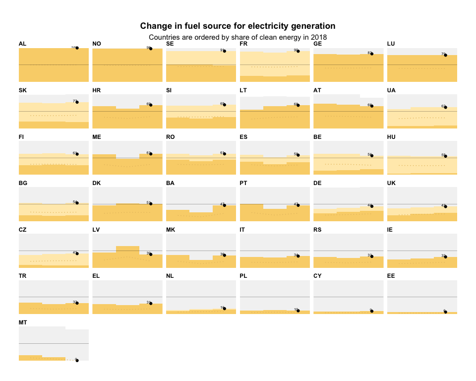

Tidy\_Tuesday\_2020\_08\_11
================

-   [Tidy Tuesday: Energy in Europe](#tidy-tuesday-energy-in-europe)
    -   [Load libraries](#load-libraries)
    -   [Get Data](#get-data)
    -   [Data Wrangling](#data-wrangling)
    -   [Visualizations](#visualizations)

Tidy Tuesday: Energy in Europe
==============================

Load libraries
--------------

    library(tidyverse)

Get Data
--------

    energy_types <- readr::read_csv('https://raw.githubusercontent.com/rfordatascience/tidytuesday/master/data/2020/2020-08-04/energy_types.csv')
    country_totals <- readr::read_csv('https://raw.githubusercontent.com/rfordatascience/tidytuesday/master/data/2020/2020-08-04/country_totals.csv')

Data Wrangling
--------------

    #Remove consumption
    x<- energy_types %>%
      filter(!type=="Pumped hydro power") %>%
      select(-level, -country_name) %>%
      pivot_longer(cols = starts_with("2"),names_to = "year", values_to = "production")

    #Keep only Net production
    y<- country_totals %>%
      filter(type=="Total net production") %>%
      select(-level, -type, -country_name) %>%
      pivot_longer(cols = starts_with("2"),names_to = "year", values_to = "total")

    #Calculate proportion for each energy source type
    z<- x %>%
      left_join(y) %>%
      mutate(proportion=production/total) %>%
      mutate(Type= case_when(
        type%in% c("Geothermal", "Hydro","Solar", "Wind") ~ "Renewable",
        type=="Conventional thermal" ~ "Fossil fuels",
        TRUE ~ type
      )) %>%
      group_by(country, year, Type) %>%
      summarise(Proportion= sum(proportion)) %>%
      mutate(Type= fct_relevel(Type, c("Other", "Fossil fuels", "Nuclear", "Renewable"))) %>%
      ungroup()
     
    ## Calculate sum of clean energy for year 2018
    zz<- z %>%
      filter(year=="2018") %>%
      filter(Type %in% c("Nuclear", "Renewable")) %>%
      group_by(country, year) %>%
      summarise(N_R =sum(Proportion)) %>%
      mutate(label = round(100*N_R, digits = 0))  %>%
      ungroup() %>%
      mutate(country= fct_reorder(country, desc(label)))

    ## Catculate average clean energy production by year
    zzz<- z %>%
      filter(Type %in% c("Nuclear", "Renewable")) %>%
      group_by(country, year) %>%
      summarise(N_R_mean = mean(Proportion)) %>%
      ungroup() 

    #Order levels according to total clean energy proportion in 2018
    z<- z %>% 
      mutate(country= fct_relevel(country, levels(zz$country)))

    zzz<- zzz %>%
      mutate(country= fct_relevel(country, levels(zz$country)))

Visualizations
--------------

    ggplot() +
      theme_void() +
      geom_bar(data= z, aes(x=year, y=Proportion, fill=Type), stat="identity", width=1) +
      geom_point(data= zz, aes(year, N_R)) +
      geom_text(data= zz, aes(year, N_R, label=label, hjust=1, vjust =0), size =2) +
      geom_line(data=zzz, aes(year, N_R_mean, group=country), color = "#E7C06E", linetype= "dotted") +
      geom_hline(yintercept = .50, size=0.1) +
      facet_wrap(~country, ncol = 6) +
      theme(legend.position = "bottom") + 
      scale_x_discrete(expand = c(0, 0)) +
      scale_fill_manual(values = c("white", "#F3F3F3", "#FFEBB9", "#F9D379"))  +
      ggtitle(label = "Change in fuel source for electricity generation", subtitle = "Countries are ordered by share of clean energy in 2018") +
      theme(plot.title = element_text(face="bold", hjust = 0.5),
            plot.subtitle = element_text(hjust = 0.5)) +
      theme(strip.text=element_text(face = "bold", hjust=0),
            legend.position = "none") +
      theme(plot.margin = margin(1, 1, 1, 1, "cm"))

<!-- -->
