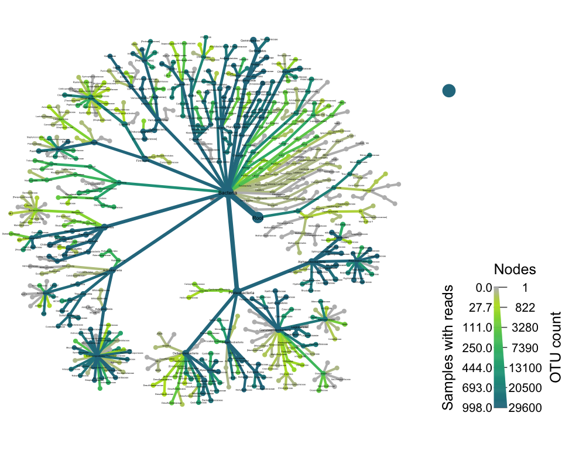
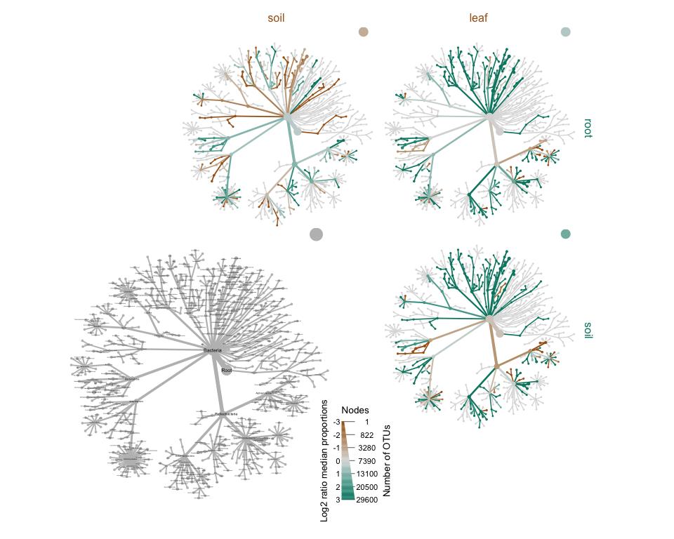

## Objectives

Use the `metacoder` [package](https://grunwaldlab.github.io/metacoder_documentation/index.html){target="_blank"} to visualize hierarchical data. 

The [study](https://www.nature.com/articles/ncomms12151){target-"_blank}, published on Nature in 2016, looks at the effect of host characteristics on the microbiome of Boechera stricta (Brassicaceae), a perennial wild mustard. 

Specific task set out to do:
1.	Combine OTU, metadata, and taxonomy data into one table and filter for the samples only in one group of interest, like coming from roots  
2.	Visualize the taxonomy data from samples belonging to the roots  
3.	Visualize the taxonomy data from samples belonging to the roots and leaves to highlight the differences  

## Load libraries


```r
library(tidyverse)
library(metacoder)
```

## Get Data


```r
metadata<- readr::read_tsv("SMD.txt") # number of samples:1699;  data and metadata associated to it: 15 variables
OTU<- readr::read_tsv("otuTable97.txt") #Large data set: 407806 
taxonomy<- readr::read_tsv("taxAssignments97.txt") 
```

## Data Wrangling 

We can use tidyverse verbs to filter and join the data. 

```r
# Combine OTU, metadata, and taxonomy data into one table and filter for the samples only in one group of interest, like coming from roots  

## 998 samples associated with root
metadata_root<- metadata %>%
  filter(Type=="root")

levels(as.factor(metadata$Type))
```

```
## [1] "leaf" "root" "soil"
```

```r
OTU_root<- OTU %>%
  select(OTU_ID, metadata_root$SampleID)

#Inconsistent variable ID and observation name for OTU, as well as variable type
taxonomy_root<- taxonomy %>%
  rename(OTU_ID="OTU ID") %>%
  mutate(OTU_ID = str_remove(OTU_ID, "OTU_")) %>%
  mutate(OTU_ID= as.numeric(OTU_ID))

#Combined DF
combined<- OTU_root %>%
  pivot_longer(cols= starts_with("M"), names_to = "SampleID", values_to = "counts") %>%
  left_join(taxonomy_root) %>%
  left_join(metadata)
```

However, in order to use the `metacoder` package, our data has to be of specific class: `Taxmap`. I'm following the workflow on their [example page](https://grunwaldlab.github.io/metacoder_documentation/example.html){target="_blank"}. A few thing to note:  
 * the 'Taxmap' class comes from package `taxa` and it's used to store taxonomy and associated information. 
 * for this analyses, I removed:  
    * OTUs that were classified as "Unassigned"  
    * OTUs that were not classified up to family level  
 * in order to parse taxonomy correctly, each lineage should begin with "r__Root"


```r
pm_taxonomy<- taxonomy %>%
  rename(OTU_ID="OTU ID") %>%
  drop_na() %>%
  select(OTU_ID, taxonomy) %>%
  filter(!taxonomy == "Unassigned") %>%
  mutate(taxonomy = str_replace(taxonomy, "Root;", "r__Root;"))

pm_otus<- OTU %>%
  mutate(OTU_ID = as.character(OTU_ID)) %>%
  mutate(OTU_ID = str_replace(OTU_ID, "^", "OTU_")) %>%
  left_join(pm_taxonomy) 

pm_samples<- metadata

obj <- taxa::parse_tax_data(pm_otus,
                      class_cols = "taxonomy", # the column that contains taxonomic information
                      class_sep = ";", # The character used to separate taxa in the classification
                      class_regex = "^(.+)__(.+)$", # Regex identifying where the data for each taxon is
                      class_key = c(tax_rank = "info", # A key describing each regex capture group
                                    tax_name = "taxon_name"))

str(obj)
```

```
## Classes 'Taxmap', 'Taxonomy', 'R6' <Taxmap>
##   Inherits from: <Taxonomy>
##   Public:
##     all_names: function (tables = TRUE, funcs = TRUE, others = TRUE, builtin_funcs = TRUE, 
##     arrange_obs: function (data, ..., target = NULL) 
##     arrange_taxa: function (...) 
##     branches: function (subset = NULL, value = "taxon_indexes") 
##     classifications: function (value = "taxon_names", sep = ";") 
##     clone: function (deep = FALSE) 
##     data: list
##     data_used: function (...) 
##     edge_list: data.frame
##     filter_obs: function (data, ..., drop_taxa = FALSE, drop_obs = TRUE, subtaxa = FALSE, 
##     filter_taxa: function (..., subtaxa = FALSE, supertaxa = FALSE, drop_obs = TRUE, 
##     funcs: list
##     get_data: function (name = NULL, allow_external = TRUE, ...) 
##     get_data_frame: function (...) 
##     get_data_taxon_ids: function (dataset_name, require = FALSE, warn = FALSE, message = FALSE) 
##     get_dataset: function (data) 
##     id_classifications: function (sep = ";") 
##     initialize: function (..., .list = NULL, data = list(), funcs = list(), named_by_rank = FALSE) 
##     input_ids: aab aki akj aki akk akl aab akm akn ako akp akq akr aks  ...
##     internodes: function (subset = NULL, value = "taxon_indexes") 
##     is_branch: function () 
##     is_internode: function () 
##     is_leaf: function () 
##     is_root: function () 
##     is_stem: function () 
##     is_taxon_id: function (ids) 
##     leaves: function (subset = NULL, recursive = TRUE, simplify = FALSE, 
##     leaves_apply: function (func, subset = NULL, recursive = TRUE, simplify = FALSE, 
##     map_data: function (from, to, warn = TRUE) 
##     map_data_: function (from, to) 
##     mutate_obs: function (data, ..., target = NULL) 
##     n_leaves: function () 
##     n_leaves_1: function () 
##     n_obs: function (data = NULL, target = NULL) 
##     n_obs_1: function (data = NULL, target = NULL) 
##     n_subtaxa: function () 
##     n_subtaxa_1: function () 
##     n_supertaxa: function () 
##     n_supertaxa_1: function () 
##     names_used: function (...) 
##     obs: function (data, value = NULL, subset = NULL, recursive = TRUE, 
##     obs_apply: function (data, func, simplify = FALSE, value = NULL, subset = NULL, 
##     print: function (indent = "", max_rows = 3, max_items = 6, max_width = getOption("width") - 
##     print_tree: function (value = "taxon_names") 
##     remove_redundant_names: function () 
##     replace_taxon_ids: function (new_ids) 
##     roots: function (subset = NULL, value = "taxon_indexes") 
##     sample_frac_obs: function (data, size, replace = FALSE, taxon_weight = NULL, obs_weight = NULL, 
##     sample_frac_taxa: function (size = 1, taxon_weight = NULL, obs_weight = NULL, obs_target = NULL, 
##     sample_n_obs: function (data, size, replace = FALSE, taxon_weight = NULL, obs_weight = NULL, 
##     sample_n_taxa: function (size, taxon_weight = NULL, obs_weight = NULL, obs_target = NULL, 
##     select_obs: function (data, ..., target = NULL) 
##     set_taxon_auths: function (value) 
##     set_taxon_names: function (value) 
##     set_taxon_ranks: function (value) 
##     stems: function (subset = NULL, value = "taxon_indexes", simplify = FALSE, 
##     subtaxa: function (subset = NULL, recursive = TRUE, simplify = FALSE, 
##     subtaxa_apply: function (func, subset = NULL, recursive = TRUE, simplify = FALSE, 
##     supertaxa: function (subset = NULL, recursive = TRUE, simplify = FALSE, 
##     supertaxa_apply: function (func, subset = NULL, recursive = TRUE, simplify = FALSE, 
##     taxa: list
##     taxon_ids: function () 
##     taxon_indexes: function () 
##     taxon_names: function () 
##     taxon_ranks: function () 
##     taxonomy_table: function (subset = NULL, value = "taxon_names", use_ranks = NULL, 
##     transmute_obs: function (data, ..., target = NULL) 
##   Private:
##     ids_are_valid: function (ids_to_check) 
##     make_graph: function () 
##     nse_accessible_funcs: taxon_names taxon_ids taxon_indexes classifications n_su ...
##     parse_nse_taxon_subset: function (...) 
##     remove_obs: function (data, indexes, unname_only = FALSE) 
##     remove_taxa: function (el_indexes) 
##     valid_taxon_ids: function (ids)
```

```r
print(obj) #node is taxon with directed edges
```

```
## <Taxmap>
##   644 taxa: aab. NA, aac. Root ... ayu. Methanospirillaceae
##   644 edges: NA->aab, NA->aac, aac->aad ... agq->ayt, aiy->ayu
##   2 data sets:
##     tax_data:
##       # A tibble: 47,806 x 1,701
##         taxon_id OTU_ID M1024P1833 M1551P81 M1551P57 M1551P85 M1551P28
##         <chr>    <chr>       <dbl>    <dbl>    <dbl>    <dbl>    <dbl>
##       1 aab      OTU_1           0        0        0        0        0
##       2 aki      OTU_2          41       22        4      726   112492
##       3 akj      OTU_3          67       65       12    13514        1
##       # … with 47,803 more rows, and 1,694 more variables:
##       #   M1551P29 <dbl>, M1551P38 <dbl>, M1551P90 <dbl>,
##       #   M1551P71 <dbl>, M1551P12 <dbl>, M1551P84 <dbl>,
##       #   M1551P48 <dbl>, M1551P4 <dbl>, M1551P52 <dbl>,
##       #   M1551P3 <dbl>, …
##     class_data:
##       # A tibble: 138,452 x 5
##         taxon_id input_index tax_rank tax_name regex_match
##         <chr>          <int> <chr>    <chr>    <chr>      
##       1 aab                1 <NA>     <NA>     <NA>       
##       2 aac                2 r        Root     r__Root    
##       3 aad                2 k        Bacteria k__Bacteria
##       # … with 138,449 more rows
##   0 functions:
```

```r
#low abundance data to zeros, counts >5
?zero_low_counts
obj$data$tax_data <- zero_low_counts(obj, dataset = "tax_data", min_count = 5)

no_reads <- rowSums(obj$data$tax_data[, pm_samples$SampleID]) == 0
sum(no_reads) #47806 without reads
```

```
## [1] 20606
```

```r
#drop OTU w/o data
obj <- filter_obs(obj, target = "tax_data", ! no_reads, drop_taxa = TRUE)


#uneven sampling counts to proportions
obj$data$tax_data <- calc_obs_props(obj, "tax_data")

#per taxon abundance
obj$data$tax_abund <- calc_taxon_abund(obj, "tax_data",
                                       cols = pm_samples$SampleID)


#number of samples that have reads for each taxon:
obj$data$tax_occ <- calc_n_samples(obj, "tax_abund", groups = pm_samples$Type, cols = pm_samples$SampleID)


#compare groups
obj$data$diff_table <- compare_groups(obj, dataset = "tax_abund",
                                      cols = pm_samples$SampleID, # What columns of sample data to use
                                      groups = pm_samples$Type) # What category each sample is assigned to
print(obj$data$diff_table)
```

```
## # A tibble: 1,932 x 7
##    taxon_id treatment_1 treatment_2 log2_median_rat… median_diff mean_diff
##    <chr>    <chr>       <chr>                  <dbl>       <dbl>     <dbl>
##  1 aab      root        soil                  -0.827   -0.152     -0.111  
##  2 aac      root        soil                   0.305    0.153      0.125  
##  3 aad      root        soil                   0.324    0.162      0.132  
##  4 aae      root        soil                  -4.57    -0.00309   -0.00711
##  5 aaf      root        soil                   0.954    0.186      0.172  
##  6 aag      root        soil                   0.612    0.0614     0.0540 
##  7 aah      root        soil                   0.969    0.0525     0.0535 
##  8 aai      root        soil                  -3.09    -0.000633  -0.0120 
##  9 aaj      root        soil                  -1.68    -0.00860   -0.0195 
## 10 aak      root        soil                  -1.81    -0.0510    -0.0649 
## # … with 1,922 more rows, and 1 more variable: wilcox_p_value <dbl>
```


## Visualizations


```r
#input class Taxmap
heat_tree(obj, 
          node_label = taxon_names,
          node_size = n_obs,
          node_color = root, 
          node_size_axis_label = "OTU count",
          node_color_axis_label = "Samples with reads",
          layout = "davidson-harel", # The primary layout algorithm
          initial_layout = "reingold-tilford") # The layout algorithm that initializes node locations
```

<!-- -->

```r
heat_tree_matrix(obj,
                 data = "diff_table",
                 node_size = n_obs, # n_obs is a function that calculates, in this case, the number of OTUs per taxon
                 node_label = taxon_names,
                 node_color = log2_median_ratio, # A column from `obj$data$diff_table`
                 node_color_range = diverging_palette(), # The built-in palette for diverging data
                 node_color_trans = "linear", # The default is scaled by circle area
                 node_color_interval = c(-3, 3), # The range of `log2_median_ratio` to display
                 edge_color_interval = c(-3, 3), # The range of `log2_median_ratio` to display
                 node_size_axis_label = "Number of OTUs",
                 node_color_axis_label = "Log2 ratio median proportions",
                 layout = "davidson-harel", # The primary layout algorithm
                 initial_layout = "reingold-tilford", # The layout algorithm that initializes node locations
                 output_file = "differential_heat_tree.pdf") # Saves the plot as a pdf file
```

<!-- -->
