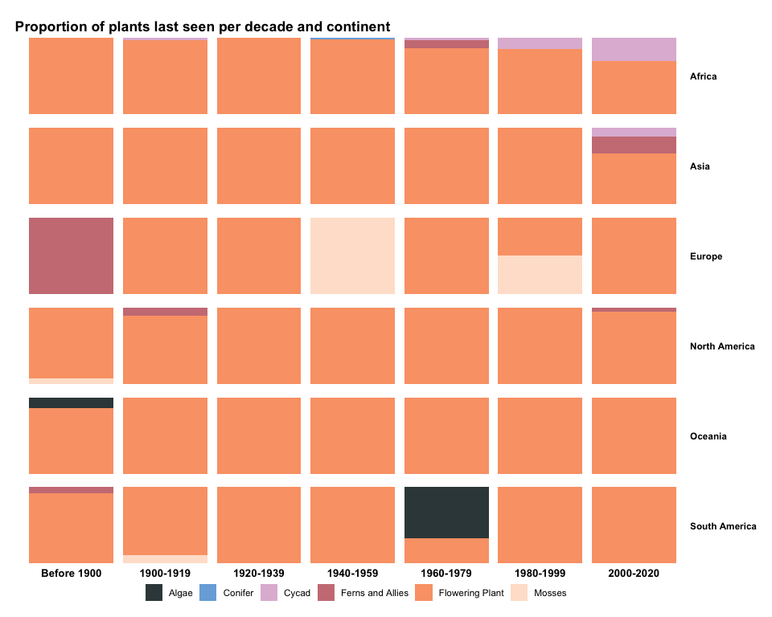
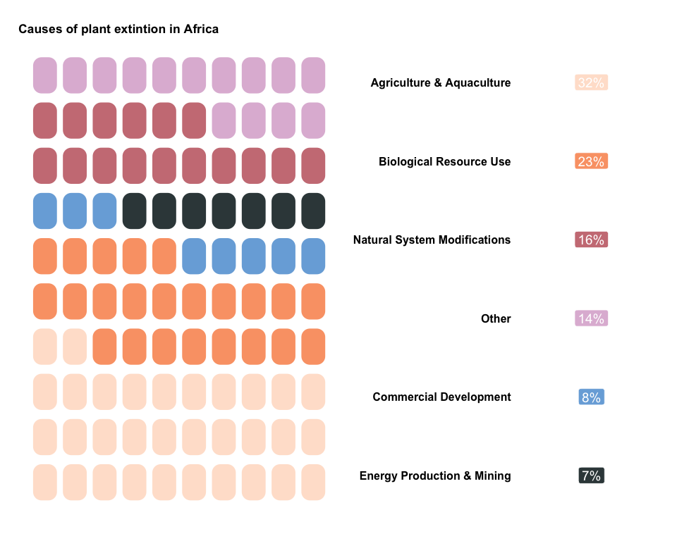

Tidy\_Tuesday\_2020\_08\_25
================

-   [Tidy Tuesday: Plants in danger](#tidy-tuesday-plants-in-danger)
    -   [Load libraries](#load-libraries)
    -   [Get Data](#get-data)
    -   [Data Wrangling](#data-wrangling)
    -   [Visualizations](#visualizations)

Tidy Tuesday: Plants in danger
==============================

Load libraries
--------------

    library(tidyverse)
    library(ggtext)
    library(hrbrthemes)
    library(paletteer)
    library(skimr)
    library(waffle)
    library(patchwork)

Get Data
--------

    plants <- readr::read_csv('https://raw.githubusercontent.com/rfordatascience/tidytuesday/master/data/2020/2020-08-18/plants.csv')

    threats <- readr::read_csv('https://raw.githubusercontent.com/rfordatascience/tidytuesday/master/data/2020/2020-08-18/threats.csv')

Data Wrangling
--------------

    counts_plants<- plants %>%
      drop_na() %>%
      group_by(continent, group, year_last_seen) %>%
      summarise(counts=n()) %>%
      ungroup() %>%
      mutate(year_last_seen = fct_relevel(year_last_seen, c("Before 1900" , "1900-1919", "1920-1939", "1940-1959", "1960-1979", "1980-1999","2000-2020")))

      
    total_plants<- counts_plants %>%
      group_by(continent, year_last_seen) %>%
      summarise(total=sum(counts)) %>%
      ungroup() %>%
      mutate(year_last_seen = fct_relevel(year_last_seen, c("Before 1900" , "1900-1919", "1920-1939", "1940-1959", "1960-1979", "1980-1999","2000-2020")))

    counts_plants <- counts_plants %>%
      left_join(total_plants) %>%
      mutate(proportion= counts/total)

    counts_plants2 <- plants %>%
      drop_na() %>%
      arrange(group) %>%
      group_by(continent, year_last_seen) %>%
      mutate(index = row_number()) %>%
      ungroup() %>%
      mutate(year_last_seen = fct_relevel(year_last_seen, c("Before 1900" , "1900-1919", "1920-1939", "1940-1959", "1960-1979", "1980-1999","2000-2020")))

    #long format data
    threat_Africa <- threats %>%
      filter(continent =="Africa", threatened == 1 ) %>%
      group_by(continent) %>%
      count(threat_type) %>%
      ungroup() %>% 
      mutate(percent = round(n/sum(n)*100,0)) %>% 
      mutate(threat_type_mod = factor(case_when(
        threat_type == "Agriculture & Aquaculture" ~ "Agriculture & Aquaculture",
        threat_type == "Biological Resource Use" ~ "Biological Resource Use",
        threat_type == "Commercial Development" ~ "Commercial Development",
        threat_type == "Energy Production & Mining" ~ "Energy Production & Mining", 
        threat_type == "Natural System Modifications" ~ "Natural System Modifications",  
        TRUE ~ "Other"))) %>% 
      select(threat_type_mod, percent) %>% 
      group_by(threat_type_mod) %>% 
      summarise(percent = sum(percent)) %>% 
      mutate(threat_type_mod = fct_reorder(threat_type_mod, percent, sum, .desc=F)) %>%
      mutate(index = row_number()) 

Visualizations
--------------

    p1<- ggplot(counts_plants) +
      geom_bar(aes(year_last_seen, proportion, fill=group), stat = "identity") +
      facet_grid(continent~.) +
      theme_void() +
      labs(title = "Proportion of plants last seen per decade and continent") +
      theme(axis.text.x = element_text(face = "bold", size = 10)) +
      theme(plot.title = element_markdown(face="bold")) +
      theme(strip.text=element_text(face = "bold", hjust=0)) +
      theme(plot.margin = margin(0.5, 0.5, 0.5, 0.5, "cm")) +
      theme(legend.position = "bottom", legend.margin = margin(), legend.title = element_blank()) +
      guides(fill = guide_legend(nrow = 1)) +
      scale_fill_paletteer_d("vapoRwave::floralShoppe", guide="none")

    p1

<!-- -->

    p2<- ggplot() +
      geom_point(data= counts_plants2, aes(x=continent, y=index, shape=group, color=continent), stat = "identity") +
      facet_grid(~year_last_seen, switch= "x") +
      theme_void() +
      labs(title = "Plants last seen by decade in **Africa**, **Asia**, **Europe**,  **North America**,  **Oceania**, and  **South America**",
           subtitle = "Shapes denote plant grouping and the total number of plants is provided for each continent") +
      theme(plot.title = element_markdown(face="bold")) +
      theme(strip.text=element_text(face = "bold", hjust=0.5)) +
      theme(plot.margin = margin(0.5, 0.5, 0.5, 0.5, "cm")) +
      theme(legend.position = "bottom",  legend.margin = margin(), legend.title = element_blank()) +
      guides(shape = guide_legend(nrow = 1)) +
      scale_color_paletteer_d("vapoRwave::floralShoppe", guide="none") +
      geom_text(data=total_plants, aes(continent, total + 2, label=total))

    p2

<!-- -->

    p3<- ggplot(threat_Africa, aes(fill = threat_type_mod, values = percent))  +
      geom_waffle(n_rows = 10, size = .5, color=NA, 
                  radius = unit(9, "pt"), height = 0.8, 
                  width = 0.8, flip = T) +
      theme_void() +
      labs(title = "Causes of plant extintion in Africa") +
      theme(plot.title = element_markdown(face="bold")) +
      theme(plot.margin = margin(0.5, 0.5, 0.5, 0.5, "cm")) +
      theme(legend.position = "none") +
      scale_fill_paletteer_d("vapoRwave::floralShoppe")
      

    p3_leg<- ggplot(threat_Africa) +
      geom_label(aes(1, threat_type_mod, label=paste0(percent, "%"), fill=threat_type_mod), size=5, color="white")+
      theme_void() +
      scale_fill_paletteer_d("vapoRwave::floralShoppe") +
      theme(axis.text.y = element_text(size=12, face= "bold", hjust = 1),
            legend.position = "none") +
      scale_x_continuous(expand = c(0,0))

    p3 + p3_leg + 
      plot_layout(widths = c(2, 1))

<!-- -->
