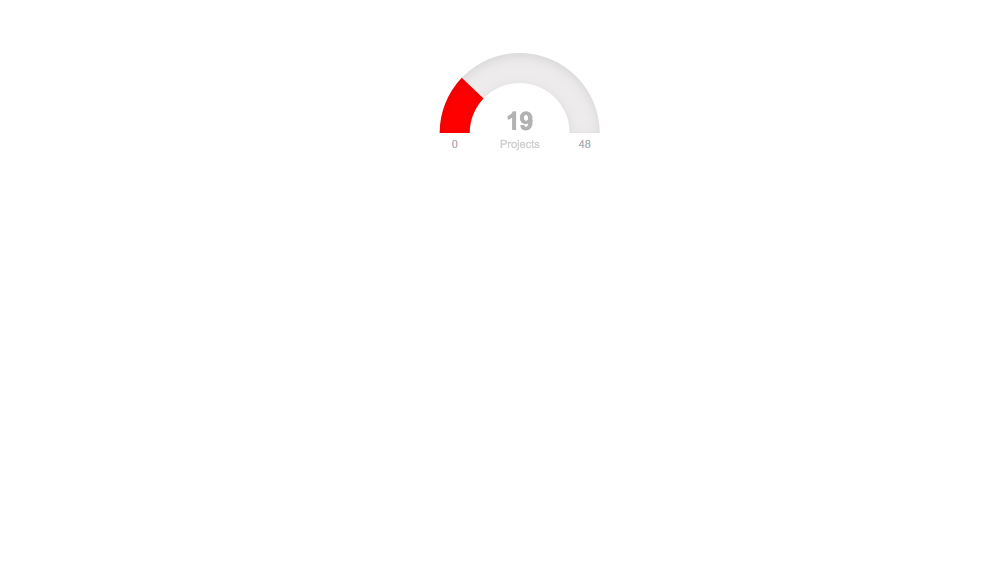

TidyTuesday
================

The [Pinto lab](https://www.pintolab.com/), under [Chris Anderson](https://github.com/chrisLanderson) lead, meet every Tuesday to discuss visualization and analyses of [TidyTuesday](https://github.com/rfordatascience/tidytuesday) data.

As a group exercise the objectives are:

-   gain proficiency with R:
    -   learn about new packages
    -   improve code readability
    -   improve visualization techniques
-   learn from each other
-   do (some) research outside our own and have fun!

In this repo I will be documenting *my* contribution.

So far I have looked at data about:

1.  Australian fires
2.  Passwords
3.  Spotify
4.  San Francisco trees
5.  NFL attendance

5 out of 6, what a streak!

